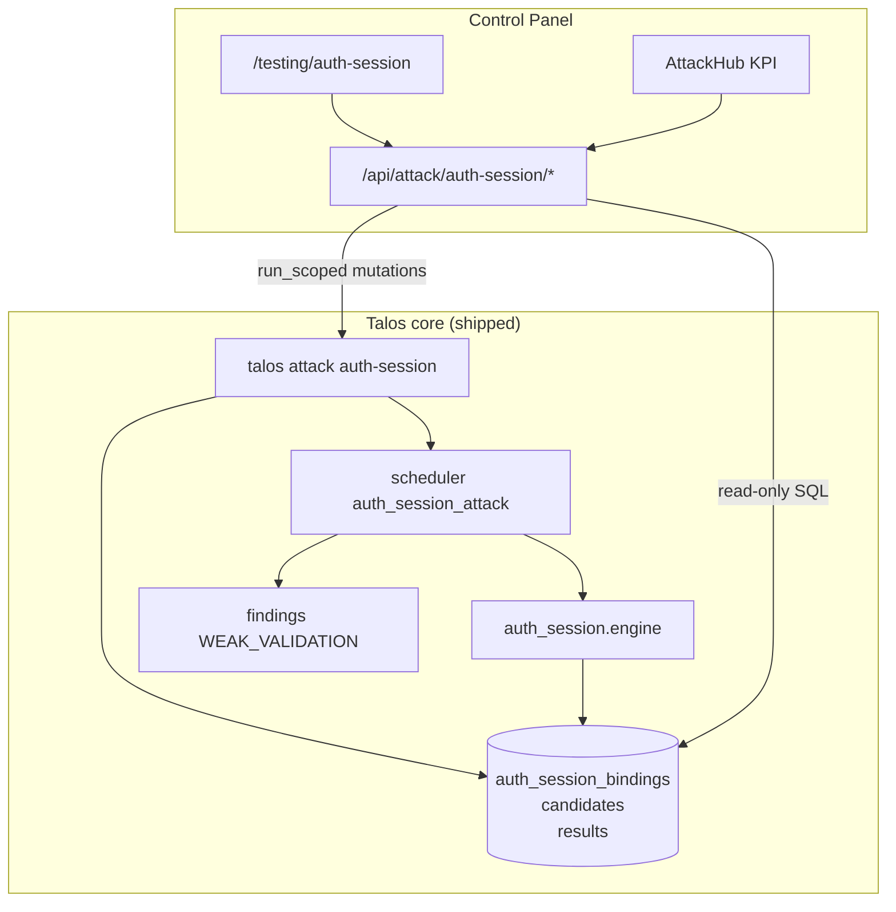
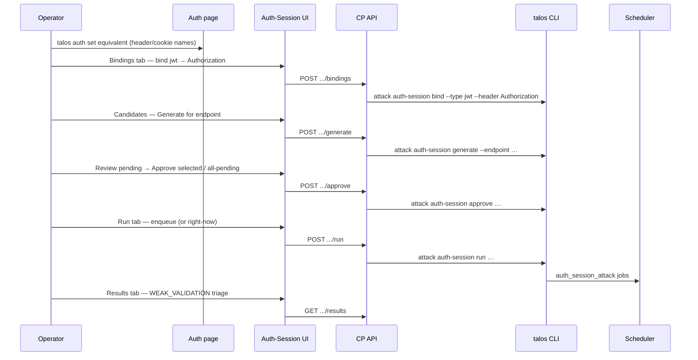

<!-- Generated by /design skill (id d29b93af). Approved after write→review→revise loop, 0 open issues. -->

# Authentication & Session Testing Engine in Talos Control Panel

| Field | Value |
|-------|-------|
| **Document** | Design: Auth-Session Testing Engine Control Panel surfaces |
| **Author** | Grok Design (Control Panel) |
| **Date** | 2026-07-31 |
| **Status** | **Approved** (rev 3 — design review consensus, 0 open issues). Control Panel design; core engine already shipped. |
| **Workspace** | `talos-v2` |
| **Audience** | Senior engineers implementing Control Panel + reviewing product IA |
| **Core design** | `docs/design-auth-session-testing-engine.md` (CLI/engine; CP was out of scope there) |
| **Peer CP design quality bar** | `docs/URL-Sink-Discovery-Control-Panel-Design.md` |

---

## Overview

Authentication & Session Testing (`talos attack auth-session`) is a **shipped** core attack engine (`talos/auth_session/`, schema v54 tables, job type `auth_session_attack`) that probes whether a *presented* credential is validated (JWT signature, algorithm, claims, structure). It is **distinct** from Unauth (strip/malformed auth), BAC (other-role session swap), the Auth page / `auth_config` (role session configuration), and passive JWT detectors.

This document designs **full CLI parity** in the Talos Control Panel: every bind / generate / candidates lifecycle / run / results / filter / suite command must be reachable from UI, with CLI as the **mutation source of truth** (`cli.run` / `run_scoped`) and read-only SQLite for inventory and KPIs—matching Unauth/BAC Control Panel patterns.

**Critical product requirement:** do not ship a partial UI that hides approve lifecycle, suite catalog, decision filter, or binding management. Prefer **CLI as mutation SoT; if “more than CLI,”** only richer aggregates, deep links, and live job poll—not engine reimplementation.

---

## Background & Motivation

### Product context

Talos is a client-approved penetration testing / public bug bounty platform: MITM capture → deterministic engines → findings; AI is policy-gated suggest-first. Auth-session is an **authorized active attack** module: one outbound HTTP flow per approved `test_id`, operator approve gate before enqueue, findings only on `WEAK_VALIDATION`.

### Core architecture (locked, shipped)

```
talos auth set --header Authorization     # auth_config name only
        │
        ▼
talos attack auth-session bind            # auth_session_bindings (type=jwt)
        │
        ▼
talos attack auth-session generate        # pending candidates (no HTTP)
        │
        ▼
approve / reject / unapprove              # operator gate (product-critical)
        │
        ▼
run [--right-now]                         # one auth_session_attack job per test_id
        │
        ▼
engine mutate token → single HTTP → auth_session_results
        │
        ▼
scheduler settle → finding if WEAK_VALIDATION
```

| Artifact | Location |
|----------|----------|
| Package | `talos/auth_session/` (`cli`, `candidates`, `engine`, `db`, `suite_jwt`, `jwt_mutate`, `decision_filter`, `findings_bridge`, `verdict`, …) |
| Tables | `auth_session_bindings`, `auth_session_candidates`, `auth_session_results` |
| Job type | `auth_session_attack` (one `test_id` per job in `meta`) |
| Verdicts | `WEAK_VALIDATION` \| `SECURE` \| `UNKNOWN` |
| Findings | `attack_type=auth_session`, display **Authentication & Session Testing**, trigger `WEAK_VALIDATION` |
| Decision filter | `auth-session-decision-filter.yaml` (init/show/validate only; **no** reclassify/apply in v1) |

### Current CP state (as of 2026-07-31)

| Area | Status |
|------|--------|
| Core CLI + engine Phases 1–5 | Shipped on `main` |
| Schema v54 auth_session_* tables | Shipped |
| Findings bridge for `auth_session` | Shipped |
| CP grep for auth-session **attack** engine | **No matches** (confirmed gap) |
| Auth page / `auth_config` / `auth_sessions/<role_id>.txt` | Shipped — **different concept** (role session files) |
| Testing hub registry | secrets, errors, url-sinks, unauth, bac, iv, intruder — **no auth-session** |
| Peer modules Unauth/BAC | Full ModuleShell + Overview/Run/Results/Config + `/api/attack/{unauth,bac}/*` |

### Naming homonym (must not confuse operators)

| Concept | What it is | Where |
|---------|------------|--------|
| **Auth-session attack engine** | JWT mutation testing | CLI `talos attack auth-session`; package `talos/auth_session/`; tables `auth_session_*` |
| **Role session files** | Manual per-role headers/cookies for BAC/unauth strip targets | `Project.auth_session_path()` → `<data_dir>/auth_sessions/<role_id>.txt`; Auth page; `auth_config` router |
| **Auth page** | Configure `auth_config` artifact names + role sessions | `/auth` |
| **Classic Authentication Bypass** | Strip-style `auth test` / `auth_test` jobs → often `BYPASS` | Auth page “test” / unauth auto-run path — **not** JWT mutation |
| **Unauth** | Strip / malformed auth → `BYPASS` / `SECURE` / `UNKNOWN` | `/testing/unauth` |
| **BAC** | Role session swap / technique families → `POSSIBLE_BAC` | `/testing/bac` |

**UI labels:** prefer **“Auth-Session Testing”** or full **“Authentication & Session Testing”**. Never title the module “Auth Sessions.” Deep-link to Auth page as *prerequisite configuration*, not as the attack home.

**Findings list display (CP gap):** Core `ATTACK_DISPLAY["auth_session"] = "Authentication & Session Testing"`, but CP `Findings.tsx` / `FindingDetail.tsx` today special-case only `passive_secret` and otherwise render raw `attack_type` (`auth_session`). Empty-state copy mentions only `POSSIBLE_BAC` / `BYPASS`. Closing this gap is a **required** CP polish task (see K18b / PR 5.2)—not optional “verify.”

### Pain points for operators today

1. Full workflow exists only on CLI; CP operators cannot bind, generate, approve, or triage without dropping to Console/terminal.
2. Approve-first gate is invisible in UI—unlike Unauth’s “run all recipes,” bulk approve is **required** product behavior.
3. No Testing hub KPI for `WEAK_VALIDATION` / pending candidates / bindings readiness.
4. Findings with `attack_type=auth_session` appear in Findings list but have no module workspace for triage/replay context.
5. Homonym with Auth page risks operators looking in the wrong place.

### Why this matters

Senior pentesters need the same loop as CLI, visually:

```text
Auth config → Bind JWT field → Generate candidates → Review/approve
  → Run (scheduler or right-now) → Results / Findings → Filter tune + re-run
```

CP must make the **pending → approved → run** path obvious and complete—not a wizard that skips approve or hides bindings.

---

## Goals & Non-Goals

### Goals

1. **Full CLI parity** — every `talos attack auth-session …` subcommand and material flag is reachable from CP (see parity matrix).
2. **Dedicated Testing hub module** at `/testing/auth-session`, peer to Unauth/BAC (active, medium–high risk).
3. **Approve-first UX** — candidate table + bulk approve/reject/unapprove is first-class; Run only acts on approved (matching CLI).
4. **CLI mutation SoT** — all writes via `cli.run_scoped(project_id, ["attack", "auth-session", …])`; reads via read-only SQLite (and optional CLI show for filter text).
5. **No new attack engine logic in CP** — no reimplementation of mutate/verdict/suite; no schema migrations unless a tiny read-path bug forces an additive view (prefer none).
6. **Reuse ModuleShell + Unauth/BAC tab workspace patterns** — registry, hub KPIs, disclaimers, `?tab=` routing, `useAction`, ConfirmButton, DataTable, job polling.
7. **Cross-links** — Auth (prereq), Findings (`attack_type=auth_session`), Scheduler (`auth_session_attack`), Endpoint/Flow/Replay, Unauth/BAC distinction.
8. **Precise product language** — weak token validation evidence; authorized testing only; one HTTP request per approved testcase.
9. **Phased shippable slices** — Phase 1 usable read-only inventory; progressive full parity.

### Non-Goals

| Non-goal | Rationale |
|----------|-----------|
| Reimplement JWT mutation / engine in CP | Core is SoT; CP is UI + thin API |
| Filter reclassify/apply (v1) | Core explicitly has no apply/reclassify; operators re-run after filter edit |
| New SQLite tables / migrations for CP | Tables already exist (v54) |
| Bury module under Auth page | Auth page = config/sessions; attack lives under Testing |
| Auto-run without approve | Product gate; never enqueue pending candidates |
| Freeform shell / arbitrary payload builders | Policy: handlers call CLI argv only |
| Confuse role session files UI with this module | Homonym must stay separated |
| Passive JWT inventory as this module’s primary job | Different surface; optional future deep-link only |
| AI agent tools for token attacks | Out of scope; AI remains suggest-first elsewhere |

---

## Key Decisions

| # | Decision | Rationale |
|---|----------|-----------|
| **K1** | **Dedicated active module** `/testing/auth-session` peer to Unauth/BAC | Core is an attack engine with outbound HTTP; Auth page is configuration. Matches Testing hub IA (`registry.ts`, ModuleShell). |
| **K2** | **API home: `/api/attack/auth-session/*` on existing `attack` router** | Peers Unauth/BAC (`talos_ui/routers/attack.py`). Same prefix, same `cli.run_scoped` patterns, same test style as `test_attack_bac_routes.py`. Not a new top-level router (unlike passive url-sink/error-intel). |
| **K3** | **Target six tabs: Overview \| Bindings \| Candidates \| Run \| Results \| Config — progressive registration** | Full IA is six tabs at complete parity. **Ship progressive tabs** (strategy 1): Phase 1 registers only `overview` + `bindings`; later phases append tab ids to `AUTH_SESSION_TABS`. No dead disabled tabs under “available.” See **Progressive tab policy**. |
| **K4** | **Mutations always CLI argv; reads prefer SQL** | CP rule (`docs/control-panel/cli-integration.md`). List candidates/results/bindings/status aggregates from SQLite; mutate via `["attack","auth-session",…]`. Filter show may use CLI stdout (YAML text) like Unauth ConfigTab. |
| **K5** | **No filter apply/reclassify UI in v1; practical edit path required** | Core v1 has only init/show/validate. Config tab must show **filename + absolute path**, instruct re-run (not reclassify), and offer **Open project data dir** via existing `POST /api/projects/{id}/open-directory` (`target=data_dir`). In-UI YAML write is post-parity stretch only. |
| **K6** | **Registry risk is static `medium`; elevated risk is local banners only** | `AttackModuleDef.risk` and ModuleShell badge do not flip dynamically. Surface high-risk copy as **local banners** on Generate (`--include-unsafe-methods`) and Run (`--right-now` / large N). Hub card stays `risk: "medium"`. |
| **K7** | **Hub KPI source: `auth_session` — fixed three chips** | Extend `AttackKpiSource` with `"auth_session"`. AttackHub **dedicated branch** (not generic): chips exactly `weak` = `counts.WEAK_VALIDATION` (tone danger if >0 else muted), `pending` = `candidates_by_status.pending` (warn if >0 else muted), `approved` = `candidates_by_status.approved` (info if >0 else muted). |
| **K8** | **Candidate row identity: candidate UUID** | Detail drawer + bulk actions use `auth_session_candidates.id`. Results keyed by `replay_flow_id` (CLI `results show`). |
| **K9** | **Generate scope modes match CLI mutex** | Four UI modes: `project` (no scope flags), `endpoint` (`--endpoint`), `module` (`--module`), `flow` (`--flow` alone). **Mutex:** `--endpoint` XOR `--module` (API 400 if both). `--flow` is independent explicit baseline path (not combined with endpoint/module in UI). Optional: binding, role, family/test-id, force-refresh, include-unsafe-methods. |
| **K10** | **Run estimate = count of approved matching filters** | Not testable_endpoints × recipes (Unauth). SQL: `COUNT(*)` where `status='approved'` AND filters. |
| **K11** | **right-now: ConfirmButton + elevated timeout + hard refuse** | Default `CLI_TIMEOUT` is **60s**. Contract (PR 4.1): (1) FE ConfirmButton when `estimate > 5` or `right_now`; (2) API computes `estimate` for the same filters; if `right_now` and `estimate > 20` → **400** with message to enqueue without `--right-now`; (3) if `right_now` and `estimate ≤ 20` → `cli.run_scoped(..., timeout=max(CLI_TIMEOUT, min(600, 30 * max(estimate, 1))))`. Enqueue path keeps default timeout. |
| **K12** | **Unbind --force is ConfirmButton-only** | Destructive cascade of pending/rejected. Still refuse when approved/running/done/failed/results (CLI precondition). |
| **K13** | **Display name: “Auth-Session Testing”** | Short hub card title; help/module shell can expand to full ATTACK_DISPLAY string. Avoid “Auth Sessions.” |
| **K14** | **Command tree grows with each mutation PR** | Group `attack.auth-session` in `command_tree.py`. Add commands in the same PR that ships the mutation (2.1 bind/unbind/generate, 3.1 lifecycle, 4.1 run, 5.1 filter/suite). PR 5.1 is completeness + argv snapshot suite, not first introduction. |
| **K15** | **Phase 1: progressive tabs Overview + Bindings (read-only) + hub “Inventory” posture** | Register module `status: "available"` with hub **statusLine / subtitle “Inventory (read-only)”** until Phase 3 exit. Partial lifecycle banner in ModuleShell until Phase 4 E2E. Do **not** market “full Auth-Session” before Phase 3 minimum (prefer Phase 4). |
| **K16** | **“More than CLI” allowed only for aggregates + deep links + poll** | Overview joins endpoints/flows for path labels; findings deep-link; 8–10s poll while jobs in flight—same as Unauth/BAC. No parallel verdict engine. |
| **K17** | **Auth prereq picker reads `auth_config` artifacts** | Bind form lists headers/cookies already in auth_config (from existing `GET /api/auth` artifacts); do not invent names not in config. |
| **K18** | **Findings deep-link: implement URL filter hydration (required polish)** | Today Findings keeps `attackType`/`verdict` in **local React state only** (no `useSearchParams`). **PR 4.2 or 5.2 must** make `Findings.tsx` read `?attack_type=` and `?verdict=` on mount into that state (and keep select in sync). Until that lands, Overview CTAs use plain `/findings` + helper text “Filter Type → auth_session / Verdict → WEAK_VALIDATION.” After hydration: `/findings?attack_type=auth_session` and `/findings?attack_type=auth_session&verdict=WEAK_VALIDATION`. Result row → `/flows/:replay_flow_id` always; finding link when present (see Results finding join). |
| **K18b** | **Findings display map + empty-state copy required** | Map `auth_session` → **Authentication & Session Testing** in list Type column, type filter option labels, and FindingDetail (prefer shared `ATTACK_DISPLAY` helper or FE map mirroring core). Empty-state: include `WEAK_VALIDATION` alongside `POSSIBLE_BAC` / `BYPASS`. Required for operator-facing full ship (PR 5.2 acceptance). |
| **K19** | **Bulk lifecycle never expands CLI-unsupported filters via bulk flags; expand is unbounded** | CLI approve/reject/unapprove support `--endpoint` / `--test-id` / `--family` (+ bulk flags) but **not `--binding`**. Never emit `--all-pending` / `--all-approved` / `--retry-failed` alone under a silent binding (or other non-CLI-bulk) scope. **Normative expand contract:** Binding-scoped (or any non-CLI-bulk) bulk expand **MUST** resolve the **full** matching ID set—SQL or `list_candidates(..., limit=None)` (or paginate until exhausted)—**never** only the currently rendered page or the list API default `limit=200` (max 1000). **Prefer backend expand:** FE sends `binding_id` + bulk flag (and other filters); API expands with `limit=None` then builds positional UUID argv (no fake CLI `--binding`). FE page materialize is **forbidden** for “all matching in filter” actions. Explicit multi-select of visible rows may still send those IDs only (operator-selected subset). Acceptance: unit test with **>200** pending under one binding. |
| **K20** | **attack.py growth: helpers module, same URL prefix** | Keep routes on `APIRouter(prefix="/api/attack")`. Implement auth-session handlers in `talos_ui/routers/attack_auth_session.py` (or `attack_helpers_auth_session.py`) imported/included from `attack.py`—do not paste 400+ lines mid-file. Split to a second top-level router only if line count still hurts after extract (soft trigger: attack.py + helper > ~1200 lines combined is fine; unreadable monofile is not). |
| **K21** | **No candidates `offset` in v1** | CLI/`list_candidates` support `limit` only. CP: `limit` (default 200, max 1000) + filters; no OFFSET pagination unless a later PR adds explicit additive SQL with tests. |

---

## Proposed Design

### Information architecture

#### Where it lives

| Surface | Path | Role |
|---------|------|------|
| **Primary workspace** | `/testing/auth-session` | Full attack lifecycle |
| Testing hub card | `/testing` | KPI chips + open module |
| Auth page | `/auth` | **Prerequisite only** (set header/cookie names + role sessions) |
| Findings | `/findings` | `WEAK_VALIDATION` findings triage |
| Scheduler | `/scheduler` | `auth_session_attack` job visibility |
| Endpoint / Flow | `/endpoints/:id`, `/flows/:id` | Deep links from candidates/results |

**Not recommended:** nesting under Auth page tabs (hides active attack among config) or under Unauth (different threat model).

#### Tab structure (operator workflow)

```text
bind → generate → review/approve → run → results/findings → filter/suite
  │         │            │          │           │                │
  ▼         ▼            ▼          ▼           ▼                ▼
Bindings  Candidates   Candidates  Run       Results          Config
          (generate)   (lifecycle)
```

| Tab id | Label | CLI mapping | First interactive phase |
|--------|-------|-------------|-------------------------|
| `overview` | Overview | `status` + aggregates | Phase 1 |
| `bindings` | Bindings | `bind`, `unbind`, `show-bindings` | Phase 1 read; Phase 2 mutations |
| `candidates` | Candidates | `generate`, `candidates list/show`, `approve`, `reject`, `unapprove` | Phase 2 inventory; Phase 3 lifecycle |
| `run` | Run | `run` (+ filters, `--right-now`) | Phase 4 |
| `results` | Results | `results list/show` | Phase 4 |
| `config` | Filter & Suite | `filter init/show/validate`, `suite list` | Phase 5 |

URL: `/testing/auth-session?tab=candidates&status=pending` (search params for filters).

#### Progressive tab policy (K3 / K15) — mandatory for “implement Phase N”

| Phase exit | Tabs registered in `AUTH_SESSION_TABS` | Hub card posture | Module banner |
|------------|----------------------------------------|------------------|---------------|
| **Phase 1** | `overview`, `bindings` only | statusLine: **“Inventory (read-only)”** | “Lifecycle tabs ship in later phases; bind/generate/approve not yet in UI.” |
| **Phase 2** | + `candidates` (generate + list; bulk approve **disabled** or hidden) | statusLine: **“Inventory — generate OK; approve next”** | Banner until Phase 3: no approve yet |
| **Phase 3** | candidates bulk approve/reject/unapprove live | statusLine: **“Approve ready”** (clear “Inventory only”) | Banner: “Run tab lands Phase 4 — enqueue still via CLI or wait” **or** soft note |
| **Phase 4** | + `run`, `results` | statusLine clear / normal | Optional thin “Filter & Suite in Phase 5” |
| **Phase 5** | + `config` | full module | none (parity complete) |

**Rules:**

1. Do **not** render five greyed-out tabs in Phase 1.
2. `shared.ts` exports tab list built from a `SHIPPED_TABS` constant updated per phase (or feature flags only if needed—prefer constant).
3. **Release / marketing:** do not call the module “full CLI parity” or remove partial banners until **Phase 3 minimum**; prefer **Phase 4 E2E** before considering complete. Phase 5 required for filter/suite parity claim.
4. Hub registry `status` stays `"available"` from Phase 1 (usable inventory)—posture is via statusLine + banner, not `coming_soon` (avoids hiding read-only value).

#### Architecture diagram



#### Operator sequence



### Frontend structure

Mirror Unauth/BAC layout under `talos-control-panel/frontend/src/pages/attack/`:

```
attack/
  registry.ts                    # + auth-session module + kpi source
  AttackHub.tsx                  # + dedicated KPI branch for auth_session (K7)
  modules/
    AuthSessionModule.tsx        # shell + progressive tabs
  auth-session/
    shared.ts                    # types, SHIPPED_TABS, verdicts, statuses, bulk helpers
    OverviewTab.tsx
    BindingsTab.tsx
    CandidatesTab.tsx
    RunTab.tsx
    ResultsTab.tsx
    ConfigTab.tsx
    components/
      AuthSessionDisclaimer.tsx
      DistinctionBanner.tsx      # vs Unauth / BAC / Auth page / classic auth test
      PartialLifecycleBanner.tsx # until Phase 4
      CandidateStatusChip.tsx
      VerdictChip.tsx
      JobEstimate.tsx
      CandidateDetailDrawer.tsx
      GenerateScopeForm.tsx
      BindingForm.tsx
```

**Also in PR 1.2 (discoverability):**

- `frontend/src/components/HeaderSearch.tsx` — jump entry `testing-auth-session`
- `docs/control-panel/pages.md` — module on Testing diagram / inventory
- Testing hub keywords on the `/testing` jump item: add `auth-session jwt`

**Registry entry (illustrative):**

```ts
{
  id: "auth-session",
  class: "active",
  name: "Auth-Session Testing",
  description:
    "Mutate presented JWTs (alg, signature, claims, structure) to detect weak validation. Approve-first; one HTTP request per approved test.",
  risk: "medium", // static — elevated risk is local banners only (K6)
  status: "available",
  path: `${TESTING_BASE}/auth-session`,
  keywords: [
    "auth-session", "jwt", "alg none", "token validation",
    "signature", "claims", "kid", "WEAK_VALIDATION",
    "jwt mutation", // distinguish from Auth page "session cookie"
  ],
  kpi: "auth_session",
}
```

**HeaderSearch entry (PR 1.2):**

```ts
{
  id: "testing-auth-session",
  label: "Auth-Session Testing",
  path: "/testing/auth-session",
  group: "Testing",
  keywords: "jwt mutation weak validation alg none token auth-session attack active not auth page",
}
```

Auth page jump stays `label: "Authentication"` with keywords that do **not** claim JWT mutation testing.

**Route (`App.tsx`):**

```tsx
<Route path="/testing/auth-session" element={<AuthSessionModule />} />
```

**Module shell tabs:** same pattern as `UnauthModule.tsx` — `useSearchParams` for `tab`, load overview once, poll while `jobs_pending + jobs_running > 0`. Tab list = progressive `SHIPPED_TABS` only.

**AttackHub KPI wiring (K7) — exact contract:**

```ts
// After GET /api/attack/auth-session/summary
const c = summary.counts || {};
const by = summary.candidates_by_status || {};
const weak = c.WEAK_VALIDATION ?? 0;
const pending = by.pending ?? 0;
const approved = by.approved ?? 0;
setKpiMap((prev) => ({
  ...prev,
  auth_session: {
    chips: [
      { label: "weak", value: weak, tone: weak > 0 ? "danger" : "muted" },
      { label: "pending", value: pending, tone: pending > 0 ? "warn" : "muted" },
      { label: "approved", value: approved, tone: approved > 0 ? "info" : "muted" },
    ],
    // Phase 1–2: statusLine: "Inventory (read-only)" | "Inventory — approve next"
    // Phase 3+: omit or clear
  },
}));
```

### UX details by tab

#### 1. Overview

**Purpose:** readiness + next-step CTAs (not a second Run page).

| Element | Content |
|---------|---------|
| `AuthSessionDisclaimer` | Active attack; token mutation; authorized testing; one HTTP per approved test |
| `DistinctionBanner` | “Not Unauth (strip). Not BAC (role swap). Not Auth page (config / role sessions). **Not classic Authentication Bypass** (`auth test` / BYPASS). Tests whether *mutated* tokens are still accepted.” Links to `/testing/unauth`, `/testing/bac`, `/auth` |
| `PartialLifecycleBanner` | Shown until Phase 4 exit — which tabs exist / what to use CLI for |
| KPI strip | Bindings count; candidates by status (pending/approved/running/done/failed/rejected); results by verdict; jobs pending/running |
| Readiness | Bindings empty? → CTA Bindings + Auth page. Pending > 0? → CTA Approve (if Phase ≥3 else CLI hint). Approved > 0? → CTA Run (if Phase ≥4). Weak > 0? → CTA Results / Findings |
| Recent weak | Top N `WEAK_VALIDATION` results with path/method + link to flow |
| Empty states | `no_bindings`, `no_candidates`, `no_results`, `jobs_in_flight` |

Data: `GET /api/attack/auth-session/overview` (status-like + recent weak + job counts + empty_state).

#### 2. Bindings

| Element | Behavior |
|---------|----------|
| Table | id, location, name, auth_type, role, created_at; candidate counts optional |
| Bind form | type=`jwt` (only v1); location header\|cookie; name from auth_config picker; optional role; optional advanced `config_json` textarea |
| Unbind | Select binding → Unbind; if pending/rejected, ConfirmButton with force |
| Prereq callout | If auth_config empty for chosen location, link **Open Auth page** `/auth` |

Mutations:

- `POST /bindings` → `bind --type jwt --header NAME` or `--cookie NAME` `[--role …] [--config-json …]`
- `POST /unbind` → `unbind --header|--cookie|--id … [--force]`

Read: `GET /bindings` (SQL via `list_bindings` columns + optional `count_candidates_for_binding`).

#### 3. Candidates (product-critical)

Top section: **Generate** (no HTTP).

| Control | CLI flag / notes |
|---------|------------------|
| Scope mode radio: **project** \| **endpoint** \| **module** \| **flow** | project → no scope flags; endpoint → `--endpoint`; module → `--module`; flow → `--flow` only. **Never** send endpoint+module together (CLI mutex). |
| Binding filter | `--binding` |
| Role prefer | `--role` |
| Families multi | `--family` (repeat) |
| Test IDs multi | `--test-id` (repeat) |
| Force refresh | `--force-refresh` |
| Include unsafe methods | `--include-unsafe-methods` + **local high-risk banner** (K6; hub badge stays medium) |

Main table: filterable inventory.

| Column | Source |
|--------|--------|
| Status chip | `status` |
| test_id | `test_id` |
| Family | `test_family` |
| Title | `title` |
| Endpoint | join method/path when available |
| Risk | `risk_hint` |
| Fingerprint | `token_fingerprint` (never full token) |
| Updated | `updated_at` |

Filters: status, endpoint, **binding**, family, test_id, limit (match CLI list; **no offset** — K21).

**Bulk bar (sticky) — K19 materialize rule (unpaginated):**

- Approve selected | Approve all pending (scope filters) | Retry failed
- Reject selected | Reject all pending (+ reason input)
- Unapprove selected | Unapprove all approved

| Active table filters / action | Bulk strategy |
|-------------------------------|---------------|
| Only CLI-supported bulk dims: endpoint and/or test_id and/or family (and bulk flag) | May use `--all-pending` / `--retry-failed` / `--all-approved` + those flags (CLI-unbounded; OK) |
| **`binding` filter active** (or any dimension CLI bulk cannot express) — “all matching” | **Preferred:** POST bulk flag + `binding_id` (+ other filters); **backend** expands via `list_candidates(..., binding_id=…, status=…, limit=None)` (or equivalent SQL **without** LIMIT) → positional UUID argv. **Forbidden:** FE using only the current table page or `GET …/candidates?limit=200` as the ID set for “all pending in filter.” |
| Explicit multi-select of visible rows | POST those `candidate_ids` only (operator subset; truncation of “all” is intentional) |

**Hard rule:** “Approve all pending (this filter)” under binding scope must not silently under-approve when matching rows exceed list UI limit (200 default / 1000 max). CLI `--all-pending` is unbounded; CP expand must match that completeness for the same logical scope.

Detail drawer (`candidates show` fields): mutation_summary, meta_json, reject_reason, skip_reason, baseline_flow link, binding link, deep-link endpoint/flow.

Statuses and transitions (UI copy must match core):

```text
pending ──approve──► approved ──run/scheduler──► running ──settle──► done|failed
   │                    │
   └──reject──► rejected   unapprove ──► pending
failed|done ──approve──► approved (retry)
```

#### 4. Run

| Control | CLI / contract |
|---------|----------------|
| Endpoint / binding / family / test_id / candidate multi | matching flags |
| Job estimate | SQL count approved in scope (`estimated_jobs_approved` or run-estimate) |
| Enqueue (default) | `run` without `--right-now`; default `CLI_TIMEOUT` (60s) OK |
| Right now | `run --right-now` + ConfirmButton + spinner; **K11 timeout contract** |

Show approved-only note: *“Only approved candidates enqueue. Pending must be approved on the Candidates tab.”*

**Right-now local banner (K6):** elevated outbound risk + sequential HTTP; prefer enqueue for large batches.

**Timeout contract (normative for PR 4.1 acceptance):**

| Condition | Behavior |
|-----------|----------|
| `right_now=false` | `cli.run_scoped(project_id, args)` default timeout |
| `right_now=true`, estimate `E > 20` | **HTTP 400** — body explains use enqueue; do not start CLI |
| `right_now=true`, `1 ≤ E ≤ 20` | `timeout = max(CLI_TIMEOUT, min(600, 30 * E))` seconds |
| `right_now=true`, `E = 0` | 400 or no-op message “no approved candidates in scope” |
| FE | ConfirmButton if `E > 5` or right_now; disable right-now control when `E > 20` after estimate fetch |

Link to Scheduler: plain `/scheduler` (job-type URL filter not required if unsupported).

#### 5. Results

| Element | Behavior |
|---------|----------|
| Filters | verdict, endpoint, binding, family, test_id, candidate, limit (no offset) |
| Columns | time, method/path, test_id, family, verdict chip, orig→replay status, matched_section/group, failure_reason, finding link if resolved |
| Row click | drawer with full result + links: replay flow, original flow, candidate, endpoint, **finding when present** |
| Tallies | WEAK / SECURE / UNKNOWN chips from overview or summary |
| Poll | while jobs in flight (same as Unauth ResultsTab 8s) |

Verdict chips:

| Verdict | Tone |
|---------|------|
| `WEAK_VALIDATION` | danger |
| `SECURE` | ok / success |
| `UNKNOWN` | muted |

Copy: *“WEAK_VALIDATION means the target accepted a mutated token (weak validation evidence)—not a freeform exploit.”*

**Finding link resolution (v1, specified):**

Preferred (detail/drawer — one row):

```sql
-- evidence type constant: auth_session_result (EVIDENCE_TYPE_AUTH_SESSION_RESULT)
SELECT f.id AS finding_id, f.title, f.status
FROM finding_evidence fe
JOIN findings f ON f.id = fe.finding_id
WHERE fe.evidence_type = 'auth_session_result'
  AND fe.reference_id = :replay_flow_id
LIMIT 1;
```

Or call core `findings_db` helper that resolves by evidence_type + reference_id if importable read-only.

List view (optional, cheaper fallback): omit per-row finding join; drawer loads finding on open. If join is heavy, v1 fallback: button **“Open Findings”** → `/findings` (after K18 hydration: `?attack_type=auth_session`) and show `endpoint_id` for operator filter.

#### 6. Config (Filter & Suite)

**Decision filter** (mirror Unauth ConfigTab filter section **without** apply) — **operator-practical path (K5):**

1. **Banner (always visible):**
   - Filename: `auth-session-decision-filter.yaml` (`talos.auth_session.decision_filter.FILTER_FILENAME`)
   - Path: `{project_data_dir}/auth-session-decision-filter.yaml` (surface absolute path from API — see filter meta below)
   - *No reclassify/apply in v1.* Edit file on disk → **re-run** approved candidates (generate refresh as needed) to rescore. Historical result rows are not rewritten.
2. **Actions:** Init → `filter init`; Show → YAML stdout; Validate → structure check.
3. **Open data dir:** button → `POST /api/projects/{project_id}/open-directory` with `{ "target": "data_dir" }` (existing projects router + `platform_open.open_directory`). Fallback: show path as copyable mono text if open fails (headless).
4. **Console path:** operators may also `attack.auth-session.filter.*` from Console once command_tree entries exist.
5. **In-UI YAML write:** **post-parity stretch only** — not Phase 5 exit criterion. Do not invent filter-write CLI for v1 parity.

**Filter show response enhancement (allowed “more than CLI”):** after CLI show, or as pure path meta on overview/config GET:

```json
{
  "filter_filename": "auth-session-decision-filter.yaml",
  "filter_path": "/abs/path/to/project/data/auth-session-decision-filter.yaml",
  "exists": true,
  "stdout": "…yaml…"
}
```

**Suite catalog** (read-only):

- `suite list --type jwt [--alg RS256] [--family …]`
- Table: test_id, family, risk_hint, title, source (core vs algorithm_degrade)
- Alg input expands degradation matrix (matches CLI `--alg`)

### Disclaimers (required copy)

```
Active attack · medium risk.

Auth-Session Testing mutates a presented credential (JWT structure, algorithm,
signature, claims, kid) and replays one HTTP request per approved testcase
against the live target. Use only on authorized bug bounty / client-approved
scope.

• Distinct from Unauth (auth removed) and BAC (other-role session).
• Distinct from classic Authentication Bypass (auth test / BYPASS).
• Operator must approve candidates before run — pending tests never auto-fire.
• WEAK_VALIDATION is evidence of weak token validation, not a freeform exploit.
• Prefer GET/HEAD/OPTIONS baselines; enable unsafe methods only when intentional
  (local warning banner — hub risk badge stays medium).
```

### Deep links map

| From | To |
|------|-----|
| Overview empty bindings | `/auth` + Bindings tab |
| Candidate row endpoint | `/endpoints/:endpointId` |
| Candidate baseline_flow | `/flows/:flowId` |
| Result replay_flow_id | `/flows/:replayFlowId` |
| Result original_flow_id | `/flows/:originalFlowId` |
| Result finding (when resolved) | `/findings/:findingId` |
| WEAK count / Findings CTA | **Until K18 hydration:** `/findings` + UI hint to filter type/verdict. **After:** `/findings?attack_type=auth_session` or `&verdict=WEAK_VALIDATION` |
| Jobs in flight | `/scheduler` |
| Distinction | `/testing/unauth`, `/testing/bac`, `/auth` |
| Filter file | Open data dir (not a route) |
| Endpoint detail strip | **Post-parity stretch** — not Phase 5 exit blocker |

---

## Full CLI ↔ CP parity matrix

Every **material behavioral** command/flag must map. Mutation path = `cli.run_scoped(project_id, argv)`.

**Presentation flags excluded:** CLI `--format` / JSON output switches are **N/A** in CP—structured HTTP JSON replaces them. Parity claims cover behavioral flags only (scopes, filters, bulk modes, force, right-now, unsafe methods, etc.).

| CLI | Flags | CP UI control | API | Mutation argv (sketch) |
|-----|-------|---------------|-----|------------------------|
| `bind` | `--type jwt`, `--header` **or** `--cookie`, `--role`, `--config-json` | Bindings form | `POST /api/attack/auth-session/bindings` | `attack auth-session bind --type jwt --header NAME …` |
| `unbind` | `--header` / `--cookie` / `--id`, `--force` | Bindings row action | `POST /api/attack/auth-session/unbind` | `attack auth-session unbind --id UUID [--force]` |
| `show-bindings` | `--format json` | Bindings table | `GET /api/attack/auth-session/bindings` | *(read SQL)* |
| `generate` | `--binding`, `--flow`, `--endpoint`, `--module`, `--role`, `--test-id*`, `--family*`, `--force-refresh`, `--include-unsafe-methods` | Candidates → Generate form | `POST /api/attack/auth-session/generate` | `attack auth-session generate …` |
| `candidates list` | `--status`, `--endpoint`, `--binding`, `--test-id*`, `--family*`, `--limit` | Candidates table filters | `GET /api/attack/auth-session/candidates` | *(read SQL)* |
| `candidates show` | `candidate_id` | Detail drawer | `GET /api/attack/auth-session/candidates/{id}` | *(read SQL)* |
| `approve` | ids…, `--all-pending`, `--retry-failed`, `--endpoint`, `--test-id*`, `--family*` | Bulk bar | `POST /api/attack/auth-session/approve` | `attack auth-session approve …` |
| `reject` | ids…, `--all-pending`, `--reason`, filters | Bulk bar | `POST /api/attack/auth-session/reject` | `attack auth-session reject …` |
| `unapprove` | ids…, `--all-approved`, filters | Bulk bar | `POST /api/attack/auth-session/unapprove` | `attack auth-session unapprove …` |
| `status` | `--endpoint` | Overview KPIs | `GET /api/attack/auth-session/overview` (+ optional `GET …/status`) | *(read SQL)* |
| `run` | `--candidate*`, `--endpoint`, `--test-id*`, `--family*`, `--binding`, `--right-now` | Run tab | `POST /api/attack/auth-session/run` | `attack auth-session run …` |
| `results list` | `--endpoint`, `--candidate`, `--binding`, `--test-id*`, `--family*`, `--verdict`, `--limit` | Results table | `GET /api/attack/auth-session/results` | *(read SQL + join flows)* |
| `results show` | `replay_flow_id` | Result drawer | `GET /api/attack/auth-session/results/{replay_flow_id}` | *(read SQL)* |
| `filter init` | — | Config | `POST …/filter/init` | `attack auth-session filter init` |
| `filter show` | — | Config | `POST …/filter/show` (CLI stdout, peer pattern) | `attack auth-session filter show` |
| `filter validate` | — | Config | `POST …/filter/validate` | `attack auth-session filter validate` |
| `suite list` | `--type jwt`, `--alg`, `--family*` | Config suite browser | `GET /api/attack/auth-session/suite` | *(import suite_jwt in-process read **or** CLI json — prefer in-process pure catalog like BAC techniques meta)* |

### Thin CP enhancements (more than CLI, justified)

| Enhancement | Why allowed |
|-------------|-------------|
| Overview aggregates + empty_state | Operator orientation; mirrors Unauth overview |
| Join flows for method/path on results | Human triage; SQL read only |
| Job counts for `auth_session_attack` | Poll + hub pressure; same as Unauth |
| Auth_config name picker for bind | Prevents bind precondition failures |
| Deep links to Auth/Findings/Scheduler/Flows | Navigation, not engine logic |
| Estimate job count on Run | Prevents accidental 500-job enqueue |
| Live poll 8–10s while in flight | UX parity with Unauth/BAC |
| Distinction banner | Homonym + module confusion prevention |
| Filter path + open data dir | Practical edit without inventing apply |
| Elevated right-now timeout | Avoid 60s false failures |
| Findings URL hydration + display map | Operator triage |

### Post-parity stretch (explicitly **not** Phase 5 exit blockers)

| Stretch | Notes |
|---------|-------|
| In-UI decision filter YAML editor/write | Optional later; v1 = show/validate + open data dir |
| Endpoint detail “auth-session strip” | Optional later |
| Dashboard strip beyond hub KPI | Hub only first |

### Console command_tree (parity)

Grow group `attack.auth-session` in `command_tree.py` **with each mutation PR** (K14):

| PR | command_tree additions |
|----|------------------------|
| 2.1 | bind, unbind, generate (+ flags) |
| 2.2 / 3.x | candidates list/show (read-only console optional) |
| 3.1 | approve, reject, unapprove |
| 4.1 | run, results list/show, status |
| 5.1 | filter init/show/validate, suite list + full argv snapshot suite |

Required for Console operators and `find_command` / `build_argv` tests (BAC pattern).

---

## API / Interface Changes

### Router placement

**Prefix:** `/api/attack` (existing `APIRouter` in `attack.py`).  
**Implementation layout (K20):**

- Register/include routes from `talos_ui/routers/attack_auth_session.py` (preferred) **or** a clearly delimited section in `attack.py` that immediately delegates to helper functions in that module.
- Bodies, argv builders, overview SQL live in the helper module—not a 400-line paste mid-`attack.py`.
- URL paths remain `/api/attack/auth-session/*` (no new top-level prefix).

Justification: peers Unauth/BAC; same `cli.run_scoped` patterns; avoids monofile bloat without changing public API home.

### Read endpoints

#### `GET /api/attack/auth-session/summary`

Hub KPI lightweight:

```json
{
  "counts": {
    "WEAK_VALIDATION": 2,
    "SECURE": 10,
    "UNKNOWN": 1
  },
  "candidates_by_status": {
    "pending": 12,
    "approved": 3,
    "running": 0,
    "done": 8,
    "failed": 1,
    "rejected": 0
  },
  "bindings": 1
}
```

SQL: `GROUP BY` on `auth_session_results.verdict` and `auth_session_candidates.status`; `COUNT` bindings.  
**Consumers:** AttackHub only needs this shape; chip mapping is fixed by K7 (not “three verdict chips” like Unauth).

#### `GET /api/attack/auth-session/overview`

Query: `project_id`, `endpoint_id?`, `top_n` (default 8, max 50)

```json
{
  "bindings": 1,
  "binding_details": [
    {
      "id": "…",
      "location": "header",
      "name": "Authorization",
      "auth_type": "jwt",
      "role_id": null,
      "in_auth_config": true
    }
  ],
  "candidates_total": 24,
  "candidates_by_status": {"pending": 12, "approved": 4, "done": 8},
  "results_total": 8,
  "results_by_verdict": {"WEAK_VALIDATION": 2, "SECURE": 6},
  "jobs": {"pending": 1, "running": 0, "done": 5, "failed": 0},
  "jobs_pending": 1,
  "jobs_running": 0,
  "estimated_jobs_approved": 4,
  "auth_config_ready": true,
  "bindings_valid": true,
  "filter_filename": "auth-session-decision-filter.yaml",
  "filter_path": "/abs/…/auth-session-decision-filter.yaml",
  "filter_exists": false,
  "recent_weak": [ /* result rows + flow join */ ],
  "empty_state": {
    "no_bindings": false,
    "no_candidates": false,
    "no_results": false,
    "jobs_in_flight": true,
    "no_auth_config": false
  },
  "disclaimer": "…"
}
```

Implementation notes:

- Reuse logic equivalent to `cmd_status` tallies (`talos/auth_session/cli.py` `cmd_status`).
- Job counts: `scheduler_jobs WHERE job_type = 'auth_session_attack' GROUP BY status`.
- **Readiness predicates (split, not fuzzy):**
  - `auth_config_ready` = at least one auth_config artifact (header or cookie) exists (`GET /api/auth` / auth_config list). Used for “configure Auth page first” empty state.
  - Per-binding `in_auth_config` = that binding’s `(location, name)` is still present in auth_config. Bindings table warning when false (bind would fail / generate skips).
  - `bindings_valid` = every binding has `in_auth_config=true` (or true when bindings empty).
- Prefer direct SQL / `talos.auth_session.db` list helpers—**read-only**. Do not call engine.

#### `GET /api/attack/auth-session/bindings`

Returns list of bindings + optional per-status candidate counts via `count_candidates_for_binding` + `in_auth_config` per row.

#### `GET /api/attack/auth-session/candidates`

Query params (match CLI / `list_candidates`): `status`, `endpoint_id`, `binding_id`, `test_id` (repeat or comma), `family` (repeat), `limit` (default 200, max 1000).

**No `offset` in v1** (K21)—core helper has LIMIT only; use filters + limit.

**Note (K19):** List default `limit=200` is for **inventory UI only**. Approve/reject/unapprove bulk expand with `binding_id` must call `list_candidates(..., limit=None)` (or unbounded SQL)—not re-use this list endpoint’s default limit.

Response:

```json
{
  "items": [ /* AuthSessionCandidate fields + endpoint method/path if joined */ ],
  "count": 42,
  "filters_applied": { "status": "pending" }
}
```

#### `GET /api/attack/auth-session/candidates/{candidate_id}`

Single candidate detail (drawer).

#### `GET /api/attack/auth-session/results`

Filters: `endpoint_id`, `candidate_id`, `binding_id`, `test_id`, `family`, `verdict`, `limit`.  
Join `flows` on `replay_flow_id` for method/path/host/status_code/captured_at (Unauth pattern).  
Optional: left-join finding via `finding_evidence` (`auth_session_result` + `reference_id = replay_flow_id`) for list chips; or resolve only on detail.

#### `GET /api/attack/auth-session/results/{replay_flow_id}`

Full result row + flow metadata + optional `finding_id` (SQL sketch under Results tab).

#### `GET /api/attack/auth-session/suite`

Query: `auth_type=jwt`, `alg?`, `family?`  
Implementation: import `CORE_JWT_TEST_CASES` + `alg_degradation_tests` from `talos.auth_session.suite_jwt` (pure catalog, no project required)—same spirit as `/unauth/techniques` importing recipe meta. Fallback: CLI `suite list --format json` if import fails.

#### `GET /api/attack/auth-session/run-estimate` (optional helper)

Query: same filters as run → `{ "approved_matching": N }`. Or fold into overview/`GET candidates?status=approved&…&count_only`. Prefer dedicated small endpoint if FE wants estimate without loading full rows.

### Mutation endpoints

All return `{ "steps": [ r.to_dict() for r in results ] }` like Unauth/BAC.

| Method | Path | Body (Pydantic) | argv |
|--------|------|-----------------|------|
| POST | `/bindings` | `AuthSessionBindBody` | `bind` |
| POST | `/unbind` | `AuthSessionUnbindBody` | `unbind` |
| POST | `/generate` | `AuthSessionGenerateBody` | `generate` |
| POST | `/approve` | `AuthSessionApproveBody` | `approve` |
| POST | `/reject` | `AuthSessionRejectBody` | `reject` |
| POST | `/unapprove` | `AuthSessionUnapproveBody` | `unapprove` |
| POST | `/run` | `AuthSessionRunBody` | `run` |
| POST | `/filter/init` | — | `filter init` |
| POST | `/filter/show` | — | `filter show` |
| POST | `/filter/validate` | — | `filter validate` |

**Body sketches:**

```python
class AuthSessionBindBody(BaseModel):
    auth_type: str = "jwt"
    header: str | None = None
    cookie: str | None = None
    role: str | None = None
    config_json: str | None = None  # raw JSON object string

class AuthSessionUnbindBody(BaseModel):
    header: str | None = None
    cookie: str | None = None
    binding_id: str | None = None
    force: bool = False

class AuthSessionGenerateBody(BaseModel):
    binding_id: str | None = None
    flow_id: str | None = None
    endpoint_id: str | None = None
    module: str | None = None
    role: str | None = None
    test_ids: list[str] | None = None
    families: list[str] | None = None
    force_refresh: bool = False
    include_unsafe_methods: bool = False

class AuthSessionApproveBody(BaseModel):
    candidate_ids: list[str] = []
    all_pending: bool = False
    retry_failed: bool = False
    endpoint_id: str | None = None
    test_ids: list[str] | None = None
    families: list[str] | None = None
    # CP-only: expand to FULL ID set server-side (limit=None); never invent CLI --binding
    binding_id: str | None = None

class AuthSessionRejectBody(BaseModel):
    candidate_ids: list[str] = []
    all_pending: bool = False
    reason: str | None = None
    endpoint_id: str | None = None
    test_ids: list[str] | None = None
    families: list[str] | None = None
    binding_id: str | None = None  # CP-only unpaginated expand (K19)

class AuthSessionUnapproveBody(BaseModel):
    candidate_ids: list[str] = []
    all_approved: bool = False
    endpoint_id: str | None = None
    test_ids: list[str] | None = None
    families: list[str] | None = None
    binding_id: str | None = None  # CP-only unpaginated expand (K19)

class AuthSessionRunBody(BaseModel):
    candidate_ids: list[str] | None = None
    endpoint_id: str | None = None
    test_ids: list[str] | None = None
    families: list[str] | None = None
    binding_id: str | None = None
    right_now: bool = False
```

**Argv builder rules:**

- Mutex: bind requires exactly one of header/cookie; unbind requires one of header/cookie/id.
- Generate: if both `endpoint_id` and `module` set → **400** (matches CLI). Prefer single scope mode from FE.
- Repeatable flags: for each id in `test_ids`/`families`/`candidate_ids`, append `--test-id` / `--family` / `--candidate`.
- Booleans: emit `--force-refresh`, `--include-unsafe-methods`, `--all-pending`, `--retry-failed`, `--all-approved`, `--right-now` only when true.
- Approve/reject/unapprove: if `binding_id` set with bulk flag, **expand to the full matching ID set** via SQL / `list_candidates(..., limit=None)` then emit positional UUIDs (K19). Never pass `--binding` to approve/reject/unapprove. Never apply the list-API default limit during expand. Cap only if product later adds an explicit hard max (not v1); if expand yields 0 IDs → 400.
- Approve positional UUIDs when not using pure bulk flags without binding.
- Validate unknown family against `KNOWN_FAMILIES` optionally in API (CLI also validates)—return 400 with known list.

**Timeouts (normative — K11):** see Run tab contract. Default `config.CLI_TIMEOUT` = 60 (`TALOS_CP_CLI_TIMEOUT`). `run_scoped` already accepts `timeout: Optional[int]`. PR 4.1 tests must cover refuse `E>20` and elevated timeout computation for `E≤20`.

### Auth config helper (read)

Prefer existing:

- Auth/auth_config list endpoints already used by Auth page

Bindings form should call existing artifact list (e.g. routes under `/api/auth-config` or project auth summary)—**do not** invent new auth_config write path for this work; operators still set names on Auth page.

---

## Data Model Changes

**None required.** Schema v54 already provides:

| Table | Key columns (for CP reads) |
|-------|----------------------------|
| `auth_session_bindings` | `id`, `location`, `name`, `auth_type`, `role_id`, `config_json`, timestamps |
| `auth_session_candidates` | `id`, `binding_id`, `baseline_flow_id`, `auth_type`, `test_id`, `test_family`, `title`, `mutation_summary`, `status`, `endpoint_id`, `token_fingerprint`, `risk_hint`, `reject_reason`, `skip_reason`, `meta_json`, timestamps |
| `auth_session_results` | `replay_flow_id` PK, `original_flow_id`, `candidate_id`, `binding_id`, `auth_type`, `test_id`, `verdict`, `endpoint_id`, `test_family`, `mutation_summary`, statuses, match fields, `failure_reason`, `created_at` |

Migration strategy: **n/a**. CP opens project DB read-only via `talos_ui/db.py`.

If joins need path labels, join existing `flows` / `endpoints` tables—no new columns.

---

## Alternatives Considered

### A. Bury under Auth page as “Testing” subtab

| Pros | Cons |
|------|------|
| Near auth_config prereq | Hides active attack among config; inconsistent with Unauth/BAC Testing hub; lower discoverability for attack KPIs |

**Rejected.** Auth page remains prereq deep-link only (K1).

### B. Single “Run” tab that auto-approves all pending

| Pros | Cons |
|------|------|
| Fewer clicks | Violates product approve gate; not CLI parity; dangerous for unsafe families |

**Rejected.** Candidates tab + explicit approve is mandatory.

### C. Dedicated router `/api/auth-session/*`

| Pros | Cons |
|------|------|
| Smaller attack.py | Breaks Unauth/BAC consistency; another registration in main |

**Rejected as a separate public URL prefix** (K2). **Accepted internal layout:** `attack_auth_session.py` helpers included under `/api/attack` (K20).

### D. Four tabs only (Overview \| Run \| Results \| Config) with bind/generate inside Config/Run

| Pros | Cons |
|------|------|
| Matches Unauth tab count | Crushes approve lifecycle UX; operators miss pending inventory |

**Rejected as final IA.** Progressive registration still targets six tabs (K3). Optional later collapse Bindings→Config if operators find it sparse.

### E. Call Python engine APIs in-process for mutations (like Repeater exception)

| Pros | Cons |
|------|------|
| Faster right-now | Violates CP write rule; duplicates CLI side effects (scheduler settle, findings) |

**Rejected.** Exception list in cli-integration is narrow (Repeater/send). Auth-session stays CLI-wrapped.

### F. Keep module `coming_soon` until Phase 3

| Pros | Cons |
|------|------|
| Hides incomplete attack surface | Blocks Phase 1 inventory value; contradicts K15 |

**Rejected.** Use `available` + Inventory statusLine + progressive tabs instead.

---

## Security & Privacy Considerations

| Topic | Treatment |
|-------|-----------|
| **Authorization** | Product assumes authorized BB/pentest scope; CP disclaimers reinforce |
| **Token storage** | Candidates store `token_fingerprint` only; never display full JWT in tables |
| **Outbound risk** | One HTTP per approved test; right-now is explicit; unsafe methods opt-in |
| **Approve gate** | UI must not offer “run all pending”; only approved |
| **Unbind force** | ConfirmButton; CLI still refuses protected states |
| **No engine in CP** | Prevents divergent mutation/verdict paths |
| **CLI injection** | Argv lists only; no `shell=True` |
| **Findings language** | WEAK_VALIDATION = weak validation evidence |
| **Homonym** | Do not write role session files from this module |

Threat model additions for CP layer: UI should not invent new high-volume loops; estimate + confirm for large runs.

---

## Observability

| Signal | Approach |
|--------|----------|
| Command log | All mutations via `cli.run_scoped` → existing CommandLog / steps UI |
| Job pressure | Overview + hub poll `auth_session_attack` pending/running |
| Errors | Surface CLI stderr via `useAction` / steps response (peer pattern) |
| Metrics (optional later) | Count of weak findings / approve latency—not required for v1 |
| Logging | Backend router: no extra; rely on CLI + scheduler logs |

Alerting: none for CP feature itself; operators watch Scheduler and Findings.

---

## Rollout Plan

### Feature flags

None required—module is additive. Phase 1 registers as `"available"` with **progressive tabs** and hub **statusLine “Inventory (read-only)”** (not `coming_soon`, not six dead tabs).

### Staged delivery

See **Phases & PR Plan** + **Progressive tab policy**. Each phase is shippable with only interactive tabs registered.

### Release / marketing policy (K15 / Issue 19)

| Claim | Allowed when |
|-------|----------------|
| Module appears in Testing hub | Phase 1 exit |
| “Inventory / bind-generate ready” | Phase 2 exit |
| “Approve lifecycle in UI” / remove Inventory-only badge | **Phase 3 exit** (minimum) |
| “E2E attack loop in CP” | **Phase 4 exit** (preferred complete for operators) |
| “Full CLI parity” (filter + suite + command tree) | **Phase 5 exit** (parity matrix rows only; stretch items excluded) |

Do **not** remove partial-lifecycle banners before Phase 3; prefer keep until Phase 4.

### Rollback

- Revert FE route/registry/HeaderSearch entry → hub card disappears.
- Backend routes unused if FE reverted.
- No DB migration to roll back.
- Core engine unaffected.

### Risks

| Risk | Severity | Mitigation |
|------|----------|------------|
| Partial UI shipping without approve | High | Progressive tabs; Inventory badge until Phase 3; marketing policy above |
| right-now vs 60s CLI_TIMEOUT | High | K11: refuse E>20; elevated timeout for E≤20; FE disable |
| Bulk approve leaks outside binding filter | High | K19 backend expand + no silent binding + bulk flag alone |
| Binding bulk under-approves past list limit 200 | Medium | K19 unpaginated expand (`limit=None`); PR 3.1 test with >200 pending |
| Findings deep-link no-ops | Medium | K18 URL hydration task; interim plain `/findings` |
| Findings shows raw `auth_session` | Medium | K18b display map + empty-state in PR 5.2 |
| Homonym with Auth page / auth test | Medium | DistinctionBanner + HeaderSearch keywords |
| attack.py bloat | Medium | K20 helpers module from Phase 1 |
| Import suite_jwt fails in CP venv | Low | Fallback CLI `suite list --format json` |
| Large candidate lists | Medium | Default limit 200; filters; no offset v1 |
| Filter edit impractical without apply | Medium | Path + open data dir + re-run copy (K5) |

---

## Phases & PR Plan

User implements **one phase at a time**. Each phase is coherent, testable, shippable.

---

### Phase 1 — Scaffold + read-only Overview & Bindings inventory

**Goal:** Operators open `/testing/auth-session`, see status KPIs and existing bindings, hub card with KPI chips—**zero outbound mutations**. Only **Overview + Bindings** tabs registered.

**Dependencies:** None (core shipped).

#### PR 1.1 — Backend read APIs + tests

| Field | Detail |
|-------|--------|
| **Title** | `cp(auth-session): overview/summary/bindings read APIs` |
| **Files** | `talos_ui/routers/attack_auth_session.py` (new helpers/routes), wire from `attack.py`; `backend/tests/test_attack_auth_session_routes.py` (new) |
| **Description** | Add `GET …/summary`, `GET …/overview`, `GET …/bindings`. SQL against auth_session_* + scheduler job counts. Split readiness: `auth_config_ready`, per-binding `in_auth_config`, filter_path meta. Disclaimer constant. |
| **Acceptance** | Tests with temp project DB fixture; empty project returns zero tallies; shaped JSON matches design (incl. K7 summary fields); no CLI subprocess for these reads. |
| **Deps** | — |

#### PR 1.2 — Registry, route, progressive shell, Overview + Bindings (read-only)

| Field | Detail |
|-------|--------|
| **Title** | `cp(auth-session): module shell, overview & bindings list UI` |
| **Files** | `registry.ts`, `App.tsx`, `AttackHub.tsx` (dedicated auth_session branch K7), `HeaderSearch.tsx`, `modules/AuthSessionModule.tsx`, `auth-session/*` Overview/Bindings/shared/disclaimer/distinction/PartialLifecycleBanner, `docs/control-panel/pages.md` |
| **Description** | Register active module; route; **SHIPPED_TABS = overview,bindings only**; Overview KPIs + empty states; Bindings table read-only (no mutate yet). Hub chips weak/pending/approved + statusLine “Inventory (read-only)”. HeaderSearch jump entry. |
| **Acceptance** | CLI-created bindings/candidates show correct counts; no project → NoProjectNotice; disclaimer + distinction (incl. classic auth test); **exactly two tabs**; no dead Run/Candidates tabs. |
| **Deps** | PR 1.1 |

**Phase 1 exit criteria:** Hub card live with Inventory posture; Overview + Bindings read-only interactive; zero mutations; progressive tab policy satisfied.

---

### Phase 2 — Bindings mutations + Generate + Candidates inventory

**Goal:** Full bind/unbind and generate; browse candidates (no approve yet—or read-only approve buttons disabled).

**Dependencies:** Phase 1.

#### PR 2.1 — Bind / unbind / generate API

| Field | Detail |
|-------|--------|
| **Title** | `cp(auth-session): bind, unbind, generate mutation routes` |
| **Files** | `attack_auth_session.py` / `attack.py`; tests; **`command_tree.py`** bind/unbind/generate entries (required, not optional) |
| **Description** | POST bindings/unbind/generate via `run_scoped` argv builders; endpoint XOR module 400; force unbind. |
| **Acceptance** | Mocked argv equality for header vs cookie, force unbind, generate scopes/families/unsafe; command_tree `build_argv` for bind/generate. |
| **Deps** | PR 1.1 |

#### PR 2.2 — GET candidates + candidate detail

| Field | Detail |
|-------|--------|
| **Title** | `cp(auth-session): candidates list/detail read API` |
| **Files** | helpers + tests |
| **Description** | Filters matching `list_candidates` (status, endpoint, binding, test_id, family, limit—**no offset**); optional flow/endpoint join. |
| **Acceptance** | Filter matrix tests; limit cap; 404 on missing id; no offset param. |
| **Deps** | PR 1.1 |

#### PR 2.3 — FE Bindings mutations + Generate + Candidates inventory

| Field | Detail |
|-------|--------|
| **Title** | `cp(auth-session): bindings CRUD UI + generate + candidates inventory` |
| **Files** | `BindingsTab.tsx`, `CandidatesTab.tsx` (list+generate), components; extend `SHIPPED_TABS` with `candidates` |
| **Description** | Bind form with auth_config picker; unbind confirm; generate four-mode scope form + unsafe local banner; filterable table + drawer. Bulk approve **hidden/disabled** with Phase 3 note. Hub statusLine: “Inventory — generate OK; approve next”. |
| **Acceptance** | bind → generate → pending rows; unbind force; only three tabs (overview, bindings, candidates); no approve API calls from UI yet. |
| **Deps** | PR 2.1, 2.2, Phase 1.2 |

**Phase 2 exit:** Operators can bind/generate and browse candidates; approve not yet in UI; progressive tabs OK.

---

### Phase 3 — Approve lifecycle (product-critical)

**Goal:** Full approve / reject / unapprove parity including bulk flags.

**Dependencies:** Phase 2.

#### PR 3.1 — Approve / reject / unapprove API

| Field | Detail |
|-------|--------|
| **Title** | `cp(auth-session): approve, reject, unapprove routes` |
| **Files** | helpers; tests; **`command_tree.py` lifecycle commands** |
| **Description** | Body → argv for ids, `--all-pending`, `--retry-failed`, `--all-approved`, endpoint/test-id/family, `--reason`. **K19:** `binding_id` + bulk flag expands server-side with **`list_candidates(..., limit=None)`** (full set), then positional UUIDs only. |
| **Acceptance** | Argv snapshots for bulk modes; **test: binding_id + all_pending emits positional UUIDs only (no CLI --binding)**; empty expand → 400; **test: >200 pending under one binding + all_pending + binding_id expands all IDs (not truncated at 200)**; expand path never uses list default limit. |
| **Deps** | PR 2.1 |

#### PR 3.2 — Candidates bulk bar + status UX

| Field | Detail |
|-------|--------|
| **Title** | `cp(auth-session): candidate approve lifecycle UI` |
| **Files** | `CandidatesTab.tsx`, bulk bar, status chips, Overview CTAs |
| **Description** | Multi-select; when binding filter active, “all pending/approved/retry” posts **bulk flag + `binding_id`** (backend unpaginated expand)—**not** IDs scraped from the visible table page. Explicit row selection still posts selected IDs. Reject reason; refresh; pending→approve path obvious. Clear hub Inventory-only badge / statusLine → “Approve ready”. |
| **Acceptance** | Binding-filtered “approve all pending” hits backend expand (no page-only ID list); only that binding’s pending change; endpoint bulk may use CLI `--all-pending`; PartialLifecycleBanner notes Run is Phase 4. |
| **Deps** | PR 3.1, 2.3 |

**Phase 3 exit:** Approve gate fully usable in UI; marketing “approve lifecycle” allowed; Inventory-only hub posture removed.

---

### Phase 4 — Run + Results

**Goal:** Enqueue / right-now + results triage + findings deep links.

**Dependencies:** Phase 3.

#### PR 4.1 — Run + results APIs

| Field | Detail |
|-------|--------|
| **Title** | `cp(auth-session): run + results list/show APIs` |
| **Files** | helpers; tests; **`command_tree.py` run/results/status** |
| **Description** | POST run with filters/right_now + **K11 timeout/refuse**; GET results with flow join; GET result by replay_flow_id with optional finding_id; run-estimate. |
| **Acceptance** | Argv `--right-now` only when set; **400 when right_now and estimate>20**; elevated timeout passed when ≤20; results filters + join; finding SQL on detail. |
| **Deps** | Phase 1.1 |

#### PR 4.2 — Run tab + Results tab UI (+ Findings URL hydration start)

| Field | Detail |
|-------|--------|
| **Title** | `cp(auth-session): run and results workspace tabs` |
| **Files** | `RunTab.tsx`, `ResultsTab.tsx`, JobEstimate, VerdictChip, poll; extend `SHIPPED_TABS` with `run`,`results`; optionally start Findings `useSearchParams` hydration |
| **Description** | Estimate; ConfirmButton; disable right-now when E>20; local high-risk banners; results drawer deep links; poll. Remove PartialLifecycleBanner or shrink to “Filter & Suite Phase 5”. |
| **Acceptance** | Enqueue works; right-now path respects API refuse; WEAK chip; finding link when evidence exists; E2E bind→…→results possible in UI. |
| **Deps** | PR 4.1, 3.2 |

**Phase 4 exit:** End-to-end attack loop in CP; preferred operator-complete claim.

---

### Phase 5 — Filter, Suite, Console tree, polish

**Goal:** Full remaining CLI surface + cross-links + docs polish.

**Dependencies:** Phase 4.

#### PR 5.1 — Filter + suite API + command_tree completeness

| Field | Detail |
|-------|--------|
| **Title** | `cp(auth-session): filter init/show/validate + suite list + command tree gate` |
| **Files** | helpers; `command_tree.py` filter/suite + **full argv snapshot suite** for all auth-session commands; tests |
| **Description** | Filter posts like Unauth; show response includes filter_path/exists; suite GET from suite_jwt; completeness gate for tree (mutations already added in 2.1/3.1/4.1). |
| **Acceptance** | Parity matrix filter/suite rows; all `attack.auth-session.*` find_command/build_argv green; no filter apply route. |
| **Deps** | — (can parallel after 1.1; ideally after 4.1 tree partials) |

#### PR 5.2 — Config tab + Findings display/deep-link + polish

| Field | Detail |
|-------|--------|
| **Title** | `cp(auth-session): config tab, suite browser, findings display & URL filters` |
| **Files** | `ConfigTab.tsx` (+ open data dir); `Findings.tsx` / `FindingDetail.tsx` display map + empty-state + **`?attack_type=` / `?verdict=` hydration**; Overview CTAs; `pages.md` / `cli-integration.md` note |
| **Description** | Filter init/show/validate + path banner + Open data dir; suite browser; **required** map `auth_session` → Authentication & Session Testing; empty-state includes WEAK_VALIDATION; deep-link CTAs use URL params after hydration. **No** filter-write UI; **no** Endpoint strip required. |
| **Acceptance** | Full **parity matrix rows** checked off; Findings list shows product name; `/findings?attack_type=auth_session` filters; open data dir works or path copyable; no apply button; stretch items not required. |
| **Deps** | PR 5.1, Phase 4.2 |

**Phase 5 exit (parity complete):** All parity matrix behavioral rows + command_tree complete. Stretch (filter write, endpoint strip, dashboard strip) remain optional post-parity.

---

## PR Plan (flat, ordered)

| PR | Title | Depends on |
|----|-------|------------|
| **1.1** | Backend overview/summary/bindings reads | — |
| **1.2** | FE registry, shell, Overview, Bindings read-only | 1.1 |
| **2.1** | Backend bind/unbind/generate | 1.1 |
| **2.2** | Backend candidates list/detail | 1.1 |
| **2.3** | FE Bindings mutate + Generate + Candidates inventory | 2.1, 2.2, 1.2 |
| **3.1** | Backend approve/reject/unapprove | 2.1 |
| **3.2** | FE approve lifecycle bulk bar | 3.1, 2.3 |
| **4.1** | Backend run + results | 1.1 |
| **4.2** | FE Run + Results tabs | 4.1, 3.2 |
| **5.1** | Backend filter/suite + command_tree | — (can parallel after 1.1) |
| **5.2** | FE Config + polish | 5.1, 4.2 |

**Suggested implementation order for a single engineer:** 1.1 → 1.2 → 2.1 → 2.2 → 2.3 → 3.1 → 3.2 → 4.1 → 4.2 → 5.1 → 5.2.

**Parallelism:** 5.1 can start after 1.1; 4.1 can start after 1.1 but FE 4.2 needs 3.2 for meaningful E2E.

---

## Testing strategy

| Layer | What |
|-------|------|
| Backend unit | `test_attack_auth_session_routes.py` — argv building, filter validation, empty DB shapes, 400 on mutex violations |
| Command tree | `find_command` + `build_argv` for every mutation |
| FE smoke | Manual phase exits; optional RTL later |
| Core regression | No core changes expected; if accidental, run `tests/test_auth_session_*.py` |
| Fixture | Create project DB with bindings/candidates via core CLI in test setup (or insert rows matching schema) |

---

## Open Questions

1. **Endpoint detail strip:** Post-parity stretch only—not Phase 5 exit (closed as non-blocking).
2. **In-UI decision filter write:** **Closed for v1** — show/validate + absolute path + Open data dir (`K5`). Revisit only if operators demand edit after ship.
3. **Findings URL params:** **Closed** — implement hydration of `?attack_type=` and `?verdict=` in Findings.tsx (K18); names match local state fields (`attackType` ← `attack_type`).
4. **right-now thresholds:** **Closed in K11** (refuse >20; timeout `30*E` cap 600; FE confirm >5). Tune constants only if field data shows hangs.
5. **Dashboard widget:** Prefer hub-only first (still open as product preference—non-blocking).
6. **Collapse Bindings into Config?** Keep progressive six-tab target until operators say otherwise (non-blocking).

---

## References

| Doc / path | Relevance |
|------------|-----------|
| `docs/design-auth-session-testing-engine.md` | Core engine design; CP was out of scope |
| `talos/auth_session/cli.py` | Exact subcommands/flags |
| `talos/auth_session/db.py` | `list_bindings`, `list_candidates`, `list_results`, status ownership |
| `talos/auth_session/models.py` | Statuses, verdicts, families |
| `talos/findings/model.py` | `ATTACK_DISPLAY["auth_session"]`, `VERDICT_TRIGGERS` |
| `docs/control-panel/cli-integration.md` | Writes via CLI only |
| `docs/control-panel/pages.md`, `frontend.md`, `backend.md`, `routing.md` | CP patterns |
| `docs/URL-Sink-Discovery-Control-Panel-Design.md` | CP design quality bar |
| `frontend/src/pages/attack/modules/UnauthModule.tsx` | ModuleShell + tabs + poll |
| `frontend/src/pages/attack/modules/BacModule.tsx` | Peer active module |
| `frontend/src/pages/attack/registry.ts` | Hub registry |
| `talos_ui/routers/attack.py` | Unauth/BAC API patterns |
| `talos_ui/command_tree.py` | Console command registration |
| `frontend/src/pages/Auth.tsx` | auth_config / role sessions prereq |
| `frontend/src/pages/attack/unauth/ConfigTab.tsx` | Filter init/show/validate UX |

---

## Appendix A — Candidate status chip colors (suggested)

| Status | Badge |
|--------|-------|
| pending | warning outline |
| approved | info / primary |
| rejected | ghost |
| running | warning |
| done | success ghost |
| failed | error outline |

---

## Appendix B — Example argv builders

```python
def _auth_session_bind_args(body: AuthSessionBindBody) -> list[str]:
    args = ["attack", "auth-session", "bind", "--type", body.auth_type or "jwt"]
    if body.header and body.cookie:
        raise HTTPException(400, "provide only one of header or cookie")
    if body.header:
        args += ["--header", body.header.strip()]
    elif body.cookie:
        args += ["--cookie", body.cookie.strip()]
    else:
        raise HTTPException(400, "header or cookie required")
    if body.role:
        args += ["--role", body.role]
    if body.config_json:
        args += ["--config-json", body.config_json]
    return args


def _auth_session_run_args(body: AuthSessionRunBody) -> list[str]:
    args = ["attack", "auth-session", "run"]
    for cid in body.candidate_ids or []:
        args += ["--candidate", cid]
    if body.endpoint_id:
        args += ["--endpoint", body.endpoint_id]
    if body.binding_id:
        args += ["--binding", body.binding_id]
    for tid in body.test_ids or []:
        args += ["--test-id", tid]
    for fam in body.families or []:
        args += ["--family", fam]
    if body.right_now:
        args.append("--right-now")
    return args
```

---

## Appendix C — File touch checklist (implementation)

**Backend**

- [ ] `talos-control-panel/backend/talos_ui/routers/attack_auth_session.py` (new — routes/helpers)
- [ ] `talos-control-panel/backend/talos_ui/routers/attack.py` (include/wire only)
- [ ] `talos-control-panel/backend/talos_ui/command_tree.py` (grow per mutation PR)
- [ ] `talos-control-panel/backend/tests/test_attack_auth_session_routes.py`

**Frontend**

- [ ] `frontend/src/pages/attack/registry.ts`
- [ ] `frontend/src/pages/attack/AttackHub.tsx` (dedicated auth_session KPI branch)
- [ ] `frontend/src/components/HeaderSearch.tsx` (testing-auth-session jump)
- [ ] `frontend/src/App.tsx`
- [ ] `frontend/src/pages/attack/modules/AuthSessionModule.tsx`
- [ ] `frontend/src/pages/attack/auth-session/**`
- [ ] `frontend/src/pages/Findings.tsx` (display map + empty-state + URL hydration)
- [ ] `frontend/src/pages/FindingDetail.tsx` (display name for auth_session)

**Docs (when shipping)**

- [ ] `docs/control-panel/pages.md` (add AuthSession module + Testing diagram)
- [ ] Optional: short note in `docs/design-auth-session-testing-engine.md` / updates.md

**Out of scope files**

- [ ] `talos/auth_session/*` engine (no change expected)
- [ ] Schema migrations
- [ ] Auth page rewrite (deep-link only)
- [ ] Filter apply/reclassify (core v1 has none)

---

## Appendix D — Revision history

| Rev | Date | Notes |
|-----|------|-------|
| 1 | 2026-07-31 | Initial Draft |
| 2 | 2026-07-31 | Review loop: Issues 1–20 — Findings deep-link/display, bulk+binding, right-now timeout, progressive tabs, filter path, generate mutex, no offset, static risk, command_tree growth, HeaderSearch, helpers module, hub chips, finding SQL, auth_config_ready split, distinction auth test, --format N/A, phase exit gates |
| 3 | 2026-07-31 | Review loop 2: K19 unpaginated bulk expand — backend `limit=None` required; FE page/list-limit materialize forbidden for “all matching”; PR 3.1 >200-pending test |

---

*End of design document.*
