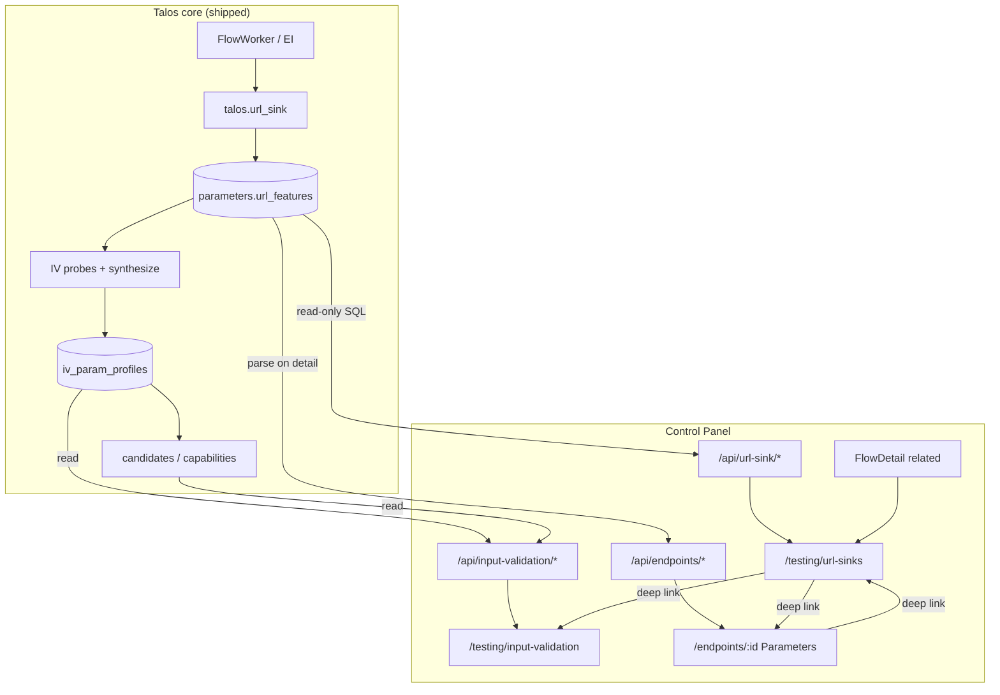
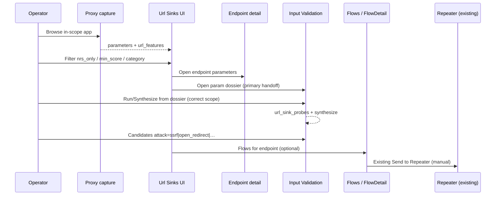
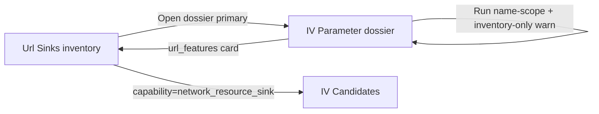

<!-- Generated by /design skill (id 7a496249). Approved after write→review→revise loop, 0 open issues. -->

# URL Sink Discovery in Talos Control Panel

| Field | Value |
|-------|-------|
| **Document** | Design: URL Sink Discovery Control Panel surfaces |
| **Author** | Grok Design (Control Panel) |
| **Date** | 2026-07-31 |
| **Status** | **Approved** (rev 3 — design review consensus). **PR1–PR4 implemented** on main; PR5 remaining. |
| **Workspace** | `talos-v2` |
| **Audience** | Senior engineers implementing Control Panel + reviewing product IA |

---

## Overview

URL Sink Discovery is a shipped **core intelligence layer** (`talos/url_sink/` + IV extensions) that finds parameters treated as URLs, hostnames, IPs, or other network resources **regardless of name**, then feeds capabilities and attack candidates for SSRF, open redirect, webhook abuse, OAuth redirect, and related prioritization. Phases 1–5 of the core program are complete on `main` (passive classifiers, structure discovery, IV canaries, capabilities/candidates, CLI polish). The remaining product gap is the **Control Panel**: there is currently **zero** URL-sink-specific UI or API under `talos-control-panel/` (confirmed by codebase search).

This document designs how operators discover, filter, inspect evidence, and hand off URL sinks end-to-end in the Control Panel—**characterization and prioritization only**, never confirmed SSRF/open-redirect Findings—reusing existing CP patterns (Testing hub modules, read-only SQLite, CLI mutations, disclaimers, deep-links).

**Recommended information architecture (hybrid):**

1. **Dedicated Testing hub module** `/testing/url-sinks` for **passive inventory triage** (pre-IV, post-capture)—the primary “find sinks fast” surface.
2. **Deep IV enrichment** so active characterization (`observed.url_sink`), capabilities (`network_resource_sink` family), and URL-family candidates are first-class inside Input Validation—not a second inventory clone.
3. **Cross-links** from Endpoint detail, Flow detail, Dashboard, and IV parameter dossiers so the intelligence layer is reachable from every operator path.

---

## Background & Motivation

### Product context

Talos is a client-approved penetration testing / public bug bounty platform: MITM capture → deterministic engines → findings; AI is policy-gated suggest-first. URL Sink Discovery is **not** an exploit engine and **must not** emit Findings from sink intelligence alone.

### Core architecture (locked, shipped)

```
Endpoint Intelligence
    │
    ├── Parameter Extraction (+ structure discovery)
    │
    ├── URL Sink Discovery (passive)          ← talos/url_sink/
    │     value classifier
    │     name category classifier
    │     initial sink score / url_features
    │
    └── Input Validation
          generic characterization
          + URL sink characterization probes   ← IV extension
                 │
                 ▼
        Unified Capabilities
          network_resource_sink (+ subfields)
          redirect_sink / fetch_sink / webhook_sink
                 │
                 ▼
        Candidate Engine
          ssrf | open_redirect | webhook_abuse | oauth_redirect | …
```

Core implementation plan explicitly: **“Do not bury this inside Input Validation as a name-list feature.”** That decision applies to **engine ownership and data contracts**. Control Panel UX may still *surface* sink intelligence inside IV (where characterization lives) while also exposing a **passive inventory workspace** that mirrors Secret Detection / Error Intelligence.

### Current CP state (as of 2026-07-31)

| Area | Status |
|------|--------|
| Core package `talos/url_sink/` | Shipped |
| `parameters.url_features` (schema v53) | Shipped |
| IV `observed.url_sink` + probes | Shipped |
| Capabilities / candidates (value-first) | Shipped |
| CLI: `talos endpoint params`, IV show/export, `url_sink.*` config | Shipped |
| CP grep for `url_sink` / `url_features` / `network_resource_sink` | **No matches** |
| IV Candidates attack enum | Already includes `ssrf`, `open_redirect`, `webhook_abuse`, `oauth_redirect` |
| IV capability filter datalist | Missing sink capabilities (`network_resource_sink`, etc.) |
| Endpoint detail Parameters tab | Shows location/name/type/examples only—**no** score/category |
| Endpoint detail API | `SELECT * FROM parameters` but does **not** parse `url_features` JSON |
| Testing hub registry | secrets, errors, unauth, bac, iv, intruder—**no** url-sinks entry |

### Pain points for operators today

1. After capture, CLI can list `url_features` (`talos endpoint params`), but CP Endpoint Parameters table is blind to sinks.
2. IV Candidates can filter by attack name, but capability hints still list reflection/context only—not `network_resource_sink` / `redirect_sink` / `fetch_sink` / `webhook_sink`.
3. Parameter dossiers (`ProfileCards`, `ParameterDetail`) never render `url_features` or `observed.url_sink` blocks that CLI `input-validation show` already prints.
4. No project-wide “show me all network-resource parameters sorted by score” inventory without dropping to SQL/CLI.
5. No Testing hub KPI for “how many high-score sinks / NRS params exist” after capture (independent of IV completion).

### Why this matters

Pentesters/BB operators need a fast loop:

```text
Capture → passive sink inventory → prioritize → IV characterize (canaries)
  → candidates triage → Repeater / Intruder / manual follow-up
```

CLI Phase 5 closed part of that loop; CP must close the visual/triage loop without inventing new DB tables.

---

## Goals & Non-Goals

### Goals

1. **Find sinks fast** — project-wide filterable inventory of parameters with `url_features` (score, NRS, name category, looks_like, host/endpoint).
2. **Characterize clearly** — surface active `observed.url_sink` and sink capabilities on IV dossiers and tables.
3. **Prioritize attacks** — operators can select URL-family attacks and sink capabilities from existing Candidates/Parameters filter controls via **hints/presets** (attacks already enum’d; capability query already server-side); scores labeled prioritization-only. Not new filter machinery.
4. **End-to-end handoff** — deep links: Url Sinks → Endpoint / IV param dossier / Candidates; IV characterization via dossier CTAs; Flows list for endpoint (manual Repeater via existing Flow “Send to Repeater” — no automated Repeater draft from inventory in v1).
5. **Incremental PRs** — ship read-only enrichment first; dedicated workspace when inventory API is solid.
6. **Reuse patterns** — ModuleShell, hub registry, disclaimers, deep-link `?tab=`, read-only SQLite + CLI mutations, Talos Config for knobs.
7. **Precise language** — characterization, prioritization, capabilities, candidates; never “confirmed SSRF”.
8. **Config visibility** — `url_sink.*` knobs reachable from module Settings and Talos Config. **Note:** core schema already has `url_sink` in `CONFIG_SECTIONS` / `SETTINGS_SCHEMA`, but CP `configuration.py` `_SECTIONS` and TalosConfig `SECTION_FILTERS` currently omit it — implementation must register the section (see K6 / PR3b).

### Non-Goals

| Non-goal | Rationale |
|----------|-----------|
| Confirmed SSRF / open-redirect Findings from this work | Core contract; OAST / verifier engines are separate programs |
| New SQLite schema for URL sinks | Data already lives on `parameters.url_features` and IV profiles |
| Freeform exploit payload builders / OAST chains in CP | Product safety + scope |
| AI agent tools for SSRF confirmation | Out of scope; AI remains suggest-first elsewhere |
| Client-data redaction pipeline | Product rule unless explicitly requested later |
| Replacing IV Candidates / Parameters as the active workspace | IV remains home of characterization and candidates |
| Full rewrite of Endpoint Workspace | Additive columns/chips only |
| Live collaborator/OAST domains in UI or probes | Core probes use `talos-canary.invalid` only |
| Project-wide rescan mutations beyond existing config set / capture | Passive features are produced by FlowWorker on capture |

### Safety copy requirements (must appear in UI)

Reuse/adapt peer disclaimers (`IvDisclaimer`, `PassiveDisclaimer`, `ErrorDisclaimer`):

1. **Passive inventory disclaimer (Url Sinks module):**  
   *“Passive local analysis of captured parameter values and names — no extra HTTP. Network-resource scores and categories are prioritization signals, not confirmed vulnerabilities or Findings.”*

2. **Active / IV sink panels:**  
   *“URL sink canaries are benign characterization probes (`talos-canary.invalid`). Accept/redirect/fetch/DNS signals are behavioral evidence for prioritization, not confirmed SSRF.”*

3. **Candidate scores:** always show prioritization note (existing `PRIORITIZATION_NOTE` in `routers/input_validation.py` and `IvDisclaimer`).

4. **Badge tooltips** for `network_resource_sink`, `redirect_sink`, `fetch_sink`, `webhook_sink`, `protocol_support` must not say “vulnerable”.

---

## Key Decisions

| # | Decision | Rationale |
|---|----------|-----------|
| **K1** | **Hybrid IA: dedicated `/testing/url-sinks` + deep IV enrichment + inventory cross-links** | Core architecture is a separate passive layer; CP should not bury pre-IV discovery only inside IV. Peer modules (secrets, errors) justify a dedicated passive workspace. IV remains the home of active characterization and candidates. |
| **K2** | **Dedicated module is passive-class, risk=none** | Inventory is read-only analysis of already-captured data. Active canaries remain owned by IV (`url_sink.iv_probes`). |
| **K3** | **No new DB tables / migrations in CP** | Read and parse existing `parameters.url_features` JSON; join IV profiles when present for optional “characterized” chips. |
| **K4** | **API home: `/api/url-sink/*` (new thin router)** | Mirrors `/api/error-intel` and `/api/passive` as first-class intelligence modules. Avoid stuffing inventory queries into IV (which implies profiles exist). Endpoint detail continues to use `/api/endpoints/*`. |
| **K5** | **Ship PR-A (Endpoint + IV enrich) before PR-C (full workspace)** | Early value without route/registry churn; workspace becomes justified once inventory API + filters exist. |
| **K6** | **Config via Talos Config after CP section registration** | Core has `url_sink` in `CONFIG_SECTIONS` / schema leaves. CP backend **hardcodes** `_SECTIONS = ("proxy", "capture", "scheduler", "attack", "http")` in `routers/configuration.py` — `GET /api/configuration/effective?section=url_sink` currently **400**. Implementers must extend `_SECTIONS` (+ ideally `parameter_intel`), `_section_summaries` cards, FE `SECTION_FILTERS` in `TalosConfig.tsx`, and tests in `test_configuration_routes.py`. Until that lands, Settings may parse full effective values for `url_sink.*` keys without `?section=` filter. Mutations: `POST /api/configuration/value` only — no second config store. |
| **K7** | **Default inventory filter: `min_score=45` + `nrs_only=true`** | Matches `url_sink.score_threshold` / `possible_network_resource`. Avoid flooding with name-only weak hits (score 15–35). |
| **K8** | **IV is enhanced, not duplicated** | Url Sinks module lists passive inventory + links into IV for dossier/candidates. Does not re-implement probe run UI or a second Candidates table. |
| **K9** | **Candidate score language unchanged** | Keep “prioritization only”; extend capability **datalist hints** and Overview preset links (not new backend filters). |
| **K10** | **param_uuid: import core helper only; raw `endpoints.host`** | Always `from talos.input_validation.db import make_param_uuid`. Pass **raw** `endpoints.host` (including origin form with `://`) as CLI `cmd_endpoint_params` does — **no local host normalization**. Regression test: UUID matches known CLI fixture row. |
| **K11** | **Dashboard: optional thin KPI only** | One chip on Testing hub card; optional Dashboard strip later. Prefer hub KPI first. |
| **K12** | **IV handoff is dossier-first; never pass UUID as `--parameter`** | See **§ IV Run handoff contract**. Inventory does **not** bulk-run IV in v1. Per-row primary CTA opens dossier. Run from dossier must use correct scope (name or future param_uuid CLI), not today’s ParameterDetail bug of posting `{ parameter: paramUuid }`. |
| **K13** | **Canonical inventory query names (FE = API)** | Same keys in URL search params and `/api/url-sink/inventory`: `min_score`, `nrs_only`, `category`, `looks_like`, `location`, `host`, `endpoint_id`, `has_iv_profile`, `has_url_sink_obs`, `search`, `sort`, `limit`, `offset`, `include_iv`. Host match = **case-insensitive substring** (`contains`). Defaults: `min_score=45`, `nrs_only=true`, `sort=score_desc`, `include_iv=false`. |
| **K14** | **IV join optional / deferred cost** | Status + inventory default = **parameters-only** parse. `include_iv=true` or detail/drawer loads IV slice. `has_iv_*` filters deferred to PR5 or require one-shot profile uuid set with hard cap. `iv_characterized_count` optional (`include_iv_stats=true`) — not on hot path. |
| **K15** | **Shared chips live under `frontend/src/components/url-sink/`** | Neutral path for PR1 before module page exists. Pages (`url-sinks/`, `input-validation/`, `EndpointDetail`) import from components — never reverse-import pages into components. |
| **K16** | **PR4 ships Overview + Inventory only** | Rollups + Settings polish move to PR5 (after config section registration). Hybrid IA unchanged. |
| **K17** | **Inventory-only badge + Run warn on dossier** | Rows with `location=response` or name prefix `jwt.` show badge “inventory-only (not injectable)” on inventory **and** Endpoint/IV dossier. **PR2 ParameterDetail:** disable Run (or ConfirmButton with strong warning) for those surfaces — not inventory-only. |
| **K18** | **High score chips use warn tone, not danger** | Danger reserved for findings-linked KPIs (secrets/findings). Prioritization scores: warn at ≥70, mid at ≥40, ghost otherwise. |
| **K19** | **Overview URL-family candidates = server-side filter** | Prefer `GET /api/input-validation/candidates?capability=network_resource_sink&min_score=60&limit=20`. Optional second call `attack=open_redirect` only if product wants a split strip. **Forbidden:** global `limit=N` then FE-filter attacks (xss/sqli fill the top-N). Hide/show from **candidates response only** (empty/error), not url-sink status. |
| **K20** | **CP config load is per-project effective, never process cache** | Status/Settings must call `load_url_sink_config_for_project(project_data_dir, …)` or `config effective` for that `project_id`. **Forbid** `get_process_url_sink_config()` / `ensure_process_url_sink_config()` in CP routers (FlowWorker singleton; wrong multi-project). |

---

## Proposed Design

### Information architecture recommendation

#### Option analysis (summary)

| Option | Pros | Cons |
|--------|------|------|
| **A. IV-integrated only** | Fewer routes; candidates already there | Hides pre-IV passive inventory; contradicts core “don’t bury in IV”; operators must run IV before seeing sinks |
| **B. Standalone only** | Clear inventory home | Duplicates candidates/dossier if not careful; characterization still lives in IV |
| **C. Hybrid (recommended)** | Matches core layers; passive triage + active dossiers; incremental | One more hub module to maintain |

**Recommendation: C (hybrid).**  
Rationale: URL Sink Discovery answers two different operator questions at two lifecycle stages:

| Stage | Question | Best surface |
|-------|----------|--------------|
| Post-capture (passive) | “Which inputs look like network resources, and what category?” | **`/testing/url-sinks`** inventory |
| Post-IV (active) | “How does the app behave on URL-shaped input, and what attacks to prioritize?” | **IV Candidates / Parameter dossier** |
| Always | “What does this endpoint look like?” | **Endpoint Parameters** chips |
| Always | “Where is this flow’s related intel?” | **Flow related strip** links |

### Architecture diagram



### Operator workflow (end-to-end)



### Module placement in Testing hub

Extend `frontend/src/pages/attack/registry.ts`:

```ts
// New constants
export const URL_SINKS_BASE = "/testing/url-sinks";

// New AttackModuleDef
{
  id: "url-sinks",
  class: "passive",
  name: "URL Sink Discovery",
  description:
    "Find parameters treated as URLs, hostnames, IPs, or network resources—regardless of name. Prioritization intelligence only.",
  risk: "none",
  status: "available",
  path: URL_SINKS_BASE,
  keywords: [
    "url", "ssrf", "redirect", "webhook", "oauth", "hostname",
    "sink", "network_resource", "url_features", "passive",
  ],
  kpi: "url_sinks", // extend AttackKpiSource union
}
```

Hub KPI chips (from `/api/url-sink/status` — parameters-only aggregates):

| Chip | Source | Tone |
|------|--------|------|
| `nrs` | `nrs_count` | warn if > 0 |
| `score≥70` | `score_ge_70` | **warn** if > 0 (not danger — prioritization only; K18) |
| `score≥thr` | `score_ge_threshold` | muted |

Status line: `Passive disabled` when `enabled_passive === false`.

**AttackHub mapping** (mirror secrets/errors pattern):

```ts
// GET /api/url-sink/status?project_id=
kpiMap["url_sinks"] = {
  chips: [
    { label: "nrs", value: s.nrs_count ?? 0, tone: nrs > 0 ? "warn" : "muted" },
    { label: "score≥70", value: s.score_ge_70 ?? 0, tone: hot > 0 ? "warn" : "muted" },
    { label: "score≥thr", value: s.score_ge_threshold ?? 0, tone: "muted" },
  ],
  statusLine: s.enabled_passive === false ? "Passive disabled" : undefined,
};
```

No project selected → hub shows empty/muted chips (no fetch); page uses `NoProjectNotice`.

### Workspace structure: `/testing/url-sinks`

**Shell:** `ModuleShell` + tabs (pattern from `ErrorIntelligence.tsx` / `SecretDetection.tsx`).

| Tab id | Label | Ship in | Purpose |
|--------|-------|---------|---------|
| `overview` | Overview | **PR4** | Status strip, distribution, top sinks, empty states, quick actions |
| `inventory` | Inventory | **PR4** | Primary filterable table |
| `rollups` | Rollups | **PR5** | By host / endpoint / category aggregates |
| `settings` | Settings | **PR5** | Effective `url_sink.*` + Talos Config deep-link + optional toggles |

Default tab: **`overview`** (onboarding) with one-click “Open inventory (NRS)” → `?tab=inventory&nrs_only=true&min_score=45`.

#### Canonical deep-link / API query map (K13)

**Single source of truth** — FE `searchParams` keys **must equal** API query param names (ErrorIntelligence / IV Candidates pattern: read on mount, write on Apply).

| Key | Type | Default | Semantics |
|-----|------|---------|-----------|
| `tab` | enum | `overview` | FE only |
| `min_score` | int 0–100 | `45` | Inclusive lower bound on `url_features.score` |
| `nrs_only` | bool (`true`/`false` or `1`/`0`) | `true` | Require `possible_network_resource` |
| `category` | str | — | Match primary **or** any entry in `name_categories` (exact category string) |
| `looks_like` | str | — | Membership in `looks_like` array |
| `location` | str | — | Exact location (`query`, `body`, `header`, `cookie`, `path`, `response`, …) |
| `host` | str | — | **Case-insensitive substring** of `endpoints.host` |
| `endpoint_id` | str | — | Exact endpoint id |
| `has_iv_profile` | bool | — | PR5 / when `include_iv` path available |
| `has_url_sink_obs` | bool | — | PR5 / when IV stats available |
| `search` | str | — | Case-insensitive substring on name **or** path **or** host |
| `sort` | enum | `score_desc` | `score_desc` \| `score_asc` \| `name` \| `host` |
| `limit` | int | `200` | Max 1000 |
| `offset` | int | `0` | Pagination |
| `include_iv` | bool | `false` | Attach slim `iv` block (costly) |

Example:

```
/testing/url-sinks?tab=inventory
  &min_score=45
  &nrs_only=true
  &category=redirect
  &host=api.example.com
  &location=query
  &looks_like=url
  &search=callback
  &sort=score_desc
```

**Forbidden aliases:** do not use `nrs`, `q`, `has_iv` — only the table above.

---

## Wireframes / structural UI mocks

### 1. Testing hub card

Matches AttackHub KPI sketch only (parameters-only status; K14/K18):

```
┌─────────────────────────────────────────────────────────┐
│ URL Sink Discovery                          [passive]   │
│ Find network-resource parameters by value…  risk: none  │
│  [ nrs: 42 ]  [ score≥70: 11 ]  [ score≥thr: 55 ]       │
│  (statusLine: "Passive disabled" when enabled_passive=false)
└─────────────────────────────────────────────────────────┘
```

**Not shown on hub:** categories count, IV-characterized count.

### 2. Overview tab

```
┌─ UrlSinkDisclaimer ─────────────────────────────────────┐
│ Passive local analysis… prioritization only…             │
└─────────────────────────────────────────────────────────┘

Config strip (from per-project effective url_sink — K20):
[enabled] [threshold: 45] [html/js: on] [iv_probes: on]

KPI strip (default parameters-only status — K14):
[ 128 NRS ] [ 312 score≥45 ] [ 41 score≥70 ]
  // NO default "w/ url_sink IV" chip
  // Optional later: show iv_characterized_count only if operator
  //   toggles include_iv_stats (not PR4 hot path)

Distributions (from parameters url_features parse — OK on hot path):
  by_category: redirect 28 · remote_fetch 40 · webhook 12 · …
  by_looks_like: url 90 · hostname 30 · ip 8 · path 15
  by_location: query · body · header · cookie · response · …

Top sinks (table, max 10) — SinkRow without iv block:
  Score | NRS | Name | Loc | Host | Path | Category | Flags | Action
  95    | ●   │ abc  | q   | api… | /x   | —        |       | Open dossier

Top URL-family candidates (see § Empty states / K19):
  server: capability=network_resource_sink&min_score=60&limit=20
  hide when that response is empty or errors

Empty states (FE ownership — see § Empty states):
  • no project → `NoProjectNotice` (page shell; no API call)
  • no_params → Capture CTA → /proxy or /flows
  • no_nrs → “Open inventory (all scores)” (clears nrs_only / lowers min_score) + Settings link
  • passive_disabled → Enable via Settings / Talos Config
```

### 3. Inventory tab (primary)

```
Filters (row 1) — keys = API names (K13):
  [min_score ▾ 45] [nrs_only ☑] [category ▾ all]
  [looks_like ▾] [location ▾] [host ________]
  [search name/path/host ____]
  [Apply] [Reset] [Refresh] [Download JSON]
  (has_iv_profile / has_url_sink_obs: PR5 only)

Table:
┌──────┬─────┬──────────┬─────┬────────────┬──────────────┬──────────┬──────────┬──────────┐
│Score │ NRS │ Name     │ Loc │ Host       │ Endpoint     │ Category │ Looks    │ Flags    │
├──────┼─────┼──────────┼─────┼────────────┼──────────────┼──────────┼──────────┼──────────┤
│ 95   │ ●   │ abc      │ q   │ api.ex.com │ GET /avatar  │ —        │ url      │          │
│ 88   │ ●   │ callback │ b   │ api.ex.com │ POST /hook   │ webhook  │ url,host │          │
│ 90   │ ●   │ jwt.jku  │ hdr │ api.ex.com │ GET /me      │ —        │ url      │ inv-only │
└──────┴─────┴──────────┴─────┴────────────┴──────────────┴──────────┴──────────┴──────────┘

Row click → SideDrawer:
  Sample values (truncated mono)
  Full url_features JSON (collapsible)
  Chips: categories, protocols_seen, evidence tokens
  Inventory-only badge when location=response or name starts with "jwt."
  Links (v1):
    [Endpoint] → /endpoints/:endpointId
    [IV dossier] → /testing/input-validation/params/:paramUuid  (PRIMARY)
    [IV candidates] → /testing/input-validation?tab=candidates&capability=network_resource_sink
    [Flows] → /flows?endpoint=<endpointId>
  NOT in v1: direct “Run IV” POST from inventory; automated Repeater draft
```

**Score chip colors** (K18): ≥70 **warn** (badge-warning), ≥40 mid (outline warning), else ghost. Never badge-error for prioritization scores.

**Category chips** (outline badges):

| Category | Suggested badge accent |
|----------|------------------------|
| `redirect` / `oauth` | info |
| `webhook` | secondary |
| `remote_fetch` / `remote_asset` | accent |
| `infrastructure` / `network_probe` | warning |
| `import_metadata` / `path_like` | ghost |

### 4. Rollups tab

Three sub-tables (or pill switcher):

1. **By host** — host, nrs_count, max_score, top categories  
2. **By endpoint** — method path, nrs_count, max_score, link to endpoint detail  
3. **By category** — category, count, median score  

Click row → Inventory with that filter applied.

### 5. Settings tab (PR5)

```
Effective url_sink configuration
  Source (after PR3b): GET /api/configuration/effective?section=url_sink
  Fallback (before section reg): GET …/effective (full) and pick url_sink.* leaves
  Or: GET /api/url-sink/status → enabled_* + score_threshold (parameters path)

  passive.enabled     [on]   [Open Talos Config → /talos-config?tab=settings&section=url_sink]
  html_js.enabled     [on]
  iv_probes.enabled   [on]
  score_threshold     45

Note: Changes via POST /api/configuration/value (talos config set). No /api/url-sink/config.
IV canary probes also require IV types analysis + IV engine enabled.
```

### 6. Endpoint detail — Parameters tab enrichment (PR1)

**Current columns:** Location | Name | Type/Shape | Observed values | **“IV state”** (today = reflection / “open IV” link — **misleading name**).

**PR1 required columns:**

| Column | Content |
|--------|---------|
| Location | unchanged |
| Name | mono; **link** to IV dossier `/testing/input-validation/params/:paramUuid` when uuid computable |
| Type / Shape | unchanged |
| URL score | `UrlScoreChip` from `url_features.score` |
| NRS | `NrsBadge` |
| Sink cat | `SinkCategoryBadge` |
| Observed values | unchanged (truncated) |
| Reflection | rename former “IV state”: reflected badge **or** “—” (not IV profile state) |

**Backend PR1:** parse `url_features`; compute `param_uuid = make_param_uuid(endpoint.host, location, name)` with **raw** host; return `url_score`, `possible_network_resource`, `name_category`, `param_uuid`.

**Post-PR4 link:** optional secondary link to inventory  
`/testing/url-sinks?tab=inventory&search=<name>&host=<host>&nrs_only=false`.

### 7. IV Parameter dossier (`ParameterDetail` + `ProfileCards`)

New cards (after Capabilities strip):

**Card: Passive URL features**

```
Score: 95  NRS: yes  Category: remote_asset
Looks like: url
Protocols: https
Evidence: value_scheme:https, name:avatar
(sample value truncated)
```

**Card: Active URL sink (observed.url_sink)**

```
Confidence: 92
Accepts: url ●  hostname ○  ip ●  path ○  unc ○  protocol ●
Accepted protocols: http, https
Redirect behavior: yes   Fetch behavior: yes
DNS resolution detected: no
Validation: invalid_url_message
Error classes: timeout, connection_refused
```

Empty copy when no IV yet: *“No active URL-sink characterization yet. Run IV (types + url_sink probes) then Synthesize.”* with CTA buttons (already on ParameterDetail).

### 8. IV Candidates / Parameters / Overview enhancements (PR2)

- **CandidatesTab** capability **datalist hints** (server filter already works): add `network_resource_sink`, `redirect_sink`, `fetch_sink`, `webhook_sink`, `protocol_support`, `url_like_value`. Acceptance: operators pick sink capabilities **without typing** full strings.
- Overview **preset links** (navigate with existing query params): e.g. `?tab=candidates&attack=ssrf&min_score=60` — not new APIs.
- **ParametersTab**: optional NRS / url_score display from slim profile fields; style sink caps in `CapabilityBadges`.
- **CapabilityBadges**: sink-family styles + tooltips (prioritization language only).
- **ParameterDetail Run CTA polish (in-scope PR2):** fix body so Run does **not** pass UUID as `--parameter` name (see § IV Run handoff contract).

### 9. Flow detail cross-link (PR5)

In `FlowRelatedPanel` or `FlowUrlSinksStrip`:

```
URL sinks on endpoint: 3 NRS · max score 95
  [View inventory] → /testing/url-sinks?tab=inventory&endpoint_id=…&nrs_only=true
  [Flows for endpoint] already available; Send to Repeater remains on FlowDetail
```

Counts via `GET /api/url-sink/by-endpoint/{id}` (parameters-only SQL/parse — no IV join).

### 10. Empty states (implementation detail)

| Condition | Owner | UI |
|-----------|-------|-----|
| No project selected | Page shell | `NoProjectNotice` — do not call `/api/url-sink/*` |
| Project, no DB | Overview | empty_state from API or 404/empty status |
| `no_params` | Overview | “Capture traffic” → `/proxy` or `/flows` |
| `no_nrs` | Overview | CTA: Inventory with `nrs_only=false&min_score=0` |
| `passive_disabled` | Overview + hub statusLine | Link Settings / Talos Config |
| Hub card, no project | AttackHub | skip KPI fetch; muted/empty chips |

**Top URL-family candidates panel (Overview) — K19:**

Normative fetch (server-side filter; **one** preferred call):

```
GET /api/input-validation/candidates
  ?project_id=…
  &capability=network_resource_sink
  &min_score=60
  &limit=20
```

Rationale: core `list_candidates` sorts **all** attacks by score then applies `limit`. A global top-20 is routinely filled by `xss`/`sqli`, so FE-filtering that list **under-reports** URL-family rows that exist below the cut. Capability filter runs in the engine before limit.

Optional second call (only if product wants a dedicated open-redirect strip):  
`?attack=open_redirect&min_score=60&limit=10` — not required for v1.

**Hide / show rules (do not use url-sink status):**

| Outcome | UI |
|---------|-----|
| Candidates request returns `count === 0` or empty list | Hide panel body; one line: *“No network-resource candidates yet — passive inventory still useful”* + link Inventory + link IV Candidates |
| Candidates request errors | Soft-fail: hide panel (no toast spam); Inventory remains primary |
| Non-empty list | Show rows grouped by `attack`; link to `/testing/input-validation?tab=candidates&capability=network_resource_sink&min_score=60` |

**Forbidden:**

- `GET …/candidates?min_score=60&limit=20` then FE-filter attack ∈ URL family.
- Inferring empty from `/api/url-sink/status` “profiles” (field does not exist on default status).
- Calling `include_iv_stats=true` solely to decide candidates-panel visibility.

---

## IV Run handoff contract (v1)

### Verified CLI / CP behavior (do not invent)

| Mechanism | Behavior |
|-----------|----------|
| CLI `talos input-validation run --parameter NAME` | Scopes by **parameter name** (all hosts/locations with that name), **not** param_uuid |
| CLI synthesize | Supports `--param-uuid` |
| CP `ScopeBody` | Has `parameter` and `param_uuid` fields |
| CP `_scope_args()` for **run** | Emits only `--host` / `--endpoint` / `--parameter` — **does not** pass `param_uuid` |
| `ParameterDetail.tsx` today | Posts `{ parameter: paramUuid, budget: "standard" }` — **incorrect** (UUID treated as name) |

### v1 inventory / Url Sinks CTAs (required)

1. **Primary:** navigate to dossier  
   `/testing/input-validation/params/:paramUuid`  
   Operator uses dossier **Synthesize** (`param_uuid` — correct) and **Run** after PR2 fix.
2. **Secondary:** deep-link IV Run tab for **name-scope** awareness (optional UI only):  
   `/testing/input-validation?tab=run` with operator-visible note that CLI `--parameter` is **name-global**.  
   Do **not** auto-POST run from inventory.
3. **Forbidden:** `POST /api/input-validation/run` with `{ parameter: <param_uuid> }` from any new Url Sinks control.
4. **Out of scope for core UUID-scoped run:** extending CLI `run --param-uuid` is a **separate** core PR if product requires single-surface run; not required to ship inventory UI.
5. **PR2 polish (in scope) — Run body:** fix `ParameterDetail` Run to use `{ parameter: profile.name }` (name scope, matches CLI) with tooltip: *“Runs IV for this parameter name on all matching surfaces (CLI --parameter).”* Prefer name from loaded profile, not UUID.
6. **PR2 polish (in scope) — inventory-only Run (K17):** when `profile.location === "response"` **or** `profile.name` starts with `jwt.`, show `InventoryOnlyBadge` on the dossier and **disable Run** (preferred) **or** require ConfirmButton with strong warning that the surface is inventory-only / non-injectable characterization. Synthesize may remain enabled if probes already exist; do not present Run as a silent success path.

### Handoff click budget

| Path | Clicks |
|------|--------|
| Inventory row → IV dossier | 1 |
| Dossier → Run (after fix) | 1 (2 total from inventory) |
| Inventory → Flows for endpoint → Send to Repeater | 2–3 via existing Flow UI |

---

## API / Interface Changes

### New router: `talos_ui/routers/url_sink.py`

Prefix: `/api/url-sink`  
Register in `main.py` alongside `error_intel`, `passive`.  
Reads: read-only SQLite. Mutations: none required for v1 inventory (config via `/api/configuration`).

#### Shared disclaimer

```python
DISCLAIMER = (
    "Passive local analysis of captured parameter values and names — no extra HTTP. "
    "Scores and categories are prioritization intelligence only; not confirmed "
    "vulnerabilities and not Findings."
)
```

#### Configuration section registration (required CP work — not optional polish)

Today (`talos-control-panel/backend/talos_ui/routers/configuration.py`):

```python
_SECTIONS = ("proxy", "capture", "scheduler", "attack", "http")
# section query validation → 400 for url_sink
```

**Required changes (PR3b, can land with PR3):**

1. Extend `_SECTIONS` to include `"url_sink"` and ideally `"parameter_intel"` (parity with core `CONFIG_SECTIONS`).
2. Extend `_section_summaries` / section cards so Overview shows a URL Sink card.
3. FE `TalosConfig.tsx` `SECTION_FILTERS`: add `{ id: "url_sink", label: "URL Sink" }` (and parameter_intel if desired).
4. Tests: `test_configuration_routes.py` — `effective?section=url_sink` returns 200; unknown section still 400.
5. Deep-link: `/talos-config?tab=settings&section=url_sink` (TalosConfig already filters settings table by `section` query when registered).

**SettingsTab interim (if PR3b not merged yet):** read `/api/url-sink/status` for flags/threshold OR full effective map without section filter.

#### `GET /api/url-sink/status`

Query: `project_id`, `include_iv_stats` (bool, default **false**)

Response (default — **parameters-only**):

```json
{
  "enabled_passive": true,
  "enabled_html_js": true,
  "enabled_iv_probes": true,
  "score_threshold": 45,
  "total_params": 1200,
  "with_url_features": 980,
  "nrs_count": 42,
  "score_ge_threshold": 55,
  "score_ge_70": 11,
  "by_category": { "redirect": 12, "webhook": 5, "remote_fetch": 20 },
  "by_looks_like": { "url": 40, "hostname": 15 },
  "by_location": { "query": 30, "body": 10, "header": 2, "response": 4 },
  "iv_characterized_count": null,
  "disclaimer": "…"
}
```

Implementation notes:

- **Default path:** scan/join `parameters` (+ `endpoints` for host histograms if needed). Parse `url_features` JSON in Python. **Do not** open `iv_param_profiles` unless `include_iv_stats=true`.
- **Config flags (K20 — mandatory):** per-request, project-scoped effective load only:
  - Preferred: `from talos.url_sink.config import load_url_sink_config_for_project` with `project_data_dir` resolved from the selected `project_id` (registry / `config.project_db_path` parent), **or**
  - `talos config effective` / existing configuration helpers scoped to that `project_id`, then map `url_sink.*` leaves.
  - **Forbidden in CP routers:** `get_process_url_sink_config()`, `ensure_process_url_sink_config()`, `set_process_url_sink_config()` — those are FlowWorker/IV **process singletons** and will show the wrong project’s knobs in a multi-project CP process.
  - PR3 test: status `enabled_passive` / `score_threshold` reflect **project** effective config (not process defaults after another project was “warmed”).
  - Do **not** assume `?section=url_sink` works until PR3 config registration lands.
- `iv_characterized_count`: only when `include_iv_stats=true` — load profiles (cap e.g. 5000 rows), parse `observed.url_sink.confidence > 0`, count intersection with NRS param_uuids. Otherwise `null` / omit. Overview default UI **must not** require it (no default “w/ url_sink IV” chip).

#### `GET /api/url-sink/overview`

Query: `project_id`, `top_n` (default 10, max 50)

Response:

```json
{
  "status": { /* status with include_iv_stats=false */ },
  "top_sinks": [ /* SinkRow without iv block */ ],
  "empty_state": {
    "no_params": false,
    "no_nrs": false,
    "passive_disabled": false
  },
  "disclaimer": "…"
}
```

#### `GET /api/url-sink/inventory`

Query: **exactly** the K13 map (same names as FE).

| Param | Type | Default | Notes |
|-------|------|---------|-------|
| `project_id` | str | required | |
| `min_score` | int 0–100 | 45 | |
| `nrs_only` | bool | **true** | `possible_network_resource` |
| `category` | str | — | primary or any of `name_categories` |
| `looks_like` | str | — | membership in `looks_like` |
| `location` | str | — | exact |
| `host` | str | — | **case-insensitive contains** on `endpoints.host` |
| `endpoint_id` | str | — | exact |
| `has_iv_profile` | bool | — | **PR5 / requires profile index**; 501 or ignore until implemented |
| `has_url_sink_obs` | bool | — | same |
| `search` | str | — | contains on name \| path \| host |
| `sort` | str | `score_desc` | |
| `limit` | int | 200 | max 1000 |
| `offset` | int | 0 | |
| `include_iv` | bool | **false** | When true, attach slim `iv` for returned page only |

Response:

```json
{
  "items": [ /* SinkRow */ ],
  "count": 42,
  "total_matched": 42,
  "filters_applied": { "min_score": 45, "nrs_only": true, "include_iv": false },
  "note": "Prioritization intelligence only…",
  "disclaimer": "…"
}
```

**SinkRow** shape (default **without** `iv`):

```json
{
  "parameter_id": "…",
  "param_uuid": "32hex",
  "endpoint_id": "…",
  "name": "abc",
  "location": "query",
  "param_type": "string",
  "semantic_type": "url",
  "host": "api.example.com",
  "method": "GET",
  "normalized_path": "/v1/avatar",
  "seen_count": 3,
  "example_values": ["https://cdn.example/x"],
  "url_features": { "score": 95, "possible_network_resource": true, "/* … */": "…" },
  "url_score": 95,
  "possible_network_resource": true,
  "name_category": null,
  "name_categories": [],
  "inventory_only": false
}
```

`inventory_only` = `location == "response"` OR `name` starts with `jwt.` (case-sensitive prefix `jwt.` as core emits).

When `include_iv=true`, add:

```json
"iv": {
  "has_profile": true,
  "capabilities": ["network_resource_sink", "fetch_sink"],
  "url_sink_confidence": 92,
  "top_url_candidate": { "attack": "ssrf", "score": 72, "confidence": 60 }
}
```

**IV enrichment algorithm (when `include_iv=true` only):**

1. Build page of parameter rows (≤ `limit`) with `param_uuid` from `make_param_uuid(raw_host, location, name)`.
2. `SELECT param_uuid, profile FROM iv_param_profiles WHERE param_uuid IN (…page uuids…)` — **bounded by page size**, not full table.
3. Parse profile JSON for capabilities / `observed.url_sink` / top URL-family candidate only.

**Detail/drawer:** `GET /api/url-sink/params/{parameter_id}` always may include IV slice (single uuid lookup — cheap).

#### `GET /api/url-sink/params/{parameter_id}`

Or by `param_uuid` query. Full inventory row + full `url_features` + optional IV intelligence slice (`observed.url_features`, `observed.url_sink`, candidates filtered to URL family).

#### `GET /api/url-sink/rollups/host` | `/endpoint` | `/category`

Query: `project_id`, `min_score`, `nrs_only`, `limit`

Response: `{ "rollup": [ { "key": "…", "count": N, "max_score": N, … } ] }`

#### `GET /api/url-sink/by-endpoint/{endpoint_id}`

Convenience for Endpoint detail / Flow strip: `{ "count": N, "nrs_count": N, "max_score": N, "items": […top 20] }`.

### Existing API enrichments

#### `GET /api/endpoints/{endpoint_id}`

In `routers/endpoints.py` after loading parameters:

```python
from talos.input_validation.db import make_param_uuid  # only import; no fork

host_raw = endpoint.get("host") or ""  # same string as endpoints.host / CLI
for p in parameters:
    p["example_values"] = db.safe_json(p.get("example_values"), [])
    p["url_features"] = db.safe_json(p.get("url_features"), {})
    uf = p["url_features"] if isinstance(p["url_features"], dict) else {}
    p["url_score"] = int(uf.get("score") or 0)
    p["possible_network_resource"] = bool(uf.get("possible_network_resource"))
    p["name_category"] = uf.get("name_category")
    p["param_uuid"] = make_param_uuid(host_raw, p.get("location") or "", p.get("name") or "")
    p["inventory_only"] = (
        (p.get("location") or "") == "response"
        or (p.get("name") or "").startswith("jwt.")
    )
```

Update frontend `Parameter` interface in `types.ts` (`url_features`, `url_score`, `possible_network_resource`, `name_category`, `param_uuid`, `inventory_only`).

#### `GET /api/endpoints/parameters/search`

Include `url_score`, `possible_network_resource`, `name_category` in SELECT/parse for IV picker / Coverage (optional PR).

#### `GET /api/input-validation/profiles` — `_slim_param_profile`

Add:

```python
observed = …
url_features = observed.get("url_features") or {}
url_sink = observed.get("url_sink") or {}
# return:
"url_score": …,
"possible_network_resource": …,
"name_category": …,
"url_sink_confidence": int(url_sink.get("confidence") or 0) or None,
"has_network_resource_sink": "network_resource_sink" in caps,
```

Extend `_match_profile_filters` with optional `min_url_score`, `name_category` if cheap.

#### `GET /api/input-validation/show/{parameter_uuid}`

No contract change if profile already contains `observed.url_features` / `observed.url_sink` (core Phase 4 attaches these). Frontend must render them. Optionally ensure attach path always includes passive copy even when profile is sparse.

#### `GET /api/input-validation/candidates`

Already supports `attack` / `capability`. Document URL-family examples in OpenAPI-ish help; frontend datalist update only.

#### `GET /api/flows/{id}/related` (or intelligence)

Add:

```json
"url_sinks": {
  "nrs_count": 3,
  "max_score": 95,
  "endpoint_id": "…"
}
```

### Frontend routes (`App.tsx`)

```tsx
<Route path="/testing/url-sinks" element={<UrlSinkDiscovery />} />
{/* optional detail drawer is in-page; dedicated route only if needed later */}
```

No legacy redirect required (new module).

### CLI interaction

Read paths: **no CLI required** (direct SQL + core helpers: `make_param_uuid`).  
Config mutations: `POST /api/configuration/value` → `talos config set` (after section registration for UI filter).  
Optional later: command drawer for `talos endpoint params`.

---

## Data Model Changes

**None in SQLite.**

| Store | Fields used |
|-------|-------------|
| `parameters` | `id`, `endpoint_id`, `name`, `location`, `param_type`, `semantic_type`, `example_values`, `seen_count`, `url_features` (TEXT JSON), … |
| `endpoints` | join for method/host/path; **host used raw** for param_uuid |
| `iv_param_profiles` | **only** when `include_iv` / detail / `include_iv_stats` |
| Layered config | `url_sink.passive.enabled`, `html_js.enabled`, `iv_probes.enabled`, `score_threshold` |

### Migration strategy

N/A for schema. Frontend must tolerate missing `url_features` (older DBs pre-v53): treat as `{}` / score 0.

### Performance estimates

| Call | Approach | Budget |
|------|----------|--------|
| status / overview (default) | parameters (+ endpoints) only; parse url_features | &lt; 300 ms typical (≤5k params) |
| inventory `include_iv=false` | same; filter/sort in process; limit/offset | &lt; 300 ms typical; &lt; 1.5 s large @ limit 200 |
| inventory `include_iv=true` | + `IN` query profiles for **page uuids only** (≤ limit) | +50–150 ms typical |
| status `include_iv_stats=true` | optional full profile scan with hard cap | may be 1–3 s; not used by hub KPI |
| has_iv_* filters | defer PR5; if implemented, one profile uuid-set load capped | document cap in API note |

**Risk:** full profile JSON scan on every inventory/status call is **explicitly forbidden** in v1 default path.

Storage: no additional CP storage.

---

## Interaction with IV workspace (enhance vs duplicate)

| Concern | Owner | Notes |
|---------|-------|-------|
| Passive inventory browse | **Url Sinks module** | Pre-IV |
| Active canary run | **IV Parameter dossier CTAs** | Correct scope only; see § IV Run handoff |
| `observed.url_sink` evidence | **IV ParameterDetail** | New cards |
| Capabilities NRS family | **IV CapabilityBadges + datalist hints** | Server filter already exists |
| Candidates ssrf/redirect/… | **IV CandidatesTab** | Preset links + hints only |
| Config `url_sink.iv_probes` | Settings (PR5) + Talos Config (PR3b) | Cross-link, not second store |

**Do not** add a second Candidates table inside Url Sinks. Overview panel: **one** candidates fetch with **server-side** `capability=network_resource_sink` (K19; see Empty states).



---

## Dedicated `/testing/url-sinks` vs IV-integrated only

### Decision: **dedicated module is worth it** (with hybrid enrichment)

**Arguments for dedicated module:**

1. **Lifecycle mismatch:** `url_features` appear after capture; IV profiles after run+synthesize. Operators need triage during recon, not only after characterization.
2. **Architectural honesty:** Core plan forbids burying URL Sink as an IV name-list; CP should reflect Endpoint Intelligence ownership of passive scoring.
3. **Filter vocabulary differs:** inventory filters = score, NRS, category, looks_like, location, structure evidence (`jwt.*`, `html_hidden`); IV filters = reflection, candidates, budget state.
4. **Peer precedent:** Secret Detection and Error Intelligence are passive Testing modules with full workspaces despite also linking from Flow/Endpoint.
5. **CLI gap analog:** QA report noted inventory hard to browse; CP inventory is the visual `talos endpoint params` project-wide.

**Arguments against (and mitigations):**

| Risk | Mitigation |
|------|------------|
| Hub clutter | One passive card; clear description |
| Duplicate UI with IV Parameters | Inventory rows deep-link; no second candidate engine |
| Maintenance cost | Shared chips under `components/url-sink/` + panels used by Endpoint + IV + Url Sinks |

**IV-integrated-only rejected** because it forces active testing before passive prioritization is visible in CP—the opposite of how pentesters work after proxy capture.

---

## Alternatives Considered

### Alternative 1 — IV-only enrichment (no dedicated module)

Add columns/filters/cards only inside Input Validation + Endpoint Parameters.

| Pros | Cons |
|------|------|
| Smaller PR surface | Pre-IV discovery buried |
| No registry/route work | Violates spirit of core IA |
| | Testing hub cannot KPI passive sinks |

**Reject** as sole strategy; accept its enrichments as **PR-A subset**.

### Alternative 2 — Endpoint Coverage only

Add “URL sink coverage” cards under Endpoints Coverage tab.

| Pros | Cons |
|------|------|
| Near inventory data | Endpoints workspace already dense |
| | No attack-family candidate handoff |
| | Poor home for project-wide sink triage |

**Reject** as primary; optional later rollup card OK.

### Alternative 3 — Dashboard-only widgets

| Pros | Cons |
|------|------|
| Visibility | Not operational (no filters/drill-down) |

**Reject** as primary; allow thin KPI later.

### Alternative 4 — New SQLite `url_sink_index` table

| Pros | Cons |
|------|------|
| Fast SQL filters on category/score | Schema churn; dual-write with parameters |
| | Core already stores on parameters |

**Reject** for v1; revisit only if inventory latency fails targets on large projects.

---

## Security & Privacy Considerations

| Topic | Treatment |
|-------|-----------|
| Authorization | Local CP; project-scoped reads; same trust model as other modules |
| Active traffic | Inventory is passive. IV canaries remain gated by IV engine + `url_sink.iv_probes.enabled` + planner warrant |
| Canary safety | UI must state canaries are benign `*.invalid` / loopback characterization only |
| Findings boundary | No Findings bridge; no “Confirm SSRF” button |
| Sample values | Show truncated examples already stored on inventory (authorized engagement data); no extra redaction pipeline |
| JWT virtual params | Surface `jwt.*` / `location=response` as inventory; warn that IV may skip non-injectable surfaces (core Phase 5 inventory-only skip) |
| Config kill-switches | Operators can disable passive / html_js / iv_probes without code deploy |
| Threat: UI overclaiming | Disclaimers + tooltips + prioritization labels required in acceptance criteria |

Threat model (brief):

- **T1:** Operator mistakes prioritization for confirmed vuln → mitigate with disclaimers.  
- **T2:** Accidental mass IV run from inventory → no bulk-run default; confirm on multi-select if added.  
- **T3:** Inventory flood (name-only low scores) → default NRS / min_score 45.

---

## Observability

| Signal | Where |
|--------|-------|
| API errors | FastAPI logs; frontend toast on failure |
| Empty states | Overview flags (`no_params`, `no_nrs`, `passive_disabled`) |
| Hub KPI | AttackHub load failures silent (peer pattern) |
| Metrics (optional later) | Counts already in status payload; no Prometheus required for local CP |

No new alerting. Backend should never log full sample URL values at INFO if they are huge; keep parity with error_intel “don’t log sensitive evidence at INFO”.

---

## Rollout Plan

### Feature flags

No separate CP feature flag required. Behavior is gated by data presence + core `url_sink.passive.enabled`. Module can ship `status: "available"` immediately when routes exist.

### Staged delivery (see PR Plan)

1. Endpoint chips + IV enrich (PR1–PR2).  
2. Inventory API + **CP configuration section registration** (PR3).  
3. Workspace Overview + Inventory + hub KPI (PR4).  
4. Rollups, Settings, cross-links (PR5).

### Rollback

- Revert FE routes/registry entry → module disappears; enrichments optional keep.  
- Backend router can remain harmless.  
- No DB migration to reverse.

---

## Acceptance Criteria / Success Metrics

### Operator acceptance

1. After proxy capture (no IV), operator can open `/testing/url-sinks` and see parameters with `abc=https://…` at score ≥ 90, NRS true, without name catalog hit.
2. Filters `category=redirect`, `min_score`, `host` (contains), `location` work and **persist in URL query using canonical K13 keys** (`nrs_only`, `search`, not `nrs`/`q`).
3. Endpoint Parameters tab shows score/NRS/category chips; **name links to IV dossier** via computed `param_uuid`; reflection column is not labeled “IV state”.
4. After IV run+synthesize, Parameter dossier shows `observed.url_sink` accepts/behaviors and sink capability badges.
5. Operators can select sink capabilities (`network_resource_sink`, …) and URL-family attacks from **datalist/select/presets without typing full strings** (existing server filters — no new filter API).
6. Every sink surface shows prioritization/disclaimer language; nowhere says “confirmed SSRF”.
7. After PR3b+PR5: Settings shows effective `url_sink.*` and deep-links `/talos-config?tab=settings&section=url_sink` successfully (section no longer 400).
8. Hub KPI reflects NRS / score≥70 with **warn** tones; `statusLine` when passive disabled.
9. Inventory **and** IV ParameterDetail: rows/dossiers with `location=response` or `jwt.*` names show **inventory-only (not injectable)** badge; dossier **Run is disabled or confirm-warned** (PR2) — not a silent success path.
10. Inventory primary CTA opens dossier; no POST of `parameter: paramUuid` as run scope from Url Sinks UI.
11. Overview “Top URL-family candidates” uses server-side `capability=network_resource_sink` (or explicit attack scope), never global top-N + FE attack filter.

### Engineering acceptance

- Backend tests: inventory filters (canonical params), status aggregates without IV join, endpoint detail parse + param_uuid parity with CLI fixture, `test_url_sink_routes.py`.
- Config tests: `effective?section=url_sink` 200 after PR3b (`test_configuration_routes.py`).
- Frontend: pure chips unit-testable; InventoryTab deep-link serialize/deserialize tests for K13 keys; empty_state → CTA mapping.
- Hub: `AttackKpiSource` union includes `url_sinks`; KPI smoke mapping documented in PR4.
- Docs: `routing.md` with API PR; `pages.md` with workspace PR; config section noted.
- No new SQLite migrations.
- Default inventory path does not scan all `iv_param_profiles`.

### Success metrics (product)

| Metric | Target |
|--------|--------|
| Time to first high-score sink after capture in CP | &lt; 30 s operator action (open module + default filter) |
| IV handoff from inventory row | ≤ 2 clicks to dossier (Run is second click on dossier after PR2 fix) |
| False-positive noise | Default view excludes score &lt; 45 / non-NRS |
| Language compliance | 0 “confirmed” SSRF strings in new UI copy |

---

## Open Questions

1. **Bulk “Run IV on all NRS”** — useful for automation, risky for traffic; defer to post-v1 with explicit confirm + budget estimate? **(still open — product)**
2. ~~Response-location / JWT badge~~ → **Resolved (K17):** show with inventory-only badge; required acceptance #9.
3. **Pagination vs infinite scroll** — start with limit/offset + “Load more”; DataTable virtualization only if needed. **(still open — implementer default: load more)**
4. **Dashboard panel** — permanently hub-only for v1; dashboard optional later. **(resolved: hub-only v1)**
5. ~~Shared component path~~ → **Resolved (K15):** `frontend/src/components/url-sink/`.
6. **CLI `run --param-uuid`** — should core gain true UUID-scoped run later? Not required for this CP program; dossier uses name-scope Run after PR2 fix.

---

## References

| Doc / code | Path |
|------------|------|
| Implementation plan | `docs/URL Sink Discovery Multi-PR Implementation Plan.md` |
| QA issues (CLI) | `docs/URL-Sink-Discovery-QA-Issues.md` |
| IV + URL sink sections | `docs/input-validation.md` |
| CLI | `docs/cli-cheat-sheet.md` |
| CP architecture | `docs/control-panel/architecture.md` |
| CP pages / routing | `docs/control-panel/pages.md`, `routing.md` |
| Core package | `talos/url_sink/*` |
| Config knobs | `talos/configuration/defaults.py` (`url_sink` section) |
| CLI endpoint params | `talos/projects/endpoint_cli.py` (`cmd_endpoint_params`) |
| IV CP router | `talos-control-panel/backend/talos_ui/routers/input_validation.py` |
| Testing registry | `talos-control-panel/frontend/src/pages/attack/registry.ts` |
| Peer modules | `ErrorIntelligence.tsx`, `SecretDetection.tsx`, `InputValidation.tsx` |

---

## PR Plan

Incremental, independently reviewable merge order. Each PR is green and useful alone.

---

### PR1 — Endpoint inventory: parse and display `url_features`

**Title:** `feat(cp): show URL sink score/category on endpoint parameters`

**Depends on:** none (core data already on main)

**Files / components:**

- `talos-control-panel/backend/talos_ui/routers/endpoints.py` — parse `url_features`; `make_param_uuid(raw host, …)`; expose `url_score`, `possible_network_resource`, `name_category`, `param_uuid`, `inventory_only`
- `frontend/src/types.ts` — extend `Parameter`
- `frontend/src/components/url-sink/` (new, neutral — K15):
  - `UrlScoreChip.tsx`, `SinkCategoryBadge.tsx`, `NrsBadge.tsx`, `InventoryOnlyBadge.tsx`
- `frontend/src/pages/EndpointDetail.tsx` — columns; rename “IV state” → “Reflection”; name → dossier link
- `backend/tests/test_endpoints_workspace.py` — parse + UUID parity fixture

**Description:**  
Read-only Endpoint detail enrichment + shared chips package. No Testing hub yet.

---

### PR2 — IV surfaces: sink intelligence + Run scope fix

**Title:** `feat(cp): surface URL sink intelligence in IV workspace`

**Depends on:** preferably **PR1** for chips

**Files / components:**

- `routers/input_validation.py` — slim profile url fields
- `input-validation/shared.tsx` — types only (ATTACKS already complete)
- `CapabilityBadges.tsx` — sink-family styles/tooltips
- `ProfileCards.tsx` — Passive URL features + Active URL sink cards
- `ParameterDetail.tsx`:
  - render URL features / url_sink cards
  - **fix Run body** → `{ parameter: profile.name, budget }` (never UUID as name)
  - tooltip for name-scope CLI semantics
  - **K17:** if `location === "response"` or name starts with `jwt.` → `InventoryOnlyBadge` + **disable Run** (or ConfirmButton + strong warning)
- `CandidatesTab.tsx` — capability datalist **hints** + presets
- `ParametersTab.tsx` / IV `OverviewTab.tsx` — optional NRS column; preset links using `capability=network_resource_sink` (not bare min_score top-N)
- Tests: `test_iv_routes.py` if slim fields change; FE coverage note for Run payload + inventory-only disable

**Description:**  
IV dossier/candidates enrichment. Closes Phase 5 IV CP gap. Fixes ParameterDetail Run scope bug and inventory-only Run warning so Url Sinks → dossier handoff is safe.

---

### PR3 — Backend inventory API + configuration section registration

**Title:** `feat(cp): URL sink inventory API and config section`

**Depends on:** none (parallel PR1/PR2)

**Files / components:**

- `talos_ui/routers/url_sink.py` (new) — status/overview/inventory/by-endpoint/params; **default no IV join**
- `talos_ui/url_sink_reads.py` (optional helper)
- `talos_ui/main.py` — include router
- `talos_ui/routers/configuration.py` — extend `_SECTIONS` with `url_sink` (+ `parameter_intel`); section cards
- `frontend/src/pages/TalosConfig.tsx` — `SECTION_FILTERS` entry for `url_sink`
- `backend/tests/test_url_sink_routes.py` (new) — filters, defaults, include_iv page-bounded join, UUID helper; **status knobs from project effective config (not process cache)**
- `backend/tests/test_configuration_routes.py` — `section=url_sink` 200
- Docs: `docs/control-panel/routing.md`

**Description:**  
Ship read APIs + fix CP config gap so `?section=url_sink` works. Config flags via `load_url_sink_config_for_project` / effective only (K20). Rollup endpoints may land here stubbed or wait for PR5 FE.

---

### PR4 — Testing hub: Overview + Inventory workspace

**Title:** `feat(cp): URL Sink Discovery workspace (overview + inventory)`

**Depends on:** **PR3**; preferably **PR1** chips

**Files / components:**

- `registry.ts` — module, `URL_SINKS_BASE`, extend `AttackKpiSource` with `url_sinks`
- `App.tsx` — route `/testing/url-sinks`
- `UrlSinkDiscovery.tsx` — ModuleShell; tabs overview | inventory only (rollups/settings placeholders disabled or hidden)
- `pages/url-sinks/OverviewTab.tsx`, `InventoryTab.tsx`, `shared.ts`
- `pages/url-sinks/components/UrlSinkDisclaimer.tsx`, `UrlFeaturesPanel.tsx` (import chips from `components/url-sink/`)
- `AttackHub.tsx` — KPI fetch `/api/url-sink/status`; chip mapping + `statusLine`
- Tests: deep-link K13 serialize; empty_state CTAs; hub KPI smoke if present
- Docs: `docs/control-panel/pages.md` module section

**Description:**  
Operator-visible passive module without Rollups/Settings bulk. Default filters `nrs_only=true`, `min_score=45`. Dossier-first handoff.

---

### PR5 — Rollups, Settings, cross-links, IV filter join (optional)

**Title:** `feat(cp): URL sink rollups, settings, and cross-links`

**Depends on:** **PR3 + PR4**; better with **PR2**

**Files / components:**

- `RollupsTab.tsx`, `SettingsTab.tsx` — complete workspace tabs
- Deep-link Settings → `/talos-config?tab=settings&section=url_sink`
- Optional `has_iv_profile` / `has_url_sink_obs` filters with capped profile uuid set
- `FlowRelatedPanel` / flows related API counts via `by-endpoint`
- Endpoint → inventory links; IV cards → inventory
- `docs/control-panel/pages.md` Flow/Endpoint notes; `docs/updates.md`
- **No** Dashboard panel required (hub-only v1)

**Description:**  
Discoverability + remaining workspace tabs. No new domain concepts.

---

### PR dependency graph

```text
PR1 (Endpoint + components/url-sink) ──┐
PR2 (IV enrich + Run fix) ─────────────┼──► PR5 (rollups/settings/cross-links)
PR3 (API + config section) ──► PR4 ────┘
     (workspace overview+inventory)
```

Parallelizable: **PR1 ∥ PR2 ∥ PR3**, then **PR4**, then **PR5**.

---

## Risks

| Risk | Severity | Mitigation |
|------|----------|------------|
| JSON parse over full parameters table is slow | Medium | Default filters; limit/offset; measure in PR3 |
| **IV profile join on every list/status call** | **High** | **Forbidden by default** (K14); page-bounded `include_iv` only |
| param_uuid host mismatch | Medium | Import `make_param_uuid`; raw `endpoints.host`; CLI fixture test (K10) |
| Operators treat NRS as confirmed SSRF | High | Disclaimers; warn not danger for scores (K18); no Findings CTA |
| **Wrong IV run scope (UUID as name)** | **High** | Dossier-first; PR2 fix; never POST uuid as `--parameter` (K12) |
| **Overview candidates FE-filter top-N** | **High** | Server-side `capability=network_resource_sink` before limit (K19) |
| **Process-level url_sink config in multi-project CP** | Medium | Forbid process cache; per-project `load_url_sink_config_for_project` (K20) |
| **CP config section missing** | Medium | PR3 registers `_SECTIONS` + FE filters (K6) |
| Inventory-only Run looks successful | Medium | PR2 disable/warn on ParameterDetail (K17) |
| Duplicate UX with IV Parameters | Low | Different filters/columns; shared chips |
| Inventory-only params / IV waste | Medium | Badge + disable/warn Run (K17) |
| FE↔API query drift | Medium | Canonical K13 map only |

---

## Appendix A — Name category catalog (for UI filters)

Stable strings from `talos/url_sink/catalog.py`:

- `redirect`
- `webhook`
- `remote_fetch`
- `remote_asset`
- `import_metadata`
- `infrastructure`
- `network_probe`
- `path_like`
- `oauth`

## Appendix B — Capability / candidate vocabulary (UI)

**Capabilities:** `network_resource_sink`, `redirect_sink`, `fetch_sink`, `webhook_sink`, `protocol_support`, deprecated alias `url_like_value`.

**Candidates (score ≥ 25 emit):** `ssrf`, `open_redirect`, `webhook_abuse`, `oauth_redirect`.

## Appendix C — Component reuse map

| Component | Path | Used by |
|-----------|------|---------|
| `UrlScoreChip` | `frontend/src/components/url-sink/` | Endpoint, Inventory, IV Parameters |
| `NrsBadge` | `components/url-sink/` | Endpoint, Inventory, Overview |
| `SinkCategoryBadge` | `components/url-sink/` | Inventory, ProfileCards, Endpoint |
| `InventoryOnlyBadge` | `components/url-sink/` | Inventory, Endpoint |
| `UrlFeaturesPanel` | `pages/url-sinks/components/` (or components if pure) | Inventory drawer, ProfileCards |
| `UrlSinkObservationPanel` | IV `ProfileCards` / ParameterDetail | IV only |
| `UrlSinkDisclaimer` | `pages/url-sinks/components/` | Url Sinks module tabs |

Import rule: **pages may import `components/url-sink`**; components must **not** import `pages/*`.

---

## Revision history

| Rev | Date | Notes |
|-----|------|-------|
| 1 | 2026-07-31 | Initial draft |
| 2 | 2026-07-31 | Review fixes: CP config section work, IV Run handoff contract, K13 query canon, optional IV joins, slim PR4, chips path, inventory-only badge, Repeater demoted, acceptance/PR plan |
| 3 | 2026-07-31 | Residual: K19 server-side candidates; hide from candidates response only; wireframes match K14 KPI; K20 per-project config forbid process cache; K17 Run disable on ParameterDetail PR2 |

---

*End of design document.*
