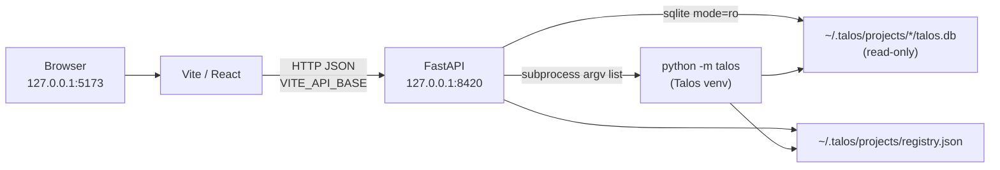

# Talos Control Panel — Internal Documentation

This directory documents the **current** Control Panel as implemented in the Talos monorepo. It is the baseline reference for modernization and feature work.

**Scope of this documentation:** describe what exists and how it works. It does not prescribe redesigns.

| Document | Contents |
|----------|----------|
| [architecture.md](./architecture.md) | System architecture, process boundaries, lifecycle |
| [startup.md](./startup.md) | Launchers, env setup, startup/shutdown sequences |
| [backend.md](./backend.md) | FastAPI package, modules, request/response flow |
| [frontend.md](./frontend.md) | React structure, components, API client, styling |
| [routing.md](./routing.md) | Every backend HTTP route |
| [cli-integration.md](./cli-integration.md) | How the panel shells out to `python -m talos` |
| [database.md](./database.md) | Read-only SQLite + registry access |
| [pages.md](./pages.md) | Every UI page and its data/command dependencies |
| [state-management.md](./state-management.md) | React contexts, hooks, local state patterns |
| [command-execution.md](./command-execution.md) | End-to-end user action lifecycle |
| [configuration.md](./configuration.md) | Environment variables, ports, paths, defaults |
| [build-and-release.md](./build-and-release.md) | Setup, dev mode, production build, prerequisites |
| [troubleshooting.md](./troubleshooting.md) | Common failures and how to diagnose them |
| [developer-guide.md](./developer-guide.md) | How to extend the Control Panel |

---

## Purpose

The Control Panel is a **local web UI for Talos operators**. It exists so operators can:

- Browse project data (flows, findings, scheduler jobs) without memorizing UUIDs
- Operate the **Endpoint Workspace** (`/endpoints`): inventory, resolved policy decisions, path rules with preview, and coverage — bulk mutations via multi-ID Talos CLI
- Manage **Talos Configuration** (`/talos-config`): layered effective config, global vs project scope, source attribution; **HTTP Rules** (`/mutations`) for request/response manipulation
- Activate projects, roles, and modules from forms instead of a terminal
- Run Talos CLI commands through dedicated pages or a full Console fallback
- Observe proxy status and logs while capturing traffic

It lives **inside the Talos repository** at `talos-control-panel/`. It is a separate application process pair (FastAPI + React/Vite), not a separate product and not part of the `talos` Python package itself.

A thin, operator-facing README also lives at [`talos-control-panel/README.md`](../../talos-control-panel/README.md). Prefer this `docs/control-panel/` tree for internal engineering detail.

---

## Architecture (summary)



**Architectural rule (enforced in code comments and structure):**

| Concern | Mechanism |
|---------|-----------|
| **Reads** | Read-only SQLite (`file:...?mode=ro`) and `registry.json` under `TALOS_HOME` |
| **Mutations** | Always `TALOS_PYTHON -m talos ...` via `talos_ui/cli.py` subprocess |

The Control Panel must not reimplement Talos business logic. The CLI remains the single source of truth for writes.

See [architecture.md](./architecture.md) for process boundaries, lifecycle, and component diagrams.

---

## Directory structure

```text
talos/                              # monorepo root
├── scripts/
│   ├── run-control-panel.sh        # Linux/macOS launcher
│   └── run-control-panel.bat       # Windows launcher
├── talos/                          # Talos core package + CLI
├── talos-control-panel/
│   ├── README.md                   # operator quick start
│   ├── bundle.sh                   # AI review bundling utility (not runtime)
│   ├── backend/
│   │   ├── requirements.txt        # fastapi, uvicorn, pydantic
│   │   └── talos_ui/
│   │       ├── main.py             # FastAPI app + router wiring
│   │       ├── config.py           # paths, ports, env defaults
│   │       ├── cli.py              # only mutation path (subprocess)
│   │       ├── db.py               # read-only SQLite + registry
│   │       ├── command_tree.py     # Console declarative CLI surface
│   │       └── routers/            # one domain per router module
│   └── frontend/
│       ├── package.json
│       ├── vite.config.ts
│       └── src/
│           ├── App.tsx             # routes + providers
│           ├── api/client.ts       # fetch wrapper
│           ├── components/
│           ├── hooks/
│           ├── pages/
│           ├── state/              # React contexts
│           ├── lib/
│           └── types.ts
└── docs/control-panel/             # this documentation
```

---

## Technology stack

| Layer | Technology |
|-------|------------|
| Backend framework | FastAPI 0.111+, Uvicorn (standard extras), Pydantic v2 |
| Backend language | Python 3.11+ (launchers assume `python3` / `python` on PATH) |
| Frontend framework | React 18, React Router 6 |
| Frontend language | TypeScript 5.6 |
| Build tool | Vite 5 |
| Styling | Tailwind CSS 3 + DaisyUI 4 (`light` / `dark` themes) |
| Fonts | IBM Plex Sans / IBM Plex Mono (see `index.css` / Tailwind config) |
| Talos integration | Subprocess: `<TALOS_PYTHON> -m talos <args>` from monorepo root |
| Persistence (reads) | SQLite project DBs + `registry.json` under `TALOS_HOME` |

Two separate Python virtual environments are used:

1. **Talos venv** — `$TALOS_ROOT/.venv` (editable install of the Talos package)
2. **Control Panel backend venv** — `talos-control-panel/backend/.venv` (FastAPI stack only)

The frontend uses its own `node_modules` under `talos-control-panel/frontend/`.

---

## Startup flow (summary)

Recommended entry point from the monorepo root:

```bash
./scripts/run-control-panel.sh          # Linux / macOS
scripts\run-control-panel.bat           # Windows
```

High-level sequence:

1. Resolve `TALOS_ROOT` and `CP_ROOT`
2. Ensure Talos venv + editable install (`pip install -e .`)
3. Ensure Control Panel backend venv + `requirements.txt`
4. Ensure frontend `npm install` if `node_modules` is missing
5. Export env (`TALOS_HOME`, `TALOS_ROOT`, `TALOS_PYTHON`, `CP_PORT`, `VITE_API_BASE`)
6. Start Vite dev server (background) and Uvicorn with `--reload` (foreground)
7. Poll frontend URL and open the default browser
8. On Ctrl+C / backend exit, tear down both process trees

Defaults: backend **8420**, frontend **5173**, both bound to **127.0.0.1**.

Details: [startup.md](./startup.md).

---

## Communication with Talos

```text
UI action → POST/GET /api/... → FastAPI router
                                    │
                    ┌───────────────┴───────────────┐
                    │ reads                         │ writes / long-running
                    ▼                               ▼
              db.py (SQLite RO,               cli.py
               registry.json)                   │
                                                ├─ run() / run_scoped()
                                                ├─ run_with_editor_content()
                                                ├─ run_scoped_with_temp_file()
                                                └─ ProcessManager (Console only; not proxy)
                                                        │
                                                        ▼
                                              TALOS_PYTHON -m talos ...
                                              cwd = TALOS_ROOT
                                              (proxy lifecycle → ProxyRuntimeManager)
```

- Project-scoped mutations typically run `talos project open <id>` first, then the target command (`run_scoped`).
- Proxy status is always read from Talos core (`proxy status --format json` / `TALOS_HOME/runtime/`); the Control Panel does not own proxy process tables.
- Config-sensitive changes auto-restart only when Talos core notifies and reconciles — pages must not hardcode restart-after-mutation.

Details: [cli-integration.md](./cli-integration.md), [command-execution.md](./command-execution.md).

---

## Design principles (as implemented)

1. **CLI is the write path** — `cli.py` is documented as the only place that mutates Talos state.
2. **Read path is thin and defensive** — SQLite connections are URI read-only; missing DB/tables yield empty results rather than hard failures where helpers allow it.
3. **No auth layer** — bound to loopback; intended for a single local operator.
4. **Domain routers map to Talos domains** — projects, proxy, roles, modules, access, auth, endpoints, flows, scheduler, attack, input-validation, findings, console, etc.
5. **Dedicated pages + Console fallback** — human-friendly pages for common workflows; `command_tree.py` + Console for broad CLI coverage.
6. **Operator feedback** — `useAction` + command log drawer + toasts surface CLI stdout/stderr after mutations.
7. **Timestamps in IST** — `formatIST` renders UTC-stored times in Asia/Kolkata for review consistency.

---

## Limitations (current implementation)

These are facts about the current code, not product requirements:

| Limitation | Detail |
|------------|--------|
| Local-only | Listens on `127.0.0.1`; CORS allows Vite ports only |
| No authentication / authorization | Any process on the machine can call the API |
| Dual venvs | Backend does not import the `talos` package; it shells out |
| Proxy lifecycle in core only | Control Panel cannot invent restart rules; auth artifact renames etc. only restart if Talos core notifies |
| CLI timeout default 60s | Long attacks may time out unless raised via `TALOS_CP_CLI_TIMEOUT` |
| Manual session file write | Auth session save writes the session file from the backend process after CLI path setup — exception to pure-CLI mutation for the file content itself (see `auth_config.py`) |
| No automated Control Panel tests in-repo | Talos has tests under `tests/`; Control Panel code itself has no dedicated test suite observed in this tree |
| Dev-oriented launcher | Default path runs Vite + Uvicorn `--reload`; production static serve is possible via `npm run build` / `preview` but not the launcher default |
| Incomplete page vs. API surface | Some backend routes (e.g. several auth-config health endpoints) have no or limited dedicated UI beyond Console; Endpoint Workspace now covers inventory/policy/rules/coverage |

---

## Related Talos paths

| Path | Role |
|------|------|
| `talos/` | Core package, CLI entry (`python -m talos`) |
| `~/.talos/` (`TALOS_HOME`) | Operator state: projects registry, per-project data dirs |
| `~/.talos/projects/registry.json` | Project registry |
| `~/.talos/projects/<id>/talos.db` | Per-project SQLite database (conventional layout) |

---

## How to use this documentation

- **Onboarding:** start with this README → [architecture.md](./architecture.md) → [startup.md](./startup.md) → [pages.md](./pages.md)
- **Adding features:** [developer-guide.md](./developer-guide.md) + the relevant domain doc
- **Debugging failures:** [troubleshooting.md](./troubleshooting.md) + [cli-integration.md](./cli-integration.md)
- **API contract:** [routing.md](./routing.md)
