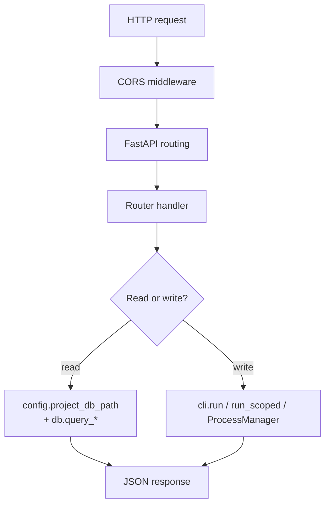

# Backend

Package: `talos_ui` under `talos-control-panel/backend/`.

---

## Package layout

```text
backend/
├── requirements.txt          # fastapi, uvicorn[standard], pydantic
└── talos_ui/
    ├── __init__.py           # empty
    ├── main.py               # FastAPI app factory wiring
    ├── config.py             # env + path resolution
    ├── cli.py                # subprocess + ProcessManager
    ├── db.py                 # registry + read-only SQLite
    ├── endpoint_reads.py     # resolved endpoint inventory (core policy)
    ├── platform_open.py      # OS directory opener (xdg-open / startfile)
    ├── command_tree.py       # Console / Helper command catalog
    └── routers/
        ├── __init__.py       # empty
        ├── projects.py
        ├── proxy.py
        ├── roles.py
        ├── modules.py
        ├── access.py
        ├── auth.py
        ├── auth_config.py
        ├── endpoints.py
        ├── flows.py
        ├── replay.py
        ├── scheduler.py
        ├── mutations.py
        ├── attack.py
        ├── input_validation.py
        ├── findings.py
        ├── console.py
        └── configuration.py   # layered Talos config (EffectiveConfig UI API)
```

There is no separate `services/` package. Domain logic is split between:

- **routers** — HTTP validation, SQL for reads, argv construction for writes
- **cli.py / db.py / config.py / platform_open.py** — shared infrastructure

---

## FastAPI application

**File:** `talos_ui/main.py`

```text
app = FastAPI(title="Talos Control Panel API", version="1.0.0")
+ CORSMiddleware (origins from config.CORS_ORIGINS)
+ include_router for each domain router
+ GET /api/health
```

Router registration order (include order):

1. projects, proxy, roles, modules  
2. access, auth, auth_config, endpoints  
3. flows, replay, scheduler, mutations  
4. attack, input_validation, findings, console  
5. configuration (layered `talos config` surface)

### Health endpoint

`GET /api/health` returns:

- `ok: true`
- `talos_home`, `projects_root`, `talos_bin` (paths/strings)
- `registry_exists` boolean

Used for diagnostics; launchers do not depend on it for browser open (they poll the frontend).

---

## Configuration module

**File:** `talos_ui/config.py`

Responsibilities:

- Resolve monorepo root: `Path(__file__).resolve().parents[3]`
- Export globals: `TALOS_HOME`, `PROJECTS_ROOT`, `REGISTRY_PATH`, `TALOS_ROOT`, `TALOS_PYTHON`, `TALOS_BIN`, `CLI_TIMEOUT`, `CP_HOST`, `CP_PORT`, `CORS_ORIGINS`
- Helpers:
  - `project_data_dir(project_id, record=None)` — prefers registry `data_dir`, else `PROJECTS_ROOT / project_id`
  - `project_db_path(...)` — `data_dir / "talos.db"`
  - `project_archive_dir(...)` — `data_dir / "archive"`

See [configuration.md](./configuration.md).

---

## Platform directory opener

**File:** `talos_ui/platform_open.py`

Shared helper for opening a **directory** in the OS default file explorer.
Used by `POST /api/projects/{id}/open-directory` only.

| API | Role |
|-----|------|
| `OpenDirectoryError` | Actionable operator-facing error |
| `open_directory(path)` | Validate exists+is_dir; launch platform opener non-blocking |

| Platform | Mechanism |
|----------|-----------|
| Linux | `subprocess.Popen(["xdg-open", dir], shell=False, …)` |
| Windows | `os.startfile(dir)` (File Explorer association) |
| Other | `OpenDirectoryError` — unsupported OS |

Security notes:

- Never `shell=True`; never concatenate user-controlled shell commands
- Does not hardcode Dolphin, Nautilus, Thunar, or third-party Windows explorers
- Path must be resolved by the caller from project identity + registry
- No generic “open arbitrary path” HTTP surface

This is **not** a Talos state mutation and does not write SQLite.

---

## CLI module

**File:** `talos_ui/cli.py`

Documented in-module as the **only** place that mutates Talos state.

| API | Role |
|-----|------|
| `CommandResult` | Dataclass: cmd, stdout, stderr, exit_code, duration_ms, ok, timed_out |
| `run(args)` | Synchronous `python -m talos` with timeout |
| `run_sequence(steps)` | Multiple commands; stop on first failure |
| `run_scoped(project_id, args)` | `project open` then command |
| `run_with_editor_content(args, content)` | EDITOR shim for interactive CLI editors |
| `run_scoped_with_editor_content(...)` | Scoped + editor content |
| `run_scoped_with_temp_file(...)` | Write temp file path arg then run |
| `ProcessManager` | Background processes (proxy, console background cmds) |
| `process_manager` | Module singleton |
| `wait_for_port_release` / `wait_for_port_listener` | Proxy restart reliability |

Full detail: [cli-integration.md](./cli-integration.md).

---

## Database module

**File:** `talos_ui/db.py`

| API | Role |
|-----|------|
| `load_registry()` | Parse `registry.json` → dict |
| `get_project_record(id)` | Single project record |
| `get_active_project_id()` | Detect active project from registry |
| `connect(db_path)` | SQLite URI `mode=ro`, `Row` factory |
| `table_exists` | Defensive table check |
| `db_exists` | Path existence |
| `query_all` / `query_one` / `scalar` | SELECT helpers → dicts |
| `safe_json` | Parse JSON columns safely |

Full detail: [database.md](./database.md).

---

## Command tree module

**File:** `talos_ui/command_tree.py`

Declarative description of the Talos CLI surface for the Console page.

- `arg(...)` / `cmd(...)` builders
- `COMMAND_TREE` — grouped list of commands with typed args
- `find_command(cmd_id)` — lookup by id
- `build_argv(command, values)` — safe argv assembly (no shell)

Field kinds: `text`, `number`, `boolean`, `select`, `multi`.

Background flags exist for `proxy.start` and `ui.start` so Console can start them via `ProcessManager` instead of `run()`.

---

## Routers

Each router is an `APIRouter` with a `/api/<domain>` prefix and FastAPI tags.

| Router file | Prefix | Primary concern |
|-------------|--------|-----------------|
| `projects.py` | `/api/projects` | Registry list/detail, create/open/close/delete/purge, rename, description, scope, constraints, outscope, summary |
| `proxy.py` | `/api/proxy` | Start/stop/restart/status/config/logs via Talos proxy CLI + runtime log |
| `roles.py` | `/api/roles` | List (DB), create/set/unset/rename/delete (CLI) |
| `modules.py` | `/api/modules` | List (DB), create/set/unset/rename/delete (CLI) |
| `access.py` | `/api/access` | Matrix (DB), client/server set, coverage/signals |
| `auth.py` | `/api/auth` | Artifact names (set/unset/clear --force), auth-bypass test, test-results |
| `auth_config.py` | `/api/auth-config` | Per-role provider, session file/apply/clear, login flows, extractors (get/set/remove), test (JSON full tokens), validate/refresh, TTL, expiry signals (incl. headers), control flows, reset-health; enriched state snapshot |
| `endpoints.py` | `/api/endpoints` | Endpoint Workspace: resolved list/summary/coverage, bulk multi-ID mutations, rules CRUD+preview, detail+policy explain |
| `endpoint_reads.py` | (helper) | Read-only resolved inventory via Talos `policy` resolver (not a mutation path) |
| `flows.py` | `/api/flows` | List/detail/filters (optional flags), derived fields, related + intelligence reads, filter-aware adjacent, export, body decoding |
| `replay.py` | `/api/replay` | Flow/endpoint replay |
| `scheduler.py` | `/api/scheduler` | Process start/stop + enriched status; jobs list/show; cancel/prune; enqueue; pause/resume/clear |
| `mutations.py` | `/api/mutations` | HTTP Rules (Manipulation Engine): list/summary, engine toggle, create/update, enable/disable, import/export, reorder, duplicate |
| `attack.py` | `/api/attack` | Unauth + BAC run/results/filters |
| `input_validation.py` | `/api/input-validation` | IV engine control + caches + export |
| `findings.py` | `/api/findings` | List/detail/lifecycle, groups, reports |
| `console.py` | `/api/console` | Tree + modeled run + raw run |

Per-route contracts: [routing.md](./routing.md).

### Common patterns in routers

**Reads**

```text
record = db.get_project_record(project_id)
db_path = config.project_db_path(project_id, record)
rows = db.query_all(db_path, "SELECT ...", params)
return {"...": rows}
```

`project_id` is almost always a **query parameter**, not a path segment (exceptions: project-scoped path routes under `/api/projects/{project_id}/...` and some auth-config path segments for role/flow ids).

**Writes**

```text
results = cli.run_scoped(project_id, ["subcommand", ...])
return {"steps": [r.to_dict() for r in results]}
```

Or for non-scoped project ops:

```text
result = cli.run(["project", "create", ...])
return result.to_dict()
```

**Errors**

- `HTTPException(404, ...)` for missing project/flow/endpoint/finding on some detail routes
- Missing DB often returns empty lists / zero counts instead of 404
- CLI failures still return HTTP 200 with `steps[].ok == false` in most mutation handlers (client inspects step results)
- Attack unknown technique returns `{"error": "..."}` without raising
- Console unknown command returns `{"error": "..."}`

There is **no global exception handler** or structured logging framework in the Control Panel backend beyond Uvicorn/FastAPI defaults and process stderr.

---

## Request flow



### Body validation

Pydantic `BaseModel` classes live beside handlers in each router (not a shared schemas package).

### Query params

Common: `project_id`, pagination (`offset`, `limit`), filters (`search`, `status`, `role`, `module`, …).

---

## Response flow

### Data responses

Plain JSON objects/arrays shaped for the React pages, e.g.:

- `{ "projects": [...], "active_project_id": "..." }`
- `{ "endpoints": [...], "total": N }`
- `{ "flow": {...}, "diff": {...}, ... }`

JSON-encoded columns are often parsed with `db.safe_json` before return. Flow bodies may be base64 if non-UTF8 (`flows._decode_body`).

### Mutation responses

Typical:

```json
{
  "steps": [
    {
      "cmd": [".../python", "-m", "talos", "project", "open", "..."],
      "cmd_str": "...",
      "stdout": "...",
      "stderr": "...",
      "exit_code": 0,
      "duration_ms": 123,
      "ok": true,
      "timed_out": false
    },
    { "...": "second step" }
  ]
}
```

Single-step project create/open often returns the `CommandResult` dict at the top level (not wrapped in `steps`) — the frontend adapts with `.then((r) => ({ steps: [r] }))` on those calls.

### ProcessManager responses

Proxy start/status returns process fields: `running`, `pid`, `argv`, `cmd_str`, `started_at`, optionally `already_running`, `error`, `restarted`, `logs`.

---

## Error handling

| Layer | Behavior |
|-------|----------|
| Missing project on summary | `HTTPException 404` |
| Missing flow/endpoint/finding | `HTTPException 404` on detail routes that check |
| Missing DB file | Empty lists / default scalars |
| CLI timeout | `CommandResult` with `timed_out=True`, `exit_code=-1` |
| Missing `TALOS_PYTHON` | `CommandResult` with explanatory stderr |
| Unknown console command | JSON `error` field |
| Frontend non-2xx | `ApiError` thrown by client |

There is no retry middleware. Proxy lifecycle errors surface through CLI step results on the Proxy page.

---

## Subprocess execution

See [cli-integration.md](./cli-integration.md). Summary:

- `subprocess.run` for short commands
- `subprocess.Popen` + thread pump for managed processes
- Always argv lists; never `shell=True`
- `cwd=config.TALOS_ROOT`
- Env includes Talos venv on `PATH`

---

## Logging

The Control Panel backend does **not** define a custom Python logging configuration.

Observable output:

| Source | Where it appears |
|--------|------------------|
| Uvicorn access / errors | Launcher TTY (backend foreground) |
| CLI stdout/stderr | Captured into `CommandResult` → API → UI command drawer |
| Managed process stdout | `ProcessManager` deque → `/api/proxy/logs` |
| Frontend proxy restart | `console.info` / `console.error` in browser |
| Frontend Vite | `frontend.log` |

---

## Auth session file exception

`routers/auth_config.py` saves manual session content with:

1. CLI `auth-config set-session <role> path` (ensure path exists)
2. Direct `Path.write_text` of operator-edited content from the backend process

This is intentional parity with editing the file in an external editor, but it is a **filesystem write from the Control Panel**, not a pure CLI mutation of content. Application of the session still goes through CLI (`set-session` without path).

---

## Dependencies

From `requirements.txt`:

```text
fastapi>=0.111
uvicorn[standard]>=0.30
pydantic>=2.7
```

Stdlib only beyond that for DB/CLI (sqlite3, subprocess, threading, socket, tempfile, etc.).
