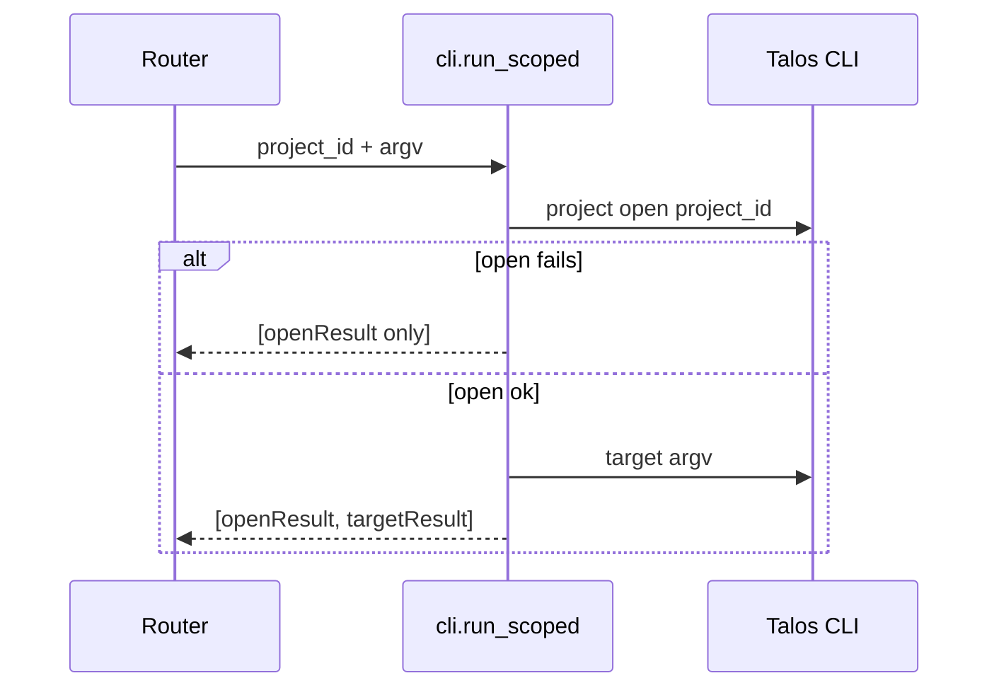

# CLI integration

How the Control Panel executes Talos commands. Implementation: `talos_ui/cli.py` (primary), helpers in routers and `command_tree.py`.

---

## Architectural rule

> Every write action is expressed as a `talos …` argv list and run via subprocess — never as a direct SQL write.

The CLI is the single source of truth for mutations. Reads may go through SQLite (`db.py`); writes go through this module.

### Exceptions

**Repeater (`/api/send/*` mutations):** may call `talos.send.engine` / `talos.send.db` **in-process** (async `await` of engine coroutines). Must not open ad-hoc SQL. Must return synthetic `steps` for CommandLog. Reads remain free to import Python as elsewhere.

Why: full raw bodies in argv/temp files are brittle; multi-send can run many minutes beyond default `CLI_TIMEOUT`; the engine already exposes clean `SendOutcome` dataclasses.

Exact Mode 1 replay (`/api/replay/*`) stays a thin CLI wrap (`talos replay …`).

---

## Command construction

### Base argv

```text
[TALOS_PYTHON, "-m", "talos", *args]
```

Built by `_talos_argv(args)`.

Examples of `args` as assembled by routers:

| Action | `args` |
|--------|--------|
| Open project | `["project", "open", project_id]` |
| Create project | `["project", "create", name, …]` |
| Rename project | `["project", "rename", project_id, new_name]` |
| Set description | `["project", "description", project_id, text]` |
| Scope add | open then `["project", "scope", "add", prefix]` |
| Scope remove | open then `["project", "scope", "remove", prefix]` |
| Scope import | open then temp file + `["project", "scope", "import", tmp]` |
| Set scope (legacy replace) | `["project", "scope", project_id, *prefixes]` |
| Set constraints | `["project", "constraints", project_id, "--store-bodies", …]` |
| Delete / purge | `["project", "delete", project_id, "--purge"?, "--force"?]` |
| Outscope add | open then `["project", "outscope", "add", prefix]` |
| Outscope import | open then temp file + `["project", "outscope", "import", tmp]` |
| Create role | `["role", "create", name]` after open |
| BAC technique | `["attack", "bac", "session-swap", "--role", …]` |

### Working directory and environment

| Setting | Value |
|---------|-------|
| `cwd` | `config.TALOS_ROOT` (monorepo root) |
| `env` | `os.environ` copy with Talos venv directory prepended to `PATH` (`_talos_env`) |

Prepending the venv bin ensures child tools (e.g. `mitmdump` installed in the Talos venv) are found when the proxy starts.

### Console argv builder

`command_tree.build_argv(command, values)`:

- Starts from `command["path"]`
- Appends positionals then flags
- Booleans emit bare flags when true
- Multi values repeat the flag or positional once per item
- Empty / null / `[]` values skipped

Frontend mirrors this for preview only; the server rebuilds argv independently.

### Never shell

All invocations use argument lists. `shell=True` is not used. This avoids shell injection; raw Console mode still has no semantic validation of argv tokens.

---

## Synchronous vs background commands

### Synchronous — `run()`

```text
subprocess.run(argv, capture_output=True, text=True, timeout=…)
```

Used for normal CLI commands that are expected to finish within `CLI_TIMEOUT` (default 60s, env `TALOS_CP_CLI_TIMEOUT`).

Returns a `CommandResult` with stdout/stderr/exit code/duration/`ok`/`timed_out`.

### Sequence — `run_sequence()`

Runs a list of argv lists in order. Stops after the first failure. Used by `run_scoped`.

### Project-scoped — `run_scoped(project_id, args)`

Always:

1. `talos project open <project_id>`
2. Target command

Both steps are returned so the UI can show exactly what ran. Talos keeps “active project” as persistent CLI state; opening first ensures the correct project context.

### Editor-driven — `run_with_editor_content(args, content)`

For CLI commands that open `$EDITOR` (e.g. extractors):

1. Write content to a temp file
2. Create an executable shim script: `cat content.txt > "$1"`
3. Set `EDITOR` and `VISUAL` to the shim
4. Run the CLI with the augmented env

Used by auth-config extractor edit.

### Temp file argument — `run_scoped_with_temp_file`

For commands that take a filename (e.g. `auth-config set-extractor … extractor.py`):

1. Open project
2. Write content to a NamedTemporaryFile (`delete=False`)
3. Append path to argv and run
4. Unlink temp file in `finally`

### Background — `ProcessManager`

Long-running processes (primarily the proxy; also Console commands marked `background: true`):

```text
subprocess.Popen(argv, stdout=PIPE, stderr=STDOUT, text=True, bufsize=1, …)
```

| Platform | Process group |
|----------|----------------|
| Unix | `start_new_session=True` |
| Windows | `CREATE_NEW_PROCESS_GROUP` |

A daemon thread pumps stdout lines into a `deque(maxlen=2000)`.

Singleton: `cli.process_manager`.

---

## ProcessManager API

| Method | Behavior |
|--------|----------|
| `start(name, args)` | Start if not already running; return status |
| `stop(name, force=False)` | Kill process tree; wait up to 5s then force |
| `restart(name, args, host, port, force=False)` | Stop → wait port free → start → wait listener |
| `status(name)` | Running flag, pid, argv, exit_code, … |
| `logs(name, tail=300)` | Tail of in-memory log buffer |

Lifecycle locks per process name prevent concurrent start/stop races.

### Kill behavior

| Platform | Mechanism |
|----------|-----------|
| Windows | `taskkill /PID … /T /F` |
| Unix | `os.killpg(pgid, SIGTERM|SIGKILL)` with fallback to `terminate`/`kill` |

### Port helpers

- `wait_for_port_release(host, port)` — bind test until free (default 5s)
- `wait_for_port_listener(host, port)` — connect until accepts (used up to ~5s in restart loop)

Used so proxy restarts do not race with mitmdump releasing the listen port.

---

## stdout / stderr handling

| Mode | Capture |
|------|---------|
| `run` / sequences | Full stdout and stderr as strings on `CommandResult` |
| Timeout | Partial stdout/stderr from exception + timeout marker in stderr |
| FileNotFoundError (Python missing) | Empty stdout; instructional stderr; `exit_code=-1` |
| Managed process | stdout+stderr merged; lines stored in rolling buffer; not returned in start response body except restart failure may include `logs` |

The UI command drawer displays `stdout` and `stderr` from steps. Proxy page polls `/api/proxy/logs`.

---

## Error handling

| Condition | Result |
|-----------|--------|
| Non-zero exit | `ok=False`, exit_code as returned |
| Timeout | `timed_out=True`, `exit_code=-1`, stderr annotated |
| Missing interpreter | `ok=False`, message points at launcher / `TALOS_PYTHON` |
| Process start FileNotFoundError | `{ running: false, error: "…" }` |
| Restart port stuck | `{ restarted: false, error: "port still in use…" }` |
| Process dies during restart | error + optional logs |
| Listener never appears | error after startup wait |

HTTP layer usually still returns 200 for CLI failures; the client looks at `steps[].ok`.

---

## Interaction with project scoping



Pages pass the **UI-selected** project id. That is not automatically the same as Talos’s active project until open succeeds. Dedicated pages that mutate state always call scoped endpoints with that id.

Console can disable scoping (“Scope to active project” checkbox); then `cli.run` is used without open.

---

## Security considerations

| Control | Implementation |
|---------|----------------|
| No shell metacharacters interpretation | List argv only |
| Loopback-only API | Uvicorn host 127.0.0.1; no auth |
| Modeled Console commands | Typed forms + `build_argv` |
| Raw Console | Operator-supplied tokens only; still no shell, but can pass any CLI subcommand |
| Env inheritance | Full parent env + PATH prepend; EDITOR override only for editor shim |
| Temp files | Written under system temp; unlinked after set-extractor style commands |
| Session file write | Backend can write under project `auth_sessions/` (see auth_config router) |

The Control Panel trusts the local operator. It does not sandbox Talos CLI capabilities.

---

## Proxy restart coupling

Proxy-relevant CLI mutations in Talos core call `notify_proxy_config_changed`, which may auto-restart the managed proxy. The Control Panel does **not** call a restart-if-running helper after UI mutations; it only observes status transitions.

Triggers observed in the frontend:

- Project open after create / open
- Role create / set / unset / rename / delete
- Module create / set / unset / rename / delete
- Auth artifact set / clear
- Mutation add / edit / enable / disable / delete

Server no-ops if proxy is not running. Errors are best-effort (logged; should not fail the primary action’s UX, though the promise may reject after logging).

---

## Timeouts and long-running attacks

Default CLI timeout is **60 seconds**. Attack runs, large IV phases, and reports that exceed this return timed-out results.

Mitigations available today:

- Raise `TALOS_CP_CLI_TIMEOUT` for the backend process
- Prefer enqueue-style workflows (scheduler) where the CLI returns quickly and work continues inside Talos

The Control Panel does not stream partial CLI output for synchronous `run()` commands.
