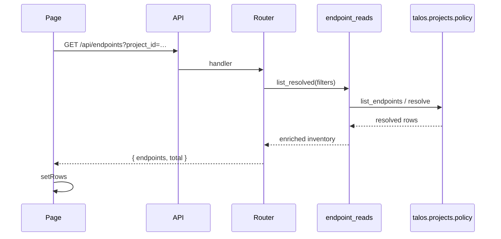
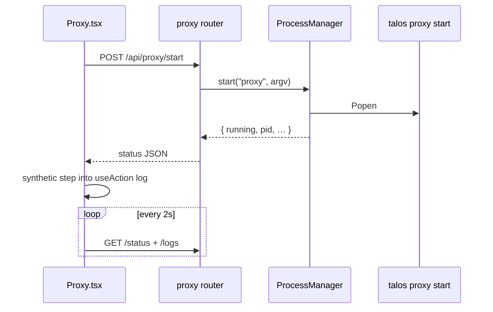
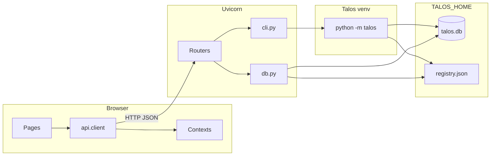

# Command execution lifecycle

End-to-end path of a typical mutating user action in the Control Panel.

---

## Lifecycle overview

```text
Button click
    ↓
React handler (useAction / onClick)
    ↓
api.post / api.del  (fetch → FastAPI)
    ↓
Backend router (validate body/params)
    ↓
cli.run / run_scoped / ProcessManager
    ↓
TALOS_PYTHON -m talos …
    ↓
Talos CLI (business logic, SQLite writes, side effects)
    ↓
CommandResult (stdout/stderr/exit)
    ↓
JSON response { steps: [...] }
    ↓
useAction → CommandLogContext.log
    ↓
UI update (toast, drawer, optional reload; proxy auto-restart only if Talos core decides)
```

---

## Sequence diagram (scoped mutation)

Example: **Create role** on Roles & Modules page.

```mermaid
sequenceDiagram
  participant U as Operator
  participant Page as RolesModules.tsx
  participant Action as useAction
  participant API as api.client
  participant R as roles router
  participant CLI as cli.py
  participant T as Talos CLI
  participant Log as CommandLogContext
  participant UI as Toast + Drawer

  U->>Page: Click Create
  Page->>Action: createRole.run()
  Action->>API: POST /api/roles?project_id=… {name}
  API->>R: FastAPI handler
  R->>CLI: run_scoped(project_id, ["role","create",name])
  CLI->>T: project open project_id
  T-->>CLI: CommandResult open
  CLI->>T: role create|set|unset|rename|delete
  T-->>CLI: CommandResult create
  CLI-->>R: [open, create]
  R-->>API: { steps: [...] }
  API-->>Action: StepsResponse
  Action->>Log: log("Create role", steps)
  Log->>UI: toast + optional open drawer
  Action-->>Page: result
  Page->>Page: loadRoles()
  Note over T: role set/unset may notify proxy core; rename/delete cascade via core
  Page-->>U: Updated list + feedback
```

---

## Layer-by-layer detail

### 1. Button click

- DaisyUI `button` with `onClick`
- Often disabled when `running` or required fields empty
- Destructive actions use `ConfirmButton` (Yes/Cancel) first

### 2. React

| Mechanism | Role |
|-----------|------|
| Local form state | Collects arguments |
| `useProject().selected` | Supplies `project_id` query param |
| `useAction` | Tracks `running`, logs result |
| Manual `try/finally` | Used where synthetic steps are needed (Proxy) |

Console builds `values` or space-split `rawArgs` instead of domain-specific forms.

Scope import (Projects page) uses `run_scoped_with_temp_file`: upload/bulk text →
backend temp file → `talos project scope|outscope import <tmp>` → unlink temp.
The operator never supplies a path on the Talos host.

### 3. API client

`src/api/client.ts`:

- Builds URL: `VITE_API_BASE + path` + query params
- `Content-Type: application/json` when body present
- Parses JSON; throws `ApiError` on non-2xx

Most CLI failures still return **HTTP 200** with `steps[].ok === false`, so `ApiError` is for true HTTP errors (404 detail, 500, network).

### 4. Backend router

- Pydantic validates body when defined
- Constructs argv list from typed fields
- Calls `cli.run`, `cli.run_scoped`, or specialized helpers
- Returns dict suitable for the frontend

### 5. CLI layer

See [cli-integration.md](./cli-integration.md).

For scoped actions:

```text
argv_open = [python, -m, talos, project, open, <id>]
argv_cmd  = [python, -m, talos, ...command...]
```

Each is a separate process with captured output and timeout.

### 6. Talos

Talos performs real work: registry updates, SQLite writes, network (replay/attack), scheduler queue changes, etc. The Control Panel does not participate inside that process.

### 7. Response

`CommandResult.to_dict()` includes the full argv, quoted `cmd_str`, streams, exit code, duration, ok, timed_out.

Multi-step responses preserve order: open first, then target.

### 8. UI update

| Channel | When |
|---------|------|
| Toast | Every `log()` call |
| Command drawer | Auto-opens if any step failed |
| Page reload | Caller invokes `load()` / `refresh()` |
| Proxy restart | Never from CP pages after mutations; Talos core notify/reconcile only |
| Header chips | Next StatusContext poll (≤3s) or explicit refresh |

---

## Variant: read-only list load



No CLI on list (resolved via core policy module). Bulk mutations use
`POST /api/endpoints/bulk/*` → one multi-ID CLI argv. No command log on pure reads.

---

## Variant: background process (proxy start)



Process keeps running after the HTTP request completes. Logs accumulate in memory on the backend.

---

## Variant: Console modeled run

1. Load tree once: `GET /api/console/tree`
2. Operator fills typed fields; frontend shows argv preview
3. `POST /api/console/run` with `command_id`, `values`, optional `project_id`
4. Server `find_command` + `build_argv`
5. Background flag → ProcessManager; else run/run_scoped
6. Steps logged under label `Console: <summary>`

Raw mode skips the tree and posts `args: string[]` to `/api/console/raw`.

---

## Frontend / backend interaction diagram



---

## Failure modes in the lifecycle

| Stage | Failure | Operator sees |
|-------|---------|---------------|
| Network / CORS | fetch fails | Uncaught error unless handled; no toast from useAction |
| HTTP 404 | Missing resource | `ApiError` |
| CLI non-zero | Business/CLI error | Toast fail, drawer opens, stderr in entry |
| CLI timeout | 60s default | `timed_out`, drawer |
| Missing TALOS_PYTHON | FileNotFoundError path | stderr message about launcher |
| Proxy not running | status poll | Header shows Stopped; start is operator-initiated |
| Proxy restart fail | Port/process issues | console.error in browser; primary action already logged |

---

## Timing characteristics

| Operation type | Expected duration |
|----------------|-------------------|
| Registry / SQLite list | Milliseconds–low hundreds |
| Simple CLI (role create) | Sub-second to few seconds |
| project open + command | Two process startups |
| Replay / small attack | Seconds |
| Large attack / IV run via sync CLI | May hit timeout |
| Proxy start | Process up; HTTP returns immediately when Popen succeeds |

There is no progress streaming for synchronous CLI commands—only final captured output.
