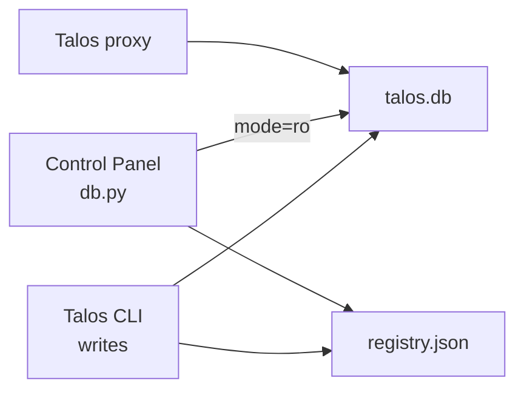

# Database and registry access

The Control Panel’s read path is implemented in `talos_ui/db.py` with path resolution in `talos_ui/config.py`. It never opens SQLite for writes.

---

## SQLite usage

### Connection mode

```text
uri = f"file:{db_path}?mode=ro"
sqlite3.connect(uri, uri=True)
row_factory = sqlite3.Row
```

Connections are **strictly read-only** at the SQLite URI level. Mutation of project data is intended to go only through the Talos CLI.

### Path resolution

```text
TALOS_HOME (default ~/.talos)
└── projects/
    ├── registry.json
    └── <project_id>/          # conventional layout
        ├── talos.db
        ├── archive/
        └── auth_sessions/     # manual auth files (filesystem, not SQLite)
```

Helpers:

| Function | Result |
|----------|--------|
| `project_data_dir(id, record)` | `record["data_dir"]` if set, else `PROJECTS_ROOT / id` |
| `project_db_path(...)` | `data_dir / "talos.db"` |
| `project_archive_dir(...)` | `data_dir / "archive"` |

Registry records may override the data directory via `data_dir`.

---

## Read-only behaviour

| Behaviour | Detail |
|-----------|--------|
| Missing DB file | `query_all` → `[]`; `query_one` → `None`; `scalar` → default (`0`) |
| Corrupt / missing registry | `load_registry` → `{}` |
| Non-dict registry root | treated as empty |
| JSON columns | `safe_json(text, default)` returns default on parse failure |
| Table existence | `table_exists` available; most routers do not pre-check every table—they rely on empty results or let exceptions surface if schema mismatches |

There is **no write API** in `db.py`. No migrations are run by the Control Panel; schema is owned by Talos when projects are created/used via the CLI.

---

## Helper functions

### Registry

| Function | Purpose |
|----------|---------|
| `load_registry()` | Load all keys from `registry.json` |
| `get_project_record(project_id)` | One project record or `None` |
| `get_active_project_id()` | Detect currently active project |

Active project detection order:

1. Top-level pointer keys: `_active_project_id`, `active_project_id`, `_active`, `active` (string id present in registry)
2. Else first project record with `status == "active"` (canonical Talos `ProjectStatus`)
3. Else legacy `active` / `is_active` truthy flags on records
4. Else `None`

Keys starting with `_` are skipped when listing projects in the projects router.

### SQLite

| Function | Purpose |
|----------|---------|
| `connect(db_path)` | Open RO connection |
| `table_exists(conn, table)` | Check `sqlite_master` |
| `db_exists(db_path)` | Path exists |
| `query_all(db_path, sql, params)` | SELECT → `list[dict]` |
| `query_one(db_path, sql, params)` | SELECT → `dict \| None` |
| `scalar(db_path, sql, params, default=0)` | First column of first row |
| `safe_json(text, default)` | JSON parse helper |

Connections are used in short `with connect(...) as conn` scopes inside helpers; callers do not hold long-lived connection pools.

---

## Caching

**None.** Every request re-reads the registry file or opens the project DB as needed. The frontend polls some endpoints on intervals, but the backend does not cache query results.

---

## Tables accessed

The following tables appear in Control Panel SQL. Column usage is as needed by each query; the Control Panel does not own the schema.

| Table | Used by (routers) |
|-------|-------------------|
| `roles` | roles, access matrix, endpoints, flows, scheduler, attack bac, findings evidence |
| `modules` | modules, access, endpoints, flows, scheduler, attack |
| `access_map` | access matrix |
| `auth_config` | auth artifact names |
| `auth_test_results` | auth test results; flow detail |
| `role_auth_provider` | auth_config state |
| `role_auth_state` | auth_config artifacts |
| `manual_session_config` | auth_config state |
| `auth_flow_config` | auth_config flows |
| `session_health_config` | auth_config health |
| `session_health_control_flows` | auth_config control flows |
| `session_suspicion_state` | auth_config suspicion |
| `endpoints` | Endpoint Workspace inventory/detail, parameter search, coverage, project summary |
| `endpoint_policy` | Resolved via policy engine for list/summary/coverage; raw row on detail |
| `endpoint_annotations` | endpoint detail (legacy annotations; tags also on `endpoint_policy.tags`) |
| `endpoint_roles` | inventory roles column, coverage role observation, detail |
| `parameters` | endpoint detail, parameter search, coverage parameter tables |
| `policy_rules` | Rules tab + path exclusion/priority resolution |
| `flows` | flows list/detail, endpoint recent flows, attack joins, auth results, summary, scheduler joins, related children/original |
| `replay_diffs` | flow detail results + list flags + child replay panel |
| `bac_results` | attack bac, flow detail results + list flags |
| `unauth_results` | attack unauth, flow detail results + list flags |
| `finding_evidence` | flow related panel + list has_finding_evidence flag |
| `scheduler_jobs` | flow related (jobs referencing flow_id / replayed_flow_id) |
| `endpoint_policy` | flow detail health chips / intelligence |
| `role_auth_state` / `role_auth_provider` / `session_health_config` / `session_suspicion_state` | flow intelligence session panel |

| `scheduler_jobs` | scheduler list/status, summary |
| `scheduler_config` | scheduler status |
| `scheduler_state` | scheduler status |
| `findings` | findings list/detail/groups, summary |
| `finding_evidence` | finding detail + list role/module subselects |
| `finding_timeline` | finding detail |
| `finding_groups` | findings groups |
| `finding_group_members` | groups list/members |
| `out_of_scope_domains` | projects outscope (Basic Scope prefixes in `domain` column) |
| `input_validation_config` | IV config |
| `iv_param_cache` | IV status / parameters |
| `iv_reflection_cache` | IV status |
| `iv_probe_results` | IV status / show parameter |

If Talos renames tables or columns, these queries break until the Control Panel is updated. There is no schema version negotiation in the panel.

---

## Assumptions made by the Control Panel

1. **Conventional project layout** under `TALOS_HOME/projects/<id>/` unless `data_dir` is set on the registry record.
2. **Registry is JSON object** mapping project ids to records (plus optional meta keys).
3. **Exactly one active project** is the normal Talos model (`status == "active"`); helpers tolerate legacy shapes.
4. **DB may not exist yet** for a newly created or never-opened project (`db_exists` false is a valid UI state on the Dashboard and Projects workspace; outscope list is empty until the DB exists).
5. **Registry project records** may include `constraints` (`store_bodies`, `max_body_size`, `capture_in_scope_only`) and `status` (`active` / `inactive`); the projects router merges defaults when absent.
6. **JSON text columns** store headers, cookies, tags, meta, IV exclusion lists, scheduler job meta, finding evidence data.
7. **Binary flow bodies** may be SQLite BLOBs; flow detail decodes UTF-8 or base64-encodes for JSON safety.
8. **Auth session files** live at `<data_dir>/auth_sessions/<role_id>.txt`, mirrored from Talos `Project.auth_session_path` (comment in `auth_config.py` notes both places must stay aligned).
9. **Scheduler job meta** may contain `attacker_role_id` / `module_id` as JSON fields extracted via `json_extract` in SQL.
10. **Finding list role/module** come from `finding_evidence` with `evidence_type` of `role` / `module`, not necessarily columns on `findings`.

---

## Interaction with the rest of Talos



The Control Panel is a concurrent reader. SQLite locking behavior under concurrent writers (proxy, CLI, scheduler) is whatever SQLite + Talos use; the panel does not configure WAL or busy timeouts itself—defaults of the connection apply.

---

## What is not accessed

The Control Panel does not systematically query every Talos table (e.g. full archive body stores, worker internals). Unmodeled data is still reachable indirectly via Console CLI commands that print to stdout.
