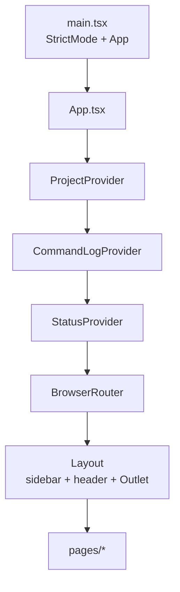

# Frontend

Location: `talos-control-panel/frontend/`.

Stack: **React 18**, **TypeScript**, **Vite 5**, **React Router 6**, **Tailwind CSS 3**, **DaisyUI 4**.

---

## React architecture



Provider order (outer → inner):

1. `ProjectProvider` — project list + selected project
2. `CommandLogProvider` — CLI result history, drawer open state, toasts
3. `StatusProvider` — Talos proxy runtime snapshot + active role/module (depends on project)
4. `BrowserRouter` — client routes

All authenticated-domain pages assume a selected project; many render `NoProjectNotice` when none is selected.

---

## Entry points

| File | Role |
|------|------|
| `index.html` | Mount point `#root` |
| `src/main.tsx` | `ReactDOM.createRoot`, imports `index.css` |
| `src/App.tsx` | Providers + route table |
| `vite.config.ts` | React plugin; host `127.0.0.1`; port `5173`; `strictPort` |

---

## Page layout

`components/Layout.tsx` defines a three-zone shell:

| Zone | Content |
|------|---------|
| **Left sidebar** | Grouped nav links (Overview, Model, Capture, Testing, Configuration, Results) |
| **Top header** | `AppHeader` — global runtime context + actions (not primary navigation) |
| **Main** | `<Outlet />` for the active page (`p-6`, scrollable) |

### Global top header (`AppHeader`)

The header answers, at a glance: project/role/module context, what Talos is doing now, and global utilities. Proxy and Scheduler are **runtime surfaces in the header**, not primary nav destinations (they remain jumpable via search and deep links).

| Region | Content |
|--------|---------|
| **Context** | Project pill (`Project: name` → `/projects`), active Role / Module chips (`HeaderRoleModule`) |
| **Runtime** | Proxy status menu (`HeaderProxyMenu`), Scheduler status + active queue count (`HeaderSchedulerMenu`), Findings triaging signal (`HeaderFindings`) |
| **Utilities** | IST clock, Search/jump palette (`Ctrl/Cmd+K`), activity console toggle (`$_`), theme toggle |

Proxy labels are uppercase Talos-derived lifecycle strings (`RUNNING`, `STARTING`, `RESTARTING`, `STOPPING`, `STOPPED`, `FAILED`). Scheduler shows execution state (`RUNNING` / `PAUSED` / `WAITING`) plus active queue depth (pending + running + paused). Findings count is **TRIAGING only** (actionable signal).

Global overlays / chrome:

- `CommandDrawer` — bottom-docked activity console (Chrome DevTools style; resizable height; Expanded / Collapsed / Auto-hide modes; copy per command). Also toggled from the header `$_` button
- `ToastStack` — transient success/failure toasts
- `HeaderSearch` modal — jump palette when open

Navigation groups (from `NAV_GROUPS`):

| Group | Routes |
|-------|--------|
| Overview | `/`, `/projects`, `/proxy` |
| Model | `/roles-modules`, `/access`, `/auth` |
| Capture | `/endpoints`, `/flows`, `/mutations` (HTTP Rules) |
| Testing | `/scheduler`, `/attack`, `/input-validation`, `/secret-detection` |
| Configuration | `/talos-config` |
| Results | `/findings`, `/console` |

Detail routes exist for endpoints, flows, and findings but are not separate sidebar items.

---

## Routing

Defined in `App.tsx` with React Router v6 nested routes under `Layout`.

| Path | Component |
|------|-----------|
| `/` | `Dashboard` |
| `/projects` | `Projects` |
| `/proxy` | `Proxy` |
| `/roles-modules` | `RolesModules` |
| `/access` | `Access` |
| `/auth` | `Auth` |
| `/endpoints` | `Endpoints` |
| `/endpoints/:endpointId` | `EndpointDetail` |
| `/flows` | `Flows` |
| `/flows/:flowId` | `FlowDetail` |
| `/mutations` | `Mutations` |
| `/scheduler` | `Scheduler` |
| `/attack` | `Attack` |
| `/input-validation` | `InputValidation` (tabs: overview/candidates/parameters/multi-level/run/settings) |
| `/input-validation/params/:paramUuid` | `ParameterDetail` (IV dossier) |
| `/input-validation/endpoints/:endpointId` | `IvEndpointIntel` |
| `/input-validation/hosts/:host` | `IvHostIntel` |
| `/secret-detection` | `SecretDetection` (tabs: overview/detections/documents/rules/settings) |
| `/secret-detection/detections/:detectionId` | `DetectionDetail` |
| `/secret-detection/documents/:documentId` | `DocumentDetail` |
| `/findings` | `Findings` |
| `/findings/:findingId` | `FindingDetail` |
| `/console` | `Console` |
| `/talos-config` | `TalosConfig` (query: `tab`, `section`, `scope`) |

There is no catch-all 404 route in the current `App.tsx`.

Page-level behavior: [pages.md](./pages.md).

---

## Shared components

| Component | File | Purpose |
|-----------|------|---------|
| `Layout` | `Layout.tsx` | App chrome + sidebar nav + outlet |
| `AppHeader` | `AppHeader.tsx` | Global top header shell (context + runtime + utilities) |
| `HeaderProxyMenu` | `HeaderProxyMenu.tsx` | Proxy status pill + lifecycle hover menu |
| `HeaderSchedulerMenu` | `HeaderSchedulerMenu.tsx` | Scheduler status · queue + pause/resume menu |
| `HeaderFindings` | `HeaderFindings.tsx` | TRIAGING findings signal → `/findings` |
| `HeaderRoleModule` | `HeaderRoleModule.tsx` | Active role/module chips + switchers |
| `HeaderSearch` | `HeaderSearch.tsx` | Jump palette (`Ctrl/Cmd+K`) |
| `HeaderCommandButton` | `HeaderCommandButton.tsx` | Toggle activity console drawer |
| `HeaderClock` | `HeaderClock.tsx` | Live IST clock |
| `HoverMenu` | `HoverMenu.tsx` | Header hover panel with leave-delay bridge |
| `ThemeToggle` | `ThemeToggle.tsx` | DaisyUI light/dark toggle |
| `CommandDrawer` | `CommandDrawer.tsx` | Bottom-docked command log (resize, copy, auto-hide) |
| `ToastStack` | `ToastStack.tsx` | Renders toasts from command log context |
| `DataTable` | `DataTable.tsx` | Dense boxed table: click header to sort, column show/hide, drag-reorder, drag-edge resize; layout persisted when `storageKey` set; Actions cells allow overflow for row menus |
| `HttpInspector` | `components/http/HttpInspector.tsx` | Request/response viewer: Pretty (default) + Raw; request also Params / JWT; wrap always on |
| `HttpPrettyView` | `components/http/HttpPrettyView.tsx` | Burp-style Pretty: full message, multi-format indent, syntax colors, line numbers, wrap always on; all headers shown |
| `HttpView` | `HttpView.tsx` | Re-exports `HttpInspector` for legacy import path |
| `StatusBadge` | `StatusBadge.tsx` | Colored badge for status/verdict/priority values |
| `ParameterPicker` | `ParameterPicker.tsx` | Searchable parameter UUID picker (uses `/api/endpoints/parameters/search`) |
| `PathField` | `PathField.tsx` | Label + monospace path + Copy path / Open directory icon buttons |
| `PolicyExplain` | `PolicyExplain.tsx` | Structured `talos endpoint policy` view (Policy drawer + Endpoint Detail) |
| `SideDrawer` | `SideDrawer.tsx` | Right-side drawer for explain/rule forms |
| Common utilities | `Common.tsx` | `ConfirmButton`, `UuidChip`, `NoProjectNotice`, `Modal`, `Section`, `ModuleHelp` |

### Endpoint Workspace pages

| File | Role |
|------|------|
| `pages/Endpoints.tsx` | Tab shell: Inventory \| Policy \| Rules \| Coverage (`?tab=`) |
| `pages/endpoints/InventoryTab.tsx` | Summary strip, filters, multi-select, sticky bulk bar |
| `pages/endpoints/PolicyTab.tsx` | Decision table, problem filters, explain drawer |
| `pages/endpoints/RulesTab.tsx` | Rules table, create/edit drawer, live preview |
| `pages/endpoints/CoverageTab.tsx` | Qualification / baseline / role / parameter coverage |
| `pages/endpoints/shared.tsx` | Filters, badges, bulk result banner helpers |
| `pages/EndpointDetail.tsx` | Inspector: Overview \| Policy \| Parameters \| Flows \| Activity |
| `pages/Flows.tsx` | Flow table + filters + signal icons + shared `FlowActions` menu |
| `pages/FlowDetail.tsx` | Flow inspection workspace shell (header, full-width tabs, bottom operator panels) |
| `pages/flows/*` | FlowActions, health chips, summary/meta, replay/session/related/timeline/debug panels |
| `components/http/*` | parseHttp (pure parsers + tests), buildCurl, HttpInspector / HttpPrettyView / HttpRawView family |

### `PathField` (project path actions)

Used on the Projects workspace for resolved `data_dir` and `db_path`.

| Control | Behavior |
|---------|----------|
| Label | e.g. “Data directory”, “Database” |
| Path | Monospace resolved path from the project API |
| Copy path | Browser clipboard (`navigator.clipboard`) + toast via `CommandLogContext` |
| Open directory | `POST /api/projects/{id}/open-directory` with enum target only |

Helper `openDirectoryBody(target)` builds `{ target: "data_dir" | "database_dir" }` so the frontend never submits the rendered filesystem path.

`useAction` logs successful CLI/OS steps and surfaces `ApiError` detail as a failed step (drawer + toast) so open-directory failures are not silent.

### `DataTable`

Used heavily for list pages (Flows, Findings, Endpoints inventory/policy/rules, Scheduler jobs). Supports:

- Column definitions with `render`, `sortValue`, `sortable`, `alwaysVisible`, `defaultWidth`, `minWidth`
- Client-side sorting (toolbar help: “Click a column header to sort …”; per-header tooltip matches)
- **Boxed cells** (`.table-boxed`) so column boundaries are visible
- **Column resize** via drag handles on every header’s right edge
- Drag header to reorder; Columns menu to show/hide
- Optional `storageKey` persists order, hidden set, and widths in `localStorage` (`talos-cp-table:<key>`)
- “Reset widths” restores default column widths
- Row click handlers
- `actions` column cells use `overflow-visible` so ⋮ dropdown menus are not clipped

Ad-hoc tables elsewhere use the same denser `.table-tight` borders so lists read consistently even without resize controls.

### `ConfirmButton`

Two-step confirm UI for destructive actions (delete/purge project, delete mutation, clear jobs, remove scope/outscope prefixes, etc.).

### Project types (`types.ts`)

`Project` includes `status`, `constraints` (`store_bodies`, `max_body_size`, `capture_in_scope_only`), `db_path`, plus identity/scope/active fields. Related: `ProjectSummary`, `OutscopeDomain` (`prefix` preferred; `domain` legacy alias). Scope mutations use `api.post` / `api.del` / `api.postForm` (multipart file import).

### `UuidChip`

Shows first 8 chars of a UUID; click copies full value to clipboard.

---

## Contexts

| Context | File | Holds |
|---------|------|-------|
| Project | `state/ProjectContext.tsx` | projects, selectedId/selected, setSelectedId, refresh, loading |
| Command log | `state/CommandLogContext.tsx` | entries, log(), clear, open/setOpen, lastFailed, toasts |
| Status | `state/StatusContext.tsx` | proxy + scheduler + findings signal + active role/module; shared header poller |

Details: [state-management.md](./state-management.md).

---

## Hooks

| Hook | File | Purpose |
|------|------|---------|
| `useAction` | `hooks/useAction.ts` | Wrap async mutation → log steps → expose `{ run, running }` |
| `useProject` | ProjectContext | Consume project context |
| `useCommandLog` | CommandLogContext | Consume command log |
| `useStatus` | StatusContext | Consume status |

`useAction` expects the function to return a `StepsResponse` (`{ steps: CommandResult[] }`). Pages that call endpoints returning bare `CommandResult` normalize them with `.then((r) => ({ steps: [r] }))`.

---

## API layer

**File:** `src/api/client.ts`

```text
API_BASE = import.meta.env.VITE_API_BASE || "http://127.0.0.1:8420"
```

| Export | Role |
|--------|------|
| `api.get(path, params?)` | GET with query string |
| `api.post(path, body?, params?)` | POST JSON (`body` defaults to `{}` when calling post) |
| `api.del(path, params?)` | DELETE |
| `ApiError` | Thrown on non-OK HTTP with status + body |
| `ProxyRuntimeStatus` / `formatProxyStateLabel()` | Types + labels for Talos-owned proxy runtime state |
| `SchedulerStatus` / `formatSchedulerStateLabel()` / `schedulerActiveQueueCount()` | Scheduler header snapshot helpers |
| `ProjectSummary` | Project counter shape (dashboard + findings signal) |

Implementation notes:

- Uses browser `fetch`
- Always parses response text as JSON when non-empty
- Empty params are omitted from the query string
- No auth headers, cookies, or CSRF tokens

---

## Reusable utilities

| Utility | File | Purpose |
|---------|------|---------|
| `formatIST` / `formatISTClock` | `lib/time.ts` | Full timestamps and compact header clock in Asia/Kolkata |
| Shared types | `types.ts` | TypeScript interfaces for API entities and Console specs |

There is no shared React Query / SWR layer. Pages load data with `useEffect` + `useState` and manual `load()` functions.

---

## Styling

### Tooling

- Tailwind entry: `src/index.css` (`@tailwind` layers)
- PostCSS: `postcss.config.js` (tailwind + autoprefixer)
- DaisyUI themes: **light** and **dark** only (`tailwind.config.js`)
- Fonts: IBM Plex Sans (UI), IBM Plex Mono / JetBrains Mono (`.mono`)

### Custom utility classes in `index.css`

| Class | Use |
|-------|-----|
| `.mono` | Monospace for commands, UUIDs, HTTP bodies, logs |
| `.panel` | Card surface: rounded border + base-100 background |
| `.table-tight` | Reduced cell padding for dense tables |
| `.uuid-chip` | Clickable UUID pill styling |

Pages use DaisyUI components: `btn`, `badge`, `select`, `input`, `modal`, `tabs`, `alert`, `loading`, `form-control`, etc.

### Theme toggle

`ThemeToggle` switches the DaisyUI theme (light/dark). Implementation is local to that component (HTML `data-theme` pattern typical of DaisyUI).

---

## Types

`src/types.ts` centralizes interfaces used across pages:

- Domain: `Project`, `Role`, `Module`, `EndpointRow`, `Parameter`, `FlowRow`, `FlowDetail`, `FlowDerived`, `FlowResults`, `FlowDetailBundle`, `Finding`, `FindingGroup`, `SchedulerJob`
- CLI feedback: `CommandResult`, `StepsResponse`
- Console: `CommandArgSpec`, `CommandSpec`, `CommandGroup`

Some pages still use `any` for less structured API payloads (e.g. attack results, IV status).

---

## Scripts (`package.json`)

| Script | Command |
|--------|---------|
| `dev` | `vite` |
| `build` | `tsc -b && vite build` |
| `preview` | `vite preview` (serves production build; CORS allows port 4173) |

Dependencies are intentionally small (React + react-router only in `dependencies`; tooling in `devDependencies`).
