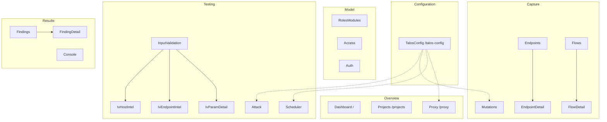

# UI pages

Inventory of every React page under `frontend/src/pages/`. Routes are declared in `App.tsx`; nav groups in `Layout.tsx`.

---

## Dashboard (`/`)

**File:** `Dashboard.tsx` (+ `pages/dashboard/*`)

| Aspect | Detail |
|--------|--------|
| **Purpose** | Mission-control snapshot for the selected project: readiness, findings triage, scheduler pipeline, proxy capture plane, session health, endpoint surface + coverage, flow intelligence, HTTP rules + Talos config posture |
| **Backend** | `GET /api/projects/{id}/dashboard` (aggregate; polls ~5s while visible). Legacy `GET …/summary` remains for header/Projects strip |
| **CLI** | Indirect via dashboard assembly (proxy status, `config effective`, `config http list`) — no mutations |
| **DB** | Aggregates on findings/status/attack_type, scheduler jobs/config/state, flows source/status/hosts, roles session health, outscope count; endpoint inventory/policy/coverage via `endpoint_reads` |
| **Components** | Hero strip (readiness chips + onboarding checklist), Findings / Scheduler / Proxy / Session panels, Endpoints + Flows charts, HTTP rules + Talos config posture, Activity rail; `recharts` mini donuts/bars |
| **Workflow** | Select project → scan readiness + triage queue + pipeline pressure → click panel headers into owning pages |

Design rules: decision-first metrics for testers; does not re-own header lifecycle pills as sole content (depth + distributions instead); graceful empty/no-DB onboarding checklist.

---

## Projects (`/projects`)

**File:** `Projects.tsx`

Operator **project workspace** (first full module redesign after the application shell). Not only a project list — lifecycle, identity, Basic Scope (in / out of scope), capture constraints, and live summary counts.

| Aspect | Detail |
|--------|--------|
| **Purpose** | Full project management: select/filter projects; create/open/close; rename; description; in-scope / out-of-scope prefixes; constraints; delete/purge; workspace summary; copy/open project paths |
| **Backend** | `GET /api/projects` (via context); `GET …/{id}/summary`; `GET …/{id}/outscope`; `POST /api/projects`; `POST …/open`; `POST /close`; `POST …/rename`; `POST …/description`; `POST …/scope/add`, `DELETE …/scope/entry`, `POST …/scope/bulk`, `POST …/scope/import`; `POST …/constraints`; `POST …/open-directory`; `POST/DELETE …/outscope`, bulk/import; `DELETE …/{id}?force&purge` |
| **CLI** | `project create`, `open`, `close`, `delete [--purge] [--force]`, `rename`, `description`, `scope add\|remove\|list\|clear\|import`, `constraints`, `outscope add\|remove\|list\|clear\|import` (mutations always via CLI). Path **Open directory** is Control Panel backend OS integration, not CLI. |
| **DB** | Registry for list/detail fields (`status`, `scope`, `constraints`, paths); read-only SQL for summary counters and outscope list |
| **Components** | Split layout (list + workspace), `Modal`, `ConfirmButton`, `Section`, `PathField`, `useAction`, summary link strip |
| **Workflow** | Filter/select project → edit workspace panels → Apply via CLI; **Open** activates in Talos (proxy/scheduler reconcile in core); create → auto-open + select; **Copy path** / **Open directory** on data dir and database paths |

### Layout

| Region | Behavior |
|--------|----------|
| **Left list** | Filterable project inventory; active badge; scope preview; click selects UI project (does not open) |
| **Workspace header** | Name, active/inactive, DB ready, open/close, dashboard link, summary counters (flows, endpoints, findings, jobs, roles, modules) |
| **Identity & metadata** | Rename (`project rename`), description note, created_at; **Data directory** and **Database** rows via `PathField` (monospace path + compact Copy path / Open directory) |
| **Path actions** | **Copy path** — browser clipboard of the resolved path from the project API (toast via command log). **Open directory** — `POST …/open-directory` with `{ target: "data_dir" \| "database_dir" }` only; backend resolves path; never posts the rendered path string. Database open targets the parent of `talos.db` (allowed when the file is missing if the parent exists). Linux/Windows only. |
| **In scope** | List of Basic Scope prefixes; add single entry; bulk paste (one per line); `.txt` file import via CLI temp file; remove per entry. UI does not interpret URL semantics. |
| **Capture constraints** | `store_bodies`, `max_body_size`; `capture_in_scope_only` shown read-only (always enforced) |
| **Out of scope** | Same prefix model as in-scope; add / bulk / import / remove; needs `talos.db`; all mutations via `run_scoped` / temp-file import |
| **Danger zone** | Delete (registry only) vs Purge (registry + data directory); both confirm + `--force` |

### UI selection vs Talos active

- **Selected** — Control Panel context (`localStorage`); drives other pages’ data.
- **Active** — Talos registry `status == "active"` after `project open`.
- Workspace warns when selected ≠ active. Proxy reconcile on open/close is **Talos core**, not the Control Panel.

After create, frontend re-lists, finds by name, opens, and sets selection. After rename, re-selects by new display name (slug/id may change — CLI-017).

---

## Proxy (`/proxy`)

**File:** `Proxy.tsx`

| Aspect | Detail |
|--------|--------|
| **Purpose** | Operator control + observability for the Talos-managed proxy |
| **Backend** | `GET /status`, `GET /logs`, `POST /start`, `/stop`, `/restart`, `/kill`, `GET|POST /config`; layered source via `GET /api/configuration/effective` |
| **CLI** | `proxy start|stop|restart|kill|status|config` via `cli.run` (core owns mitmdump); effective mode/source from `talos config` |
| **DB** | None in CP for config; layered YAML + legacy dual-write owned by Talos core |
| **Components** | `useAction`, runtime panel, config panel with **source badge**, link to Talos Configuration, live log tail; header also has hover lifecycle menu |
| **Workflow** | Set host/port → Start; Restart/Stop; Kill; contextual Direct/Upstream editor; full inheritance lives under **Talos Configuration → Proxy** |

Warns if selected project is not Talos-active. Header and page show transitional states when core auto-restarts. Header proxy pill hover offers start/stop/restart/kill/force-kill.

---

## Talos Configuration (`/talos-config`)

**File:** `TalosConfig.tsx`

The primary Control Panel surface for **layered Talos configuration** (`EffectiveConfig`), not Control Panel process env.

| Aspect | Detail |
|--------|--------|
| **Purpose** | View and edit global + project configuration with source attribution (DEFAULT / GLOBAL / LEGACY / PROJECT / CLI) |
| **Route query** | `?tab=overview\|settings\|files`, `?section=proxy\|capture\|http\|…`, `?scope=project\|global` |
| **Backend** | `GET /api/configuration/context\|schema\|effective\|settings\|get`; `POST /value`, `POST /unset`; `POST /open-directory` |
| **CLI** | `config show\|effective\|get\|set\|unset\|schema` (project via `--project` / `run_scoped`; global via `--global` without scoping) |
| **DB** | None — never reads `scheduler_config` / `proxy_config` / `attack_config` for effective values |
| **Components** | Scope switch Project/Global, source badges, typed edit modal, Files inspection, `ModuleHelp` |
| **Workflow** | Overview cards → Settings table (Override / Edit / **Remove override**) → Files paths + effective JSON |

Tabs:

| Tab | Role |
|-----|------|
| **Overview** | Paths, inheritance counts, section summary cards |
| **Settings** | Generic leaf table (scalar keys; `http.rules` managed on HTTP Rules workspace) |
| **Files** | Global/project paths, copy/open directory, effective JSON dump (no raw YAML editor in v1) |

Related workspaces keep contextual controls but link here for ownership: Proxy, Scheduler, HTTP Rules (`http.enabled`), Attack unauth auto-run, Projects capture constraints.

---

## Roles & Modules (`/roles-modules`)

**File:** `RolesModules.tsx`

| Aspect | Detail |
|--------|--------|
| **Purpose** | Full role/module lifecycle: create, use for capture, reset to global, rename, delete |
| **Backend** | `GET/POST /api/roles*`, `GET/POST /api/modules*` (list DB; mutations CLI) |
| **CLI** | `role create/set/unset/rename/delete`, `module create/set/unset/rename/delete` (scoped; delete uses `--force` after UI confirm) |
| **DB** | `roles`, `modules` for lists |
| **Components** | Capture-context banner, two-column panels, `ModuleHelp`, `ConfirmButton`, `UuidChip`, `useAction`; header chips share the same set/unset wording |
| **Workflow** | Create name → **Use for capture** (`set`); **Reset to global** (`unset`, not empty); rename (UUID stable); delete cascades / reassigns flows to `global`. Built-in `global` is protected. Switching may restart a running proxy via core notify. |
| **Operator guidance** | Page help explains roles vs modules, set vs unset→global, and lifecycle; inline text near capture banner and create fields |

---

## Access Model (`/access`)

**File:** `Access.tsx`

| Aspect | Detail |
|--------|--------|
| **Purpose** | Edit client_allowed / server_expected matrix; run coverage & signals reports |
| **Backend** | `GET /api/access/matrix`; `POST /client`, `/server`; `POST /coverage`, `/signals` |
| **CLI** | `access client/server set`, `access coverage`, `access signals` |
| **DB** | CROSS JOIN roles×modules + access_map |
| **Components** | Matrix table, value badges, inline selects |
| **Workflow** | Requires ≥1 role and module; set cell values; optional CLI report output in panel |

Unset/delete access endpoints exist on the backend but are not exposed on this page UI.

---

## Auth (`/auth`)

**File:** `Auth.tsx`

| Aspect | Detail |
|--------|--------|
| **Purpose** | Full role auth workspace: artifacts, provider, session health, validation flows, runtime recovery |
| **Backend** | `/api/auth/*`, `/api/auth-config/{role}/*` (enriched state, extractors, TTL, expiry, control flows, clear-session, reset-health), `GET /api/roles` |
| **CLI** | `auth set/unset/clear/test`, `auth-config set-provider`, login flows + extractors, `test`/`validate`/`refresh`, `set-ttl`, expiry signals, control flows, `clear-session`, `reset-health` |
| **DB** | `auth_config`, `role_auth_*`, `auth_flow_config`, `session_health_*`, `auth_test_results` (via state/results endpoints) |
| **Components** | Five functional sections, role state strip, extractor modal, secondary auth-bypass panel, `ModuleHelp` |
| **Workflow** | Artifacts → provider → acquire credentials → health → validation → runtime recovery |

**Sections:**

1. **Authentication Artifacts** — project-wide cookie/header **names**; add/remove/clear (`auth set/unset/clear`)
2. **Role Authentication** — AUTO login-flow list, or MANUAL structured session editor (headers/cookies/expiry CRUD, Save & Apply; optional raw file)
3. **Session Health** — AUTO: TTL + refresh-before; MANUAL: refresh-before only (lifetime is session expiry); expiry signals; suspicion + reset-health
4. **Validation Flows** — control-flow list with per-row Validate + Remove; add flow UUID (not URL validation endpoints)
5. **Runtime and Recovery** — structured status (manual expiry/session state fixed); validate all / refresh; recovery actions

**Extractor:** view/edit Python `extract(response)`; test shows full token values (no store).

**Auth-bypass testing** is not on this page (belongs under Attacks / unauth later).

**Operator guidance:** page-level `How Auth works` plus inline notes on AUTO vs MANUAL TTL, validate vs refresh, and control-flow baseline semantics.

---

## Endpoints (`/endpoints`) — Endpoint Workspace

**File:** `Endpoints.tsx` (+ `pages/endpoints/*`)

Operator **Endpoint Workspace** (not a raw capture table). Four tabs answer distinct questions:

| Tab | Operator question |
|-----|-------------------|
| **Inventory** (default) | What endpoints has Talos discovered, and what do I want to do with them? |
| **Policy** | What will Talos actually test, skip, or prioritize, and why? |
| **Rules** | What path-level policy have I configured? |
| **Coverage** | Where is my endpoint model weak or incomplete? |

| Aspect | Detail |
|--------|--------|
| **Purpose** | Inventory API surface; curate policy; understand automation eligibility; send endpoints into testing |
| **Backend** | `GET /api/endpoints` (resolved list + filters + `ids_only`); `/summary`, `/policy-summary`, `/coverage`, `/filters`; bulk `POST /api/endpoints/bulk/*`; rules CRUD + preview; detail/policy explain |
| **CLI** | All mutations via multi-ID `endpoint mark/unmark/priority/exclude/include/tags` and `endpoint rule *`; test enqueue via `scheduler enqueue` / `replay endpoint`. Reads use core policy resolver (`endpoint_reads` → same as `talos endpoint list/policy`) |
| **DB** | Read-only observation (hits, modules, parameters); **resolved** priority/exclusion/qualification from Talos policy engine — UI does not infer |
| **Components** | Tab shell, `InventoryTab`, `PolicyTab`, `RulesTab`, `CoverageTab`, `PolicyExplain`, `SideDrawer`, sticky bulk bar, `DataTable`, `ModuleHelp` |
| **Workflow** | Inventory browse/filter → multi-select → bulk mutate (one CLI call with all IDs) → Policy explain → Rules create with live preview → Coverage jump-to-filter |

### Inventory

- Summary strip (clickable): total, testable, excluded, dangerous, logout, unqualified
- Filters: search, origin, method, effective priority, priority source (Manual/Rule/Auto), included/excluded, qualified, qualification reason, safety, role, module, tag, has parameters, has baseline
- Columns: select, method, endpoint (origin+path), priority **and** source separately (`HIGH` `AUTO`), state, roles, params, hits, last seen, ⋮ actions
- Selection: page / all matching filters (backend resolves IDs) / clear — sticky bulk bar for Mark, Priority, Exclusion, Tags, Test, Create path rule from selection
- Bulk result banner: affected / unchanged / total; validation failure surfaces Talos rejection (no per-row CLI loop)

### Policy

- Summary cards: TESTABLE, EXCLUDED, UNQUALIFIED, MANUAL / RULE / AUTO controlled; priority histogram
- Decision table: endpoint, effective priority, source, exclusion, qualification, baseline, **TESTABLE|SKIPPED**
- Problem filters: why not testable, no baseline, no 2xx, only redirects, dangerous, logout, excluded by endpoint/rule, manual overrides
- Explain drawer: structured `talos endpoint policy` (shared `PolicyExplain` component)

### Rules

- Full UI for `talos endpoint rule add|update|delete|list|show|preview`
- Table: pattern, priority, exclusion, matches, effect, updated; multi-rule match visibility
- Create/edit drawer with **live impact preview** (core matcher, not React re-implementation)
- Inventory can seed “Create path rule from selection” with a **suggested** pattern only

### Coverage

- Read-only analytical UI: qualification %, baseline readiness, role observation (not Access Model), parameter coverage
- Cards jump to Inventory with the appropriate filter

Query: `?tab=inventory|policy|rules|coverage` and optional `?rule=<id>`.

---

## Endpoint detail (`/endpoints/:endpointId`)

**File:** `EndpointDetail.tsx`

Inspector with tabs: **Overview | Policy | Parameters | Flows | Activity**.

| Aspect | Detail |
|--------|--------|
| **Purpose** | Inspect one endpoint; mutate safety/priority/exclusion/tags; replay/enqueue; view parameters and flows |
| **Backend** | detail (includes `policy_explanation`), adjacent, mark/unmark, priority, exclude/include, tags; replay; scheduler enqueue |
| **CLI** | Same endpoint/replay/scheduler commands as workspace bulk (single-ID) |
| **DB** | endpoint (+ canonical origin from `endpoints.host`), policy, parameters, roles, modules, flows |
| **Components** | Header status strip, action dropdowns, `PolicyExplain` (same as Policy tab), parameter/flow tables |
| **Workflow** | Overview → Policy explain → Parameters / Flows; Activity reserved until core audit history exists (not faked from `updated_at`) |

**Flows** link uses `/flows?endpoint=<id>` (flows list accepts endpoint filter).

---

## Flows (`/flows`)

**File:** `Flows.tsx`

| Aspect | Detail |
|--------|--------|
| **Purpose** | Browse captured HTTP flows; quick actions |
| **Backend** | list + filters; roles list; replay/enqueue/export; auth-config attach login/control flows |
| **CLI** | `replay flow`, `scheduler enqueue flow`, `flow export`, `auth-config add-flow` / `add-control-flow` |
| **DB** | flows (+ roles/modules names) |
| **Components** | `DataTable`, dropdown menu, assign modal, `formatIST` |
| **Workflow** | Filter → row open detail; or ⋮ replay/enqueue/export/assign as login or control flow |

---

## Flow detail (`/flows/:flowId`)

**File:** `FlowDetail.tsx`

| Aspect | Detail |
|--------|--------|
| **Purpose** | Full request/response; attack/replay result chips; actions |
| **Backend** | `GET /api/flows/{id}`, adjacent, replay, enqueue, export |
| **CLI** | `replay flow`, `scheduler enqueue flow`, `flow export` |
| **DB** | flow row + optional replay_diffs, bac_results, unauth_results, auth_test_results |
| **Components** | `HttpView`, `StatusBadge`, `formatIST` |
| **Workflow** | Inspect HTTP → optional attack result cards → replay/export |

---

## HTTP Rules (`/mutations`)

**File:** `Mutations.tsx` (route kept for bookmark compatibility; sidebar label **HTTP Rules** under Capture)

Workflow-oriented UI for the HTTP Manipulation Engine (traffic pipeline), not a generic CRUD editor.

| Aspect | Detail |
|--------|--------|
| **Purpose** | Declarative request/response manipulation: match conditions + ordered actions; layered project/global rules |
| **Backend** | `/api/mutations*` → `talos config http …` (list, create, update, enable/disable, delete, engine, import/export, reorder, duplicate) |
| **CLI** | `config http list/show/create/update/delete/enable/disable/set-priority/set-match/add-action/reorder/export/import/enable-engine/…` |
| **Storage** | `project.yaml` / global `~/.talos/config.yaml` (`http.rules`) — not SQLite |
| **Components** | Engine toggle, global summary, filters, rule table (priority/direction chips/action chips/origin), details drawer, visual match + action builders, create modal + templates, import/export, `ModuleHelp` |
| **Workflow** | Scan summary → filter list → open rule drawer → edit structured match/actions with preview → save; templates for common ops; Proxy page shows compact pipeline status card |

| Region | Behavior |
|--------|----------|
| **Header** | Title + Engine ON/OFF (`http.enabled` via `/api/mutations/engine`) |
| **Summary** | Active / request / response / disabled counts |
| **Filters** | Direction, scope (project/global), host, free-text search |
| **Table** | Priority, enabled toggle, name, direction (blue/green/purple), match summary, action chips, origin, edit/duplicate/delete |
| **Details drawer** | Full match + actions; stats placeholders (live counters future); edit opens builder |
| **Create** | Modal with templates (cache validators, research header, CSP strip, delay, block, …); priority presets (10–100); scope Project vs Global; validation preview |
| **Edit** | Side drawer; same visual builders; layer fixed to rule origin |

Priority presets: Lowest(10) … Highest(100); advanced mode exposes numeric priority. Global rules are editable/deletable with `--global` on the CLI path.

---

## Scheduler (`/scheduler`)

**Files:** `Scheduler.tsx` shell + `pages/scheduler/*` (ControlStrip, MetricsStrip, JobsTab, HistoryTab, JobDetailDrawer, EnqueueDrawer, shared)

| Aspect | Detail |
|--------|--------|
| **Purpose** | Full CLI surface for the rate-limited priority job queue + managed daemon (not cron): process start/stop, queue pause/resume, job inventory/detail/cancel, enqueue, clear, prune |
| **Backend** | Enriched `GET /status` (process + metrics + counts); `POST /start` `/stop`; `GET /jobs` (family filter, total/offset); `GET /jobs/{id}`; `POST /cancel` `/prune`; enqueue/clear/pause/resume; rate limits read from `/api/configuration/settings?section=scheduler` |
| **CLI** | `scheduler status/start/stop/pause/resume/jobs list|show/cancel/prune/clear/enqueue …`; rate keys owned by `talos config scheduler.*` (Talos Configuration page) |
| **DB** | scheduler_jobs (+ joins), scheduler_state; process from `SchedulerRuntimeManager` / `~/.talos/runtime/scheduler.json` (config table is legacy dual-write, not CP source of truth) |
| **Components** | Process + queue control strip (two “running” concepts), clickable status chips + metrics, Jobs / History tabs, job detail drawer, enqueue drawer (flow/endpoint + priority/type/force), bulk cancel, prune confirm |
| **Workflow** | Start daemon → watch process vs queue state → filter by family/status → open job drawer (meta/timestamps/verdict) → cancel pending/paused → enqueue with flags → clear pending or prune terminal history |
| **Deep-link** | `?tab=jobs\|history&status=failed&type=bac&job=<id>` (Dashboard failed jobs land on History with drawer open) |

**Mental model:** Jobs execute only when the **process is live** and **queue state is running**. Rate limits stay under Talos Configuration (read-only strip + deep link on this page).

---

## Attack (`/attack`)

**File:** `Attack.tsx` (tabs: BAC, Unauth)

| Aspect | Detail |
|--------|--------|
| **Purpose** | Launch unauth/BAC attacks; view results and decision-filter helpers |
| **Backend** | `/api/attack/unauth/*`, `/api/attack/bac/*`; unauth auto-run from configuration `attack.unauth_auto_run` |
| **CLI** | `attack unauth run`, `attack bac <technique>`, filter init/show/validate; auto-run via layered config |
| **DB** | unauth_results, bac_results (+ joins) for display |
| **Components** | Auto-run banner + Configure link, technique buttons, summary cards, results tables |
| **Workflow** | See effective auto-run + source → run manually → results; toggle auto-run under **Talos Configuration → Attack** |

Long runs may hit the 60s CLI timeout.

---

## Input Validation (`/input-validation`)

**Files:** `InputValidation.tsx` + `pages/input-validation/*`

IV **workspace** (tabbed shell + dossier routes) exposing the full M1–M12 intelligence surface.

| Route | Purpose |
|-------|---------|
| `/input-validation?tab=overview` | Status KPIs, confidence, top candidates, empty-state CTAs |
| `?tab=candidates` | Attack prioritization board (filters, drill-down) |
| `?tab=parameters` | Parameter intelligence inventory |
| `?tab=multi-level` | Endpoint + host profile lists (M10) |
| `?tab=run` | Scope, budget run/resume/synthesize/clear, phase shortcuts |
| `?tab=settings` | Enable, workers, budget, max req, phases, auth artifacts, excludes |
| `/input-validation/params/:paramUuid` | Parameter dossier (capabilities, candidates, observed cards, tested, probes→flows) |
| `/input-validation/endpoints/:endpointId` | Endpoint intelligence dossier |
| `/input-validation/hosts/:host` | Application/host intelligence dossier |

| Aspect | Detail |
|--------|--------|
| **Purpose** | Operator UX for characterization intelligence — not an exploit runner |
| **Backend** | `/api/input-validation/*` status, overview, profiles, candidates, endpoints, hosts, show, export JSON, config/run CLI wrappers |
| **CLI** | Full `talos input-validation *` parity for config/run/synthesize/candidates/show/export/exclude |
| **DB** | `input_validation_config`, `iv_param_profiles`, `iv_endpoint_profiles`, `iv_app_profiles`, `iv_probe_results`, caches |
| **Components** | Tabs (Endpoints-style), `CapabilityBadges`, `CandidateScore`, `ProfileCards`, `ProbeEvidenceTable`, `ScopeBar` |
| **Workflow** | Enable → Run standard → wait (auto-refresh) → Synthesize → Candidates → open parameter dossier → evidence flows |
| **Polling** | Overview/status every 5s while `running+queued > 0` |

Candidate scores are always labeled **prioritization only**, not confirmed vulnerabilities.

---

## Findings (`/findings`)

**File:** `Findings.tsx`

| Aspect | Detail |
|--------|--------|
| **Purpose** | List findings; client-side filters; manage groups |
| **Backend** | list, groups list/create/delete/report |
| **CLI** | `finding group create/remove`, `finding report --group` |
| **DB** | findings, groups |
| **Components** | `DataTable`, group badges, report pre |
| **Workflow** | Filter by status/type/verdict/role/module → open detail; create groups |

Status filter is server-side; other filters are client-side on the loaded list.

---

## Finding detail (`/findings/:findingId`)

**File:** `FindingDetail.tsx`

| Aspect | Detail |
|--------|--------|
| **Purpose** | Lifecycle (confirm/reject/reopen/duplicate), evidence, timeline, report |
| **Backend** | detail, confirm/reject/reopen/duplicate, groups add, report |
| **CLI** | matching `finding *` |
| **DB** | findings, evidence, timeline, duplicates |
| **Components** | Evidence cards with flow links, timeline list |
| **Workflow** | Triage finding → confirm/reject → optional group/report |

---

## Console (`/console`)

**File:** `Console.tsx`

| Aspect | Detail |
|--------|--------|
| **Purpose** | Full CLI coverage fallback: modeled forms + raw argv |
| **Backend** | `GET /api/console/tree`, `POST /run`, `POST /raw` |
| **CLI** | Any command in tree or raw list; optional project open prefix |
| **DB** | None for execution; tree is in-memory `COMMAND_TREE` |
| **Components** | Group list, command list, dynamic fields, argv preview |
| **Workflow** | Pick group → command → fill args → Run; or Raw tab with space-split tokens |

Background commands show pid/status instead of step logging. Results of normal runs go to `CommandLogContext` (drawer).

---

## Cross-cutting page behaviours

| Behaviour | Pages |
|-----------|-------|
| Require selected project | Most except Projects/Console partially |
| `useAction` + toast/drawer | All mutation UIs |
| Proxy restart after state change | **None** — Talos core owns restart/reconcile; UI only observes |
| Polling | Proxy (2s), Status header (3s), Scheduler (4s) |
| Detail prev/next | EndpointDetail, FlowDetail |
| IST timestamps | Flows, FlowDetail, Scheduler, Attack, Findings |

---

## Pages vs backend surface gaps

Backend routes without dedicated primary UI (reachable via Console or unused):

- Project workspace is complete for core `talos project *` surface (create/open/close/delete/purge/rename/description/scope/constraints/outscope); export/import/clone/archive remain future CLI work
- Access unset/delete
- Endpoint path policy UI
- Finding notes (model defined, no endpoint)
- `talos ui` background start (in command tree only)
- Auth page now covers TTL, expiry signals, validation control flows, extractors, recovery, and secondary auth-bypass testing
