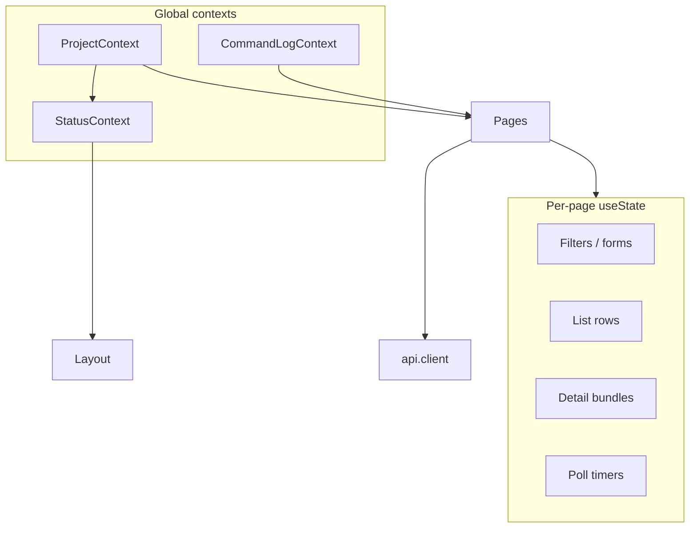

# State management

The Control Panel frontend uses **React Context** for a few global concerns and **local component state** for almost everything else. There is no Redux, Zustand, or React Query.

---

## Overview



---

## React Context usage

### ProjectContext (`state/ProjectContext.tsx`)

| Field | Meaning |
|-------|---------|
| `projects` | List from `GET /api/projects` (includes `status`, `constraints`, `db_path`, scope, active) |
| `selectedId` | Currently selected project id for the UI |
| `selected` | Resolved `Project` object or null |
| `setSelectedId` | Updates state + `localStorage` key `talos-cp-selected-project` |
| `refresh` | Reloads project list from API |
| `loading` | True while refreshing |

**Selection rules on refresh:**

1. Keep previous selection if still present in list
2. Else fall back to `active_project_id` from API
3. Else first project
4. Else null

**Important distinction:** UI selection is independent of Talos’s active project until the operator opens a project (CLI `project open`). Header shows an “inactive” badge when selected but not active.

The Projects page keeps **workspace-local** edit state (name, description, scope text, constraints, outscope list, summary counters) synced from `selected` and reloaded after mutations. List filter text is page-local only. Rename may change the project slug; the page re-selects by the new display name after refresh.

Hook: `useProject()`.

---

### CommandLogContext (`state/CommandLogContext.tsx`)

| Field | Meaning |
|-------|---------|
| `entries` | Up to 100 log entries (newest first) |
| `log(label, steps)` | Append entry; set `lastFailed`; open drawer on failure; push toast |
| `clear` | Empty entries |
| `open` / `setOpen` | Drawer visibility |
| `lastFailed` | Whether last logged action had a failed step |
| `toasts` / `dismissToast` | Ephemeral toasts (auto-dismiss 2.8s success / 5s failure) |

Each entry: `{ id, at, label, steps: CommandResult[] }`.

This is the **primary operator feedback channel** for mutations. Success still toasts so actions are visible without watching the drawer.

Hook: `useCommandLog()`.

---

### StatusContext (`state/StatusContext.tsx`)

Shared poller for the **global top header** so individual pages do not each poll runtime chips. Pages never own global lifecycle UI transitions (e.g. proxy RESTARTING after a config-sensitive action).

| Field | Meaning |
|-------|---------|
| `proxyStatus` | Full Talos runtime snapshot from `GET /api/proxy/status` |
| `proxyRunning` | Convenience: state is `running` |
| `proxyStateLabel` | Header label (`RUNNING` / `STARTING` / `RESTARTING` / `STOPPING` / `STOPPED` / `FAILED`) |
| `schedulerStatus` | From `GET /api/scheduler/status` (counts + config + DB execution state); null without project |
| `schedulerStateLabel` | `RUNNING` / `PAUSED` / `WAITING` / … |
| `schedulerQueueCount` | Active jobs: pending + running + paused |
| `findingsTriaging` | TRIAGING count from project summary (header signal); null without project |
| `findingsConfirmed` | CONFIRMED count (tooltips) |
| `roles` / `modules` | Full lists for header switchers |
| `activeRole` | Role with `is_active` from `GET /api/roles` |
| `activeModule` | Module with `is_active` from `GET /api/modules` |
| `refreshStatus` | Immediate refresh |

Poll interval: **3 seconds** normally, **1 second** while proxy is `transitional` or `restart_pending` so auto-restarts surface quickly. Depends on `selected` from ProjectContext (clears project-scoped fields when no project).

No restart helpers live in this context. Proxy / Scheduler pages may still run their own richer polls for status + logs.

Hook: `useStatus()`.

---

## Global state summary

| Concern | Where | Persistence |
|---------|-------|-------------|
| Selected project id | ProjectContext | `localStorage` |
| Project list | ProjectContext | Memory; reload on refresh/mount |
| Command history | CommandLogContext | Memory only (max 100) |
| Drawer open | CommandLogContext | Memory |
| Toasts | CommandLogContext | Memory + timeouts |
| Proxy / scheduler / findings / role-module header | StatusContext | Memory; polled |
| Theme | ThemeToggle (local) | Implementation-local (not centralized context) |
| DataTable column prefs | DataTable `storageKey` | `localStorage` when key set |

---

## Local state patterns

Pages typically:

1. Read `selected` from `useProject()`
2. `useState` for rows, filters, form fields, loading flags
3. `useEffect` to load when `selected` or filters change
4. Define `load()` and call after mutations
5. Wrap mutations with `useAction(label, fn)`

Examples:

| Page | Notable local state |
|------|---------------------|
| Endpoints | search + multi filters, rows, total, loading |
| Console | command tree, selected command, form values, modeled/raw mode |
| Auth | role id, wizard fields, session content, role state snapshot |
| Scheduler | jobs, status, modal visibility, config fields |
| Attack | tab, results, run options |

Detail pages use route params (`useParams`) as the primary id source.

---

## Shared hooks

### `useAction` (`hooks/useAction.ts`)

```text
const { run, running } = useAction(label, async (...args) => StepsResponse)
```

- Sets `running` true for the duration
- Awaits `fn`
- Calls `log(label, result.steps || [])`
- Always clears `running` in `finally`
- Does **not** catch errors — network/`ApiError` propagate unless the caller catches

Normalization pattern when API returns a bare `CommandResult`:

```ts
api.post(...).then((r) => ({ steps: [r] }))
```

Proxy start/stop synthesize a single “ok” step from JSON status for logging purposes (they do not receive true CLI step arrays).

---

## Data flow

### Read path

```text
Mount / filter change
  → api.get
  → setState(rows)
  → render DataTable / detail
```

No global cache: revisiting a page re-fetches (unless component stayed mounted).

### Write path

```text
User event
  → useAction.run / inline handler
  → api.post/del
  → backend CLI
  → { steps }
  → CommandLogContext.log
  → optional load() refresh
  → (no proxy restart from the page — Talos core owns lifecycle)
```

### Status path

```text
StatusProvider interval
  → proxy status
  → (if project) roles/modules + scheduler status + project summary
  → AppHeader chips (proxy, scheduler, findings, role/module)
```

---

## Provider nesting (required order)

From `App.tsx`:

```text
ProjectProvider
  CommandLogProvider
    StatusProvider   ← uses useProject
      BrowserRouter
        Layout / routes
```

`StatusProvider` must sit inside `ProjectProvider`. Consumers of any context must be under their provider or the hook throws.

---

## What is intentionally not global

- List filters (reset when navigating away unless component remains mounted)
- CLI command form values on Console
- Attack tab selection
- IV probe table contents
- Modal open flags

This keeps domains decoupled at the cost of no cross-page shared filter state.
