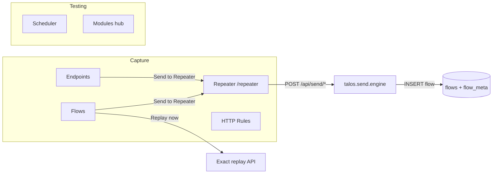
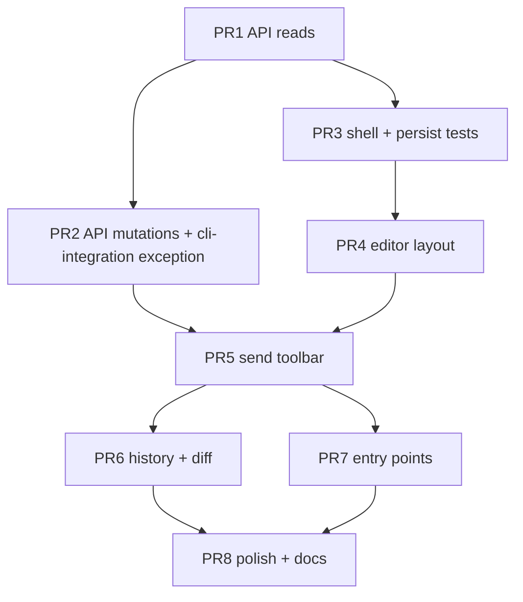

# Control Panel: Repeater Feature UI

| Field | Value |
|-------|-------|
| **Author** | TBD |
| **Date** | 2026-07-29 |
| **Status** | Implemented (CP Repeater UI + `/api/send`) |
| **Related** | Repeater Phase 1–2 CLI (`talos send`), CP Error Intelligence / Flow Detail patterns |
| **Out of engine scope** | Intruder, schedule/continuous send, token refresh, redirect following |

---

## Overview

Talos already ships a full Burp-style **Mode 2** repeater engine as CLI `talos send` (distinct from exact Mode 1 `talos replay`). Operators can materialize drafts, apply structured or raw edits, send once / N× / parallel (hard-capped), branch via `session_id`, redo as-sent requests, diff request+response, and browse history/tree — all while keeping captures immutable and writing a new `flows` row per send (`source ∈ {manual_send, ai_send}`).

This design adds a **first-class Control Panel Repeater workspace**: a polished, keyboard-first request/response workbench that feels like a product surface (not a CLI form), reuses existing HTTP viewing primitives, and maps 1:1 onto the shipped engine without redesigning send semantics. Entry points open from Flow Detail, Endpoints, Findings, and deep-links (`/repeater?flow=…`); drafts stay client-local until Send; history/lineage remain in SQLite via existing `flows` + `flow_meta`.

**Send path contract (critical):** the UI always serializes the full editor document to **raw HTTP bytes** and calls `send_once(..., raw_message=…)`. Structured editor modes are *editing conveniences only*; they never emit incremental `apply_*` patch lists to the server. That guarantees deleted headers/cookies/query keys actually leave the wire.

---

## Background & Motivation

### Current state

| Layer | What exists |
|-------|-------------|
| Engine | `talos/send/{cli,engine,draft,db,raw_http,normalize,request_diff}.py` — complete Phase 1–2 |
| Docs | `docs/updates.md` (Repeater Phase 1/2), `docs/cli-cheat-sheet.md`, `docs/architecture.md` |
| Exact replay CP | `POST /api/replay/flow/{id}`, `POST /api/replay/endpoint/{id}` via thin CLI wrapper (`routers/replay.py`) |
| Flow UI | `FlowDetail.tsx` + `HttpInspector` (read-only Pretty/Raw/Params/Encoded) + `FlowReplayPanel` (lineage of *replays*, not sends) |
| Flow actions | `FlowActions.tsx`: Replay now, Enqueue replay, export, copy raw/curl — **no Send to Repeater** |
| Testing modules | ModuleShell workspaces under `/testing/*` (EI, IV, secrets, BAC, unauth) — scan-oriented, not interactive HTTP editing |
| CP write rule | `docs/control-panel/cli-integration.md`: every write is `talos …` argv subprocess; reads may import Python |

### Pain points

1. **CLI-only Mode 2** — operators who live in the Control Panel must drop to Console or terminal for edit → send → compare.
2. **Replay conflation risk** — “Replay now” is exact re-execution; editing a capture needs a clearly different path and UI language.
3. **No sticky draft** — CLI drafts are temp files / memory; CP needs multi-tab sticky unsaved work without inventing a server draft table.
4. **History is invisible** — `send history` / `tree` / `diff` exist but are not surfaced next to the editor.

### Design slogan

> **Replay = identity-preserving re-execution. Send = free mutation with full lineage. Repeater UI = the interactive surface for Send.**

---

## Goals & Non-Goals

### Goals

1. Burp-Repeater-class **workspace**: request editor + response viewer + history/tree + send toolbar, DaisyUI/Tailwind dark theme, keyboard-first.
2. **Fork from any flow** (capture, prior send, or a prior replay row as parent) via `talos send from` semantics.
3. **Raw and structured edit modes** that always serialize to a full raw message on send; Content-Length auto-fix ON by default (toggle for edge tests).
4. **Send / Redo / Dup(branch) / Reset / Export / Note / multi-send** with visible caps (N ≤ 50; parallel uses engine default concurrency `min(N, 10)`).
5. **Compare** last response vs baseline (root capture) and vs parent; request+response diff chips.
6. **Multi-tab** repeater sessions (client-only), deep-links, open-from Flow Detail / Endpoints / Findings.
7. **Incremental PR plan** — each PR independently reviewable and mergeable.
8. Stay true to Talos invariants: **immutable captures**, lineage fields, operator UI always stamps `manual_send`, no scheduler for sends.

### Non-Goals

| Item | Why |
|------|-----|
| Redesign `talos.send` engine | Already shipped Phase 1–2 |
| Intruder (payload positions, wordlists, attack types) | Explicit future; do not scope-creep |
| Schedule / continuous send | Out of CLI Phases 1–2 |
| Token refresh / redirect following | Engine does not follow redirects (httpx, 30s, same as replay) |
| Mutating proxy captures or UPDATE parent flows | Forbidden |
| Replacing exact Replay buttons with Send | Both stay; different product intents |
| Server-persisted draft table | Prefer localStorage + in-memory; DB only on send |
| Streaming SSE / NDJSON for multi-send (v1) | Deferred; v1 is single request + spinner/summary |
| **Compose request from scratch without a parent flow** | Engine requires a parent for lineage (`draft_from_flow`); no synthetic capture. New tab prompts for flow UUID / recent flow |
| Nested JSON path editor | Engine `json_sets` is **top-level keys only**; nested paths are non-goal |
| New code-editor dependency (Monaco/CodeMirror) | v1 uses monospaced `<textarea>` only |
| Mid-flight cancel of multi-send | Engine has no cancel; abort only by closing browser (orphans server work) |

---

## Proposed Design

### Information architecture & navigation

**Primary home: Capture group — first-class tool**

Repeater is an interactive capture/investigation tool (like Burp’s Repeater sits next to Proxy/Target), not an automated Testing module. Place it in the **Capture** sidebar group:

| Item | Route | Notes |
|------|-------|-------|
| **Repeater** (new) | `/repeater` | Primary workspace |
| Endpoints | `/endpoints` | Existing |
| Flows | `/flows` | Existing |
| HTTP Rules | `/mutations` | Existing |

**Secondary surfaces (not separate nav items):**

| Entry | Behavior |
|-------|----------|
| Flow Detail sticky actions + list ⋮ | **Send to Repeater** → `/repeater?flow={id}` (or activate matching open tab) |
| Endpoint Detail | Concrete UI deltas below |
| Finding Detail | Concrete UI deltas below |
| HeaderSearch (`Ctrl/Cmd+K`) | Jump item: “Repeater” under Capture; keywords `send, burp, edit, once` |
| Console command tree | Follow-up PR (not blocking) |

**Not under `/testing/*`:** Testing Modules are Active/Passive scanners with ModuleShell chrome. Optional one-line card on the Modules hub may deep-link to `/repeater` for discoverability without nesting the workspace there.

**Replay remains separate:**

| Action | API / engine | UI label |
|--------|--------------|----------|
| Exact re-send | `POST /api/replay/…` → `talos replay` (CLI wrap) | **Replay now** / Enqueue replay |
| Mutable send | `POST /api/send/once` → `talos.send.engine` (in-process; see exception) | **Send** / **Send to Repeater** |



### Multi-tab / multi-session UX

**Burp-like client tabs** (not server sessions):

- Each **Repeater tab** is a local workspace: draft, parent, root, active session_id, last response, dirty flag, editor mode.
- **Server `session_id`** (from `send dup` / optional stamp on once) is a *logical branch marker* for history filters — orthogonal to UI tabs.
- Tab strip titles use **method + short path** as primary label (UUIDs stay in context bar, secondary).
- Closing a dirty tab → confirm discard (drafts auto-persist; soft close preferred when clean).
- Cap open tabs at **12** client-side (soft); toast if exceeded.
- Restoring tabs after reload from `localStorage` key scoped by project id.

#### Parent lineage after Send (product rule)

| Rule | Behavior |
|------|----------|
| **Default** | **`parentFlowId` stays** the flow the tab was opened from (or last explicit Fork). Successful Send does **not** advance parent to `execution_flow_id`. Multiple Sends from the same draft are **siblings** under that parent (tree width grows under one parent). |
| After Send | Update response pane, set `lastExecutionId`, clear dirty, keep draft editable as-is, refresh history list if loaded. |
| **Fork** (history row action) | Replace draft **and** set `parentFlowId` to that execution; re-materialize from draft API. |
| **Single-click** history row | Load **response only** into response pane; draft and parent unchanged. |
| Optional advanced (v1.1+) | Toolbar toggle “Chain next send from last execution” — when on, after success set `parentFlowId = execution_flow_id`. **Off by default; not required for v1.** |

### Primary layout (wireframe-level)

Full-height workspace under Layout main (`p-0` or reduced padding for this page only).

```text
┌─ Tab strip ──────────────────────────────────────────────────────┐
│ [+]  GET /v1/me ✱  │  POST /orders  │                            │
├─ Context bar ────────────────────────────────────────────────────┤
│ GET /v1/me · Parent abc… · Root def… · Session ghi…             │
│ CL: auto ✓ · logout/dangerous chips · Dirty ✱                    │
├─ Toolbar ────────────────────────────────────────────────────────┤
│ [Send ↵] [▼ multi] [Redo] [Dup] [Reset] [Export] [Note] [Clear] │
├───────────────────────────────┬──────────────────────────────────┤
│ REQUEST                       │ RESPONSE                         │
│ [Raw | Pretty | Params |      │ [Pretty | Raw | Encoded | Diff]  │
│  JSON-assist]                 │ Status · len · duration · verdict│
│  monospaced textarea / tables │ CL-normalized badge if any       │
│                               │ HttpInspector (read-only)        │
├───────────────────────────────┴──────────────────────────────────┤
│ History ▾  [list | tree]  session filter                         │
│  click = response only · Fork = load as parent                   │
└──────────────────────────────────────────────────────────────────┘
```

**Regions:**

1. **Tab strip** — open workspaces; `✱` dirty; human titles (method + path).
2. **Context bar** — method/path primary; parent/root UuidChips; session; CL policy; **annotation chips** (logout / dangerous) from draft API.
3. **Toolbar** — primary actions (see below).
4. **Split panes** — request | response. Default CSS grid **50/50**. Optional minimal custom splitter (~50 LOC, no new dependency); ratio in localStorage. If splitter slips schedule, ship fixed 50/50.
5. **History drawer** — collapsible; click vs Fork semantics as above.

### Editor modes

**No Monaco/CodeMirror in v1** — monospaced `<textarea>` and DaisyUI tables only.

Modes are **mutually exclusive edit surfaces** (one active at a time):

| Mode id | UI | On send |
|---------|-----|---------|
| `raw` | Full HTTP/1.1 message in one textarea | Serialize `raw_text` → `raw_message` bytes |
| `pretty` | Start-line (method + URL), headers table, cookies table, body textarea | Rebuild full message via `draft_to_raw_bytes` / client equivalent → `raw_message` |
| `params` | Query key/value table + body form params (when `application/x-www-form-urlencoded`) | Same: rebuild full message → raw |
| `json-assist` | Top-level JSON object keys only; **disabled** when body is not a JSON object | Edit body object in draft → rebuild full message → raw |

**Forbidden:** sending incremental `headers=` / `remove_headers=` lists derived partially from the current map. The only legal send payloads are:

1. **`raw_message`** (primary, always used by CP UI), or  
2. (API-only / agents) full structured replace that the **router** converts to raw before `send_once` — never half-sets without removes.

Client-side request-diff chips vs parent may still call `GET /api/send/diff` or compute locally; that is display-only.

**Smart defaults:**

- Materialize from parent → open in `pretty` with Raw available.
- Switching modes re-parses; on failure keep previous mode and toast.
- **Content-Length auto-update ON** by default.
- Host sync when URL changes in pretty mode (client-side, before serialize).
- Sticky draft: debounced localStorage persist (300ms) + flush on `visibilitychange` / `beforeunload`.

**Do not** use `$EDITOR` / `send edit` from CP — the workspace *is* the editor.

### Response pane

- Reuse **read-only** `HttpInspector` (Pretty / Raw / Encoded) for the last response.
- Status chips: HTTP status, body length, **`duration_ms`** (from server hydrate/show — see DTO), `verdict`, `replay_error` if any.
- After send: toast with **status + verdict**; show response immediately (no history panel required for a usable loop).
- **CL-normalized badge** when last execution’s `flow_meta.normalizers` is non-empty (engine stores `normalizers` list after `apply_content_length`) — makes “as sent ≠ draft” visible.
- Optional **Request as sent** sub-view from hydrate (`request_as_sent`) when normalizers rewrote headers.
- **Diff mode** (full panel can land in PR6; PR5 still shows verdict chip from outcome):
  - Response vs **baseline** (root capture)
  - Response vs **parent**
  - Request vs baseline chips from `compute_request_diff`

### History / tree / sessions

| View | Data | Interaction |
|------|------|-------------|
| **List** | `list_send_history(root, session?, parent?, source?, limit)` | **Click** → response only; **Fork** → draft+parent replace |
| **Tree** | Structured nodes built in router from history rows (`parent_flow_id`) | Same |
| **Session filter** | `session_id` chips | Dup creates UUID and selects it |

Empty history: “No sends under this root yet. Edit the request and press **Send** (`Ctrl+Enter`).”

### Toolbar actions

| Action | Shortcut | Behavior | Engine |
|--------|----------|----------|--------|
| **Send** | `Ctrl/Cmd+Enter` | Serialize draft → raw → once; **parent unchanged**; update response; clear dirty | `send_once(..., raw_message=)` |
| **Multi-send** | toolbar dropdown | Dialog: Repeat N (1–50) + delay ms **or** Parallel N (1–50). Concurrency = **engine default** `min(N, 10)` — not operator-editable in v1. Confirm required. | `send_repeat` / `send_parallel` |
| **Redo** | `Ctrl/Cmd+Shift+Enter` | Re-fire **last execution** (or selected history row) as-sent | `redo_send` |
| **Dup / Branch** | — | New `session_id`; stamp subsequent sends | logical dup |
| **Reset draft** | — | Re-materialize from current parent; confirm if dirty | draft API |
| **Export** | — | Download request.http + response.http for last execution or parent | export API |
| **Note** | — | Edit note on last **send** row only | note API |
| **Clear drafts** | — | Wipe all localStorage tabs for this project (secrets hygiene) | client only |
| **Compare** | — | Diff two history rows or parent vs last (full UI PR6) | diff API |
| **Open parent / root** | — | Navigate to Flow Detail | frontend |

#### Multi-send progress (v1) — closed decision

**Choice A (simplest, honest):** single server request; modal shows:

- Spinner + **elapsed wall time**
- Copy: “Sending N requests…” (repeat) or “Sending N concurrent requests (engine concurrency ≤ 10)…”
- **No fake `i/N` progress** (client cannot know mid-flight without streaming)
- On completion: summary table of outcomes (status, verdict, execution id); close or keep open
- Cancel mid-flight: **not supported** (button disabled / hidden)

**Operability:** `api/client.ts` has **no fetch timeout**. Multi-send may hold the browser request up to server max (~900s sequential). UI must:

- Disable Send/Multi while in flight
- Show elapsed timer so the hang is intentional, not a frozen app
- Document in help that long multi-sends block one browser tab’s network request

Phase B (not v1): SSE/NDJSON or client-driven sequential once-loop for true `i/N` + AbortController.

### Keyboard-first map

Avoid browser-reserved chords that cannot be reliably overridden:

| Key | Context | Action |
|-----|---------|--------|
| `Ctrl/Cmd+Enter` | Workspace (not trapped in modal) | Send once |
| `Ctrl/Cmd+Shift+Enter` | After a send exists | Redo last execution |
| `Ctrl/Cmd+Shift+]` / `[` | Tab strip focused | Next / previous repeater tab |
| `Ctrl/Cmd+Shift+T` | — | New tab → prompt for flow UUID / recent |
| `Ctrl/Cmd+Shift+W` | — | Close active repeater tab (confirm if dirty). **Note:** browser may still handle `Ctrl+W` to close the window — do not fight it |
| `Alt+1` / `Alt+2` | — | Focus request / response pane |
| `?` | Not in input | Shortcuts help |

Primary send shortcut stays `Ctrl+Enter` (usually free). Prefer **toolbar buttons** over reserved browser keys for close/new.

---

## Frontend architecture

### Routes & files

```text
frontend/src/
├── App.tsx                          # + Route /repeater
├── components/
│   ├── Layout.tsx                   # NAV_GROUPS Capture → Repeater
│   ├── HeaderSearch.tsx             # JUMP_ITEMS
│   └── http/
│       ├── HttpInspector.tsx        # keep read-only response
│       ├── HttpRequestEditor.tsx    # NEW editable request surface
│       ├── HttpDiffView.tsx         # NEW (PR6) request/response diff
│       ├── SplitPane.tsx            # NEW optional ~50 LOC horizontal split
│       └── …existing parseHttp, views…
├── pages/
│   ├── Repeater.tsx                 # page shell: tabs + project switch + query
│   └── repeater/
│       ├── RepeaterWorkspace.tsx
│       ├── RepeaterToolbar.tsx
│       ├── RepeaterHistory.tsx      # PR6
│       ├── RepeaterTabStrip.tsx
│       ├── MultiSendDialog.tsx
│       ├── NotePopover.tsx
│       ├── emptyStates.tsx
│       ├── draftState.ts            # types + localStorage + multi-window
│       ├── serializeDraft.ts        # draft → raw HTTP bytes (canonical)
│       ├── shortcuts.ts
│       ├── useSendMutation.ts       # StepsResponse adapter for CommandLog
│       └── shared.ts
└── types.ts
```

### Reuse vs extend `HttpInspector`

| Concern | Approach |
|---------|----------|
| Response viewing | **Reuse** `HttpInspector` as-is |
| Request viewing on Flow Detail | Unchanged |
| Editable request | **New** `HttpRequestEditor` sharing `parseHttp.ts` |
| Why not dual-mode HttpInspector | Protects Flow Detail; avoids mode-flag sprawl |

```tsx
export type EditorMode = "raw" | "pretty" | "params" | "json-assist";

export interface RequestDraft {
  method: string;
  url: string;
  host: string;
  path: string;
  query: string;
  request_headers: Record<string, string>;
  request_cookies: Record<string, string>;
  /** UTF-8 text body when encoding is utf8; null if empty or binary-only */
  request_body: string | null;
  /** Present when body is non-UTF-8 or operator forced base64 */
  request_body_base64: string | null;
  request_body_encoding: "utf8" | "base64";
  /**
   * Full HTTP message dual storage (mirrors server SendDraftResponse).
   * Required so binary bodies / raw mode survive localStorage without lossy UTF-8.
   */
  raw_text: string | null;
  raw_base64: string | null;
  raw_encoding: "utf8" | "base64";
}

interface HttpRequestEditorProps {
  draft: RequestDraft;
  onChange: (next: RequestDraft) => void;
  mode: EditorMode;
  onModeChange: (m: EditorMode) => void;
  disabled?: boolean;
}
```

`serializeDraft(draft, mode): Uint8Array` is the **single** client path to bytes for `POST /once`. Draft API hydration maps server `raw` / `raw_base64` / `raw_encoding` 1:1 onto `RequestDraft`.

#### `serializeDraft` algorithm (normative)

Source of truth is **mode-dependent**. Never mix: raw mode must not rebuild from structured fields; structured modes must not trust stale `raw_text`.

```text
serializeDraft(draft, mode) → Uint8Array

if mode === "raw":
  // raw_* is authoritative — ignore method/headers/body structured fields
  if draft.raw_encoding === "base64" and draft.raw_base64:
    return base64Decode(draft.raw_base64)
  if draft.raw_text != null:
    return utf8Encode(draft.raw_text)   // operator-edited text
  throw "empty raw message"

// pretty | params | json-assist — structured fields are authoritative
// 1) Sync cookies → Cookie header (engine apply_cookie / buildCurl parity)
headers = { ...draft.request_headers }
headers = setOrRemoveCookieHeader(headers, draft.request_cookies)
//    - If request_cookies empty → remove Cookie header (case-insensitive)
//    - Else → Cookie: name=value; name2=value2  (exact values; no encoding magic in pretty;
//      form params mode may encode body form fields only)
// 2) Resolve body bytes
body = bodyBytesFromDraft(draft)  // utf8 string or base64 field
// 3) Build message like talos.send.raw_http.serialize_request:
//    - request-line: METHOD + request-target from absolute url (path?query) + HTTP/1.1
//    - CRLF line endings
//    - inject Host from url netloc if no Host header present
//    - headers as-is after cookie sync
//    - blank line + body bytes
bytes = serializeLikePython(draft.method, draft.url, headers, body)

// 4) Optional: refresh raw_* on draft for display / next raw switch
//    if bytes are valid utf-8 → raw_text + encoding utf8; else raw_base64 + base64
return bytes
```

| Rule | Detail |
|------|--------|
| **Cookie dual map** | Pretty shows headers table **and** cookies table. Before structured serialize, **cookies table wins**: rewrite/remove the `Cookie` header from `request_cookies` (same intent as engine `apply_cookie` / CP `buildCurl`). Divergent header-only Cookie edits in pretty headers table should either be disabled or mirrored into `request_cookies` on edit — prefer **cookies table owns Cookie header**. |
| **Mode switch** | raw → pretty: `parse_request`-equivalent into structured fields; pretty → raw: run `serializeDraft` and set `raw_*`. On parse failure, stay in previous mode + toast. |
| **Parity tests (PR 4)** | Unit tests with golden vectors: same method/url/headers/body → client bytes **equal** Python `talos.send.raw_http.serialize_request` for ≥3 fixtures (no body, JSON body, cookie set). Delete cookie in pretty → serialized raw **lacks** that cookie name. |

**Forbidden:** structured serialize that only iterates current header keys without cookie sync; sending structured `edit.headers` maps to the API (v1 rejects non-raw edits — see POST once).

### Local state vs server

```mermaid
sequenceDiagram
  participant UI as Repeater tab
  participant LS as localStorage
  participant API as CP /api/send
  participant Eng as talos.send

  UI->>API: GET /draft/{flow_id}
  API->>Eng: draft_from_flow + serialize
  Eng-->>API: draft JSON + raw + annotations
  API-->>UI: DraftResponse
  UI->>LS: persist tab snapshot

  Note over UI: operator edits (no server)

  UI->>UI: serializeDraft → raw bytes
  UI->>API: POST /once {parent, raw_base64, opts}
  API->>Eng: send_once raw_message=...
  Eng-->>API: SendOutcome(+s)
  API-->>UI: steps + result outcomes hydrated
  Note over UI: parentFlowId unchanged; lastExecutionId set; dirty clear
```

#### localStorage multi-window & safety rules

Key: `talos-cp-repeater-v1:{projectId}`

```ts
interface RepeaterPersistV1 {
  version: 1;
  writerId: string;           // per-window random id
  updatedAt: string;          // ISO
  activeTabId: string;
  tabs: Array<{
    id: string;
    title: string;            // method + short path
    parentFlowId: string;
    originalFlowId: string;
    sessionId: string | null;
    draft: RequestDraft;
    dirty: boolean;
    lastExecutionId: string | null;
    updateContentLength: boolean;
    editorMode: EditorMode;
    createdAt: string;
    updatedAt: string;
  }>;
  splitRatio: number;
  historyCollapsed: boolean;
}
```

| Concern | Rule |
|---------|------|
| **Multi-window** | Each window has `writerId`. Prefer **single window** for heavy editing. On `storage` event for the same key when remote `updatedAt` is newer: **(a)** if **no** local dirty tabs → auto-reload from LS; **(b)** if **any** local tab is dirty → **do not auto-reload**; toast with actions **“Load remote (discard local)”** / **“Keep local (overwrite remote on next save)”**. Never silently discard in-memory dirty edits. No CRDT. |
| **Debounce** | 300ms write; also **sync flush** on `visibilitychange` (hidden), `pagehide`, `beforeunload` |
| **QuotaExceededError** | try/catch; toast; fall back to **memory-only** for large bodies; drop bodies/raw > 512 KiB from LS (keep in RAM); still allow send from memory |
| **Project switch** | `Repeater.tsx` `useEffect` on `selected.id`: flush current project key, unload tabs, load new project key (or empty) |
| **Schema bump** | If `version !== 1`, ignore blob and start fresh (optional one-time toast) |
| **Clear drafts** | Toolbar action clears key + in-memory tabs for project |
| **Secrets** | Cookies/Authorization live in LS — same class of risk as browser storage; Clear drafts is the hygiene control |
| **Binary raw in LS** | Persist `raw_base64` when `raw_encoding === "base64"`; never force binary through lossy `raw_text` alone |

### Types (`types.ts` additions)

```ts
export interface SendDraftResponse {
  parent_flow_id: string;
  original_flow_id: string;
  method: string;
  url: string;
  host: string;
  path: string;
  query: string;
  request_headers: Record<string, string>;
  request_cookies: Record<string, string>;
  request_body: string | null;
  request_body_base64: string | null;
  request_body_encoding: "utf8" | "base64";
  request_body_len: number;
  /** Full HTTP message: utf-8 with replace if binary body embedded, else raw_base64 */
  raw: string | null;
  raw_base64: string | null;
  raw_encoding: "utf8" | "base64";
  endpoint_id: string | null;
  parent_source: string | null;
  baseline_status_code: number | null;
  /** From get_annotations(endpoint_id); empty if none */
  endpoint_annotations: string[];
}

export interface SendOutcomeDto {
  execution_flow_id: string | null;
  parent_flow_id: string;
  original_flow_id: string;
  status_code: number | null;
  success: boolean;
  failure_reason: string | null;
  verdict: "SAME" | "DIFFERENT" | "ERROR" | null;
  request_body_len: number;
  response_body_len: number;
  source: "manual_send" | "ai_send";
  session_id: string | null;
  profile: string;
  profile_index: number;
  profile_count: number;
  note: string | null;
  /** Server-computed from response_end - captured_at when both present; else null */
  duration_ms: number | null;
  /** flow_meta.normalizers when hydrated */
  normalizers?: string[];
  response?: FlowHttpSide;
  request_as_sent?: FlowHttpSide;
}

/** Mutation envelope — required for CommandLog / useAction parity */
export interface SendMutationResponse {
  steps: CommandResult[];
  result: {
    profile: string;
    profile_count: number;
    original_flow_id: string;
    parent_flow_id: string;
    outcomes: SendOutcomeDto[];
  };
}

export interface SendHistoryRow {
  id: string;
  parent_flow_id: string | null;
  session_id: string | null;
  method: string;
  url: string;
  status_code: number | null;
  source: string;
  verdict: string | null;
  note: string | null;
  profile: string | null;
  profile_index: number | null;
  profile_count: number | null;
  request_body_len: number;
  response_body_len: number;
  captured_at: string;
  replay_error: string | null;
  /** When available from timestamps */
  duration_ms: number | null;
}
```

**Binary encoding (closed):**

| Field | Rule |
|-------|------|
| Body UTF-8-safe | `request_body` string, `request_body_encoding: "utf8"`, `request_body_base64: null` |
| Body binary / invalid UTF-8 | `request_body: null`, `request_body_base64` set, `encoding: "base64"` |
| Raw message same duality (server **and** client `RequestDraft`) | `raw`/`raw_text` **or** `raw_base64` + `raw_encoding` |
| POST once | Accepts `raw_base64` (preferred from UI) or `raw` utf-8 text only in v1 |
| Round-trip test | binary body → draft → once → show equals CLI path |

### Integration points (UI) — concrete deltas

#### Flow Detail / FlowActions

- Insert **Send to Repeater** as first item in `FlowActions` (menu + panel variants):  
  `<Link to={\`/repeater?flow=${flow.id}\`}>Send to Repeater</Link>`
- Keep **Replay now** / **Enqueue replay** labels and APIs unchanged.
- Optional HTTP tab header button: “Edit & send (Mode 2)” next to help text distinguishing exact replay.

#### Endpoint Detail (`EndpointDetail.tsx`)

Current: flows table rows are click-to-navigate only; header has **Replay ▾** (endpoint exact replay). No row ⋮ menu.

**v1 deltas:**

1. Header actions: add button **Send to Repeater** next to Replay ▾.  
   **Preferred flow selection (closed order):**
   1. `policy.baseline_flow_id` if present (already on `EndpointDetail` policy object) **and** that id exists among project flows / is non-null,
   2. else first row in `flows[]` as returned by the endpoint detail API (current API order — do not re-sort client-side for v1),
   3. else **disabled** + tooltip “No flows for this endpoint”.
2. Flows table: add column **Actions** (stop row click propagation):
   - Link/button **Repeater** → `/repeater?flow={f.id}` for each row.
   - Row click still navigates to Flow Detail.

#### Finding Detail (`FindingDetail.tsx`)

Evidence is typed (`evidence_type` + `reference_id`), not a generic flow field.

**v1 deltas** — for each evidence item:

| `evidence_type` | Affordance |
|-----------------|------------|
| `original_flow` | Link “Send to Repeater” → `/repeater?flow={reference_id}` when `reference_id` present |
| `replay_flow` | Same |
| `diff` | **No** Send to Repeater (diff rows are not reliable send parents). Keep existing “open flow” only if product already links `reference_id` as flow; do not add Repeater |
| Other types | No Repeater link |

Prefer **original_flow** when both original and replay exist (baseline for investigation).

#### FlowReplayPanel (`FlowReplayPanel.tsx`)

**v1 decided:** do **not** add a dual Sends list.

- Panel title remains for Mode 1 lineage (existing).
- If any `children` have `source ∈ {manual_send, ai_send}` (client filter on existing related payload — **no new API**): show one link  
  **“Open send history in Repeater”** → `/repeater?flow={currentOrOriginalId}`.
- Defer filtered dual list UI.

#### Other

| Surface | Change |
|---------|--------|
| `attack/AttackHub.tsx` | Optional discoverability card → `/repeater` |
| `Layout.tsx` / `HeaderSearch.tsx` | Nav + jump |

### Mutation client helper

```ts
// useSendMutation — wraps api.post and feeds CommandLog
// Response must be SendMutationResponse { steps, result }
// Either use useAction("Send once", () => api.post(...)) directly
// because steps is top-level, or:
async function postSendOnce(...): Promise<StepsResponse & { result: ... }> {
  const body = await api.post<SendMutationResponse>(...);
  return { steps: body.steps, result: body.result };
}
```

UI hardcodes `source: "manual_send"`. API may still accept `ai_send` for future agents/automation.

---

## Backend API

### Router

**New:** `talos-control-panel/backend/talos_ui/routers/send.py`  
**Prefix:** `/api/send`  
**Tags:** `send`  
**Register in:** `main.py` (next to `replay`)

### Implementation strategy & CLI architecture exception

**Architectural rule today** (`docs/control-panel/cli-integration.md`):

> Every write action is expressed as a `talos …` argv list and run via subprocess — never as a direct SQL write.

**Repeater exception (required, documented):**

| Layer | Rule |
|-------|------|
| **Reads** | Direct import `talos.send.db` / `draft` / `request_diff` / `replay.diff` — consistent with EI/IV/passive |
| **Send mutations** (once, redo, multi) | **In-process** `await` of `talos.send.engine` coroutines — **not** CLI wrap |
| **note / export / dup** | In-process via `talos.send.db` / uuid (same package; still **no ad-hoc SQL** in the router) |
| **Forbidden** | Raw `UPDATE`/`INSERT` SQL in `routers/send.py`; inventing alternate persistence |

**Why exception (not elevated CLI timeout alone):**

1. Full raw bodies in argv / temp-file races are brittle vs in-memory `raw_message`.
2. Multi-send can run many minutes; default `CLI_TIMEOUT` is 60s; even elevated timeout still requires stdout JSON scraping of multi-outcome CLI.
3. Engine already exposes clean `SendOutcome` / `MultiSendOutcome` dataclasses.

**Required doc update:** `docs/control-panel/cli-integration.md` gains an **Exceptions** subsection:

> **Repeater (`/api/send/*` mutations):** may call `talos.send.engine` / `talos.send.db` in-process. Must not open ad-hoc SQL. Must return synthetic `steps` for CommandLog. Reads remain free to import Python as elsewhere.

**Handler recipe:**

```python
# Preferred — async route, never asyncio.run in request path
@router.post("/once")
async def send_once_route(project_id: str, body: SendOnceBody):
    db_path = _db_path(project_id)
    t0 = time.perf_counter()
    try:
        if body.profile.type == "once":
            outcome = await send_once(..., raw_message=raw_bytes)
            outcomes = [outcome]
        elif body.profile.type == "repeat":
            multi = await send_repeat(...)
            outcomes = multi.outcomes
        else:
            multi = await send_parallel(..., concurrency=None)  # engine default
            outcomes = multi.outcomes
    except ...:
        ...
    duration_ms = int((time.perf_counter() - t0) * 1000)
    steps = [_synthetic_step(
        cmd_str=f"send once {body.parent_flow_id}",
        ok=all(o.success for o in outcomes) if outcomes else False,
        duration_ms=duration_ms,
        stdout=_summarize(outcomes),
        stderr=first_failure_reason(outcomes) or "",
    )]
    return {"steps": steps, "result": {...hydrated outcomes...}}
```

**Ban:** `asyncio.run(...)` inside sync FastAPI handlers on the request path (nested event loop risk under uvicorn).  
**v1 routes stay `async def` + `await` engine coroutines.** Do not introduce fire-and-forget `create_task` for send work (orphans the request). No second “sync escape hatch” pattern for v1.

#### Error shape: 409 vs `{ steps, result }` (closed — Choice A)

| Case | HTTP | Body | CommandLog |
|------|------|------|------------|
| **Success** (flow inserted, even if HTTP to target failed with stored `replay_error`) | **2xx** | **`{ steps, result }`** required; `steps[].ok` reflects outcome success flags | `useAction` logs `steps` |
| **Validation / malformed JSON / bad profile n** | **4xx** (400/422) | FastAPI `{ detail }` | `useAction` catch synthesizes failed step from `ApiError.detail` |
| **Precondition, no flow inserted** (e.g. `endpoint_annotated_logout`, flow not found for parent, invalid source) | **409** (or **404** for missing parent) | **`{ "detail": "<human string>" }` only** — **no** `steps` body | `useAction` catch already builds a failed CommandLog step from `detail` |

**Envelope applies to 2xx mutation responses only.** Do not invent dual-body 409 responses that embed `steps`. Logout row in Security: disable Send when draft annotations include logout; if send still attempted, 409 `detail` explains.

**Timeouts (server-side work budget):**

| Endpoint | Suggested max work |
|----------|--------------------|
| once / redo | ~45s (HTTP 30s + overhead) |
| multi sequential | `min(45 + N * 35, 900)` s |
| multi parallel | `~45 + ceil(N/10)*35` s (default conc) |
| reads | default |

Frontend has no fetch abort timeout — multi-send UI relies on elapsed timer (see Multi-send progress).

### Endpoints

#### `GET /api/send/draft/{flow_id}`

Materialize editable draft (no DB write). Include **`endpoint_annotations`** via `get_annotations(db_path, endpoint_id)` when endpoint present.

**Response:** `SendDraftResponse`.  
Errors: 404 flow missing.

#### `POST /api/send/once`

Primary body from CP UI:

```json
{
  "parent_flow_id": "uuid",
  "source": "manual_send",
  "reason": null,
  "note": null,
  "session_id": null,
  "update_content_length": true,
  "edit": {
    "raw_base64": "<full HTTP message bytes>",
    "raw": null
  },
  "profile": { "type": "once" }
}
```

`profile` alternatives:

```json
{ "type": "repeat", "n": 10, "delay_ms": 50 }
{ "type": "parallel", "n": 5 }
```

**Parallel concurrency:** omit operator field in v1; pass `concurrency=None` so engine uses `min(n, 10)`. UI copy: “Up to 10 concurrent (engine default).” Do **not** imply a free-form concurrency control.

**Edit payload (v1 closed — raw only):**

- Accept **`edit.raw_base64`** and/or **`edit.raw`** (utf-8 text). Decode to `raw_message` and call `send_once(..., raw_message=…)`.
- If the client sends structured-only fields (`headers`, `remove_headers`, `query`, `json_sets`, etc.) **without** raw: respond **400** with  
  `detail: "CP v1 accepts edit.raw_base64 or edit.raw only"`  
  Do **not** ship a half-open agent structured path that applies partial sets. A future agent structured path requires a **tested** full remove+set or raw-conversion helper in a later PR — not PR 2.
- CP UI always sends `raw_base64` from `serializeDraft`.

**Response envelope (required on 2xx):**

```json
{
  "steps": [
    {
      "cmd": [],
      "cmd_str": "send once <parent_id>",
      "stdout": "…",
      "stderr": "",
      "exit_code": 0,
      "duration_ms": 123,
      "ok": true
    }
  ],
  "result": {
    "profile": "once",
    "profile_count": 1,
    "original_flow_id": "…",
    "parent_flow_id": "…",
    "outcomes": [ /* SendOutcomeDto with duration_ms, hydrate */ ]
  }
}
```

Hydrate first (or all) outcomes with response/request_as_sent and **`duration_ms`** from stored flow timestamps (`response_end - captured_at`) when both present. Include `normalizers` from `flow_meta` when present.

Validation: `1 ≤ n ≤ 50`.

#### `POST /api/send/redo/{flow_id}`

Same envelope: `{ steps, result: { outcomes: [one] } }`.

#### `POST /api/send/dup/{flow_id}`

`{ steps, result: { session_id, parent_flow_id, original_flow_id } }`.

#### `GET /api/send/history`

Query: `project_id`, `from`, `session`, `parent`, `source`, `limit`.  
Response: `{ original_flow_id, count, executions: SendHistoryRow[] }` — include `duration_ms` when computable.

**Implementation note (PR 1):** engine `list_send_history` today SELECTs `captured_at` but **not** `response_end`. To populate `duration_ms`:

1. Prefer a small extension to `talos.send.db.list_send_history` to SELECT `response_end` (and optionally return it on each row), **or**
2. Router SQL that joins/selects `response_end` for the same filter set.

Do not leave history durations always-null. Engine package change is allowed and preferred over duplicated history SQL in the router. Compute `duration_ms` only when both timestamps parse.

#### `GET /api/send/tree`

Structured `nodes` built from history + optional `lines` from `build_send_tree`.

#### `GET /api/send/show/{flow_id}`

Include bodies per query; **`duration_ms`** computed server-side; encoding rules same as draft.

#### `GET /api/send/diff`

Query: `a`, `b`, `side`. Direct pure functions.

#### `POST /api/send/note/{flow_id}`

`{ steps, result: { ok, flow_id } }`. 400 if not send source.

#### `POST /api/send/export/{flow_id}`

Prefer browser download payload:

```json
{
  "steps": [...],
  "result": {
    "flow_id": "…",
    "request_http_base64": "…",
    "response_http_base64": "…",
    "request_bytes": 0,
    "response_bytes": 0
  }
}
```

### Auth / project scoping

All routes require `project_id` query param. Resolve `db_path` via existing helpers. Local-operator trust model.

### Streaming

Not in v1. Phase B only if multi-send UX demands true progress.

---

## Data model

### Server / SQLite

**No new tables.** Reuse `flows`, `flow_meta` (parent, session, note, verdict, profile*, normalizers), `replay_diffs`.

### CP-only client state

`localStorage` schema and multi-window rules above. No IndexedDB in v1.

---

## Security & Privacy Considerations

| Risk | Severity | Mitigation |
|------|----------|------------|
| Operator sends mutated auth to production | High (inherent) | No auto-send; logout annotation disables Send |
| Dangerous endpoints | Medium | Draft returns annotations; **warn badge**; send still allowed (engine allows manual/AI) |
| Logout endpoints | Medium | Draft returns annotations; **disable Send** + explain; if forced, **HTTP 409 `{ detail }` only** (no steps envelope; `useAction` catch logs) |
| Drafts in localStorage | Medium | Project-scoped; Clear drafts; size caps; multi-window toast |
| Export secrets | Medium | Same as existing flow export |
| Multi-send amplification | Medium | Caps N≤50; engine conc ≤10; confirm dialog |
| Path traversal on export | Low | Base64 in JSON only |
| SSRF via edited URL | Accepted | Offensive tool companion |

---

## Observability

| Signal | How |
|--------|-----|
| Operator feedback | **Required** `steps` on every **2xx** mutation → CommandLog + toasts via `useAction`; 4xx/409 use catch path |
| Latency | `steps[].duration_ms` = wall clock of API handler; outcome `duration_ms` = server HTTP interval when known |
| Errors | 400/422 validation; **409** precondition (logout, etc.) with string `detail` only; engine `failure_reason` on 2xx stored outcomes never swallowed |
| Bodies | Never log request/response bodies at INFO |

---

## Alternatives Considered

### A. Thin CLI wrapper only (`cli.run_scoped(["send", "once", …])`)

| Pros | Cons |
|------|------|
| Matches `replay.py` and write rule | Argv/temp-file for raw bodies; multi-send timeouts; stdout scrape |

**Rejected** for mutation path; Console may still invoke CLI.

### B. Nest Repeater under Testing Modules

| Pros | Cons |
|------|------|
| Hub discoverability | ModuleShell mismatch |

**Rejected** as primary IA; optional hub card only.

### C. Server-side draft table

**Rejected** — overkill; conflicts with “draft until send”.

### D. Single workspace without tabs

**Rejected** — poor Burp parity.

### E. Make `HttpInspector` dual-mode editable

**Rejected** — new `HttpRequestEditor`.

### F. Incremental structured patches from full editor document

| Pros | Cons |
|------|------|
| Smaller JSON | **Delete header/cookie/query silently fails** unless complete remove-sets computed |

**Rejected.** Always full raw serialize.

### G. Client-driven multi-send loop for i/N

Viable Phase B; v1 chooses **server multi + spinner/summary** for engine parity and simpler client.

---

## Rollout Plan

1. Always-on once routes ship (no feature flag required); PR7 must not land before PR5 without disabled CTAs.
2. Ship order per PR Plan.
3. Rollback: remove route + nav; no DB migrations.
4. CLI Phase 1–2 unchanged.

---

## Key Decisions

| # | Decision | Rationale |
|---|----------|-----------|
| 1 | **Primary nav: Capture → Repeater (`/repeater`)** | Interactive workbench with Flows/Endpoints |
| 2 | **API prefix `/api/send`** | Mirrors CLI; “Repeater” is UI name |
| 3 | **In-process engine for send mutations + formal CLI exception** | Bodies, multi-send duration, `SendOutcome`; document in `cli-integration.md`; still no ad-hoc SQL; **required `steps` envelope** |
| 4 | **No new SQLite tables** | Engine lineage sufficient |
| 5 | **Client-only multi-tab drafts (localStorage) + multi-window storage events** | Sticky unsaved work; last-writer-wins with toast |
| 6 | **New `HttpRequestEditor`; keep `HttpInspector` read-only** | Flow Detail stability |
| 7 | **Keep Replay; add Send to Repeater** | Mode 1 vs 2 |
| 8 | **Always serialize editor → `raw_message` on send** | WYSIWYG; no incremental patch drift |
| 8a | **`serializeDraft` mode SoT + cookie→header sync** | raw uses `raw_*` only; structured rebuilds like Python `serialize_request`; cookies table owns Cookie header |
| 9 | **Parent stays after Send** | Sibling executions under open parent; Fork advances parent |
| 10 | **Multi-send: single request + spinner/elapsed/summary (no fake i/N)** | Matches no-SSE v1; honest UX |
| 11 | **Parallel concurrency = engine default only** | No operator conc field v1 |
| 12 | **CL auto-fix default ON** | Engine default |
| 13 | **Binary bodies + raw message: utf8 or base64 on server and client** | Client `RequestDraft` mirrors `raw_text`/`raw_base64`/`raw_encoding` |
| 14 | **UI hardcodes `manual_send`** | Operator tool; API may accept `ai_send` for agents later |
| 15 | **No blank parent-less request** | Engine lineage requires parent flow |
| 16 | **No Monaco; textarea + tables** | No new dependency |
| 17 | **duration_ms server-computed; history needs `response_end`** | Extend `list_send_history` or router SQL |
| 18 | **Draft includes endpoint_annotations** | Disable logout; warn dangerous |
| 19 | **PR5 ships verdict/response without full history panel** | Daily-usable vertical slice |
| 20 | **2xx = `{ steps, result }`; precondition = 409 detail only** | No dual-body 409; `useAction` catch for errors |
| 21 | **POST once v1 rejects non-raw edit** | No half-open agent structured path in PR 2 |
| 22 | **Dirty multi-window: no silent auto-reload** | Toast Keep local / Load remote |
| 23 | **Endpoint header flow: baseline_flow_id → first flows[] row** | Closed priority |

---

## Open Questions

1. ~~Binary encoding~~ → **Closed** in Key Decision 13.
2. Multi-send dialog placement: collapsed “Send multiple…” with Confirm — **yes, confirmed** in Toolbar.
3. ~~FlowReplayPanel Sends subsection~~ → **Closed:** link-out only in v1.
4. ~~Async handler pattern~~ → **Closed:** `async def` + `await` engine only; ban `asyncio.run` and `create_task` for request-scoped send. No sync escape hatch in v1.
5. Console `send.*` command tree — **follow-up**, not v1 gate.

No remaining product blockers for implementation start.

---

## Risks

| Risk | Severity | Mitigation |
|------|----------|------------|
| UI/engine edit semantic drift | High | Raw-only send path + round-trip tests |
| Large body localStorage quota | Medium | Cap, memory fallback, Clear drafts |
| Replay vs Send confusion | Medium | Labels, placement, help |
| Multi-send blocks browser request | Medium | Elapsed timer, caps, help text |
| Multi-window LS clobber | Medium | Dirty → no auto-reload; Keep local / Load remote toast |
| Diff performance | Low | Engine body text-diff caps |

---

## References

- `talos/send/cli.py`, `engine.py`, `draft.py`, `db.py`, `request_diff.py`, `raw_http.py`, `normalize.py`
- `docs/updates.md` — Repeater Phase 1 & 2
- `docs/cli-cheat-sheet.md` — `talos send` surface
- `docs/architecture.md` — send module table
- `docs/control-panel/{frontend,backend,pages,routing,state-management,cli-integration}.md`
- CP patterns: `routers/error_intel.py`, `routers/replay.py`, `pages/ErrorIntelligence.tsx`, `pages/FlowDetail.tsx`, `components/http/HttpInspector.tsx`, `pages/flows/FlowActions.tsx`, `pages/flows/FlowReplayPanel.tsx`, `pages/EndpointDetail.tsx`, `pages/FindingDetail.tsx`
- Exact replay: `POST /api/replay/flow/{id}`

---

## PR Plan

### PR 1 — Backend `/api/send` reads + draft

| | |
|--|--|
| **Title** | `cp(send): add /api/send draft, history, tree, show, diff` |
| **Files** | `talos_ui/routers/send.py` (new), `talos_ui/main.py`, `backend/tests/test_send_routes.py` (new) |
| **Depends on** | None |
| **Description** | Direct imports for draft (with `endpoint_annotations`, binary encoding fields), history with **`duration_ms` via `response_end`** (extend `list_send_history` SELECT or equivalent), structured tree nodes, show, diff. No outbound HTTP. |

### PR 2 — Backend `/api/send` mutations + architecture exception

| | |
|--|--|
| **Title** | `cp(send): once/redo/dup/note/export via talos.send.engine + steps envelope` |
| **Files** | `routers/send.py`, `tests/test_send_routes.py`, **`docs/control-panel/cli-integration.md`** (Exceptions subsection) |
| **Depends on** | PR 1 |
| **Description** | Async handlers only (`await` engine; ban `asyncio.run` / `create_task`); **`edit.raw_base64`/`raw` only** — **400 if structured-only edit**; multi profiles with caps; **2xx always `{ steps, result }`**; precondition **409 `{ detail }` only** (logout); hydrate `duration_ms` + normalizers. Contract tests: steps on 2xx, 409 logout, 400 non-raw edit, delete-header-via-raw round-trip. |

### PR 3 — Frontend shell: route, nav, tabs, localStorage + tests

| | |
|--|--|
| **Title** | `cp(repeater): route /repeater, Capture nav, tab shell + persist tests` |
| **Files** | `App.tsx`, `Layout.tsx`, `HeaderSearch.tsx`, `pages/Repeater.tsx`, `pages/repeater/{RepeaterTabStrip,draftState,shared,emptyStates}.tsx`, unit tests for persist schema / project switch / version bump / dirty multi-window conflict |
| **Depends on** | PR 1 (can mock) |
| **Description** | Empty states, multi-tab, multi-window listener (**no silent dirty overwrite** — Keep local / Load remote), deep-link `?flow=`, Clear drafts. **No Send yet.** Persist unit tests including dirty conflict behavior. |

### PR 4 — `HttpRequestEditor` + response pane + layout

| | |
|--|--|
| **Title** | `cp(repeater): HttpRequestEditor + serializeDraft + split layout` |
| **Files** | `HttpRequestEditor.tsx`, `serializeDraft.ts` (+ unit tests), optional `SplitPane.tsx` (~50 LOC), `RepeaterWorkspace.tsx` |
| **Depends on** | PR 3 |
| **Description** | Modes `raw` \| `pretty` \| `params` \| `json-assist`; mode SoT + cookie→header sync per algorithm; client `raw_text`/`raw_base64` duality; golden parity vs Python `serialize_request`; delete-cookie test. No Monaco. Default 50/50 grid. Annotation chips. Optional review split 4a raw / 4b structured in same merge train. |

### PR 5 — Send toolbar: once, multi-send, redo, dup, note, export

| | |
|--|--|
| **Title** | `cp(repeater): send toolbar + multi-send summary modal` |
| **Files** | `RepeaterToolbar.tsx`, `MultiSendDialog.tsx`, `NotePopover.tsx`, `useSendMutation.ts`, workspace wiring |
| **Depends on** | **PR 2 and PR 4** (hard) |
| **Description** | Ctrl+Enter send via `serializeDraft` → `raw_base64`; **parent stays**; toast status+verdict; response hydrate; **CL normalizer badge**; multi-send spinner + elapsed + summary (**no fake i/N**); redo; dup; note; export; Clear drafts. CommandLog via 2xx `steps` / 409 catch. Daily-usable without history panel. |

### PR 6 — History, tree, full diff

| | |
|--|--|
| **Title** | `cp(repeater): history/tree panel + HttpDiffView` |
| **Files** | `RepeaterHistory.tsx`, `HttpDiffView.tsx`, workspace |
| **Depends on** | PR 5 |
| **Description** | List/tree; click vs Fork; session filter; full compare. |

### PR 7 — Integration entry points

| | |
|--|--|
| **Title** | `cp(repeater): Send to Repeater from Flow, Endpoint, Finding` |
| **Files** | `FlowActions.tsx`, `FlowDetail.tsx`, `EndpointDetail.tsx` (header + flows column), `FindingDetail.tsx` (original_flow/replay_flow only), `FlowReplayPanel.tsx` (link-out), optional AttackHub card |
| **Depends on** | **PR 5 hard** (no dead-end Send CTAs on main) |
| **Description** | Exact UI deltas: Endpoint preferred flow order `baseline_flow_id` → first `flows[]` row; Finding `original_flow`/`replay_flow` only; FlowReplayPanel link-out; Mode 1 vs 2 copy. |

### PR 8 — Polish: shortcuts help, remaining tests, pages docs

| | |
|--|--|
| **Title** | `cp(repeater): shortcuts, docs pages/routing, updates.md` |
| **Files** | `shortcuts.ts`, remaining tests, `docs/control-panel/{pages,routing,frontend}.md`, `docs/updates.md` |
| **Depends on** | PR 6–7 |
| **Description** | Shortcut overlay (browser-safe chords); document IA/API; mark Repeater CP shipped. CLI exception already landed in PR 2. |

### Suggested merge order



---

## Appendix A — Engine capability map (UI ↔ CLI)

| CLI | UI control | API |
|-----|------------|-----|
| `send from` | Open tab / materialize | `GET /draft/{id}` |
| `send once` (+ edits) | Send / editor → **raw** | `POST /once` |
| `send once --repeat/--parallel` | Multi-send dialog | `POST /once` profile |
| `send redo` | Redo | `POST /redo/{id}` |
| `send dup` | Dup / Branch | `POST /dup/{id}` |
| `send show` | Response pane / reload | `GET /show/{id}` |
| `send history` | History list | `GET /history` |
| `send tree` | Tree view | `GET /tree` |
| `send diff` | Diff / Compare | `GET /diff` |
| `send note` | Note popover | `POST /note/{id}` |
| `send export` | Export button | `POST /export/{id}` |
| `send edit` | **N/A** (workspace is editor) | — |

## Appendix B — Visual quality bar

Match or exceed:

- **Flow Detail** HTTP tab density and `HttpInspector` readability
- **Error Intelligence** empty states, badges, craft (without ModuleShell chrome)
- DaisyUI: `btn`, `badge`, `join`, `.panel`, `UuidChip`, `StatusBadge`

**PR5 bar (must not feel like plumbing):** toast status+verdict, hydrated response, dirty clear, session chip after Dup, CL normalizer badge, multi-send summary table. History is enhancement (PR6), not required for “this is a Repeater.”

Avoid: dense HTML forms that look like “CLI flags as inputs”; prefer tables and raw message editing with structured assistants.

## Appendix C — Codebase verification baseline

| Claim | Status |
|-------|--------|
| `talos send` Phase 1–2 complete; sources; caps; CL default ON; logout blocks | True |
| Exact replay CP = thin CLI wrap | True |
| FlowActions has Replay, no Send to Repeater | True |
| Capture nav = Endpoints/Flows/HTTP Rules | True |
| HttpInspector read-only | True |
| Direct Python **reads** established; mutations usually CLI | True |
| `CLI_TIMEOUT` default 60s | True |
| `build_send_tree` returns ASCII lines only | True |
| `send_parallel` optional `concurrency` default `min(n,10)` | True |
| Engine stores `normalizers`, `response_end` on flow | True |
| EndpointDetail flows table = click navigate, no row actions | True |
| Finding evidence typed `original_flow` / `replay_flow` / `diff` | True |
