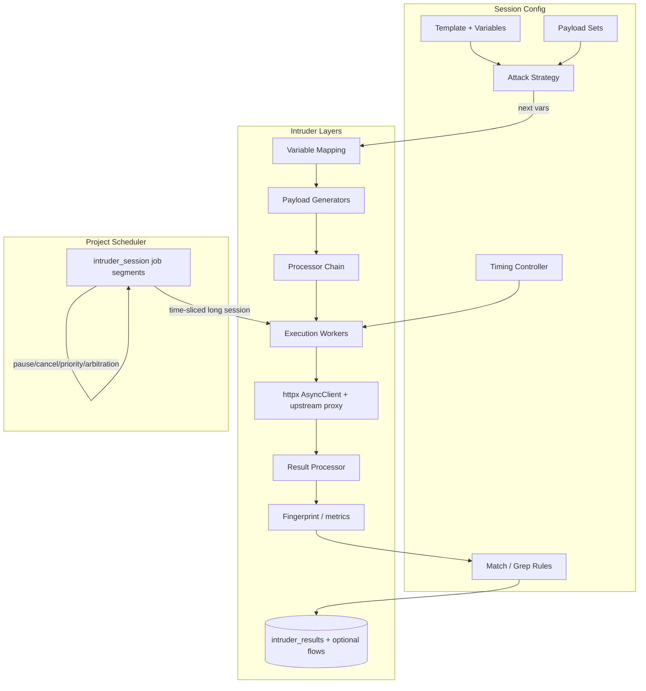
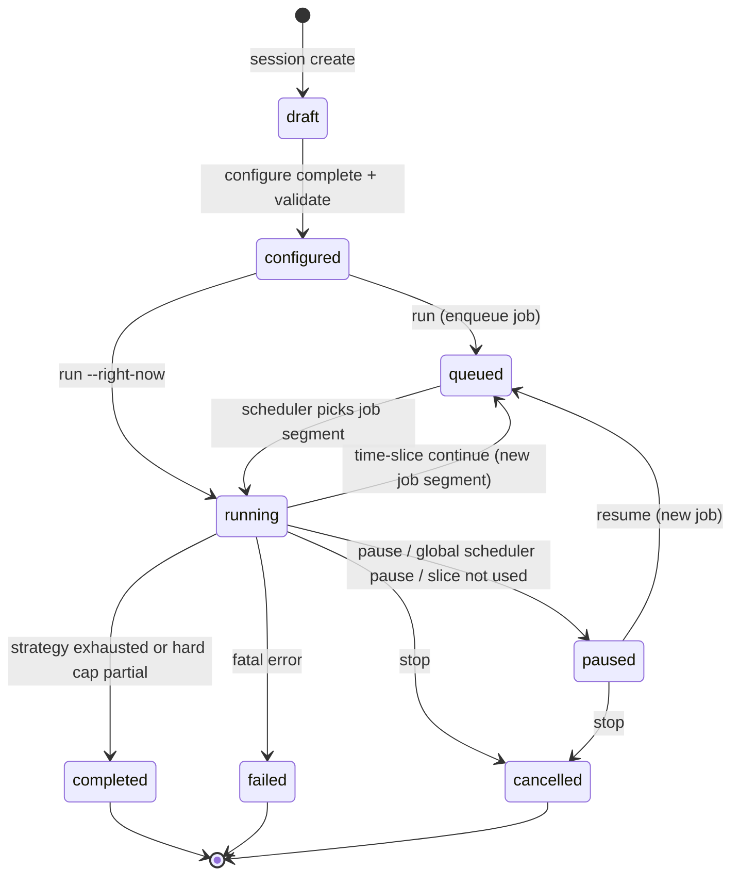

# Talos Intruder (CLI-first) — Design Document

| Field | Value |
|-------|-------|
| **Document title** | Talos Intruder — Multi-phase CLI Design |
| **Project** | Talos |
| **Author** | (design) |
| **Date** | 2026-07-29 |
| **Status** | Implemented Phase 1 (rev 3 design; schema 46) |
| **Scope** | Talos core CLI only; Control Panel / UI deferred |
| **Audience** | Senior engineers familiar with `talos/` |

---

## Overview

Talos needs a Burp-like **Intruder** that is **not** another independent request sender. Today outbound HTTP execution is split across two modes and several scheduler-backed engines:

| Path | Module | Scheduler? | Mutation | Volume model |
|------|--------|------------|----------|--------------|
| Exact Replay (Mode 1) | `talos/replay/engine.py` | Yes (`replay_*`) | None (identity-preserving) | One job → one flow row |
| BAC / Unauth (Mode 1 family) | `talos/projects/bac`, `unauth` | Yes (`bac_*`, `unauth_attack`) | Attack-specific variants | One job → one flow row |
| Input Validation | `talos/input_validation/` | Yes (`iv_*` job types) | Parameter inject via `surface.inject_value` | Planner waves; one job per probe |
| Send / Repeater (Mode 2) | `talos/send/engine.py` | **No** — immediate | Free edit | Caps: N≤50, concurrency≤10 |

Intruder is a **new high-volume mutation engine** alongside Mode 1 replay engines (replay / BAC / unauth / IV) and Mode 2 send. Operators and AI agents configure a **session** (template + payload sets + strategy + timing + match/grep). That session is executed as one or more **time-sliced** `intruder_session` scheduler jobs that share a single `session_id` and durable checkpoint. Micro rate control lives in the Intruder Timing Controller; the project Scheduler keeps queue ownership, pause/resume, cancellation, and resource arbitration.

This document defines layered architecture, process model, cancel/pause contracts, data model, CLI/AI contract, storage strategy, phased implementation, PR plan, and open questions — grounded in the current codebase (`SCHEMA_VERSION = 45`, `ReplayScheduler` single-threaded serial jobs, IV fingerprint/outcomes, send lineage).

---

## Background & Motivation

### Why not clone Burp Intruder

Burp Intruder conflates request editor, payload engine, attack engine, scheduler, rate limiter, and result viewer. That monologue is hard for humans to script and worse for AI agents. Talos already separated **capture** (proxy), **exact re-execution** (replay), **mutable one-offs** (send), and **parameter characterization** (IV). Intruder must continue that separation:

1. **Request** — exactly one HTTP baseline (capture, send execution, or AI-authored flow).
2. **Template** — named `{{variables}}` with location, type, encoding, semantic type.
3. **Payload Sets** — generators produce iterators; Intruder never knows *how* values are produced.
4. **Attack Strategy** — `next() → {variables}`; Sniper/Pitchfork/ClusterBomb as strategies, not gods.
5. **Execution Engine** — Request + Variables + Timing + Concurrency → Result. Nothing else.

### Current pain points

- **Send multi-send is not Intruder.** `send once --repeat N` / `--parallel N` are investigation tools with hard caps (50 / 10). No wordlists, no strategies, no match rules, no resume after process restart, no metrics table.
- **IV is not Intruder.** IV is parameter intelligence with a fixed probe taxonomy, not operator-defined payload cartesian products. Jobs are *per probe*; Intruder needs *per session* with thousands of attempts and micro-timing.
- **Scheduler is coarse.** `ReplayScheduler` (`talos/scheduler/scheduler.py`) runs **one job at a time**, then sleeps a randomized `[min_delay, max_delay]` from `scheduler_config` (defaults 2–6s). That model is correct for BAC/IV stealth but wrong as the *only* rate control for Intruder volume.
- **Docs explicitly exclude Intruder** from Send Phase 1/2 (`docs/updates.md`). This design is the next major feature after Repeater CLI completeness.

### Design constraints from existing Talos philosophy

From `docs/architecture.md`, `docs/how to code.instructions.md`, and live modules:

- **Centralized execution** for attack modules (IV/BAC/Unauth already go through scheduler).
- **Immutable captures** — never UPDATE baseline flows; new rows for executions.
- **Project-scoped SQLite** (`talos/projects/db.py` owns all DDL / migrations).
- **AI-friendly CLI** — `--format json`, stable UUIDs, non-interactive (`--force` policy via `talos.cli_output`), inspectable state.
- **Module docs** — purpose, dependencies, data flow, side effects on every module.
- **HTTP stack** — httpx async, 30s timeout, no redirects, project upstream proxy (`get_upstream_url`), annotation gates.

---

## Goals & Non-Goals

### Goals

1. Deliver a **CLI-first Intruder** as an execution engine integrated with the project scheduler (session-as-job, time-sliced segments).
2. Provide a **simple MVP** that is immediately useful (wordlist + numbers, single + sniper, fixed RPS, concurrency 1, results + pause/resume) while remaining **extensible** via generator/processor/strategy protocols.
3. Make every surface **machine-friendly** for human operators today and AI agents tomorrow (stable JSON schemas, exit codes, poll loop).
4. Reuse Talos primitives: `surface.inject_value`, `ResponseFingerprint` / `compare_fingerprints`, annotations, upstream proxy, flow lineage conventions, CLI output helpers.
5. Define a **storage strategy** that does not explode project DBs under 10k–100k+ attempts.
6. Ship via **independently valuable phases** and reviewable PRs (CLI only).
7. Make **scheduler coexistence honest in Phase 1** via mandatory time-slices + hard duration/attempt caps + pause that releases the worker.

### Non-Goals (this design / PR plan)

- Control Panel / UI for Intruder (see short Future note only).
- Becoming a general-purpose load tester (no distributed workers, no multi-host campaign orchestration).
- Full Burp feature parity in Phase 1 (no Pitchfork/ClusterBomb until later; no Python sandbox generators until later).
- Replacing Send, Replay, or Input Validation.
- Implementing every payload generator/processor listed in the vision.
- Token refresh / redirect following (remain global product gaps unless Intruder-specific later).
- Changing proxy capture semantics.
- **Findings auto-promotion** from Intruder matches (Phase 1: **no** findings bridge; optional later PR).
- **Live session_health / auth refresh** during Intruder (Phase 1: credentials frozen from baseline; consecutive auth-failure stop).

---

## Proposed Design

### Logical pipeline

Every stage is replaceable; Phase 1 implements concrete defaults for each.

```
Template → Strategy → Variable Mapping → Payload Generator → Payload Processor
  → Execution Scheduler (session workers) → HTTP Client → Result Processor
  → Match / Grep rules → metrics + optional flow storage
```



### Five layers (refined against codebase)

#### 1. Request (baseline)

Exactly one HTTP request, loaded from:

| Source | How | Notes |
|--------|-----|-------|
| `proxy_capture` flow | `talos intruder session create --from <flow_id>` | Immutable baseline |
| `manual_send` / `ai_send` flow | same | Allows “edit in Send, attack in Intruder” |
| Raw HTTP file | `--raw-file` (Phase 2+) | Materialize as synthetic parent flow or store template body only |

Baseline is **copied into session config** (method, URL, headers, body snapshot, `role_id`, `module_id`, `endpoint_id`, `project_id`) so later mutation of the parent flow does not change a running session. `original_flow_id` / `base_flow_id` retained for lineage.

#### 2. Template (`{{variables}}`)

**Syntax:** double-brace placeholders, not Burp `§positions§`.

```
GET /api/users/{{user_id}}/orders?q={{q}} HTTP/1.1
Host: api.example.com
Authorization: Bearer {{token}}
```

Each variable is a structured object:

```python
@dataclass
class TemplateVariable:
    name: str                    # "user_id"
    location: str                # path | query | body | header | cookie | raw
    path: str | None             # inject name / JSON field / form field
    original_value: str | None   # value at template creation
    encoding: str                # none | url | base64 | ...
    semantic_type: str           # from parameters table when known
    param_id: str | None         # link to parameters.id when derived from intel
    fixed_value: str | None      # if set, not driven by strategy
```

##### Template render algorithm (Phase 1 contract)

`surface.inject_value(location, name, value, url, headers, body, *, normalized_path="", semantic_type="", surface_kind="")` is **single-parameter** and path injection **requires `normalized_path`** for reliability.

**Algorithm `render_attempt(baseline, template, fixed_vars, strategy_vars) → AttemptSpec`:**

1. **Start from baseline snapshot** (not live DB row): `method`, `url`, `headers: dict[str,str]`, `body: bytes | None`, plus `normalized_path` loaded once at session create (from `endpoints.normalized_path` when `endpoint_id` known; else best-effort derive — see path gate below).
2. **Build binding map:**
   - Apply `fixed_value` for every variable that has one.
   - Overlay `strategy_vars` (wins over fixed only if the variable is strategy-bound; fixed-only vars must not appear in strategy sets).
   - Unbound non-fixed variables → validation error (never silent baseline leave-in for strategy-declared vars).
3. **Partition variables** into `location != raw` (named inject) vs `location == raw` (string replace).
4. **Named inject order** (deterministic; each call mutates url/headers/body):
   1. `path`
   2. `query`
   3. `header`
   4. `cookie`
   5. `body` (JSON/form/multipart/XML/GraphQL via existing surface detection)
   
   For each: `url, headers, body = inject_value(location, name=var.path or var.name, value=processed_payload, url, headers, body, normalized_path=..., semantic_type=var.semantic_type)`.
5. **Raw mode:** after named injects, for each raw variable perform literal replace of `{{name}}` in URL string, each header value, and body decoded as UTF-8 (fallback latin-1) — **all occurrences**. Encoding processors already applied to payload before replace.
6. **Content-Length:** always strip any `Content-Length` header after mutation; let httpx recompute (same as `replay.engine._execute_replay`). Exception only if a future processor `preserve_content_length` is explicitly set (not Phase 1).
7. **Auth artifacts:** unlike IV default skip, Intruder **allows** mutating Authorization / session cookies by default (operators often fuzz tokens). Optional `safety.skip_auth_artifacts: true` reuses IV-style skip lists for named injects only.
8. **Multi-var body:** sequential `inject_value` calls; later vars see already-mutated body. PR-2 tests must cover multiparam JSON, path segment + `normalized_path`, multi-occurrence raw `{{x}}...{{x}}`, and **negative** path inject without braces.

**Path inject gate (no silent no-op):** `inject_path_param` only rewrites when `normalized_path` contains a `{name}` brace placeholder matching the variable. A concrete path like `/users/42` alone will **not** inject.

At `session validate` / `run`:

- For every variable with `location=path` (and not fixed-only unused): resolve `normalized_path`. If it lacks `{var.path or var.name}` (brace form), **fail** with stable code **`path_inject_unavailable`** (EXIT_PRECONDITION).
- Operator fix: re-create from an endpoint-linked flow that has normalized braces, set `location=raw` and put `{{user_id}}` in the snapshot URL, or fix the template URL/`normalized_path` explicitly in config.
- Never “succeed” while leaving the path unchanged.

**Unification:** prefer named locations + `inject_value`; raw is the escape hatch for free-form positions that do not map to a single parameter name.

#### 3. Payload Sets

A payload set is `{ name, generator, processors[], options }`. Generators implement:

```python
from typing import Protocol, Iterator, Any

class PayloadGenerator(Protocol):
    """Produces an iterator of string payloads. Stateless between sessions after open()."""

    def open(self, config: dict[str, Any]) -> None: ...
    def __iter__(self) -> Iterator[str]: ...
    def estimate_count(self) -> int | None:
        """None if unbounded / unknown."""
        ...
    def checkpoint(self) -> dict[str, Any]:
        """Serializable cursor for resume."""
        ...
    def restore(self, checkpoint: dict[str, Any]) -> None: ...
```

#### 4. Attack Strategy

```python
class AttackStrategy(Protocol):
    """Maps payload set iterators → variable bindings per attempt."""

    def prepare(self, variables: list[str], payload_sets: dict[str, PayloadGenerator]) -> None: ...
    def next(self) -> dict[str, str] | None:
        """Return {var_name: payload} or None when exhausted."""
        ...
    def progress(self) -> dict[str, Any]:
        """sent, total_estimate, percent, generator cursors."""
        ...
    def checkpoint(self) -> dict[str, Any]: ...
    def restore(self, checkpoint: dict[str, Any]) -> None: ...
```

| Strategy | Behavior | Phase |
|----------|----------|-------|
| `single` | One payload set, one primary variable; one pass | **1** |
| `sniper` | One set applied to each variable in turn (others at baseline/fixed) | **1** |
| `pitchfork` | Parallel advance of N sets for N variables | **2** |
| `cluster_bomb` / `cartesian` | Cartesian product | **2** |
| `zip` | Pitchfork with length = min | **2** |
| `permutation` / `recursive` / `state_machine` | Later | **3–4** |

#### 5. Execution Engine

Receives fully rendered request + session timing/concurrency policy; returns a result record. Uses the **same HTTP constraints** as replay/send:

- **One long-lived `httpx.AsyncClient` per session segment** (connection pooling); `timeout=Timeout(timeout_s)` default 30s; `follow_redirects=False`
- Project upstream proxy via `get_upstream_url(db_path)`
- Strip captured `Content-Length` after render
- Annotation policy (see Security)

```python
@dataclass
class AttemptSpec:
    attempt_index: int
    variables: dict[str, str]
    method: str
    url: str
    headers: dict[str, str]
    body: bytes | None

@dataclass
class AttemptResult:
    attempt_index: int
    variables: dict[str, str]
    status_code: int | None
    success: bool
    failure_reason: str | None
    duration_ms: float | None
    metrics: dict[str, Any]
    flow_id: str | None
    match_tags: list[str]
    grepped: dict[str, list[str]]
```

### Module layout

```
talos/intruder/
  __init__.py
  models.py
  template.py          # parse {{var}}, validate, render algorithm
  generators/
  processors/
  strategies/
  timing.py
  engine.py            # session runner: strategy loop + workers + HTTP
  results.py
  match.py
  grep.py              # Phase 3+
  session.py           # state machine, checkpoint, control flags
  db.py                # CRUD only — no DDL
  cli.py
  config_schema.py     # load/validate config schema_version
```

**DDL ownership:** only `talos/projects/db.py` may create/alter tables.

---

### Session state machine



| Status | Meaning |
|--------|---------|
| `draft` | Baseline + partial config; not runnable |
| `configured` | Validated; ready to run |
| `queued` | Optional brief pre-claim state after `run`/`resume` before first pick-up; pollers may also see `running` as soon as `job_id` is set |
| `running` | Attack in progress — **includes** inter-segment gaps while a continuation job is pending (engine idle but session not paused) |
| `paused` | Operator/global cooperative pause; **no** active running job; checkpoint durable |
| `completed` | Strategy exhausted **or** hard cap hit (partial success — see `stopped_reason`) |
| `failed` | Fatal engine/config error |
| `cancelled` | Operator stop |

**Session ↔ job cardinality (Phase 1):** **1 session : N job segments** over the session lifetime. Each segment is one `scheduler_jobs` row with `job_type=intruder_session` and `meta.session_id`. Only one segment may be non-terminal (pending/running) at a time.

---

### Process model (Phase 1 contract) — **blocking for implementers**

This subsection is normative for PR-5/PR-6.

#### Where the engine runs

| Mode | Process | Thread | Notes |
|------|---------|--------|-------|
| Default `session run` | Scheduler runner process (`python -m talos.scheduler.runner` or proxy-started scheduler) | **`talos-scheduler` daemon thread** | Same pattern as BAC/IV: `_execute_intruder_job` → `asyncio.run(engine.run_session_segment(...))` |
| `--right-now` | **CLI process** | Main thread + asyncio | Does **not** enqueue a job; refuses if session already has pending/running job |

**Phase 1: no dedicated Intruder worker process.** Engine always runs inside the scheduler worker thread (or CLI for `--right-now`).

Verified constraint: `ReplayScheduler.stop()` sets `_stop_event` and **joins after the current job finishes**. Therefore the engine **must** cooperatively exit so proxy/scheduler shutdown is not blocked for hours.

#### Cooperative check set (every attempt boundary, and at least every 200 ms if concurrency > 1)

Before launching a new attempt, engine evaluates (in order):

1. **`intruder_sessions.control_flag`** ∈ {`null`, `pause`, `cancel`} (DB read; may be cached ≤200 ms).
2. **Cancel signal (Phase 1):** **`control_flag == cancel` only.** Running cancel never flips `scheduler_jobs.status` to `cancelled` mid-flight; settlement after the engine returns uses `mark_done(..., verdict="cancelled")` (see Cancel contract). Do not poll job status for cancel.
3. **Global scheduler state:** `scheduler_state` ∈ {`paused`, `waiting_for_session`} → treat as **cooperative pause** (same as `control_flag=pause`). Rationale: `talos scheduler pause` must not be a no-op during multi-hour Intruder.
4. **Stop callback / `_stop_event`:** scheduler passes a `should_stop: Callable[[], bool]` into the engine; true → cooperative **pause** (checkpoint + return), so `stop()` can join promptly. Policy: process teardown prefers **pause** (resumable) over cancel unless `control_flag` already `cancel`.
5. **Time-slice budget exhausted** → exit segment with `verdict=continue` (see Time-slice).
6. **Hard caps** (`max_attempts`, `max_duration_s` active time, `max_results`) → exit session `completed` with `stopped_reason`.

#### On scheduler process SIGTERM / `ReplayScheduler.stop()`

1. `should_stop()` becomes true.
2. Engine stops launching new attempts; **awaits in-flight** HTTP (concurrency usually 1) with existing request timeout.
3. Flushes result batch + checkpoint in one SQLite transaction.
4. Returns `SegmentOutcome(reason="process_stop")`.
5. `_execute_intruder_job` marks job **done** with `verdict=paused` (or `partial`), session status **`paused`**, clears `control_flag` if it was only implicit stop.
6. Thread can join; operator later `session resume`.

#### Global `talos scheduler pause` while Intruder segment running

- Engine observes `scheduler_state=paused` at next check → cooperative pause as above.
- Does **not** require the outer `_run` loop to see pause mid-job (it cannot today); Intruder brings the check inside the job.

#### `--right-now` exclusivity

- `run --right-now` **must refuse** (EXIT_PRECONDITION) if `session.job_id` points to pending/running job, or status is `queued`/`running`.
- Default `run` **must refuse** if status is `running` under `--right-now` elsewhere (detect via status + heartbeat `progress_json.updated_at` optional).
- `--right-now` never inserts `scheduler_jobs` rows; sets `job_id=NULL`, `execution_mode=foreground` in progress.
- On Ctrl-C: same as process_stop → session `paused` with checkpoint (not cancelled), unless `--cancel-on-interrupt` later.

---

### Timing Controller vs Scheduler (critical)

```mermaid
sequenceDiagram
  participant CLI as talos CLI
  participant SDB as scheduler_jobs
  participant Sched as ReplayScheduler
  participant Eng as Intruder Engine
  participant TC as TimingController
  participant HTTP as httpx

  CLI->>SDB: enqueue segment (meta.session_id)
  Sched->>SDB: get_next_pending
  Sched->>Eng: run_session_segment(session_id, job_id)
  Note over Sched: Job status=running<br/>No per-attempt coarse delay
  loop until slice/cap/pause/cancel/done
    Eng->>Eng: cooperative checks
    Eng->>TC: acquire
    TC-->>Eng: grant
    Eng->>HTTP: attempt
    HTTP-->>Eng: response
    Eng->>Eng: buffer result; batch flush
  end
  Eng-->>Sched: SegmentOutcome
  alt verdict=continue
    Sched->>SDB: mark_done verdict=continue
    Sched->>SDB: enqueue next segment priority=10 (AUTO)
    Note over Sched: Auto BAC/IV at prio 10 can run<br/>before next Intruder segment
  else paused/cancelled/completed
    Sched->>SDB: mark_done with verdict
  end
  Note over Sched: Coarse delay applies<br/>before next job (any type)
```

| Concern | Owner |
|---------|--------|
| Queue ownership, priorities, cancel API, persistence, arbitration | **Scheduler** |
| RPS, concurrency, jitter, token bucket (later) | **TimingController** |
| Per-request inter-job delay `[min_delay, max_delay]` | Scheduler — **between jobs only**, including between Intruder **segments** |

**Hard rule:** Intruder must **not** bypass the Scheduler for normal operation, but **does** bypass the scheduler’s per-request timing **within** a segment.

#### Time-slice (Phase 1 — mandatory fairness)

Session may monopolize the single worker only for a **slice**, then yields:

| Parameter | Phase 1 default | Meaning |
|-----------|-----------------|---------|
| `slice.max_attempts` | **100** | Max attempts per job segment |
| `slice.max_wall_s` | **60** | Max active wall seconds per segment (while engine is running) |
| Either limit hits first | — | Checkpoint; job `done` + `verdict=continue`; enqueue continuation (priority policy below) |

#### Continuation priority policy (normative — Phase 1 fairness)

Verified: `get_next_pending` uses `ORDER BY priority DESC, created_at ASC` (`talos/scheduler/db.py`).  
`PRIORITY_MANUAL = 100`, `PRIORITY_AUTO = 10` (`talos/scheduler/job.py`).

If every Intruder segment stayed at priority 100, auto BAC/IV (priority 10) would **never** run until the whole session finished (~100 segments for 10k attempts). Time-slice alone would not meet the Phase 1 fairness claim.

| Segment kind | Priority | When |
|--------------|----------|------|
| **First** segment of `session run` (operator/AI kickoff) | **`PRIORITY_MANUAL` (100)** | Immediate start over auto background work |
| **Continuation** segments (`verdict=continue` re-enqueue) | **`PRIORITY_AUTO` (10)** | Same tier as auto BAC/IV/auth_test; FIFO by `created_at` among priority 10 |
| **Resume** after pause (`session resume` → new job) | **`PRIORITY_MANUAL` (100)** | Operator-initiated; treated like a fresh kickoff |
| `--right-now` | n/a (no job) | — |

Optional later constant `PRIORITY_INTRUDER_CONTINUE = 10` may alias `PRIORITY_AUTO` for readability; Phase 1 **must** use value **10** for continuations (not a new mid-tier unless product adds one).

**Effects:**

- After each slice, any pending auto BAC/IV/replay job enqueued **before** the continuation (or FIFO-eligible) can run during the coarse post-job delay cycle.
- Other manual jobs (priority 100) still preempt the next Intruder **continuation** until drained — correct: operator work > background Intruder drain.
- A second Intruder session’s first segment (100) can jump ahead of another session’s continuations (10).

**PR-6 mandatory test:** enqueue Intruder session that will multi-slice; while first segment runs (or after it continues), enqueue `auth_test` or `bac_*` at `PRIORITY_AUTO`; assert the auto job executes **before** the next Intruder continuation segment completes (i.e. between segments under `ORDER BY priority DESC, created_at ASC`).

**Session remains one logical entity;** progress/checkpoint live on `intruder_sessions`, not on each job row.

---

### Pause semantics (STATUS_PAUSED collision — **Decision: option A**)

**Do not** set `scheduler_jobs.status = paused` for cooperative Intruder pause.

Today `STATUS_PAUSED` means **session-expiry suspension** for BAC; `resume_paused_jobs()` bulk-resumes all paused jobs after auth fix. Colliding would unintentionally requeue operator-paused Intruder sessions.

**Phase 1 contract (option A):**

| Event | Session status | Job row action | Resume |
|-------|----------------|----------------|--------|
| Operator `session pause` | `paused` | Current job → **`done`**, `verdict=paused` (or `partial`) | `session resume` enqueues **new** job at **PRIORITY_MANUAL**, same `session_id`, restores checkpoint |
| Global scheduler pause / process stop | `paused` | same | **Not** restored by `talos scheduler resume` — see below |
| Time-slice | stays **`running`** (normative) | job → **`done`**, `verdict=continue`; new job pending at **PRIORITY_AUTO** | automatic |
| Operator `session stop` | `cancelled` | job → **`done`**, `verdict=cancelled` | no auto-resume |
| Strategy exhausted / hard cap | `completed` | job → **`done`**, `verdict=completed` | n/a |

`session resume` never uses `resume_paused_jobs()`; it only enqueues a fresh job if `session.status == paused` and checkpoint valid.

##### Global scheduler resume does **not** resume Intruder (runbook)

After `talos scheduler pause` (or process stop) forces cooperative Intruder pause (option A), jobs are **not** left in `STATUS_PAUSED` — they are already `done` with `verdict=paused`. Therefore `talos scheduler resume` / `resume_paused_jobs()` **will not** restart Intruder sessions.

**Operator / AI rule:** after global pause+resume of the scheduler daemon queue, explicitly call:

```bash
talos intruder session resume <session_id>   # each paused session
# future: talos intruder session resume --all
```

**PR-6/7 implementation note:** `talos scheduler resume` **should warn** (stderr) when any `intruder_sessions.status = paused` exist for the project, listing session ids, so agents are not stranded.

---

### Cancel contract (Phase 1)

Verified: `talos scheduler cancel` today only accepts **pending/paused** jobs; running jobs error.

| Entry point | Behavior |
|-------------|----------|
| `talos intruder session stop <id>` | Set `control_flag=cancel`. If a job is **pending**, also cancel that job via existing cancel API. If **running**, engine observes **`control_flag` only**. |
| `talos scheduler cancel <job_id>` when `job_type=intruder_session` and status **running** | **Extended in PR-6:** set session `control_flag=cancel` (lookup `meta.session_id`); return success “cancel requested”. **Do not** write `scheduler_jobs.status=cancelled` while still running. Do not hard-kill the thread. |
| `talos scheduler cancel` pending Intruder job | Existing path (pending is cancellable today); clear session to non-running state with messaging |

**In-flight HTTP:** stop launching new attempts; **finish in-flight** requests (await with normal timeout). No httpx force-abort in Phase 1 (avoids torn TLS; concurrency default 1 makes this trivial).

**Terminal (after engine returns):** session `cancelled`; checkpoint retained; job **`mark_done(..., verdict="cancelled")`** only — Phase 1 does **not** require mid-flight or post-hoc `STATUS_CANCELLED` on the job row for running cancels. Pending cancels may still use existing `cancelled` status via the normal cancel API.

**Idempotency:** second `stop` while already `cancelled` → EXIT_OK no-op JSON `{ "status": "cancelled", "noop": true }`. `stop` while `completed` → EXIT_PRECONDITION.

**Risk severity:** cancel incompleteness is **High** for operability without this contract; mitigated by the above.

---

### Crash recovery & attempt_index (at-least-once)

```text
checkpoint_json fields (normative):
  attempt_index: int          # last successfully committed attempt
  strategy: {...}             # strategy.checkpoint()
  generators: {name: {...}}   # per-set cursors
  started_at_mono: ...
  segment_attempts: int
```

**Flush rule:** result rows for attempts `(prev_flushed+1)…K` and `checkpoint_json` with `attempt_index=K` and `progress_json` commit in **one SQLite transaction**.

**On restore** (new segment after crash / `reset_stale_running` → pending → run):

1. Load checkpoint; `next_index = checkpoint.attempt_index + 1` (if no checkpoint, `0`).
2. `strategy.restore` / generators restore.
3. First `next()` produces the next payload after the last committed attempt (generators must be cursor-correct).
4. Insert results with `INSERT OR IGNORE` / upsert on `UNIQUE(session_id, attempt_index)` — conflict → skip write, continue (idempotent).
5. **Semantics: at-least-once HTTP** — crash after HTTP success but before commit may **re-send** the same payload once. Acceptable for security testing; document it. Never skip ahead without commit.

**`reset_stale_running`:** existing helper requeues job pending. Session status should be repaired on segment start: if session `running` but no live engine, treat as resume-from-checkpoint (engine entrypoint normalizes session to `running` for the new segment).

**Mandatory tests (PR-5/6):** crash mid-batch → no unique violation; no permanent stuck `running` without job; duplicate attempt_index ignored.

---

### Concurrency & rate control

| Param | Meaning | Phase 1 default |
|-------|---------|-----------------|
| `mode` | unlimited \| fixed \| token_bucket \| … | `fixed` |
| `rps` | target requests/sec | `2.0` |
| `max_concurrency` | in-flight workers | **`1`** |
| `burst_size` | token bucket capacity | `1` |
| `jitter_ms` | random ± delay | `0` |
| `timeout_s` | per-request timeout | `30` |
| `retry` / `backoff` | optional | off |

Concurrency **2+ is opt-in** for Phase 1 (document stealth default 1). Example configs and CLI samples use `1` unless demonstrating override.

Implementation: `asyncio.Semaphore(max_concurrency)` + rate sleep before launch; **one** `httpx.AsyncClient` per segment with `limits=httpx.Limits(...)`.

---

### Hard safety caps (Phase 1 — decided, not open)

| Cap | Default | On hit | Override |
|-----|---------|--------|----------|
| `max_attempts` | **10_000** | Session `completed`, `stopped_reason=max_attempts` (partial OK) | config / CLI |
| `max_results` | **= max_attempts** (10_000) | Same as max_attempts if rows would exceed | config |
| `max_duration_s` | **3600** (**active** run time only — see below) | `stopped_reason=max_duration` | config / CLI |
| Wordlist file | **1_000_000 lines** or **64 MiB** | Refuse at configure/run without `--force` | `--force` |
| Confirm threshold | estimate **> 1_000** attempts | `confirm_or_exit` / require `--force` non-interactive | `--force` |
| Cartesian product (Phase 2) | estimate **> 1_000** | same confirmation | `--force` |
| `slice.max_attempts` | **100** | segment continue | config |
| `slice.max_wall_s` | **60** | segment continue | config |
| Consecutive auth failures | **20** status 401/403 in a row | Session `completed`, `stopped_reason=auth_failures` | config `auth_fail_threshold` |

Terminal status for cap hits is **`completed`** (not `failed`) with `progress_json.stopped_reason` set. Strategy natural exhaust → `stopped_reason=exhausted`.

`failed` reserved for: invalid config at runtime, unrecoverable DB errors, missing baseline, engine exceptions.

##### `max_duration_s` = **active** duration (not calendar wall from `started_at`)

Pause/resume and crash recovery must not burn the 1-hour budget while the session is idle.

| Clock | Counts toward `max_duration_s`? |
|-------|----------------------------------|
| Time inside `run_session_segment` (engine running, including in-flight HTTP waits) | **Yes** |
| Coarse scheduler delay between segments | **No** (session has no running engine; not “attacking”) |
| Session `status=paused` (operator, global pause, process stop, Ctrl-C on `--right-now`) | **No** — clock frozen |
| Inter-segment gap while continuation job is `pending` | **No** |

**Implementation:** maintain `progress_json.active_duration_s` (float seconds). Each segment adds `segment_wall_s` measured with monotonic clock from segment start to segment return. Cap check: `active_duration_s + elapsed_this_segment >= max_duration_s` → complete with `stopped_reason=max_duration`. Do **not** compute `now - started_at`.

`started_at` remains first-start timestamp for display only; `finished_at` is terminal time.

---

### Result metrics (reuse, don’t reinvent)

Prefer adapting IV’s `ResponseFingerprint` (`talos/input_validation/fingerprint.py`):

- status, content-type class, body_length, body_hash, header_hash, JSON schema sketch, redirect summary, error signature, duration_ms

Extend in `metrics_json`: words, lines, cookies set, reflection (payload substring), match tags.

### Match rules & Grep rules

**Phase 1 match (online):** `status`, `body_contains`, `regex`, `length_delta_gt` (vs baseline fingerprint), `time_gt_ms`.

**Grep / extract pools:** Phase 3.

Evaluation online for tags `interesting=1`; offline re-filter via `results list` filters without re-send.

### AI integration (design for; don’t implement all in v1)

| Hook | Phase |
|------|-------|
| Stable session IDs + JSON status/results + exit codes | **1** |
| Export JSONL | **1** |
| Template suggest from parameters | **3** |
| Adaptive timing / AI generator | **4+** |
| Findings bridge | **not Phase 1** |

### Interaction with HTTP Manipulation Engine

Today `HTTPManipulationEngine` runs in **mitmproxy** only — **not** on httpx replay/send/IV.

**Phase 1:** Do not apply HTTP rules to Intruder traffic (consistent with other engines).

### Flow insert side effects (when bodies stored)

When `store_interesting_bodies` / `sample_flows` / `all_flows` creates a `flows` row:

| Field | Value |
|-------|-------|
| `source` | `intruder` |
| `replay_reason` | `intruder` |
| `original_flow_id` | `base_flow_id` |
| `role_id` / `module_id` | **Copied from baseline** (NOT NULL FKs — required) |
| `endpoint_id` / `project_id` | From baseline / session |
| `flow_meta` | `{ generated_by, session_id, attempt_index, variables }` |

**Passive / error_intel (Phase 1 — required skip):** Interesting/sample/all_flows inserts must **not** feed error clusters or passive scan noise.

Verified risk: `replay_db.insert_replayed_flow` can invoke `_maybe_error_intel_on_replay` for scheduler-path inserts. PR-5 **must** do one of:

1. **(Preferred)** Dedicated insert helper for Intruder that does **not** call error_intel/passive hooks; or  
2. Pass an explicit skip into the existing hook when `source=intruder` (source filter).

Key Decision 25 is **required**, not optional. No open question.

**Scope:** if `safety.require_in_scope: true` (default **true**), at `session run` re-check baseline URL with existing scope helpers; out-of-scope → EXIT_PRECONDITION unless `--force`.

### Relationship to Send

Send remains the **interactive/mutable editor**. Intruder imports a flow as baseline. High volume is never Send’s job.

---

## API / Interface Changes

### Protocols (conceptual)

```python
class PayloadGenerator(Protocol):
    def open(self, config: dict) -> None: ...
    def __iter__(self) -> Iterator[str]: ...
    def estimate_count(self) -> int | None: ...
    def checkpoint(self) -> dict: ...
    def restore(self, checkpoint: dict) -> None: ...

class PayloadProcessor(Protocol):
    def process(self, value: str, context: dict) -> str: ...

class AttackStrategy(Protocol):
    def prepare(self, variables: list[str], sets: dict[str, PayloadGenerator]) -> None: ...
    def next(self) -> dict[str, str] | None: ...
    def progress(self) -> dict: ...
    def checkpoint(self) -> dict: ...
    def restore(self, checkpoint: dict) -> None: ...

class TimingController(Protocol):
    async def acquire(self) -> None: ...
    def note_response(self, result: AttemptResult) -> None: ...
    def update(self, config: dict) -> None: ...

class ResultProcessor(Protocol):
    def process(self, response, baseline_fp, variables: dict[str, str]) -> dict: ...

class MatchRule(Protocol):
    def evaluate(self, metrics: dict, baseline: dict | None) -> bool: ...
```

### Session config document (YAML/JSON)

Stored as `intruder_sessions.config_json`. **Config document `schema_version` is independent of project `SCHEMA_VERSION`.**

**Phase 1:** only `schema_version: 1` accepted; unknown/missing → validate error EXIT_USAGE/PRECONDITION.

```yaml
schema_version: 1
session:
  id: "…"
  name: "id-enum-orders"
  base_flow_id: "…"
  endpoint_id: "…"
  role_id: "…"
  module_id: "…"

template:
  method: GET
  url: "https://api.example.com/users/{{user_id}}/orders"
  headers:
    Authorization: "Bearer {{token}}"
    Accept: application/json
  body: null
  variables:
    - name: user_id
      location: path
      original_value: "42"
      semantic_type: integer
    - name: token
      location: header
      path: Authorization
      fixed_value: "eyJhbGciOi..."   # fixed auth — not payload-driven

payload_sets:
  user_id:
    generator: numbers
    options: { start: 1, end: 500, step: 1 }
    processors: []

strategy:
  type: sniper   # or single
  options: {}

timing:
  mode: fixed
  rps: 2
  max_concurrency: 1
  jitter_ms: 0
  timeout_s: 30

slice:
  max_attempts: 100
  max_wall_s: 60

storage:
  mode: metrics_only
  sample_rate: 0.0
  store_interesting_bodies: true
  max_body_bytes: 65536
  max_results: 10000

match: []
grep: []

safety:
  respect_logout: true
  respect_dangerous: true
  require_in_scope: true
  skip_auth_artifacts: false
  max_attempts: 10000
  max_duration_s: 3600
  auth_fail_threshold: 20
```

### Validation rules (`session validate` / `run` preconditions)

Reject with EXIT_PRECONDITION (and JSON error object when `--format json`) when:

| Rule | Error code (stable string) |
|------|----------------------------|
| No baseline / missing template method/url | `missing_baseline` |
| Zero variables and strategy needs vars | `no_variables` |
| Strategy `single`/`sniper` without payload set for required var | `unbound_variable` |
| Empty wordlist after open | `empty_generator` |
| Numbers `start > end` or `step == 0` | `invalid_numbers` |
| Sniper with zero injectable (non-fixed) variables | `sniper_no_targets` |
| Unknown generator/strategy/processor | `unknown_plugin` |
| Config `schema_version != 1` | `unsupported_config_version` |
| Wordlist over size without `--force` | `wordlist_too_large` |
| Estimate > 1000 without confirm/`--force` | `confirm_required` |
| Logout annotation | `endpoint_annotated_logout` |
| Dangerous without confirm/`--force` | `endpoint_annotated_dangerous` |
| Out of scope with `require_in_scope` | `out_of_scope` |
| Session already running/queued (conflict) | `session_busy` |
| `location=path` but `normalized_path` lacks `{name}` braces | `path_inject_unavailable` |

Processors may produce empty string — **allowed** (explicit empty payload). Generator that yields zero items is not.

### Scheduler job meta

```json
{
  "session_id": "<uuid>",
  "engine": "intruder",
  "schema_version": 1,
  "segment": 3
}
```

---

## Data Model Changes

All DDL in `talos/projects/db.py` (migration to `SCHEMA_VERSION` 46+).

### `intruder_sessions`

| Column | Intent |
|--------|--------|
| `id`, `project_id`, `name` | Identity |
| `status` | draft…cancelled |
| `base_flow_id`, `endpoint_id` | Baseline |
| `config_json` | Full config document |
| `checkpoint_json` | Strategy/generator cursors + attempt_index |
| `progress_json` | sent, matched, errors, rps_ema, **active_duration_s**, stopped_reason, updated_at, execution_mode, segment, continuation_priority |
| `job_id` | Current segment job id (nullable) |
| `control_flag` | null \| pause \| cancel |
| `created_at` / `updated_at` / `started_at` / `finished_at` | ISO-8601 |
| `failure_reason` | Fatal only |
| `schema_version` | Config schema (1) |

### `intruder_results`

| Column | Intent |
|--------|--------|
| `id`, `session_id`, `attempt_index` | UNIQUE(session_id, attempt_index) |
| `variables_json`, `status_code`, `success`, `failure_reason` | Attempt |
| `duration_ms`, `body_length`, `word_count`, `line_count`, `body_hash` | Metrics |
| `fingerprint_json`, `metrics_json` | Evidence |
| `interesting`, `match_tags_json`, `grepped_json` | Match/grep |
| `flow_id`, `created_at` | Optional body lineage |

### Wordlists

- Project-local `<project_data>/wordlists/` preferred.
- Absolute paths allowed; record path + size + mtime hash in config for reproducibility.
- Limits: 1e6 lines / 64 MiB without `--force`.

---

## CLI Surface

### Command tree

Top-level **`talos intruder`** (not under `attack`) — first-class engine peer of `send` / `input-validation`.

```text
talos intruder
├─ session  create|list|show|configure|validate|run|pause|resume|stop|status|delete
├─ template show|set-var|clear-var
├─ payload  set|list|clear
├─ strategy set
├─ timing   set
├─ match    add|list|clear
├─ results  list|show|export
└─ generators list
```

Aliases: `talos intruder run|status` → session run|status.

### Example (concurrency 1)

```bash
talos --project demo intruder session create --from <flow_id> --name enum-users
talos --project demo intruder template set-var $SID --name user_id --location path
talos --project demo intruder payload set $SID --var user_id --generator numbers --start 1 --end 200
talos --project demo intruder strategy set $SID --type single
talos --project demo intruder timing set $SID --mode fixed --rps 2 --concurrency 1
talos --project demo intruder match add $SID --status 200 --length-delta-gt 50
talos --project demo intruder session run $SID --format json
talos --project demo intruder session status $SID --format json
talos --project demo intruder results export $SID --out ./enum --jsonl
```

### `session run` semantics

| Flag | Behavior |
|------|----------|
| (default) | Validate → enqueue **first segment** job → `{session_id, job_id, status:"queued"}` |
| `--right-now` | Foreground engine in CLI; no job row; exclusive with queued/running |
| Already running/queued | EXIT_FAILURE `session_busy` unless `--force` which implies stop+requeue policy (document: `--force` cancels then restarts) |

---

## AI contract (Phase 1 frozen field names)

### Recommended agent poll loop

```text
POST/CLI: session run --format json  → job_id
loop every 2s:
  session status --format json
  until status in (completed, failed, cancelled, paused)
  # status stays "running" across time-slice gaps (pending continuation job_id)
results export --jsonl  or  results list --interesting --format json

# After talos scheduler pause/resume (global): Intruder does NOT auto-resume.
# For each paused session:
talos intruder session resume <session_id> --format json
```

No `--follow` required for MVP if `progress_json` is rich.

##### Inter-segment session status (normative for agents)

While a multi-segment attack is in progress (including coarse scheduler delay and pending continuation jobs):

| Field | Rule |
|-------|------|
| `status` | **`running`** until terminal (`completed`/`failed`/`cancelled`) or cooperative **`paused`** |
| `job_id` | Always points at the **current** pending or running segment job (updated when continuation is enqueued) |
| `progress.segment` | Monotonic segment counter (increments on each new segment) |
| `progress.active_duration_s` | Cumulative active attack time (excludes pause and inter-segment idle) |

Do **not** use `queued` for inter-slice gaps after the first kickoff. `queued` is only for the brief window after `session run` before the first segment is claimed, **or** resume-from-pause before the new job is picked up — implementers may collapse that to `running` as soon as a pending job exists; either is OK if documented in status JSON as `execution_mode` + non-null `job_id`. **Frozen rule for pollers:** treat `status=running` with changing `job_id`/`segment` as healthy progress, not failure or double-run.

### Exit codes (aligned with `cli_output.py`)

| Code | Constant | When |
|------|----------|------|
| 0 | EXIT_OK | Success; enqueue ack; stop noop; export OK; `--right-now` completed (including partial caps) |
| 1 | EXIT_FAILURE | Runtime engine failure; session_busy without force; export IO error |
| 2 | EXIT_USAGE | Bad args; unknown subcommand; missing `--force` when required in non-TTY |
| 3 | EXIT_PRECONDITION | No project; validate fail; logout; scope; right-now conflict |
| 130 | EXIT_CANCELLED | Interactive confirm declined |

**`--right-now` special:** exit 0 for `completed` (exhausted or cap); exit 0 for operator interrupt→paused (session paused); exit 1 for `failed`; exit 0 for clean `cancelled` via concurrent stop (rare).

### Confirmation matrix (CLI-015)

| Action | TTY | Non-interactive |
|--------|-----|-----------------|
| Dangerous endpoint run | confirm | `--force` |
| Estimate > 1000 | confirm | `--force` |
| Wordlist over limit | confirm | `--force` |
| `all_flows` storage | confirm | `--force` |
| `session delete` with results | confirm | `--force` |
| Logout endpoint | **hard deny** (no force override) | hard deny |

### Stable JSON schemas (sketches)

**`session run` enqueue ack:**

```json
{
  "session_id": "uuid",
  "job_id": "uuid",
  "status": "queued",
  "execution_mode": "scheduler",
  "estimate_attempts": 200,
  "slice": {"max_attempts": 100, "max_wall_s": 60}
}
```

**`session status`:**

```json
{
  "session_id": "uuid",
  "name": "enum-users",
  "status": "running",
  "job_id": "uuid-or-null",
  "execution_mode": "scheduler",
  "base_flow_id": "uuid",
  "progress": {
    "sent": 150,
    "matched": 3,
    "errors": 1,
    "attempt_index": 149,
    "estimate_total": 200,
    "percent": 75.0,
    "rps_ema": 1.9,
    "active_duration_s": 78.4,
    "stopped_reason": null,
    "updated_at": "2026-07-29T12:00:00Z",
    "segment": 2,
    "continuation_priority": 10
  },
  "control_flag": null,
  "timing": {"mode": "fixed", "rps": 2.0, "max_concurrency": 1},
  "started_at": "...",
  "finished_at": null
}
```

**`results list` item:**

```json
{
  "id": "uuid",
  "session_id": "uuid",
  "attempt_index": 42,
  "variables": {"user_id": "42"},
  "status_code": 200,
  "success": true,
  "failure_reason": null,
  "duration_ms": 85.2,
  "body_length": 1234,
  "body_hash": "abc…",
  "interesting": true,
  "match_tags": ["m1"],
  "flow_id": null,
  "created_at": "..."
}
```

Result UUIDs are stable for a given `(session_id, attempt_index)` insert; resume does not renumber. Re-export is idempotent (same rows).

**Errors:** human shape on stderr; with `--format json` on supporting commands, errors remain stderr text (existing CLI convention) — agents parse exit code + optional `status` poll. Config validation may print `{"error":"…","code":"empty_generator"}` on stderr as a single JSON object when `--format json` (Phase 1 recommendation for validate/run).

---

## Storage & Performance Strategy

### Policy

| Mode | Default? |
|------|----------|
| `metrics_only` (+ interesting bodies optional) | **Yes** |
| `sample_flows` / `all_flows` | Opt-in + confirm |

### SQLite write strategy (Phase 1)

| Rule | Detail |
|------|--------|
| Batching | Buffer results in memory; commit every **50 attempts** or **0.5 s**, whichever first |
| Single transaction | Each flush: INSERT results + UPDATE checkpoint_json + UPDATE progress_json |
| busy_timeout | All Intruder connections set `PRAGMA busy_timeout=5000` |
| Writer discipline | Prefer one connection per engine segment for writes; status CLI uses short-lived read connections (WAL) |
| Checkpoint frequency | Same as batch flush — **not** every attempt alone |
| Progress | In-memory between flushes; `status` may lag ≤0.5 s |

### Side effects of interesting flows

Inserting `source=intruder` flows must **not** invoke error_intel/passive hooks (required; see Flow insert side effects).

### Caps & estimates

| Volume | metrics_only ~1–2 KB/row |
|--------|--------------------------|
| 1k–10k | ~1–20 MB (within default max_results) |
| 100k | requires raising caps; indexes + WAL extra |

### Phase 1 prune

- `session delete --force` drops session + all results (+ optional orphan flows by session_id in flow_meta).
- No partial `results prune` required for MVP (document DB size in status: `results_count`, optional `db_bytes` later).

### Performance targets

| Metric | Target |
|--------|--------|
| Fixed 2 RPS, concurrency 1 | Sustain without scheduler crash |
| Status CLI | < 100 ms |
| Slice yield | ≤ 100 attempts or 60 s |

---

## Scheduler Integration Design

### New constants

```python
INTRUDER_SESSION = "intruder_session"
INTRUDER_JOB_TYPES = (INTRUDER_SESSION,)
# JOB_TYPES += INTRUDER_JOB_TYPES
```

### `_execute_intruder_job`

1. Parse `meta.session_id`, `meta.segment`.
2. Annotation pre-check on endpoint (logout → skip job; dangerous already gated at enqueue).
3. Normalize session to `running`; clear stale control if needed.
4. `asyncio.run(engine.run_session_segment(session_id, job_id, should_stop=...))`.
5. Map `SegmentOutcome`:
   - `continue` → `mark_done(verdict="continue")`; enqueue next segment at **`PRIORITY_AUTO` (10)**; session stays **`running`**; update `job_id`.
   - `paused` → `mark_done(verdict="paused")`; session `paused`.
   - `cancelled` → `mark_done(verdict="cancelled")`; session `cancelled`.
   - `completed` → `mark_done(verdict="completed")`; session `completed`.
   - `failed` → `mark_failed` or done+failed; session `failed`.
6. **Never** use `STATUS_PAUSED` on job rows for Intruder cooperative pause.
7. Coarse scheduler delay applies after segment returns; with continuation priority 10, auto BAC/IV can interleave.
8. First segment / operator resume enqueue at **`PRIORITY_MANUAL` (100)** (see Continuation priority policy).

#### Segment job history volume

A full 10k-attempt session at slice=100 creates ~**100** terminal `scheduler_jobs` rows (`verdict=continue|completed|…`). Active queue depth stays O(1) (one pending continuation). This history is intentional for audit; prune with existing `talos scheduler prune --status done` (optional later: filter by `job_type` / `verdict`). Not a `max_queue_size` problem.

### Extend cancel CLI

For `job_type=intruder_session` + `status=running`: request cancel via `control_flag` (see Cancel contract). Tests required.

### Resource arbitration

| Resource | Policy |
|----------|--------|
| Scheduler thread | One running job; slices requeue |
| HTTP | Session concurrency (default 1) |
| max_queue_size | Each segment is one job; only one pending segment per session |

---

## Phased Implementation Plan

### Phase 0 — Foundations

Schema + package skeleton + CLI help / empty list.

### Phase 1 — MVP Intruder (ship)

**In scope:**

- Template render algorithm + inject bridge + validation rules.
- Generators: wordlist, numbers, static; processors: url_encode, base64_encode.
- Strategies: **single + sniper** (both ship; sniper is core Intruder value for multi-position baselines — not deferred).
- Timing: fixed RPS, concurrency default 1, jitter optional.
- **Hard caps (active duration) + time-slice with continuation PRIORITY_AUTO + process model + cancel/pause option A + crash recovery.**
- Match: status, contains, regex, length_delta, time_gt.
- Storage metrics_only + interesting bodies; fingerprint reuse.
- Scheduler integration with segments; CLI full tree; `--right-now`; export JSONL/CSV.
- AI contract schemas; ignore/filter intruder flows for passive if needed.

**MVP size note:** Phase 1 is intentionally larger than “single strategy only” because pause/cancel/slice/caps are safety-critical and sniper is the primary operator model for multi-position templates. **Not** splitting MVP-A/B; acceptance is the full Phase 1 list with mandatory tests for process model.

**Out of scope:** Pitchfork/ClusterBomb, adaptive rate, grep pools, Python generators, param-intel auto, findings bridge, auth refresh, Control Panel, outbound HTTP engine.

**Exit criteria:**

- ID enum with numbers/wordlist via CLI enqueue path.
- Pause/resume across process restart without dup `attempt_index` failure.
- Global scheduler pause / stop cooperatively ends segment ≤ one in-flight timeout.
- Time-slice re-enqueues at **priority 10** so a pending auto BAC/IV/`auth_test` job runs between segments (PR-6 test mandatory).
- Caps enforced with **active** duration; JSON status pollable every 2s; status stays `running` across slices.

### Phase 2 — Multi-set strategies & storage modes

Pitchfork, cluster_bomb, zip; sample/all flows; session clone; host caps; more processors.

### Phase 3 — Grep, pools, param-intel

### Phase 4 — Adaptive timing, advanced generators, AI suggest

### Phase 5 — Hardening, optional findings promote, docs sweep

---

## Alternatives Considered

### A — Per-payload scheduler jobs (like IV)

**Rejected:** queue explosion vs `max_queue_size` default 200; coarse delay fights micro RPS.

### B — Fully bypass scheduler (like Send)

**Rejected** as primary path; breaks centralization. `--right-now` is escape hatch only.

### C — Always store full flow rows

**Rejected** as default; opt-in `all_flows`.

### D — Raw-only position markers

**Rejected** as sole model; hybrid structured + raw.

### E — Batched jobs of K attempts (hybrid)

Enqueue jobs that each run K attempts with internal TimingController, then complete.

| Pros | Cons |
|------|------|
| Natural scheduler fairness | Same end-state as time-slice segments |
| Fits mental model of “batch job” | Naming only — still need checkpoint on session |

**Disposition:** **Adopted as Phase 1 time-slice** (Key Decision: session logical, N job segments). Not a separate architecture — it **is** PR-6 segment design. Batches of K without shared session checkpoint would reintroduce resume bugs.

### F — Dedicated Intruder worker process; scheduler only monitors

| Pros | Cons |
|------|------|
| Proxy-embedded scheduler never blocked | Second daemon, dual rate authorities, harder ops |
| Clean SIGTERM surface | Diverges from IV/BAC process model |

**Deferred.** Phase 1 cooperative checks + slices make in-thread execution acceptable. Revisit if multi-hour slices still hurt proxy shutdown after slices land.

### G — Extend Send multi-send caps instead of new engine

| Pros | Cons |
|------|------|
| Less surface | Send is editor lineage; no strategies/match/resume/metrics table |
| | Caps philosophy (50) conflicts with Intruder volume |

**Rejected.** Product boundary: Send = mutable investigation; Intruder = high-volume attack engine.

---

## Security & Privacy Considerations

| Threat | Severity | Mitigation |
|--------|----------|------------|
| Logout mass-fire | High | Hard skip |
| Dangerous brute force | High | Confirm / `--force`; max_attempts; max_duration |
| Out-of-scope host | Medium | `require_in_scope` default true |
| Huge wordlists | Medium | 1e6 / 64 MiB + force |
| Python generator RCE | High | Not Phase 1 |
| Credential leakage in export | Medium | Interesting-only bodies; project-local DB |
| 401 flood / dead session | Medium | `auth_fail_threshold=20` stop |
| Cancel stuck session | High | Cancel contract + control_flag |

**Auth Phase 1:** credentials frozen from baseline snapshot. No `session_health.ensure_healthy`. On 20 consecutive 401/403 → complete with `stopped_reason=auth_failures`. Operator updates template headers and resumes/clones.

---

## Observability

- `progress_json` + `session status --format json`
- Scheduler job list shows segments with verdicts `continue|paused|completed|cancelled`
- Counters: sent, matched, errors, rps_ema, segment index
- Logging INFO on segment start/end reasons

---

## Rollout Plan

1. Schema + package (Phase 0).
2. Phase 1 MVP behind normal CLI (no feature flag).
3. Docs: architecture, cheat-sheet, updates.
4. Scheduler runner must be up for default run.
5. Rollback: stop sessions; unused tables inert.

---

## Key Decisions

| # | Decision | Rationale |
|---|----------|-----------|
| 1 | Scheduler-backed engine, not Send extension | Centralization; Send stays editor |
| 2 | **Logical session with N time-sliced job segments** (`verdict=continue`) | Micro-timing inside segment; fairness between segments; avoids per-payload queue blowup |
| 2b | **First segment / resume = PRIORITY_MANUAL (100); continuations = PRIORITY_AUTO (10)** | Real interleave with auto BAC/IV under `ORDER BY priority DESC`; verified against `get_next_pending` |
| 3 | TimingController owns micro rate; Scheduler owns queue | Coarse vs micro split |
| 4 | **Cooperative pause → job `done`+`verdict=paused`; session `paused`; resume = new job** (option A) | Avoids STATUS_PAUSED collision with session-health bulk resume |
| 5 | Default storage metrics-only | DB survival at volume |
| 6 | `{{var}}` + `inject_value` render algorithm (normative) | Reuse surface; deterministic multi-var order |
| 7 | Top-level `talos intruder` CLI | Peer of send/IV |
| 8 | Reuse ResponseFingerprint | One fingerprint system |
| 9 | No outbound HTTP rules Phase 1 | Parity with replay/send/IV |
| 10 | Default enqueue; `--right-now` exclusive secondary | One queue; no double-run |
| 11 | Phase 1 strategies: single + sniper | Core operator value |
| 12 | Python generators deferred | Safety |
| 13 | Control Panel deferred | Scope lock |
| 14 | DDL only in `projects/db.py` | Existing boundary |
| 15 | Credentials from baseline; no auth refresh Phase 1 | Simplicity; auth_fail_threshold stop |
| 16 | **Hard caps decided** (10k attempts, **3600s active** duration, wordlist 1e6/64MiB, confirm >1000) | Active time excludes pause/inter-segment idle; implementable day one |
| 17 | **Default max_concurrency = 1** | Stealth; reduce cancel/in-flight complexity |
| 18 | **No findings bridge in Phase 1** | Keep results table separate |
| 19 | **Time-slice in Phase 1** (100 attempts / 60s) + continuation priority 10 | Honest coexistence with auto BAC/IV |
| 20 | **Engine in scheduler thread** with cooperative stop | Matches existing daemon; no second process |
| 21 | **Cancel via control_flag only** while running; settle with `done`/`verdict=cancelled` | No mid-flight `STATUS_CANCELLED`; matches today’s cancel API limits |
| 22 | **At-least-once attempts**; checkpoint co-committed with results | Crash-safe unique indexes |
| 23 | **Global scheduler pause / WAITING_FOR_SESSION → cooperative Intruder pause** | Pause-all is not a no-op mid-segment |
| 24 | Config `schema_version` 1 only in Phase 1 | Clear evolution path |
| 25 | Passive/error_intel **must skip** `source=intruder` on insert (required Phase 1) | Avoid error cluster / passive noise; do not call unfiltered `insert_replayed_flow` hooks |
| 26 | Flow inserts copy role_id/module_id from baseline | NOT NULL FK integrity |
| 27 | **`max_duration_s` = active run time** (`progress_json.active_duration_s`) | Pause/resume must not burn the budget |
| 28 | Session **`running`** across inter-segment gaps | Stable AI poll contract |
| 29 | Global `scheduler resume` does **not** resume Intruder; need `session resume` | Option A job rows are already `done` |
| 30 | Path vars require brace `normalized_path` or fail `path_inject_unavailable` | No silent path no-op |

---

## Risks

| Risk | Severity | Mitigation |
|------|----------|------------|
| Long session starves scheduler | High | Time-slice + **continuation PRIORITY_AUTO** + pause yields + max active duration |
| DB growth `all_flows` | High | Default metrics_only; caps |
| Checkpoint bugs | Med | Co-commit; OR IGNORE; mandatory tests |
| inject_value gaps | Med | Raw fallback; PR-2 tests |
| Dangerous endpoints | High | Annotations + confirm + caps |
| Cancel mid-session | **High** (operability) | control_flag contract + CLI extend |
| STATUS_PAUSED collision | High if ignored | Option A — do not use job paused |
| Fingerprint SPA noise | Low | Prefer status/length matches |
| SQLITE_BUSY | Med | busy_timeout 5000; batched writer |
| Passive scan noise on interesting flows | Med | Skip source=intruder |
| Scope creep UI | Med | Non-goal |

---

## Open Questions

Resolved into Key Decisions where they blocked implementers: time-slice Phase 1 (#19), concurrency 1 (#17), findings no (#18), hard caps (#16).

**Still open (non-blocking):**

1. Exact UX copy for `stopped_reason` in human table output.
2. Whether `talos attack intruder` alias is desired for discoverability (top-level remains canonical).
3. Future: integrate `session_health` for multi-hour authenticated attacks (Phase 2+ design).
4. Future: outbound HTTP Manipulation Engine product-wide.
5. Multi-request sequences (login→attack) — Phase 4 state_machine scope.
6. Project wordlist directory auto-create on first use (lean yes).
7. Whether a dedicated `PRIORITY_INTRUDER_CONTINUE` mid-tier (e.g. 20) is ever needed vs plain `PRIORITY_AUTO` (10) — Phase 1 uses 10.

---

## Future: Control Panel

After CLI stabilizes: read-only session list/status, results table, “Send to Intruder” from Repeater — **mirroring CLI**. **No UI work in this PR plan.**

---

## Appendix: SegmentOutcome

```python
@dataclass
class SegmentOutcome:
    reason: str  # continue|paused|cancelled|completed|failed|process_stop
    attempts_this_segment: int
    session_status: str
    error: str | None = None
```

---

## References

| Resource | Path |
|----------|------|
| Architecture | `docs/architecture.md` |
| CLI conventions | `docs/cli-cheat-sheet.md`, `talos/cli_output.py` |
| Coding rules | `docs/how to code.instructions.md` |
| Updates (Intruder OOS) | `docs/updates.md` |
| Scheduler | `talos/scheduler/{scheduler,job,runner,db,cli}.py` |
| Replay / Send | `talos/replay/engine.py`, `talos/send/engine.py` |
| IV surface / fingerprint | `talos/input_validation/{surface,fingerprint}.py` |
| Schema | `talos/projects/db.py` |
| HTTP engine | `talos/configuration/http_engine.py` |
| Proxy addon | `talos/proxy/addon.py` |

---

## PR Plan

Ordered, independently reviewable. **CLI only.**

### PR-1: Schema + package skeleton

- **Title:** `intruder: schema and package skeleton (Phase 0)`
- **Components:** `talos/projects/db.py` (`intruder_sessions`, `intruder_results`, SCHEMA_VERSION + migration); `talos/intruder/{__init__,models,db}.py`; CLI help stub in `__main__.py`; migration tests.
- **Dependencies:** None
- **Description:** Durable storage + module boundary; note schema in architecture one-liner acceptable debt until PR-7 docs.

### PR-2: Template parse/render + inject bridge

- **Title:** `intruder: template render algorithm and surface inject bridge`
- **Components:** `template.py`; tests: multiparam JSON, path+`normalized_path`, multi-occurrence raw, Content-Length strip, fixed vs strategy vars, **`path_inject_unavailable` when no braces**.
- **Dependencies:** PR-1
- **Description:** Normative render algorithm; pure library.

### PR-3: Generators, processors, strategies (single+sniper)

- **Title:** `intruder: generators processors single+sniper strategies`
- **Components:** generators/processors/strategies; checkpoint unit tests; empty generator validation helpers.
- **Dependencies:** PR-1
- **Description:** Iterator contracts + validation rule helpers.

### PR-4: TimingController + metrics/match + caps constants

- **Title:** `intruder: timing, fingerprint metrics, match rules, hard-cap helpers`
- **Components:** `timing.py`, `results.py`, `match.py`; shared defaults module for caps/slice.
- **Dependencies:** PR-1
- **Description:** Offline-testable rate limit + match + cap evaluation.

### PR-5: Execution engine + SQLite batching + storage policy

- **Title:** `intruder: session engine HTTP, batch commits, caps enforcement`
- **Components:** `engine.py`, `session.py`; httpx client per segment; busy_timeout; batch flush; interesting flow insert with role/module copy **and required error_intel/passive skip**; auth_fail_threshold; hard caps including **active_duration_s**; crash/idempotent insert tests.
- **Dependencies:** PR-2, PR-3, PR-4
- **Description:** Runnable segment loop without scheduler; includes **hard safety caps** (not deferred to export PR). Must not call unfiltered `insert_replayed_flow` error_intel path.

### PR-6: Scheduler integration — segments, pause A, cancel, crash recovery

- **Title:** `intruder: intruder_session jobs, time-slice, pause/cancel contracts`
- **Components:** `job.py`, `scheduler.py`, `scheduler/cli.py` (running cancel → control_flag only; resume warning for paused Intruder sessions); segment enqueue (**first=100, continue=10**); option A pause; global scheduler_state watch; `should_stop`; tests: `reset_stale_running`+checkpoint, slice continue at priority 10, **auto job between segments**, pause releases worker, cancel flag, no STATUS_PAUSED for Intruder, active duration freezes across pause.
- **Dependencies:** PR-5
- **Description:** **1 session : N segments**; continuation priority policy; `verdict=continue|paused|cancelled|completed`.

### PR-7: CLI surface + AI JSON schemas

- **Title:** `intruder: CLI session/template/payload/strategy/timing/match/results`
- **Components:** `cli.py`; `__main__.py`; confirmation matrix; `--format json` schemas; docs cheat-sheet/architecture/updates.
- **Dependencies:** PR-5, PR-6
- **Description:** Full Phase 1 operator + agent path including run/pause/resume/stop/status/`--right-now`.

### PR-8: Export JSONL/CSV + status disk counters polish

- **Title:** `intruder: results export and status polish`
- **Components:** export handlers; results_count in status; wordlist path recording.
- **Dependencies:** PR-7
- **Description:** AI-friendly export. Caps already in PR-5 — this PR does not introduce safety.

### PR-9: Pitchfork / ClusterBomb / zip + flow storage modes

- **Title:** `intruder: multi-set strategies and flow storage modes (Phase 2)`
- **Dependencies:** PR-8
- **Description:** Cartesian with confirm >1000; sample/all flows.

### PR-10: Processor expansion + host concurrency caps

- **Dependencies:** PR-9

### PR-11: Grep rules + extracted pools + file generators

- **Title:** `intruder: grep pools and csv/json/uuid generators (Phase 3)`
- **Dependencies:** **PR-5 + PR-1 schema** (grep needs engine+results; may land after PR-8 for CLI). Prefer depend on **PR-8** for CLI glue; core extract table can migrate in this PR.
- **Description:** Chaining foundations.

### PR-12: Parameter intelligence template assist

- **Title:** `intruder: template auto from parameters + example_values generator`
- **Dependencies:** **PR-8** (stable CLI) — unambiguous.
- **Description:** Connect Parameter Intelligence to setup.

### PR-13: Adaptive timing + advanced generators

- **Dependencies:** PR-10

### PR-14: (removed / absorbed)

- **Former time-slice PR** — **absorbed into PR-6**. If further fairness work is needed (priority aging, dual lanes), open a new PR after Phase 1 ship metrics.

### PR-15: Docs sweep + optional findings promote

- **Dependencies:** Phase 1 shipped (PR-8+)
- **Description:** Still no Control Panel. Findings promote optional and off by default.

---

*End of design document (rev 3).*
