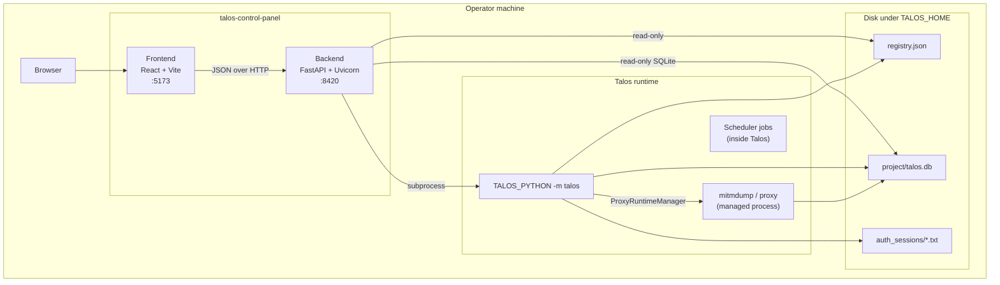
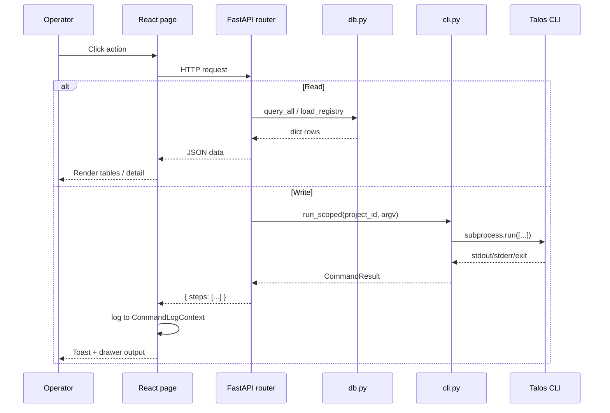
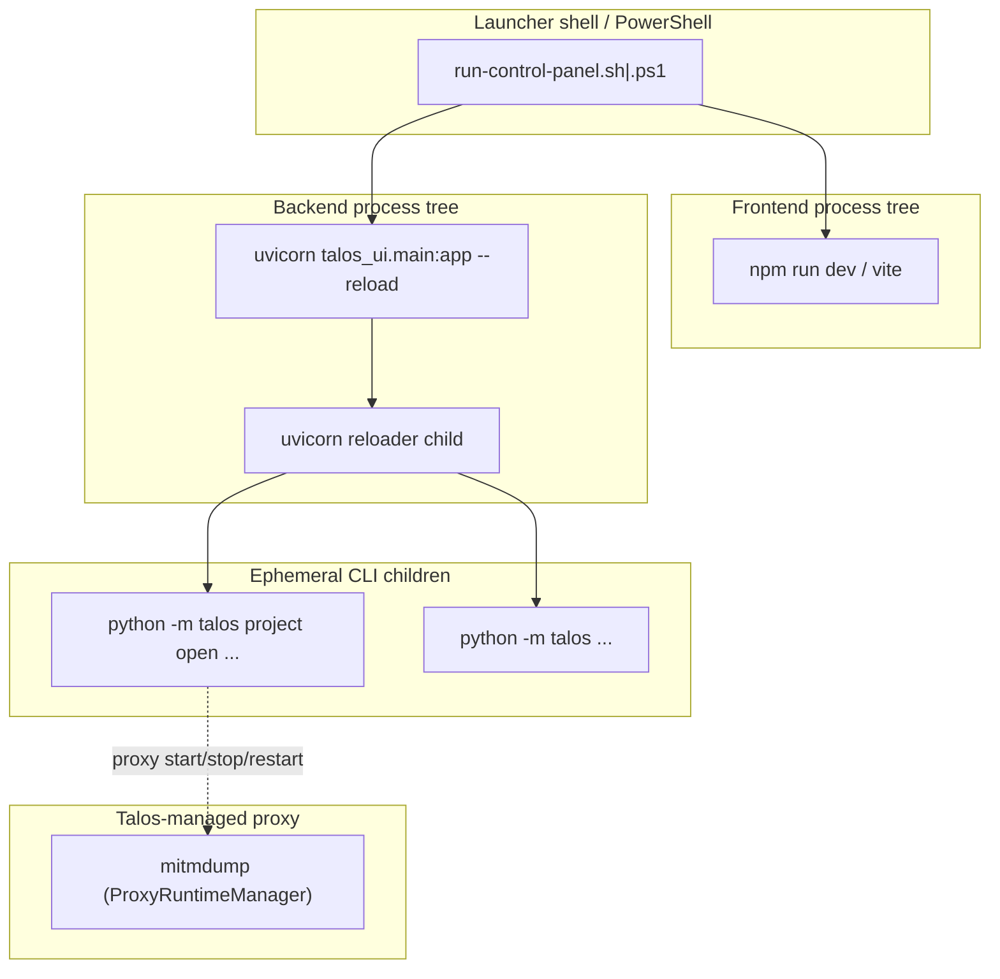

# Architecture

This document describes the Control Panel system architecture as implemented.

---

## Overall architecture

The Control Panel is a **two-process local web application** that sits beside the Talos CLI:

| Process | Role |
|---------|------|
| **Frontend** | Vite-served React SPA (dev) or static assets (production build) |
| **Backend** | FastAPI app (`talos_ui.main:app`) under Uvicorn |
| **Talos CLI** | Separate Python process(es) invoked by the backend via subprocess |

Talos core business logic remains in the `talos` package. The Control Panel is intentionally a **thin UI + orchestration layer**.



---

## Backend / frontend relationship

### Frontend responsibilities

- Present pages for Talos domains (projects, proxy, endpoints, flows, attacks, findings, etc.)
- Hold UI-only state (selected project in `localStorage`, filters, form fields, command log drawer)
- Call the backend via `src/api/client.ts` (`fetch` + JSON)
- Surface CLI results through `CommandLogContext` (drawer + toasts)

The frontend never opens SQLite or runs CLI commands directly.

### Backend responsibilities

- Expose REST-ish JSON routes under `/api/*`
- Resolve project data paths from registry + `config.project_db_path`
- Read project state for listings and detail views
- Translate mutation requests into Talos CLI argv lists
- Invoke Talos proxy CLI for operator start/stop/restart; observe core runtime status
- Optionally track Console background processes via ProcessManager (not proxy lifecycle)
- Local OS UI helpers (e.g. open project directory via `platform_open`) without mutating Talos state

### Coupling points

| Mechanism | Detail |
|-----------|--------|
| `VITE_API_BASE` | Frontend base URL for API (default `http://127.0.0.1:8420`) |
| CORS | Backend allows Vite origins `localhost/127.0.0.1` ports `5173` and `4173` |
| Shared project identity | Frontend passes `project_id` query param on most domain calls |
| Command result shape | `{ steps: CommandResult[] }` for most mutations |

There is **no WebSocket** layer. Polling is used for proxy status/logs (2s on Proxy page; 3s shared header status) and scheduler jobs (4s).

---

## Communication flow



---

## Interaction with Talos

### Primary integration: CLI subprocess

Implemented in `talos_ui/cli.py`:

- Always invokes: `[TALOS_PYTHON, "-m", "talos", *args]`
- Working directory: `TALOS_ROOT` (monorepo root)
- Environment: process env with Talos venv `bin`/`Scripts` prepended to `PATH`

### Secondary integration: filesystem reads

Implemented in `talos_ui/db.py` + `talos_ui/config.py`:

- `TALOS_HOME/projects/registry.json` for project list / active project
- `TALOS_HOME/projects/<id>/talos.db` (or record `data_dir`) for domain data
- Auth session files under `<data_dir>/auth_sessions/<role_id>.txt` for manual session editing UI

### Tertiary integration: proxy control surface

Proxy lifecycle is owned by Talos core (`ProxyRuntimeManager`, generation reconcile, `notify_proxy_config_changed`). The Control Panel:

- Runs short-lived `talos proxy start|stop|restart|status|config` via `cli.run()`
- Polls status from `talos proxy status --format json` (states: stopped / starting / running / draining / stopping)
- Tails `TALOS_HOME/runtime/proxy.log` for the Proxy page
- Does **not** restart the proxy after project/role/module/mutation/auth UI actions

### What the Control Panel does **not** do

- Import and call Talos Python APIs for mutations
- Open SQLite for writes (connections use `mode=ro`)
- Own proxy lifecycle rules or a hardcoded “restart after these actions” list
- Talk to mitmproxy except via the Talos proxy CLI / core runtime
- Accept arbitrary filesystem paths from the browser to open or read

---

## Process boundaries



| Boundary | Meaning |
|----------|---------|
| Frontend ↔ Backend | HTTP only; different ports |
| Backend ↔ Talos package | Separate interpreter (`TALOS_PYTHON` vs Control Panel venv Python) |
| Backend ↔ Proxy | Via CLI only; core owns mitmdump lifecycle and `proxy.json` |
| Control Panel ↔ Operator browser | Loopback only |

**Implication:** The proxy survives Control Panel backend restarts because lifecycle state lives under `TALOS_HOME/runtime/` in Talos core, not in the Control Panel process table.

---

## Lifecycle

### Application lifecycle

1. **Cold start** — launcher creates/validates venvs and node_modules
2. **Run** — frontend + backend serve; browser opens when frontend responds
3. **Operate** — UI selects project; reads DB; runs CLI commands
4. **Shutdown** — launcher trap / Windows cleanup stops frontend + backend trees

### Request lifecycle

See [command-execution.md](./command-execution.md) for the mutation path and [backend.md](./backend.md) for router structure.

### Project selection lifecycle

1. `ProjectProvider` loads `/api/projects` on mount
2. Selected id stored in `localStorage` key `talos-cp-selected-project`
3. Fallback order if stored id missing: Talos active project → first project → null
4. Most pages gate on `selected` and pass `project_id` as query param
5. **UI selection ≠ Talos active project** until the operator (or create flow) calls Open (`talos project open`)

### Proxy lifecycle (Talos-owned)

1. Operator Start/Stop/Restart → `cli.run(["proxy", …])` → `ProxyRuntimeManager`
2. Status/logs polled from Talos runtime (`proxy status --format json`, `proxy.log`)
3. Config-driven auto-restart is decided and executed only inside Talos core (notify + reconcile)
4. Header shows transitional labels (Starting / Stopping / Running / Stopped / Failed)

---

## Major components

### Backend package `talos_ui`

| Module | Responsibility |
|--------|----------------|
| `main.py` | Create FastAPI app, CORS, include routers, `/api/health` |
| `config.py` | Env-driven paths/ports; project path helpers |
| `cli.py` | Subprocess runners (+ optional `ProcessManager` for Console) |
| `db.py` | Registry load + read-only SQLite helpers |
| `command_tree.py` | Declarative CLI command catalog for Console |
| `routers/*` | Domain HTTP surface |

### Frontend

| Area | Responsibility |
|------|----------------|
| `App.tsx` | Provider nesting + route table |
| `components/Layout.tsx` | Sidebar nav + header status chips |
| `state/*` | Project, command log, status contexts |
| `hooks/useAction.ts` | Mutation helper wiring CLI steps into log |
| `api/client.ts` | HTTP client + `ProxyRuntimeStatus` helpers |
| `pages/*` | One primary screen per nav item (+ detail routes) |

### Launch scripts

| File | Platform |
|------|----------|
| `scripts/run-control-panel.sh` | Linux / macOS |
| `scripts/run-control-panel.ps1` | Windows |

---

## Security posture (as designed)

From the implementation and README:

- Bound to **127.0.0.1** only
- **No auth** on API or UI
- CLI always invoked with **list argv**, never `shell=True`
- Console raw mode still uses list argv but **no argument validation**
- Intended for a single trusted local operator

---

## Relationship to the monorepo

```text
TALOS_ROOT (monorepo)
├── talos/                 # business logic + CLI (single write truth)
├── talos-control-panel/   # this UI
├── scripts/               # launchers
└── docs/control-panel/    # this documentation
```

`config.py` defaults `TALOS_ROOT` to three parents above `talos_ui/config.py` (monorepo root). That assumption is what makes monorepo layout work without env vars.
