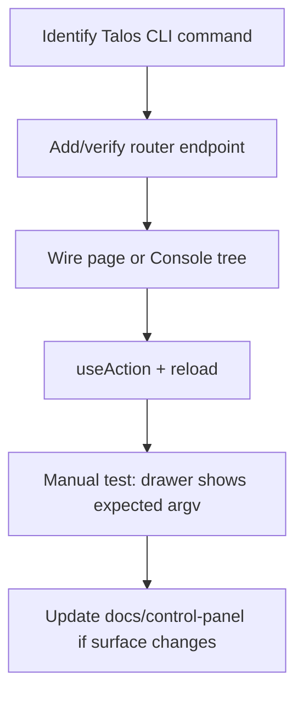

# Developer guide

How to extend the Control Panel while matching current conventions. This describes the patterns already used in the codebase—not a redesign proposal.

---

## Mental model

1. **Reads** → `db.py` + SQL in a router  
2. **Writes** → argv list via `cli.run` / `run_scoped` (or ProcessManager for long-lived processes)  
3. **UI** → page under `src/pages`, route in `App.tsx`, nav entry in `Layout.tsx` if top-level  
4. **Feedback** → `useAction` → command log drawer  
5. **OS UI only** (open directory) → `platform_open.open_directory` after server-side path resolve; never accept browser-supplied paths  

Do not write to `talos.db` from Python in the Control Panel.

---

## Adding a new page

1. Create `frontend/src/pages/YourPage.tsx`
2. Use `useProject()` and show `NoProjectNotice` when no selection (if project-scoped).
   For scope/outscope, never implement URL matching in the UI — only call CLI-backed APIs
   (add / bulk text / multipart import). One prefix per line; do not split on commas.
3. Load data with `useEffect` + `api.get`
4. Mutations with `useAction("Label", () => api.post(..., { project_id: selected!.id }))`
5. Register route in `App.tsx` inside the `Layout` parent
6. Add nav item to `NAV_GROUPS` in `Layout.tsx` if it should appear in the sidebar
7. Prefer existing components: `DataTable`, `Section`, `StatusBadge`, `UuidChip`, `Modal`, `ConfirmButton`

Detail pages typically use `useParams()` and optional adjacent navigation.

---

## Adding a new backend endpoint

1. Open or create a router under `talos_ui/routers/`
2. Define `APIRouter(prefix="/api/...", tags=[...])`
3. For reads:
   - Accept `project_id: str` query param when project-scoped
   - Resolve `db_path` via `config.project_db_path` + `db.get_project_record`
   - Use `db.query_all` / `query_one` / `scalar`
4. For writes:
   - Define a Pydantic `BaseModel` for the body when needed
   - Call `cli.run_scoped(project_id, ["talos", "sub", "args"...])`  
     (args are **without** the `talos` binary—`cli` prepends `python -m talos`)
   - Return `{"steps": [r.to_dict() for r in results]}`
5. Include the router in `main.py` if new
6. Consume from the frontend via `api.get` / `api.post` / `api.del`

Return `HTTPException(404)` only when a specific resource is required and missing; prefer empty lists for missing DBs on list endpoints (existing style).

---

## Adding a CLI command (to Console)

Talos CLI commands already exist in the `talos` package. To expose one in the Console:

1. Edit `talos_ui/command_tree.py`
2. Add a `cmd(...)` entry under the appropriate group (or new group dict)
3. Declare `arg(...)` fields with correct `kind`, `flag`, `required`, `options`
4. Set `background=True` only for long-running processes that should use ProcessManager

No frontend change is required for modeled Console commands—the tree is loaded dynamically from `GET /api/console/tree`.

For a **dedicated page**, also add a router endpoint and UI that construct the same argv the CLI expects.

If the Talos CLI gains a new subcommand, Console raw mode can call it immediately; modeled tree entries must be added manually.

---

## Adding a router

1. Create `talos_ui/routers/your_domain.py`
2. Export `router = APIRouter(prefix="/api/your-domain", tags=["your-domain"])`
3. Import and append to the tuple in `main.py` `include_router` loop
4. Keep domain boundaries aligned with Talos CLI groups when possible

Empty `routers/__init__.py` is fine; imports are explicit in `main.py`.

---

## Adding a component

1. Place shared UI in `frontend/src/components/`
2. Keep presentational when possible; data fetching stays in pages
3. Reuse DaisyUI classes and existing utilities (`.panel`, `.mono`, `.table-tight`, `.table-boxed`)
4. For tables of rows with sorting/column prefs/resize, extend `DataTable` rather than inventing a new table
5. For resolved filesystem paths, reuse `PathField` (copy + open-directory pattern)

---

## Opening a project directory (OS integration)

Do **not** add a generic endpoint such as `POST /api/open-path { "path": "..." }`.

Pattern already used by Projects:

1. Backend: strict enum target (`data_dir` | `database_dir`)
2. Resolve with `config.project_data_dir` / `project_db_path` + registry record
3. Call `platform_open.open_directory(resolved_path)`
4. Frontend: send project id + target only; copy path is pure clipboard

Helper module: `talos_ui/platform_open.py` (Linux `xdg-open`, Windows `os.startfile`, argv list / no shell).

---

## Adding a shared hook

1. Place under `frontend/src/hooks/`
2. Follow `useAction` style: thin wrappers around contexts/API
3. Contexts belong in `state/` when they provide app-wide providers

Do not put domain business logic in hooks that duplicates Talos rules—keep orchestration thin.

---

## Adding configuration

| Kind | Where |
|------|-------|
| Backend path/port/env | `talos_ui/config.py` + document in configuration.md |
| Frontend API base | `VITE_API_BASE` / `.env.example` |
| Launcher ports/paths | `scripts/run-control-panel.sh` and `.ps1` (keep in sync) |
| CORS origin | `config.CORS_ORIGINS` (code change required today) |
| CLI timeout | `TALOS_CP_CLI_TIMEOUT` already supported |

Defaults should keep monorepo layout working without env vars.

---

## Coding conventions (observed)

### Backend

| Convention | Evidence |
|------------|----------|
| Domain routers, thin helpers | `routers/*.py` + `cli`/`db`/`config` |
| Mutations return `steps` | Nearly all write handlers |
| Project scope via query param | `project_id: str` on handlers |
| Pydantic models colocated | `class XBody(BaseModel)` in same file |
| No service layer package | Logic in routers |
| List argv only | `cli.py` |
| Read-only SQLite | `mode=ro` URI |
| Defensive empty results | `query_*` if DB missing |
| Inline SQL strings | f-strings with bound params for values |
| Comments explain non-obvious architecture | module docstrings on cli/db/config |

### Frontend

| Convention | Evidence |
|------------|----------|
| Function components + hooks | All pages |
| TypeScript interfaces in `types.ts` for shared entities | Shared models |
| Local `useState` for page data | No global query cache |
| `useAction` for CLI mutations | Most write buttons |
| DaisyUI + Tailwind utility classes | All pages |
| Dense operator UX | `table-tight`, mono UUIDs, IST times |
| Restart proxy after capture-relevant state changes | Projects, roles, modules, auth names, mutations |
| Confirm destructive actions | `ConfirmButton` |
| No auth tokens on API | Local operator tool |

### Naming

- Python: snake_case modules and functions; FastAPI path params snake_case where used
- TS: PascalCase components; camelCase hooks/vars
- API paths: kebab-case multi-word (`/input-validation`, `/auth-config`)
- CLI argv: Talos’s own kebab-case subcommands (`auth-config`, `input-validation`)

### Proxy lifecycle (do not reintroduce)

Do **not** call proxy restart from pages after mutations. Talos core owns restart/reload rules via `notify_proxy_config_changed` and project open/close reconcile. The UI should only:

- Offer explicit Start / Stop / Restart on the Proxy page (CLI-backed)
- Poll `/api/proxy/status` so automatic transitions appear in the header

### Editor / file content CLIs

Prefer existing helpers:

- `run_scoped_with_temp_file` for filename arguments
- `run_with_editor_content` for `$EDITOR` flows

---

## Suggested workflow for a new feature

1. Run the CLI by hand under the Talos venv  
2. Mirror argv in a router  
3. Build the UI form  
4. Confirm command drawer output matches the hand-run command  
5. Update `docs/control-panel/routing.md` and `pages.md` when the surface changes  

---

## Testing

There is **no dedicated automated test suite** for the Control Panel in this repository as of this documentation. Talos core tests live under monorepo `tests/`.

Manual verification checklist for changes:

- Launcher starts both servers  
- `/api/health` OK  
- Read endpoint returns expected rows for a known project  
- Mutation appears in command drawer with `ok: true`  
- Talos state visible via CLI or re-read API  

---

## Files to touch (cheat sheet)

| Goal | Files |
|------|-------|
| New top-level page | `pages/*.tsx`, `App.tsx`, `Layout.tsx` |
| New API domain | `routers/*.py`, `main.py`, frontend `api` calls |
| Console only | `command_tree.py` |
| Shared types | `frontend/src/types.ts` |
| CLI execution behaviour | `cli.py` |
| Path/env defaults | `config.py`, launchers |
| Docs | `docs/control-panel/*` |

---

## What not to do (current architecture)

- Import Talos packages into the Control Panel backend to perform writes  
- Open SQLite without `mode=ro` for application features  
- Use `shell=True` or string interpolation into a shell command line  
- Assume UI-selected project is Talos-active without `project open`  
- Rely on ProcessManager state surviving a backend process restart  
- Block the HTTP worker on multi-minute CLI without considering timeout  

---

## Further reading

| Doc | When |
|-----|------|
| [architecture.md](./architecture.md) | System boundaries |
| [cli-integration.md](./cli-integration.md) | Subprocess details |
| [routing.md](./routing.md) | Existing API surface |
| [pages.md](./pages.md) | Existing UI surface |
| [command-execution.md](./command-execution.md) | Full request lifecycle |
| [troubleshooting.md](./troubleshooting.md) | Failure diagnosis |
