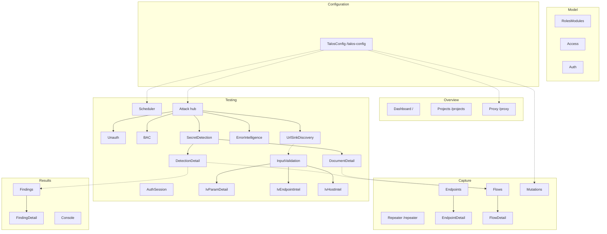

# UI pages

Inventory of every React page under `frontend/src/pages/`. Routes are declared in `App.tsx`; nav groups in `Layout.tsx`.

---

## Dashboard (`/`)

**File:** `Dashboard.tsx` (+ `pages/dashboard/*`)

| Aspect | Detail |
|--------|--------|
| **Purpose** | Mission-control snapshot for the selected project: readiness, findings triage, scheduler pipeline, proxy capture plane, session health, endpoint surface + coverage, flow intelligence, HTTP rules + Talos config posture |
| **Backend** | `GET /api/projects/{id}/dashboard` (aggregate; polls ~5s while visible). Legacy `GET …/summary` remains for header/Projects strip |
| **CLI** | Indirect via dashboard assembly (proxy status, `config effective`, `config http list`) — no mutations |
| **DB** | Aggregates on findings/status/attack_type, scheduler jobs/config/state, flows source/status/hosts, roles session health, outscope count; endpoint inventory/policy/coverage via `endpoint_reads` |
| **Components** | Hero strip (readiness chips + onboarding checklist), Findings / Scheduler / Proxy / Session panels, Endpoints + Flows charts, HTTP rules + Talos config posture, Activity rail; `recharts` mini donuts/bars |
| **Workflow** | Select project → scan readiness + triage queue + pipeline pressure → click panel headers into owning pages |

Design rules: decision-first metrics for testers; does not re-own header lifecycle pills as sole content (depth + distributions instead); graceful empty/no-DB onboarding checklist.

---

## Projects (`/projects`)

**File:** `Projects.tsx`

Operator **project workspace** (first full module redesign after the application shell). Not only a project list — lifecycle, identity, Basic Scope (in / out of scope), capture constraints, and live summary counts.

| Aspect | Detail |
|--------|--------|
| **Purpose** | Full project management: select/filter projects; create/open/close; rename; description; in-scope / out-of-scope prefixes; constraints; delete/purge; workspace summary; copy/open project paths |
| **Backend** | `GET /api/projects` (via context); `GET …/{id}/summary`; `GET …/{id}/outscope`; `POST /api/projects`; `POST …/open`; `POST /close`; `POST …/rename`; `POST …/description`; `POST …/scope/add`, `DELETE …/scope/entry`, `POST …/scope/bulk`, `POST …/scope/import`; `POST …/constraints`; `POST …/open-directory`; `POST/DELETE …/outscope`, bulk/import; `DELETE …/{id}?force&purge` |
| **CLI** | `project create`, `open`, `close`, `delete [--purge] [--force]`, `rename`, `description`, `scope add\|remove\|list\|clear\|import`, `constraints`, `outscope add\|remove\|list\|clear\|import` (mutations always via CLI). Path **Open directory** is Control Panel backend OS integration, not CLI. |
| **DB** | Registry for list/detail fields (`status`, `scope`, `constraints`, paths); read-only SQL for summary counters and outscope list |
| **Components** | Split layout (list + workspace), `Modal`, `ConfirmButton`, `Section`, `PathField`, `useAction`, summary link strip |
| **Workflow** | Filter/select project → edit workspace panels → Apply via CLI; **Open** activates in Talos (proxy/scheduler reconcile in core); create → auto-open + select; **Copy path** / **Open directory** on data dir and database paths |

### Layout

| Region | Behavior |
|--------|----------|
| **Left list** | Filterable project inventory; active badge; scope preview; click selects UI project (does not open) |
| **Workspace header** | Name, active/inactive, DB ready, open/close, dashboard link, summary counters (flows, endpoints, findings, jobs, roles, modules) |
| **Identity & metadata** | Rename (`project rename`), description note, created_at; **Data directory** and **Database** rows via `PathField` (monospace path + compact Copy path / Open directory) |
| **Path actions** | **Copy path** — browser clipboard of the resolved path from the project API (toast via command log). **Open directory** — `POST …/open-directory` with `{ target: "data_dir" \| "database_dir" }` only; backend resolves path; never posts the rendered path string. Database open targets the parent of `talos.db` (allowed when the file is missing if the parent exists). Linux/Windows only. |
| **In scope** | List of Basic Scope prefixes; add single entry; bulk paste (one per line); `.txt` file import via CLI temp file; remove per entry. UI does not interpret URL semantics. |
| **Capture constraints** | `store_bodies`, `max_body_size`; `capture_in_scope_only` shown read-only (always enforced) |
| **Out of scope** | Same prefix model as in-scope; add / bulk / import / remove; needs `talos.db`; all mutations via `run_scoped` / temp-file import |
| **Danger zone** | Delete (registry only) vs Purge (registry + data directory); both confirm + `--force` |

### UI selection vs Talos active

- **Selected** — Control Panel context (`localStorage`); drives other pages’ data.
- **Active** — Talos registry `status == "active"` after `project open`.
- Workspace warns when selected ≠ active. Proxy reconcile on open/close is **Talos core**, not the Control Panel.

After create, frontend re-lists, finds by name, opens, and sets selection. After rename, re-selects by new display name (slug/id may change — CLI-017).

---

## Proxy (`/proxy`)

**File:** `Proxy.tsx`

| Aspect | Detail |
|--------|--------|
| **Purpose** | Operator control + observability for the Talos-managed proxy |
| **Backend** | `GET /status`, `GET /logs`, `POST /start`, `/stop`, `/restart`, `/kill`, `GET|POST /config`; layered source via `GET /api/configuration/effective` |
| **CLI** | `proxy start|stop|restart|kill|status|config` via `cli.run` (core owns mitmdump); effective mode/source from `talos config` |
| **DB** | None in CP for config; layered YAML + legacy dual-write owned by Talos core |
| **Components** | `useAction`, runtime panel, config panel with **source badge**, link to Talos Configuration, live log tail; header also has hover lifecycle menu |
| **Workflow** | Set host/port → Start; Restart/Stop; Kill; contextual Direct/Upstream editor; full inheritance lives under **Talos Configuration → Proxy** |

Warns if selected project is not Talos-active. Header and page show transitional states when core auto-restarts. Header proxy pill hover offers start/stop/restart/kill/force-kill.

---

## Talos Configuration (`/talos-config`)

**File:** `TalosConfig.tsx`

The primary Control Panel surface for **layered Talos configuration** (`EffectiveConfig`), not Control Panel process env.

| Aspect | Detail |
|--------|--------|
| **Purpose** | View and edit global + project configuration with source attribution (DEFAULT / GLOBAL / LEGACY / PROJECT / CLI) |
| **Route query** | `?tab=overview\|settings\|files`, `?section=proxy\|capture\|http\|…`, `?scope=project\|global` |
| **Backend** | `GET /api/configuration/context\|schema\|effective\|settings\|get`; `POST /value`, `POST /unset`; `POST /open-directory` |
| **CLI** | `config show\|effective\|get\|set\|unset\|schema` (project via `--project` / `run_scoped`; global via `--global` without scoping) |
| **DB** | None — never reads `scheduler_config` / `proxy_config` / `attack_config` for effective values |
| **Components** | Scope switch Project/Global, source badges, typed edit modal, Files inspection, `ModuleHelp` |
| **Workflow** | Overview cards → Settings table (Override / Edit / **Remove override**) → Files paths + effective JSON |

Tabs:

| Tab | Role |
|-----|------|
| **Overview** | Paths, inheritance counts, section summary cards |
| **Settings** | Generic leaf table (scalar keys; `http.rules` managed on HTTP Rules workspace) |
| **Files** | Global/project paths, copy/open directory, effective JSON dump (no raw YAML editor in v1) |

Related workspaces keep contextual controls but link here for ownership: Proxy, Scheduler, HTTP Rules (`http.enabled`), Attack unauth auto-run, Projects capture constraints.

---

## Roles & Modules (`/roles-modules`)

**File:** `RolesModules.tsx`

| Aspect | Detail |
|--------|--------|
| **Purpose** | Full role/module lifecycle: create, use for capture, reset to global, rename, delete |
| **Backend** | `GET/POST /api/roles*`, `GET/POST /api/modules*` (list DB; mutations CLI) |
| **CLI** | `role create/set/unset/rename/delete`, `module create/set/unset/rename/delete` (scoped; delete uses `--force` after UI confirm) |
| **DB** | `roles`, `modules` for lists |
| **Components** | Capture-context banner, two-column panels, `ModuleHelp`, `ConfirmButton`, `UuidChip`, `useAction`; header chips share the same set/unset wording |
| **Workflow** | Create name → **Use for capture** (`set`); **Reset to global** (`unset`, not empty); rename (UUID stable); delete cascades / reassigns flows to `global`. Built-in `global` is protected. Switching may restart a running proxy via core notify. |
| **Operator guidance** | Page help explains roles vs modules, set vs unset→global, and lifecycle; inline text near capture banner and create fields |

---

## Access Model (`/access`)

**File:** `Access.tsx` (+ `pages/access/*`)

Operator workspace for the two-layer access map (client_allowed + server_expected). Full CLI parity with `talos access *`; roles/modules lifecycle stays on `/roles-modules`.

| Aspect | Detail |
|--------|--------|
| **Purpose** | Edit role×module matrix; bulk fill; structured coverage & BAC/IDOR signals |
| **Route query** | `?tab=matrix\|coverage\|signals` (default `matrix`) |
| **Backend** | `GET /api/access/matrix` (enriched with flow/endpoint counts); `POST /client`, `/server`, `/client/unset`, `/server/unset`, `/delete` (`--force`); `POST /bulk`; `GET /coverage`, `GET /signals` (structured); `POST /coverage\|signals` CLI parity |
| **CLI** | `access client\|server set\|unset`, `access delete --force`, `access show` (matrix), `access coverage`, `access signals` |
| **DB** | CROSS JOIN roles×modules + access_map; optional flows aggregation; analysis via `talos.projects.access` helpers |
| **Components** | Tab shell, stats strip, `MatrixTab` (sticky grid, cell drawer, multi-select bulk bar), `CoverageTab`, `SignalsTab`, `ModuleHelp`, `SideDrawer`, `ConfirmButton` |
| **Workflow** | Create roles/modules → capture with active pair → fill matrix (click cell or bulk row/column) → Coverage for expected vs observed → Signals for investigation → BAC |

### Tabs

| Tab | Role |
|-----|------|
| **Matrix** | Proper Client / Server chips per cell (full ALLOW/DENY/UNKNOWN labels); **click cycles** values (`— → ALLOW → DENY → UNKNOWN → —`, Shift+click reverse); filters; multi-select / row-column bulk CLI apply; hide global; traffic counts under cell |
| **Coverage** | Structured table from `get_access_coverage`; status chips (observed / gap / unexpected / boundary) are UI helpers only |
| **Signals** | Four sections matching CLI: multi-role endpoints, server DENY endpoints, client DENY+flows, ALLOW without flows; links to endpoint detail / BAC / matrix filters |

### Smart helpers (derived, not new Talos rules)

- **BAC-ready modules** — ≥1 role ALLOW and ≥1 DENY/UNKNOWN on same module (non-global)
- **Mismatch** — both layers set and differ
- **Mirror C→S** — bulk copy client_allowed → server_expected for selection
- Values are **never** auto-inferred from traffic

---

## Auth (`/auth`)

**File:** `Auth.tsx`

| Aspect | Detail |
|--------|--------|
| **Purpose** | Full role auth workspace: artifacts, provider, session health, validation flows, runtime recovery |
| **Backend** | `/api/auth/*`, `/api/auth-config/{role}/*` (enriched state, extractors, TTL, expiry, control flows, clear-session, reset-health), `GET /api/roles` |
| **CLI** | `auth set/unset/clear/test`, `auth-config set-provider`, login flows + extractors, `test`/`validate`/`refresh`, `set-ttl`, expiry signals, control flows, `clear-session`, `reset-health` |
| **DB** | `auth_config`, `role_auth_*`, `auth_flow_config`, `session_health_*`, `auth_test_results` (via state/results endpoints) |
| **Components** | Five functional sections, role state strip, extractor modal, secondary auth-bypass panel, `ModuleHelp` |
| **Workflow** | Artifacts → provider → acquire credentials → health → validation → runtime recovery |

**Sections:**

1. **Authentication Artifacts** — project-wide cookie/header **names**; add/remove/clear (`auth set/unset/clear`)
2. **Role Authentication** — AUTO login-flow list, or MANUAL structured session editor (headers/cookies/expiry CRUD, Save & Apply; optional raw file)
3. **Session Health** — AUTO: TTL + refresh-before; MANUAL: refresh-before only (lifetime is session expiry); expiry signals; suspicion + reset-health
4. **Validation Flows** — control-flow list with per-row Validate + Remove; add flow UUID (not URL validation endpoints)
5. **Runtime and Recovery** — structured status (manual expiry/session state fixed); validate all / refresh; recovery actions

**Extractor:** view/edit Python `extract(response)`; test shows full token values (no store).

**Auth-bypass testing** is not on this page (belongs under Attacks / unauth later).

**Operator guidance:** page-level `How Auth works` plus inline notes on AUTO vs MANUAL TTL, validate vs refresh, and control-flow baseline semantics.

---

## Endpoints (`/endpoints`) — Endpoint Workspace

**File:** `Endpoints.tsx` (+ `pages/endpoints/*`)

Operator **Endpoint Workspace** (not a raw capture table). Four tabs answer distinct questions:

| Tab | Operator question |
|-----|-------------------|
| **Inventory** (default) | What endpoints has Talos discovered, and what do I want to do with them? |
| **Policy** | What will Talos actually test, skip, or prioritize, and why? |
| **Rules** | What path-level policy have I configured? |
| **Coverage** | Where is my endpoint model weak or incomplete? |

| Aspect | Detail |
|--------|--------|
| **Purpose** | Inventory API surface; curate policy; understand automation eligibility; send endpoints into testing |
| **Backend** | `GET /api/endpoints` (resolved list + filters + `ids_only`); `/summary`, `/policy-summary`, `/coverage`, `/filters`; bulk `POST /api/endpoints/bulk/*`; rules CRUD + preview; detail/policy explain |
| **CLI** | All mutations via multi-ID `endpoint mark/unmark/priority/exclude/include/tags` and `endpoint rule *`; test enqueue via `scheduler enqueue` / `replay endpoint`. Reads use core policy resolver (`endpoint_reads` → same as `talos endpoint list/policy`) |
| **DB** | Read-only observation (hits, modules, parameters); **resolved** priority/exclusion/qualification from Talos policy engine — UI does not infer |
| **Components** | Tab shell, `InventoryTab`, `PolicyTab`, `RulesTab`, `CoverageTab`, `PolicyExplain`, `SideDrawer`, sticky bulk bar, `DataTable`, `ModuleHelp` |
| **Workflow** | Inventory browse/filter → multi-select → bulk mutate (one CLI call with all IDs) → Policy explain → Rules create with live preview → Coverage jump-to-filter |

### Inventory

- Summary strip (clickable): total, testable, excluded, dangerous, logout, unqualified
- Filters: search, origin, method, effective priority, priority source (Manual/Rule/Auto), included/excluded, qualified, qualification reason, safety, role, module, tag, has parameters, has baseline
- Columns: select, method, endpoint (origin+path), priority **and** source separately (`HIGH` `AUTO`), state, roles, params, hits, last seen, ⋮ actions
- Selection: page / all matching filters (backend resolves IDs) / clear — sticky bulk bar for Mark, Priority, Exclusion, Tags, Test, Create path rule from selection
- Bulk result banner: affected / unchanged / total; validation failure surfaces Talos rejection (no per-row CLI loop)

### Policy

- Summary cards: TESTABLE, EXCLUDED, UNQUALIFIED, MANUAL / RULE / AUTO controlled; priority histogram
- Decision table: endpoint, effective priority, source, exclusion, qualification, baseline, **TESTABLE|SKIPPED**
- Problem filters: why not testable, no baseline, no 2xx, only redirects, dangerous, logout, excluded by endpoint/rule, manual overrides
- Explain drawer: structured `talos endpoint policy` (shared `PolicyExplain` component)

### Rules

- Full UI for `talos endpoint rule add|update|delete|list|show|preview`
- Table: pattern, priority, exclusion, matches, effect, updated; multi-rule match visibility
- Create/edit drawer with **live impact preview** (core matcher, not React re-implementation)
- Inventory can seed “Create path rule from selection” with a **suggested** pattern only

### Coverage

- Read-only analytical UI: qualification %, baseline readiness, role observation (not Access Model), parameter coverage
- Cards jump to Inventory with the appropriate filter

Query: `?tab=inventory|policy|rules|coverage` and optional `?rule=<id>`.

---

## Endpoint detail (`/endpoints/:endpointId`)

**File:** `EndpointDetail.tsx`

Inspector with tabs: **Overview | Policy | Parameters | Flows | Activity**.

| Aspect | Detail |
|--------|--------|
| **Purpose** | Inspect one endpoint; mutate safety/priority/exclusion/tags; replay/enqueue; view parameters and flows |
| **Backend** | detail (includes `policy_explanation`), adjacent, mark/unmark, priority, exclude/include, tags; replay; scheduler enqueue |
| **CLI** | Same endpoint/replay/scheduler commands as workspace bulk (single-ID) |
| **DB** | endpoint (+ canonical origin from `endpoints.host`), policy, parameters (incl. `url_features`), roles, modules, flows |
| **Components** | Header status strip, action dropdowns, `PolicyExplain` (same as Policy tab), parameter/flow tables, `components/url-sink/*` chips, `ModuleHelp` |
| **Workflow** | Overview → Policy explain → Parameters / Flows; Activity reserved until core audit history exists (not faked from `updated_at`) |

**Parameters tab (URL Sink enrichment):** columns Location | Name (link → IV dossier via `param_uuid`) | Type | URL score | NRS | Sink cat | Observed values | Reflection (formerly “IV state”). Scores/NRS/categories are prioritization only. `inv-only` badge when `location=response` or name starts with `jwt.`. Backend parses `url_features` and computes `param_uuid = make_param_uuid(raw endpoints.host, location, name)`.

**Flows** link uses `/flows?endpoint=<id>` (flows list accepts endpoint filter).

---

## Input Validation — URL sink surfaces

**Files:** `input-validation/ParameterDetail.tsx`, `ProfileCards.tsx`, `CapabilityBadges.tsx`, `CandidatesTab.tsx`, `ParametersTab.tsx`, `OverviewTab.tsx`

| Surface | Behavior |
|---------|----------|
| Parameter dossier | Passive URL features + Active URL sink (canary) cards; `InventoryOnlyBadge` + **Run disabled** for response/`jwt.*`; Run posts `{ parameter: profile.name }` (CLI name scope — never UUID as `--parameter`) |
| Slim profiles API | `url_score`, `possible_network_resource`, `name_category`, `url_sink_confidence`, `has_network_resource_sink`, `inventory_only` |
| Candidates | Datalist hints include `network_resource_sink`, `redirect_sink`, `fetch_sink`, `webhook_sink`, `protocol_support`, `url_like_value`; presets for ssrf/redirect/NRS |
| Overview | Preset deep-links to candidates with server-side `capability=network_resource_sink` / attack filters |

Capability badge tooltips use prioritization language only (never “vulnerable” / “confirmed SSRF”).

---

## Flows (`/flows`)

**File:** `Flows.tsx` (+ shared `pages/flows/FlowActions.tsx`)

| Aspect | Detail |
|--------|--------|
| **Purpose** | Browse captured HTTP flows; signal icons; quick actions matching detail rail |
| **Backend** | list + filters; optional `include=flags` (diff/bac/unauth/evidence/replay/truncation); roles list; replay/enqueue/export; auth-config attach login/control flows |
| **CLI** | `replay flow`, `scheduler enqueue flow`, `flow export`, `auth-config add-flow` / `add-control-flow` |
| **DB** | flows (+ roles/modules names); LEFT JOINs to `replay_diffs`, `bac_results`, `unauth_results`, `finding_evidence` when flags requested |
| **Components** | `DataTable` (boxed cells, column resize + reorder + show/hide; Actions header visible), `FlowActions` (⋮ menu), `ModuleHelp`, signal badges, `formatIST` |
| **Workflow** | Filter (kept in URL) → row open inspection workspace; or ⋮ **Send to Repeater** / replay/enqueue/export/assign login/control/copy helpers |

**Operator guidance:** page-level `How Flows work` explains filters, signal icons (↺ Δ A F), and that ⋮ actions match the detail Actions panel. **Send to Repeater** opens Mode 2 edit-and-send; **Replay** remains exact Mode 1. Table: click a column header to sort; drag header edges to resize; Columns menu for show/hide; layout persisted under `storageKey=flows`. Actions ⋮ opens a dropdown (`dropdown-open` + overflow-visible) that is not clipped by the table panel.

**Signals (only when Core has rows):** ↺ replay · Δ diff · A attack · F finding evidence · trunc body truncated.

---

## Flow detail (`/flows/:flowId`)

**File:** `FlowDetail.tsx` + `pages/flows/*` + `components/http/*`  
**Tabs:** Overview · HTTP · Replay · Timeline · **Errors** · Debug  
**Deep-link:** `/flows/:flowId#section=errors` (hash allowlist); optional `?tab=errors`  
**Errors tab:** Eager `GET /api/error-intel/by-flow/{id}` for badge + `FlowErrorsPanel` (historical obs when scanner disabled; rescan CTA when empty + enabled)

| Aspect | Detail |
|--------|--------|
| **Purpose** | Primary inspection workspace for one HTTP transaction (not a raw DB dump) |
| **Backend** | `GET /api/flows/{id}` (flow + derived + results + endpoint_policy), `/related` (incl. optional `url_sinks` strip), `/intelligence`, filter-aware `/adjacent`, replay, enqueue, export |
| **CLI** | `replay flow`, `scheduler enqueue flow`, `flow export`, `auth-config add-flow` / `add-control-flow` |
| **DB** | flows (+ roles/modules), replay_diffs, bac/unauth/auth_test results, finding_evidence, scheduler_jobs, endpoint_policy, role_auth_* / session_health_* |
| **Components** | `HttpInspector` (Pretty default + Raw; request also Params / JWT), `HttpPrettyView`, `FlowActions` bottom panels, health chips, summary + `flow_meta`, Replay/Timeline/Errors/Debug tabs, `FlowErrorsPanel`, Session/Related panels (URL sink inventory cross-link), `ModuleHelp` |
| **Workflow** | Header + health chips → full-width tabs (Overview / HTTP / Replay / Timeline / Errors / Debug) → operator panels below (Actions / Session / Attack / Related / Source scan); keyboard ←/→ adjacent, Esc → list |

**Related panel (PR5):** when the flow has an `endpoint_id`, `/related` may include `url_sinks` (`nrs_count`, `max_score`, `count`) with a **View inventory** deep-link to `/testing/url-sinks?tab=inventory&endpoint_id=…` (prioritization only).

**Layout:** Full-width main workspace; Request | Response side-by-side under the HTTP tab; Actions / Session / Attack results / Related in a grid **below** the workspace (not a sticky right rail). Footer prev/next.

**HTTP views:** Both request and response default to Burp-style **Pretty** — same structure as Raw (start-line, all headers, blank line, body) with: standardized indentation for JSON / XML / HTML / CSS / JavaScript (and form fields one-per-line), syntax colorization, line numbers, and wrap always on. No low-signal header hide toggle and no “Pretty · no body” status banner. **Raw** is the untransformed dump (Cookie line synthesized only when the stored Cookie header is missing; wrap always on). Request also exposes Params and JWT.

**Honesty:** “Replay modified / different role” is disabled until Core exposes it; deep-link to Attack for BAC/unauth. Diff chips are Core summary rows (status/length/verdict), not a UI reimplementation of the verdict engine.

**Operator guidance:** `How Flow inspection works` covers Pretty/Raw, bottom panels, replay behavior, and keyboard shortcuts.

**Send vs Replay:** `FlowActions` leads with **Send to Repeater** (Mode 2 → `/repeater?flow=`) and keeps **Replay now** / Enqueue (Mode 1 exact). Replay tab may link **Open send history in Repeater** when child sources include `manual_send` / `ai_send`.

---

## Repeater (`/repeater`)

**File:** `Repeater.tsx` + `pages/repeater/*` + `components/http/HttpRequestEditor.tsx`  
**Deep-link:** `/repeater?flow={uuid}`  
**Nav:** Capture group (first-class tool, not under Testing Modules)

| Aspect | Detail |
|--------|--------|
| **Purpose** | Burp-style Mode 2 workbench: edit request → send → compare with lineage |
| **Backend** | `/api/send/*` (draft, once/redo/dup/note/export, history/tree/show/diff) |
| **Engine** | In-process `talos.send.engine` (CLI exception; see `cli-integration.md`) |
| **DB** | No new tables — `flows` + `flow_meta` on each send (`source ∈ {manual_send, ai_send}`) |
| **Components** | Multi-tab strip, `HttpRequestEditor`, read-only `HttpInspector` response, history list/tree, multi-send dialog, `ModuleHelp`, keyboard shortcuts |
| **Client state** | `localStorage` key `talos-cp-repeater-v1:{projectId}` (drafts only; multi-window conflict toast) |
| **Workflow** | Open from Flow/Endpoint/Finding or flow UUID → edit (pretty/raw/params/json) → **Send** (`Ctrl+Enter`) → response + history; parent stays after send; **Fork** advances parent |

**Send path contract:** UI always serializes the full editor document to raw HTTP bytes (`serializeDraft` → `edit.raw_base64`). Structured modes are editing conveniences only.

**Operator guidance:** page-level `How the Repeater works`; inline CL auto toggle, logout disable, multi-send caps (N≤50, parallel conc ≤10, no mid-flight cancel).

**Entry points:** Flow Actions, Endpoint header (baseline_flow_id → first flows[] row) + per-flow Repeater column, Finding evidence `original_flow` / `replay_flow` only.

---

## HTTP Rules (`/mutations`)

**File:** `Mutations.tsx` (route kept for bookmark compatibility; sidebar label **HTTP Rules** under Capture)

Workflow-oriented UI for the HTTP Manipulation Engine (traffic pipeline), not a generic CRUD editor.

| Aspect | Detail |
|--------|--------|
| **Purpose** | Declarative request/response manipulation: match conditions + ordered actions; layered project/global rules |
| **Backend** | `/api/mutations*` → `talos config http …` (list, create, update, enable/disable, delete, engine, import/export, reorder, duplicate) |
| **CLI** | `config http list/show/create/update/delete/enable/disable/set-priority/set-match/add-action/reorder/export/import/enable-engine/…` |
| **Storage** | `project.yaml` / global `~/.talos/config.yaml` (`http.rules`) — not SQLite |
| **Components** | Engine toggle, global summary, filters, rule table (priority/direction chips/action chips/origin), details drawer, visual match + action builders, create modal + templates, import/export, `ModuleHelp` |
| **Workflow** | Scan summary → filter list → open rule drawer → edit structured match/actions with preview → save; templates for common ops; Proxy page shows compact pipeline status card |

| Region | Behavior |
|--------|----------|
| **Header** | Title + Engine ON/OFF (`http.enabled` via `/api/mutations/engine`) |
| **Summary** | Active / request / response / disabled counts |
| **Filters** | Direction, scope (project/global), host, free-text search |
| **Table** | Priority, enabled toggle, name, direction (blue/green/purple), match summary, action chips, origin, edit/duplicate/delete |
| **Details drawer** | Full match + actions; stats placeholders (live counters future); edit opens builder |
| **Create** | Modal with templates (cache validators, research header, CSP strip, delay, block, …); priority presets (10–100); scope Project vs Global; validation preview |
| **Edit** | Side drawer; same visual builders; layer fixed to rule origin |

Priority presets: Lowest(10) … Highest(100); advanced mode exposes numeric priority. Global rules are editable/deletable with `--global` on the CLI path.

---

## Scheduler (`/scheduler`)

**Files:** `Scheduler.tsx` shell + `pages/scheduler/*` (ControlStrip, MetricsStrip, JobsTab, HistoryTab, JobDetailDrawer, EnqueueDrawer, shared)

| Aspect | Detail |
|--------|--------|
| **Purpose** | Full CLI surface for the rate-limited priority job queue + managed daemon (not cron): process start/stop, queue pause/resume, job inventory/detail/cancel, enqueue, clear, prune |
| **Backend** | Enriched `GET /status` (process + metrics + counts); `POST /start` `/stop`; `GET /jobs` (family filter, total/offset); `GET /jobs/{id}`; `POST /cancel` `/prune`; enqueue/clear/pause/resume; rate limits read from `/api/configuration/settings?section=scheduler` |
| **CLI** | `scheduler status/start/stop/pause/resume/jobs list|show/cancel/prune/clear/enqueue …`; rate keys owned by `talos config scheduler.*` (Talos Configuration page) |
| **DB** | scheduler_jobs (+ joins), scheduler_state; process from `SchedulerRuntimeManager` / `~/.talos/runtime/scheduler.json` (config table is legacy dual-write, not CP source of truth) |
| **Components** | Process + queue control strip (two “running” concepts), clickable status chips + metrics, Jobs / History tabs, job detail drawer, enqueue drawer (flow/endpoint + priority/type/force), bulk cancel, prune confirm |
| **Workflow** | Start daemon → watch process vs queue state → filter by family/status → open job drawer (meta/timestamps/verdict) → cancel pending/paused → enqueue with flags → clear pending or prune terminal history |
| **Deep-link** | `?tab=jobs\|history&status=failed&type=bac&job=<id>` (Dashboard failed jobs land on History with drawer open) |

**Mental model:** Jobs execute only when the **process is live** and **queue state is running**. Rate limits stay under Talos Configuration (read-only strip + deep link on this page).

---

## Testing modules (`/testing`)

**Files:** `Attack.tsx` (hub re-export) + `pages/attack/*` + module workspaces

Testing is a **hub + module** workspace (sidebar label **Modules** under the **Testing** group). Modules are classified as **Passive** (observe captured traffic only) or **Active** (outbound requests / auth mutation). Canonical URLs are under `/testing/*`; `/attack/*` permanently redirects.

| Route | Purpose |
|-------|---------|
| `/testing` | Hub — Passive \| Active columns, class filter, search, compact KPI cards |
| `/testing/unauth` | Unauthenticated Execution (Active) — full unauth workspace |
| `/testing/bac` | BAC (Active) — Overview / Run / Results / Filter workspace |
| `/testing/auth-session` | Auth-Session Testing (Active) — full JWT mutation lifecycle (CLI parity) |
| `/testing/input-validation` | Input Validation (Active) — characterization workspace |
| `/testing/input-validation/params/:id` | Parameter dossier |
| `/testing/input-validation/endpoints/:id` | Endpoint intelligence dossier |
| `/testing/input-validation/hosts/:host` | Host intelligence dossier |
| `/testing/secrets` | Secret Detection (Passive) — full passive scan workspace |
| `/testing/secrets/detections/:id` | Detection dossier |
| `/testing/secrets/documents/:id` | Document dossier |
| `/testing/errors` | Error Intelligence (Passive) — cluster triage workspace |
| `/testing/errors/:id` | Error cluster dossier |
| `/testing/url-sinks` | URL Sink Discovery (Passive) — inventory triage workspace |
| `/attack/*` | Legacy redirect → `/testing/*` |
| `/secret-detection/*` | Legacy redirect → `/testing/secrets/*` |
| `/input-validation/*` | Legacy redirect → `/testing/input-validation/*` |

| Aspect | Detail |
|--------|--------|
| **Purpose** | Discover and launch security tests; module-specific run + results |
| **Backend** | `/api/attack/unauth/*` (overview, techniques, run, results, filter), `/api/attack/bac/*` (overview, techniques, run, results, filter), `/api/attack/auth-session/*` (summary, overview, bindings, candidates, approve/reject/unapprove, run, results, filter, suite — full parity); Input Validation via `/api/input-validation/*`; Secret Detection via `/api/passive/*`; Error Intelligence via `/api/error-intel/*`; unauth auto-run via configuration `attack.unauth_auto_run` |
| **CLI** | `attack unauth run [--technique NAME]`, `attack unauth config [--auto-run on\|off]`, filter init/show/validate/apply; `attack bac <technique> [--role] [--module\|--endpoint] [--auto-generate]`, filter init/show/validate; `attack auth-session bind\|unbind\|generate\|approve\|run …`; `talos input-validation …`; `talos passive …` for secrets |
| **DB** | unauth_results, bac_results, auth_session_bindings/candidates/results (+ joins); IV profiles/probes; passive tables for secrets; overview also reads endpoints/policy + scheduler_jobs |
| **Components** | Registry-driven hub (`pages/attack/registry.ts` — `TESTING_BASE`, `SECRETS_BASE`, `IV_BASE`, `ERRORS_BASE`), compact `ModuleCard` (title + KPIs only), `ModuleShell`, per-module workspaces |
| **Workflow** | Hub → open module card → run / triage → Findings for global lifecycle |
| **Nav** | Sidebar group **Testing** → **Modules** (`/testing`) + **Scheduler** (modules are not separate nav entries) |

### Unauthenticated Execution (`/testing/unauth`)

**Files:** `pages/attack/modules/UnauthModule.tsx` + `pages/attack/unauth/*`

Tabbed workspace with full Core CLI parity for `talos attack unauth …`.

| Tab | Role |
|-----|------|
| **Overview** | Verdict KPIs, testable endpoints, job pressure, auto-run chip, recent BYPASS, quick “run all recipes”, readiness empty states |
| **Run** | Technique cards (description + recipe count), job estimate (upper bound), enqueue CTA → `attack unauth run [--technique]`, last stdout preview |
| **Results** | Filterable DataTable (verdict, auth/request mutation, path search); row → flow detail; light poll while jobs in flight |
| **Filter & Config** | Inline auto-run toggle (`attack.unauth_auto_run` via layered config); decision filter init/show/validate with inline YAML; **Apply filter** dry-run preview + confirm to reclassify stored unauth results and auto-reject TRIAGING findings that flip BYPASS→SECURE |

Pipeline shown to operators: strip auth → technique → optional request mutation → replay → SECURE \| BYPASS \| UNKNOWN. Endpoint inclusion is Endpoint Policy only. Auto-run enqueues classic **auth_test** jobs (distinct from `unauth_attack` recipe runs).

Long active enqueues may hit the 60s CLI timeout; execution itself is scheduler-side.

### BAC (`/testing/bac`)

**Files:** `pages/attack/modules/BacModule.tsx` + `pages/attack/bac/*`

Tabbed workspace with full Core CLI parity for `talos attack bac …`. Default product action enqueues **all eight technique families**.

| Tab | Role |
|-----|------|
| **Overview** | Candidate/auth readiness chips, verdict KPIs, job pressure, recent POSSIBLE_BAC, one-click **Run all techniques** |
| **Run** | Technique multi-select (default: all), role + project/module/endpoint scope, `--auto-generate`, job estimate, CLI preview, enqueue |
| **Results** | Filterable DataTable (verdict, technique, module, attacker role, path search); row → flow detail; poll while jobs in flight |
| **Filter** | Decision filter init/show/validate with inline YAML for `BAC-decision-filter.yaml`; **Apply filter** dry-run preview + confirm to reclassify stored BAC results and auto-reject TRIAGING findings that flip POSSIBLE_BAC→SECURE |

Pipeline: access-matrix candidates → auth prereqs per attacker role → jobs per flow × variant → POSSIBLE_BAC \| SECURE \| UNKNOWN. Scope flags match CLI (`--role`, `--module` XOR `--endpoint`). Multi-technique run is sequential CLI invocations (no Core `bac run` command).

### Auth-Session Testing (`/testing/auth-session`)

**Files:** `pages/attack/modules/AuthSessionModule.tsx` + `pages/attack/auth-session/*`  
**Design:** `docs/Auth-Session-Testing-Control-Panel-Design.md`  
**Backend:** `talos_ui/routers/attack_auth_session.py` (included under `/api/attack`)

JWT mutation testing workspace (active, medium risk) with **full CLI parity**. **Distinct from** Unauth (strip), BAC (role swap), Auth page (auth_config / role sessions), and classic `auth test` / BYPASS.

| Tab | Role |
|-----|------|
| **Overview** | Readiness, candidate/verdict KPIs, job pressure, recent WEAK_VALIDATION, deep-links to Findings/Run/Candidates |
| **Bindings** | List + bind JWT field from auth_config picker; unbind / unbind `--force` (ConfirmButton) |
| **Candidates** | Generate (project / endpoint / module / flow) + inventory + multi-select bulk approve/reject/unapprove (K19 binding expand) + detail drawer |
| **Run** | Scope filters, approved estimate, enqueue or right-now (K11: refuse E>20; elevated timeout ≤20) |
| **Results** | Filterable WEAK_VALIDATION / SECURE / UNKNOWN table; drawer with flow + finding links; poll while jobs in flight |
| **Filter & Suite** | Decision filter init/show/validate + open data dir (no apply in v1); JWT suite catalog (+ alg degrade expansion) |

Hub card chips: weak / pending / approved (no inventory statusLine). Findings list maps `auth_session` → “Authentication & Session Testing” and hydrates `?attack_type=` / `?verdict=`.

Pipeline: auth_config → bind → generate (pending, no HTTP) → **approve** → run (`auth_session_attack`, one job per approved test_id) → WEAK_VALIDATION \| SECURE \| UNKNOWN. Mutations via `cli.run_scoped`; inventory via read-only SQLite.

**Adding a module:** append to `ATTACK_MODULES` in `registry.ts`, add route + panel under `pages/attack/modules/`, optionally wire hub KPIs.

---

## Input Validation (`/testing/input-validation`)

**Files:** `InputValidation.tsx` + `pages/input-validation/*`  
**IA:** Active module under **Attack** hub (not a separate sidebar item).

IV **workspace** (tabbed shell + dossier routes) exposing the full M1–M12 intelligence surface.

| Route | Purpose |
|-------|---------|
| `/testing/input-validation?tab=overview` | Status KPIs, confidence, top candidates, empty-state CTAs |
| `?tab=candidates` | Attack prioritization board (filters, drill-down) |
| `?tab=parameters` | Parameter intelligence inventory |
| `?tab=multi-level` | Endpoint + host profile lists (M10) |
| `?tab=run` | Scope, budget run/resume/synthesize/clear, phase shortcuts |
| `?tab=settings` | Enable, workers, budget, max req, phases, auth artifacts, excludes |
| `/testing/input-validation/params/:paramUuid` | Parameter dossier (capabilities, candidates, observed cards, tested, probes→flows) |
| `/testing/input-validation/endpoints/:endpointId` | Endpoint intelligence dossier |
| `/testing/input-validation/hosts/:host` | Application/host intelligence dossier |
| `/input-validation/*` | Legacy redirect → `/testing/input-validation/*` |

| Aspect | Detail |
|--------|--------|
| **Purpose** | Operator UX for characterization intelligence — not an exploit runner |
| **Backend** | `/api/input-validation/*` status, overview, profiles, candidates, endpoints, hosts, show, export JSON, config/run CLI wrappers |
| **CLI** | Full `talos input-validation *` parity for config/run/synthesize/candidates/reflections/show/export/exclude |
| **DB** | `input_validation_config`, `iv_param_profiles`, `iv_endpoint_profiles`, `iv_app_profiles`, `iv_probe_results`, caches; cross-flow via `value_index` / `cross_flow_reflections` when `parameter_intel.cross_flow.enabled` |
| **Components** | `ModuleShell`, tabs (Endpoints-style), `CapabilityBadges` (reflection + URL sink family), `CandidateScore`, `ProfileCards` (dual reflection modes + passive URL features + active url_sink cards), `ProbeEvidenceTable`, `ScopeBar`, `components/url-sink/*` chips |
| **Workflow** | Enable → Run standard → wait (auto-refresh) → Synthesize → Candidates → open parameter dossier → evidence flows |
| **Polling** | Overview/status every 5s while `running+queued > 0` |

Candidate scores are always labeled **prioritization only**, not confirmed vulnerabilities. **Stored / cross-page reflection** is data-flow evidence (source→sink), not XSS confirmation; candidates expand shows `reflection_modes` and sink reasons when present.

**URL sink (PR1–PR2):** Dossier shows passive `url_features` and active `observed.url_sink` canary characterization. Candidates capability datalist includes `network_resource_sink` / `redirect_sink` / `fetch_sink` / `webhook_sink`. Run on dossier uses parameter **name** scope (CLI `--parameter`); inventory-only surfaces (`response` / `jwt.*`) disable Run. Dedicated workspace: **URL Sink Discovery** below.

---

## URL Sink Discovery (`/testing/url-sinks`)

**Files:** `UrlSinkDiscovery.tsx` + `pages/url-sinks/*`  
**IA:** Passive module under **Testing** hub (peer of Secret Detection / Error Intelligence).  
**Design:** `docs/URL-Sink-Discovery-Control-Panel-Design.md` (PR1–PR5 complete).

Passive inventory of parameters with `url_features` for network-resource prioritization.
**Not confirmed SSRF / open-redirect Findings.** Active canaries remain on Input Validation.

| Route | Purpose |
|-------|---------|
| `/testing/url-sinks?tab=overview` | Status knobs, NRS/score KPIs, distributions, top sinks, empty-state CTAs, optional IV URL-family candidates |
| `?tab=inventory` | Filterable passive inventory (default `min_score=45`, `nrs_only=true`) + row drawer; optional `has_iv_profile` / `has_url_sink_obs` |
| `?tab=rollups` | By host / endpoint / category aggregates → click through to Inventory |
| `?tab=settings` | Effective `url_sink.*` kill-switches + score threshold; Talos Config deep-link |

| Aspect | Detail |
|--------|--------|
| **Purpose** | Post-capture “find sinks fast” triage before / alongside IV characterization |
| **Backend** | `GET /api/url-sink/{status,overview,inventory,params,rollups/*,by-endpoint}` — parameters-only by default; `include_iv` page-bounded; `has_iv_*` uses capped profile uuid index |
| **CLI** | Read path mirrors `talos endpoint params`; config via `talos config set url_sink.*` / Talos Config section `url_sink` / module Settings |
| **DB** | `parameters.url_features` + endpoints join; optional slim IV profile slice |
| **Components** | `ModuleShell`, `UrlSinkDisclaimer`, `UrlFeaturesPanel`, `RollupsTab`, `SettingsTab`, shared `components/url-sink/*` chips, inventory `SideDrawer` |
| **Hub KPI** | `nrs`, `score≥70` (warn tone, never danger), `score≥thr`; statusLine `Passive disabled` when `enabled_passive=false` |
| **Workflow** | Capture → Overview / Inventory (NRS) → open row → IV dossier → candidates / canaries |
| **Deep-links (K13)** | Same query keys as API: `min_score`, `nrs_only`, `category`, `looks_like`, `location`, `host`, `endpoint_id`, `has_iv_profile`, `has_url_sink_obs`, `search`, `sort`, `limit`, `offset`, `include_iv` |
| **Cross-links** | Endpoint Parameters → inventory; Flow Related → inventory by `endpoint_id`; IV ProfileCards → inventory |
| **Safety** | Visible disclaimer; scores prioritization-only; no bulk Run IV from inventory; inventory-only badge for `response` / `jwt.*` |

**Inventory drawer links:** IV dossier (primary), IV candidates (`capability=network_resource_sink`), Endpoint detail, Flows for endpoint.

**Overview candidates strip (K19):** `GET /api/input-validation/candidates?capability=network_resource_sink&min_score=60&limit=20` (server-side filter). Hide on empty/error; do not FE-filter a global top-N.

**Settings:** mutations only via `POST /api/configuration/value` (`url_sink.passive.enabled`, `html_js.enabled`, `iv_probes.enabled`, `score_threshold`). No `/api/url-sink/config`.

---

## Secret Detection (`/testing/secrets`)

**Files:** `SecretDetection.tsx` + `pages/secret-detection/*`  
**IA:** Passive module under **Testing** hub (not a separate sidebar item).

Secret Detection workspace (Passive Source Intelligence engine) — full parity with
`talos passive …` (Phase 13).

| Route | Purpose |
|-------|---------|
| `/testing/secrets?tab=overview` | Status KPIs, **secret detection ON/OFF master switch**, rescan, recent detections |
| `?tab=detections` | Redacted detection inventory + filters |
| `?tab=documents` | Source document inventory (body identity + scan status) |
| `?tab=rules` | Loaded YAML detector packs (read-only) |
| `?tab=settings` | Master switch + thresholds, content types, limits (`passive_scan_config.enabled`, …) |
| `/testing/secrets/detections/:id` | Detection dossier (context, siblings, flow/finding links) |
| `/testing/secrets/documents/:id` | Document dossier (occurrences, children, detections, rescan) |
| `/secret-detection/*` | Legacy redirect to `/testing/secrets/*` |

| Aspect | Detail |
|--------|--------|
| **Purpose** | Operator UX for client-side secret/disclosure intelligence — not active validation |
| **Backend** | `/api/passive/*` status, overview, config, rules, documents, detections, rescan, by-flow |
| **CLI** | Full `talos passive status\|config\|rules\|documents\|detections\|rescan` parity; Console tree group `passive` |
| **DB** | `source_documents`, `source_occurrences`, `passive_detections`, `passive_scan_config` (reads); writes via CLI only |
| **Integrations** | Testing hub KPI card; Dashboard card; Flow detail “Source scan” panel; Finding evidence deep links |
| **Workflow** | Testing hub → Secret Detection → Overview → Detections triage → open finding for HIGH secrets |
| **Safety** | Detection payloads never include `raw_value`; list UIs show `redacted_value` only |

---

## Error Intelligence (`/testing/errors`)

**Files:** `ErrorIntelligence.tsx` + `pages/error-intelligence/*`  
**IA:** Passive module under **Testing** hub (peer of Secret Detection).

Error Intelligence workspace (Phase 9) — clusters error-like stored responses.
**Intelligence only in v1** (no Findings bridge).

| Route | Purpose |
|-------|---------|
| `/testing/errors?tab=overview` | Status, severity dist, enable/rescan, top clusters |
| `?tab=errors` | Cluster inventory; default filter medium+; hide low infra/http noise |
| `?tab=rollups` | Parameter × error and endpoint × error rollups |
| `?tab=settings` | `error_intel_config` + rescan (outdated / force / one flow) |
| `/testing/errors/:errorId` | Cluster dossier (evidence, siblings, observations → flows) |

| Aspect | Detail |
|--------|--------|
| **Purpose** | Operator UX for error/stack/SQL/disclosure clusters — not active probing |
| **Backend** | `/api/error-intel/*` status, overview, config, errors, observations, rollups, rescan, by-flow |
| **CLI** | `talos error-intel …`; Console tree group `error-intel` |
| **DB** | `error_clusters`, `error_observations`, `error_intel_config` (reads); writes via CLI only |
| **Integrations** | Testing hub KPI; Flow detail Errors tab (`#section=errors`); Endpoint + IV parameter related-error strips |
| **Workflow** | Testing hub → Error Intelligence → Overview/Errors → open cluster → Flow HTTP for full body |
| **Safety** | Evidence snippets capped; mandatory sensitivity warning; no full bodies in EI UI |

---

## Findings (`/findings`)

**File:** `Findings.tsx`

| Aspect | Detail |
|--------|--------|
| **Purpose** | List findings (default PRIMARY + linked count); filters; manage groups |
| **Backend** | list (`view=primary\|linked\|all`, status), groups list/create/delete/report |
| **CLI** | parity with `finding list [--linked\|--all] [--status]`; groups/report via CLI |
| **DB** | findings (+ relation_type, linked_count), groups |
| **Components** | `DataTable` (Rel / notes columns), relation view select, group badges, report pre |
| **Workflow** | PRIMARY triage list → open detail; switch to LINKED/all when needed; create groups |

Status + relation view are server-side; type/verdict/role/module filters are client-side on the loaded list.

---

## Finding detail (`/findings/:findingId`)

**File:** `FindingDetail.tsx`

| Aspect | Detail |
|--------|--------|
| **Purpose** | Lifecycle (confirm/reject/reopen/duplicate + optional `--linked`), analyst notes, cluster, evidence, timeline, report |
| **Backend** | detail (+ parent/linked + `flow_comparison`), confirm/reject/reopen (linked/force body), notes set/clear, groups add, report |
| **CLI** | matching `finding *` including `note set\|clear` (stdin) and lifecycle `--linked`; Original vs Attack comparison parity with `talos finding show` |
| **DB** | findings, evidence, timeline, duplicates, cluster relations, flows (summary only), replay_diffs |
| **Components** | **Original vs Attack / Testcase Flow** cards (top of page when evidence present), notes editor, Apply-to-linked checkbox, cluster links, evidence cards with human labels, timeline |
| **Workflow** | Open finding → see original vs testcase flows immediately → triage PRIMARY → notes → confirm/reject (optionally bulk-linked) → optional group/report |

**Flow comparison (`flow_comparison`):** Built from `original_flow` + `replay_flow` evidence. Side-by-side method/URL/status/body length + delta + optional diff verdict. Open Flow / Send to Repeater actions. Absent for findings without those evidence types (e.g. pure passive secrets).

---

## Console (`/console`)

**File:** `Console.tsx`

| Aspect | Detail |
|--------|--------|
| **Purpose** | Full CLI coverage fallback: modeled forms + raw argv |
| **Backend** | `GET /api/console/tree`, `POST /run`, `POST /raw` |
| **CLI** | Any command in tree or raw list; optional project open prefix |
| **DB** | None for execution; tree is in-memory `COMMAND_TREE` |
| **Components** | Group list, command list, dynamic fields, argv preview |
| **Workflow** | Pick group → command → fill args → Run; or Raw tab with space-split tokens |

Background commands show pid/status instead of step logging. Results of normal runs go to `CommandLogContext` (drawer).

---

## Cross-cutting page behaviours

| Behaviour | Pages |
|-----------|-------|
| Require selected project | Most except Projects/Console partially |
| `useAction` + toast/drawer | All mutation UIs |
| Proxy restart after state change | **None** — Talos core owns restart/reconcile; UI only observes |
| Polling | Proxy (2s), Status header (3s), Scheduler (4s) |
| Detail prev/next | EndpointDetail, FlowDetail |
| IST timestamps | Flows, FlowDetail, Scheduler, Attack, Findings |

---

## Pages vs backend surface gaps

Backend routes without dedicated primary UI (reachable via Console or unused):

- Project workspace is complete for core `talos project *` surface (create/open/close/delete/purge/rename/description/scope/constraints/outscope); export/import/clone/archive remain future CLI work
- Endpoint path policy UI
- `talos ui` background start (in command tree only)
- Auth page now covers TTL, expiry signals, validation control flows, extractors, recovery, and secondary auth-bypass testing
- Finding notes + PRIMARY/LINKED list/lifecycle and unauth `--technique` are wired (P0 trust repair)
- Access Model page covers full `talos access *` (set/unset/delete/bulk/coverage/signals)
