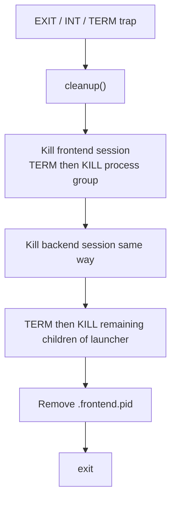

# Startup

This document describes how the Control Panel is launched, configured at process start, and shut down. Sources of truth: `scripts/run-control-panel.sh`, `scripts/run-control-panel.ps1`, `talos_ui/config.py`, `frontend/vite.config.ts`.

---

## Launcher scripts

| Script | Platform | Location |
|--------|----------|----------|
| `run-control-panel.sh` | Linux / macOS | `scripts/run-control-panel.sh` |
| `run-control-panel.ps1` | Windows (only Windows launcher) | `scripts/run-control-panel.ps1` |

There is **one script per platform** (no separate `.bat` wrapper). Both scripts:

1. Auto-detect monorepo root (`scripts/` parent)
2. Default `CP_ROOT` to `$TALOS_ROOT/talos-control-panel`
3. Validate `pyproject.toml` and control-panel `backend/` + `frontend/`
4. Set up missing dependencies
5. Start frontend (background) + backend (foreground)
6. Open a browser when the frontend responds
7. Clean up child processes when the backend stops or the user interrupts

Usage:

```bash
# from monorepo root (or any path — script resolves itself)
./scripts/run-control-panel.sh

# Windows (PowerShell)
.\scripts\run-control-panel.ps1

# Windows from cmd.exe
powershell -NoProfile -ExecutionPolicy Bypass -File .\scripts\run-control-panel.ps1
```

Optional overrides (env vars before launch):

| Variable | Default | Purpose |
|----------|---------|---------|
| `TALOS_ROOT` | parent of `scripts/` | Monorepo root |
| `CP_ROOT` | `$TALOS_ROOT/talos-control-panel` | Control panel tree |
| `TALOS_HOME` | `$HOME/.talos` / `%USERPROFILE%\.talos` | Talos state dir |
| `TALOS_VENV` | `$TALOS_ROOT/.venv` | Talos virtualenv |
| `CP_BACKEND_PORT` | `8420` | Uvicorn port |
| `CP_FRONTEND_PORT` | `5173` | Vite port |

---

## Startup sequence

```mermaid
sequenceDiagram
  participant L as Launcher
  participant TV as Talos .venv
  participant CV as CP backend .venv
  participant NM as frontend npm
  participant FE as Vite
  participant BE as Uvicorn
  participant BR as Browser

  L->>L: Resolve paths; check pyproject + dirs
  L->>L: Require python3/python, node, npm

  alt Talos python missing
    L->>TV: python -m venv
  end
  alt talos console entry or httpx missing
    L->>TV: pip install -e TALOS_ROOT
  end

  alt CP python missing
    L->>CV: python -m venv
  end
  alt fastapi/uvicorn not importable
    L->>CV: pip install -r requirements.txt
  end

  alt node_modules missing
    L->>NM: npm install
  end

  L->>L: export TALOS_HOME, TALOS_ROOT, TALOS_PYTHON, CP_PORT, VITE_API_BASE
  L->>FE: npm run dev -- --port PORT --strictPort (background)
  L->>BR: poll FE URL; open when ready
  L->>BE: uvicorn talos_ui.main:app --reload (foreground wait)
```

### Step detail

#### 1. Path resolution

- `TALOS_ROOT` defaults to the repository root containing `pyproject.toml` (parent of `scripts/`)
- A set `TALOS_ROOT` is used only if that path has `pyproject.toml`; otherwise the launcher falls back to the script's repo root and warns
- `CP_ROOT` defaults to `talos-control-panel/` under that root; a set `CP_ROOT` is used only if it has `backend/` and `frontend/`, and is remapped when it still sits under a discarded `TALOS_ROOT`
- `TALOS_VENV` under a discarded `TALOS_ROOT` is remapped to `$TALOS_ROOT/.venv`
- Errors if layout is wrong

#### 2. Prerequisite binaries

Unix launcher requires `python3`, `node`, `npm` on `PATH`.

Windows launcher requires `python`, `node`, `npm`. `curl` is optional; without it browser auto-open is skipped (warn only).

#### 3. Talos virtual environment

- Path: `TALOS_VENV` (default `$TALOS_ROOT/.venv`)
- Creates venv if Python executable missing
- Installs editable Talos if:
  - Unix: `bin/talos` missing **or** `import httpx` fails
  - Windows: `Scripts\talos.exe` missing **or** `import httpx` fails

**Important:** readiness does **not** use bare `import talos`, because running from the repo root puts the source tree on `sys.path` and can mask a missing install/dependencies.

#### 4. Control Panel backend virtual environment

- Path: `$CP_ROOT/backend/.venv`
- Installs `requirements.txt` if `import fastapi, uvicorn, httpx` fails

#### 5. Frontend dependencies

- Runs `npm install` only when `frontend/node_modules` is absent

#### 6. Environment export (before servers start)

| Variable | Value set by launcher |
|----------|------------------------|
| `TALOS_HOME` | operator home state dir |
| `TALOS_ROOT` | monorepo root |
| `TALOS_PYTHON` | Talos venv Python |
| `CP_PORT` | backend port (`CP_BACKEND_PORT`) |
| `VITE_API_BASE` | `http://127.0.0.1:<backend port>` |

#### 7. Frontend start

- `npm run dev -- --port <CP_FRONTEND_PORT> --strictPort`
- Logs: `$CP_ROOT/frontend.log` (Windows also `frontend-error.log`)
- PID file: `$CP_ROOT/.frontend.pid`
- Unix: prefers `setsid` for a new process session so teardown can kill the group
- Windows: PowerShell `Start-Process` hidden window

#### 8. Browser open

- Polls `http://127.0.0.1:<frontend port>` up to ~30s (60 × 0.5s Unix; 60 × 1s Windows)
- Opens with `xdg-open` (Linux), `open` (macOS), or `start` (Windows)
- Uses `127.0.0.1` deliberately — `localhost` can resolve to IPv6-only and fail health checks

#### 9. Backend start

```bash
cd "$CP_BACKEND_DIR"
"$CP_PY" -m uvicorn talos_ui.main:app --reload --host 127.0.0.1 --port "$CP_BACKEND_PORT"
```

- Foreground: launcher waits on backend PID so logs stay on the terminal
- `--reload` enables development auto-reload

---

## Environment variables (process)

### Launcher-owned

See table in [Launcher scripts](#launcher-scripts).

### Backend (`talos_ui/config.py`)

| Variable | Default | Meaning |
|----------|---------|---------|
| `TALOS_HOME` | `~/.talos` | State root |
| `TALOS_ROOT` | monorepo root (3 parents above `config.py`) | Repo / CLI cwd |
| `TALOS_PYTHON` | `$TALOS_ROOT/.venv/bin/python` or Windows Scripts | Interpreter for `python -m talos` |
| `TALOS_BIN` | same as `TALOS_PYTHON` | Display/health only |
| `TALOS_CP_CLI_TIMEOUT` | `60` | Seconds for normal CLI runs |
| `CP_HOST` | `127.0.0.1` | Config value (launcher binds host in uvicorn command) |
| `CP_PORT` | `8420` | Port default (launcher also passes `--port`) |

Note: the launcher invokes Uvicorn with explicit `--host 127.0.0.1 --port $CP_BACKEND_PORT`. `CP_HOST` in config is available for code that reads it; the stock launcher does not pass `CP_HOST` to Uvicorn.

### Frontend (Vite)

| Variable | Default | Meaning |
|----------|---------|---------|
| `VITE_API_BASE` | `http://127.0.0.1:8420` | API base URL baked at dev-server start |

Documented in `frontend/.env.example`. Copy to `.env.local` for manual runs when the backend is not on the default port.

---

## Virtual environments

```text
TALOS_ROOT/
├── .venv/                          # Talos: package + runtime deps (httpx, etc.)
└── talos-control-panel/
    └── backend/
        └── .venv/                  # Control Panel API (fastapi, uvicorn, pydantic, httpx)
```

Why two?

- Control Panel backend intentionally does **not** install the full Talos dependency tree into its own venv for serving HTTP.
- Mutations always use `TALOS_PYTHON` from the Talos venv so CLI behavior matches `python -m talos` used by operators.

---

## Dependency installation

| Layer | When installed | How |
|-------|----------------|-----|
| Talos package | Missing entry script or `httpx` | `pip install -e $TALOS_ROOT` |
| Backend deps | Missing fastapi/uvicorn/httpx | `pip install -r backend/requirements.txt` |
| Frontend deps | Missing `node_modules` | `npm install` |

Re-running the launcher after a failed partial install generally re-checks the same readiness probes.

---

## Frontend startup (manual)

```bash
cd talos-control-panel/frontend
export VITE_API_BASE=http://127.0.0.1:8420
npm install   # first time
npm run dev
```

Vite config binds `host: "127.0.0.1"`, port `5173`, `strictPort: true`.

---

## Backend startup (manual)

```bash
cd talos-control-panel/backend
python3 -m venv .venv && source .venv/bin/activate
pip install -r requirements.txt

export TALOS_ROOT=../..   # monorepo root
export TALOS_PYTHON="$TALOS_ROOT/.venv/bin/python"
export TALOS_HOME=~/.talos
export CP_PORT=8420

uvicorn talos_ui.main:app --reload --host 127.0.0.1 --port 8420
```

Health check: `GET http://127.0.0.1:8420/api/health`.

---

## Shutdown sequence

### Unix (`run-control-panel.sh`)



Helpers:

- `_kill_tree` — recursive `pgrep -P` + signal
- `_kill_session` — `kill -TERM -- -$pid` then KILL; falls back to tree kill

### Windows (`run-control-panel.ps1`)

1. **Pre-start cleanup**: frees backend/frontend ports and stops PIDs recorded in `.frontend.pid` / `.backend.pid` from prior crashed runs (does **not** touch the Talos proxy on :8080)
2. Starts frontend + backend as managed processes
3. Assigns both to a Windows **Job Object** with `KILL_ON_JOB_CLOSE` so closing the terminal kills children (no silent background leftovers)
4. On Ctrl+C or backend exit, `finally` teardown runs `taskkill /T` on both trees and re-frees CP ports
5. Run from **PowerShell** (`.\scripts\run-control-panel.ps1`). From cmd.exe use `powershell -NoProfile -ExecutionPolicy Bypass -File .\scripts\run-control-panel.ps1` (there is no `.bat` wrapper — that path caused `Terminate batch job (Y/N)?` hangs and duplicate “broken” scripts)

Browser open is a background PowerShell job that polls the frontend URL; it does not keep the proxy/lifecycle alive.

---

## Browser launch

| Platform | Open command |
|----------|--------------|
| Linux | `xdg-open` |
| macOS | `open` |
| Windows | PowerShell job: poll URL then `Start-Process` URL |

If the frontend never becomes ready, a warning is printed with the URL for manual open.

---

## Platform differences

| Topic | Unix | Windows |
|-------|------|---------|
| Script | bash, `set -euo pipefail` | PowerShell only (`.ps1`) |
| Python binary name | `python3` on PATH; venv `bin/python` | `python` on PATH; venv `Scripts\python.exe` |
| Talos entry check | `$VENV/bin/talos` | `%VENV%\Scripts\talos.exe` |
| Process isolation | `setsid` when available | Job Object `KILL_ON_JOB_CLOSE` + `taskkill /T` on exit |
| Pre-start cleanup | (none; ports fail if busy) | Frees CP backend/frontend ports + stale pid files |
| Proxy/CLI kill (in backend) | process group signals | `taskkill /T /F` (in `cli.py`, not launcher) |
| Frontend stderr | merged into `frontend.log` | separate `frontend-error.log` |
| Open browser | `xdg-open` / `open` | `Invoke-WebRequest` poll then `Start-Process` URL |

---

## Files created at runtime by the launcher

| Path | Purpose |
|------|---------|
| `$CP_ROOT/frontend.log` | Vite stdout/stderr (Unix) / stdout (Windows) |
| `$CP_ROOT/frontend-error.log` | Windows frontend stderr |
| `$CP_ROOT/.frontend.pid` | Frontend leader PID for cleanup |
| `$CP_ROOT/.backend.pid` | Windows backend PID for stale cleanup |

These are operational artifacts, not application source.
